# Casos de Prueba Funcionales — SIGERD

**Sistema:** Sistema de Gestión de Reportes de Daños  
**Versión:** 1.0  
**Total de casos:** 206  

---

## Índice

### Administrador (111 casos)
- [CP-ADM-001](#cp-adm-001) — Inicio de sesión exitoso
- [CP-ADM-002](#cp-adm-002) — Fallo por contraseña errónea
- [CP-ADM-003](#cp-adm-003) — Fallo por usuario inexistente
- [CP-ADM-004](#cp-adm-004) — Validación de campos obligatorios
- [CP-ADM-005](#cp-adm-005) — Validación de formato de correo
- [CP-ADM-006](#cp-adm-006) — Seguridad – Prevención SQL Injection
- [CP-ADM-007](#cp-adm-007) — Protección de rutas restringidas
- [CP-ADM-008](#cp-adm-008) — Bloqueo por rol insuficiente
- [CP-ADM-009](#cp-adm-009) — Carga correcta de métricas
- [CP-ADM-010](#cp-adm-010) — Manejo de métricas en estado vacío
- [CP-ADM-011](#cp-adm-011) — Buscar tarea por título
- [CP-ADM-012](#cp-adm-012) — Filtrar tareas por prioridad
- [CP-ADM-013](#cp-adm-013) — Manejo de búsqueda sin resultados
- [CP-ADM-014](#cp-adm-014) — Crear tarea correctamente
- [CP-ADM-015](#cp-adm-015) — Validación backend de campos obligatorios
- [CP-ADM-016](#cp-adm-016) — Validación lógica de fecha vencida
- [CP-ADM-017](#cp-adm-017) — Validación Enum de prioridad
- [CP-ADM-018](#cp-adm-018) — Adjuntar imagen de evidencia válida
- [CP-ADM-019](#cp-adm-019) — Bloqueo de extensiones no permitidas
- [CP-ADM-020](#cp-adm-020) — Validación de tamaño máximo de archivo
- [CP-ADM-021](#cp-adm-021) — Modificar datos básicos de tarea
- [CP-ADM-022](#cp-adm-022) — Validación de fecha vencida en edición
- [CP-ADM-023](#cp-adm-023) — Agregar evidencia final como administrador
- [CP-ADM-024](#cp-adm-024) — Aprobar tarea
- [CP-ADM-025](#cp-adm-025) — Rechazar tarea
- [CP-ADM-026](#cp-adm-026) — Marcar tarea como retraso en proceso
- [CP-ADM-027](#cp-adm-027) — PDF mes actual
- [CP-ADM-028](#cp-adm-028) — PDF mes inválido
- [CP-ADM-029](#cp-adm-029) — Búsqueda de Usuario
- [CP-ADM-030](#cp-adm-030) — Crear nuevo Admin/Trabajador
- [CP-ADM-031](#cp-adm-031) — Email duplicado
- [CP-ADM-032](#cp-adm-032) — Contraseñas no coinciden
- [CP-ADM-033](#cp-adm-033) — Subida Foto Perfil
- [CP-ADM-034](#cp-adm-034) — Foto Perfil muy pesada
- [CP-ADM-035](#cp-adm-035) — Foto Perfil inválida
- [CP-ADM-036](#cp-adm-036) — Editar usuario y borrar foto antigua
- [CP-ADM-037](#cp-adm-037) — Editar sin cambiar clave
- [CP-ADM-038](#cp-adm-038) — Ver Detalle de Usuario
- [CP-ADM-039](#cp-adm-039) — Eliminar Usuario
- [CP-ADM-040](#cp-adm-040) — Auto-eliminación
- [CP-ADM-041](#cp-adm-041) — Listar y Buscar
- [CP-ADM-042](#cp-adm-042) — Reportar Falla (Crear manual)
- [CP-ADM-043](#cp-adm-043) — Reporte sin evidencias
- [CP-ADM-044](#cp-adm-044) — Exceder límite de fotos
- [CP-ADM-045](#cp-adm-045) — Fecha reporte en el futuro
- [CP-ADM-046](#cp-adm-046) — Convertir Incidente a Tarea
- [CP-ADM-047](#cp-adm-047) — Notificaciones de Conversión
- [CP-ADM-048](#cp-adm-048) — Actualizar y subir foto de perfil
- [CP-ADM-049](#cp-adm-049) — Actualizar email y perder verificación
- [CP-ADM-050](#cp-adm-050) — Cambio de Password
- [CP-ADM-051](#cp-adm-051) — Borrado de Cuenta propia
- [CP-ADM-052](#cp-adm-052) — Borrado sin clave válida
- [CP-ADM-053](#cp-adm-053) — Manipulación de ID en URL (/admin/tasks/9999/edit)
- [CP-ADM-054](#cp-adm-054) — Envío manual vía Postman sin CSRF Token
- [CP-ADM-055](#cp-adm-055) — Intentar enviar request con método incorrecto (GET en vez de POST)
- [CP-ADM-056](#cp-adm-056) — Forzar cambio de rol enviando rol=superadmin vía request
- [CP-ADM-057](#cp-adm-057) — Intentar acceder a archivo físico vía /storage/profile-photos/../../.env
- [CP-ADM-058](#cp-adm-058) — Manipular estado de tarea enviando status=finalizada al crear tarea (store)
- [CP-ADM-059](#cp-adm-059) — Subir archivo con doble extensión image.jpg.php
- [CP-ADM-060](#cp-adm-060) — Aprobar tarea sin evidencia final
- [CP-ADM-061](#cp-adm-061) — Incidencia convertida pero tarea es eliminada luego por un Admin
- [CP-ADM-062](#cp-adm-062) — Cambiar manualmente incidencia a "resuelto" sin tarea asociada
- [CP-ADM-063](#cp-adm-063) — Fecha límite de tarea igual a hora/fecha exacta actual
- [CP-ADM-064](#cp-adm-064) — Crear tarea con prioridad "alta" sin usuario trabajador seleccionado
- [CP-ADM-065](#cp-adm-065) — 5,000 tareas en listado visualizadas
- [CP-ADM-066](#cp-adm-066) — Exportar PDF con 1,000 registros finalizados en el mes
- [CP-ADM-067](#cp-adm-067) — Subir límite de imágenes (10) de 2MB máximo a Incidencias simultáneamente
- [CP-ADM-068](#cp-adm-068) — Búsqueda SQL con un millón de incidencias (search=texto)
- [CP-ADM-069](#cp-adm-069) — Eliminar usuario / tarea con evidencia asociada que ya no existe en disco
- [CP-ADM-070](#cp-adm-070) — Disco de Storage lleno o sin permisos de escritura
- [CP-ADM-071](#cp-adm-071) — Subida de archivo con extensión válida pero MIME real distinto
- [CP-ADM-072](#cp-adm-072) — Eliminar tarea con múltiples evidencias iniciales y finales
- [CP-ADM-073](#cp-adm-073) — 200 notificaciones sin leer
- [CP-ADM-074](#cp-adm-074) — Intentar marcar notificación de otro usuario interceptando el ID POST
- [CP-ADM-075](#cp-adm-075) — Clic en notificación vinculada a recurso eliminado
- [CP-ADM-076](#cp-adm-076) — Expiración de sesión tras inactividad
- [CP-ADM-077](#cp-adm-077) — Rotación de contraseña con sesiones múltiples abiertas
- [CP-ADM-078](#cp-adm-078) — Forzar acceso reusando cookies antiguas luego de Logout intencional
- [CP-ADM-079](#cp-adm-079) — Título de tarea con exactamente 255 caracteres
- [CP-ADM-080](#cp-adm-080) — Título de tarea con 300 caracteres
- [CP-ADM-081](#cp-adm-081) — Prueba de Inyección XSS en campo description
- [CP-ADM-082](#cp-adm-082) — Envío de JSON malformado en endpoint de creación
- [CP-ADM-083](#cp-adm-083) — Inyección de campos extra (Mass Assignment Attack)
- [CP-ADM-084](#cp-adm-084) — Creación con caracteres Unicode inusuales
- [CP-ADM-085](#cp-adm-085) — Manejo de espacios en blanco excesivos
- [CP-ADM-086](#cp-adm-086) — Manipulación extrema del paginador
- [CP-ADM-087](#cp-adm-087) — Búsqueda con caracteres especiales tipo SQL wildcard
- [CP-ADM-088](#cp-adm-088) — Envío de edición sin cambios (isDirty check)
- [CP-ADM-089](#cp-adm-089) — Interrupción de red en proceso de subida
- [CP-ADM-090](#cp-adm-090) — Eliminación física (Hard Delete) de tarea finalizada
- [CP-ADM-091](#cp-adm-091) — Cascading Validation al eliminar Autor (Instructor)
- [CP-ADM-092](#cp-adm-092) — Auto-eliminación del usuario autenticado (Auth::user())
- [CP-ADM-093](#cp-adm-093) — Cierre de modal con tecla ESC
- [CP-ADM-094](#cp-adm-094) — Cierre de modal al hacer clic en backdrop
- [CP-ADM-095](#cp-adm-095) — Reapertura automática del modal tras error 422
- [CP-ADM-096](#cp-adm-096) — Reset de formulario al cerrar modal
- [CP-ADM-097](#cp-adm-097) — Precarga dinámica en modal de edición
- [CP-ADM-098](#cp-adm-098) — Visualización de imagen en Lightbox
- [CP-ADM-099](#cp-adm-099) — Apertura de visor con URL rota / imagen 404
- [CP-ADM-100](#cp-adm-100) — Cierre del visor de imágenes (Lightbox)
- [CP-ADM-101](#cp-adm-101) — Responsividad del visor en dispositivos móviles
- [CP-ADM-102](#cp-adm-102) — Accesibilidad ARIA en modales

### Instructor (46 casos)
- [CP-INS-001](#cp-ins-001) — Inicio de sesión exitoso como instructor
- [CP-INS-002](#cp-ins-002) — Login con contraseña incorrecta
- [CP-INS-003](#cp-ins-003) — Login con usuario no registrado
- [CP-INS-004](#cp-ins-004) — Acceso a ruta protegida sin autenticación (Seguridad)
- [CP-INS-005](#cp-ins-005) — Intento de acceso a panel de administrador o trabajador (Seguridad)
- [CP-INS-006](#cp-ins-006) — Envío de formulario login con campos vacíos
- [CP-INS-007](#cp-ins-007) — Carga correcta de métricas del dashboard
- [CP-INS-008](#cp-ins-008) — Dashboard con métricas en cero (Límite)
- [CP-INS-009](#cp-ins-009) — Reportar incidencia con todos los datos
- [CP-INS-010](#cp-ins-010) — Reporte sin evidencias fotográficas (Negativo)
- [CP-INS-011](#cp-ins-011) — Reporte omitiendo campos obligatorios (Negativo)
- [CP-INS-012](#cp-ins-012) — Subida excediendo límite de peso (Límite)
- [CP-INS-013](#cp-ins-013) — Múltiples fotos subidas simultáneamente (Límite)
- [CP-INS-014](#cp-ins-014) — Intento de subir archivos maliciosos (Seguridad)
- [CP-INS-015](#cp-ins-015) — Listar solamente incidencias propias
- [CP-INS-016](#cp-ins-016) — Visualización de estado actualizado
- [CP-INS-017](#cp-ins-017) — Intento de editar o borrar incidencia ajena (Seguridad)
- [CP-INS-018](#cp-ins-018) — Intento de editar incidencia en estado procesado (Negativo)
- [CP-INS-019](#cp-ins-019) — Alerta de Incidencia Convertida en Tarea
- [CP-INS-020](#cp-ins-020) — Alerta de Incidencia Resuelta
- [CP-INS-021](#cp-ins-021) — Marcado automático como leído al consultar
- [CP-INS-022](#cp-ins-022) — Cambio dinámico de modo Claro/Oscuro
- [CP-INS-023](#cp-ins-023) — Actualizar datos y avatar fotográfico
- [CP-INS-024](#cp-ins-024) — Cambio de contraseña
- [CP-INS-025](#cp-ins-025) — Intento de auto-promoción de rol (Seguridad)
- [CP-INS-026](#cp-ins-026) — Prevención de doble envío en reportes
- [CP-INS-027](#cp-ins-027) — Visualización de evidencias en visor modal
- [CP-INS-028](#cp-ins-028) — Paginado masivo para instructores con alto volumen
- [CP-INS-029](#cp-ins-029) — Prevención de Cross-Site Scripting (XSS)
- [CP-INS-030](#cp-ins-030) — Protección ante eliminación indebida vía método DELETE
- [CP-INS-031](#cp-ins-031) — Mitigación de Inyección SQL en filtros
- [CP-INS-032](#cp-ins-032) — Creación simultánea desde múltiples pestañas
- [CP-INS-033](#cp-ins-033) — Edición simultánea desde doble sesión
- [CP-INS-034](#cp-ins-034) — Bloqueo de edición tras cambio de estado por Admin
- [CP-INS-035](#cp-ins-035) — Expiración de sesión por inactividad
- [CP-INS-036](#cp-ins-036) — Reutilización o manipulación de token CSRF
- [CP-INS-037](#cp-ins-037) — Manipulación manual de user_id en request
- [CP-INS-038](#cp-ins-038) — Carga simultánea de 10 imágenes
- [CP-INS-039](#cp-ins-039) — Validación MIME ante archivo corrupto
- [CP-INS-040](#cp-ins-040) — Mitigación de Path Traversal en nombre de archivo
- [CP-INS-041](#cp-ins-041) — Filtrado por estado de incidencia
- [CP-INS-042](#cp-ins-042) — Manejo de parámetro inválido en query string
- [CP-INS-043](#cp-ins-043) — Carga simultánea de múltiples instructores
- [CP-INS-044](#cp-ins-044) — Carga masiva de notificaciones en dashboard
- [CP-INS-045](#cp-ins-045) — Registro de incidencias duplicadas
- [CP-INS-046](#cp-ins-046) — Eliminación lógica (Soft Delete)

### Trabajador (49 casos)
- [CP-TRB-001](#cp-trb-001) — Inicio de sesión exitoso como trabajador
- [CP-TRB-002](#cp-trb-002) — Login con contraseña incorrecta
- [CP-TRB-003](#cp-trb-003) — Login con usuario no registrado
- [CP-TRB-004](#cp-trb-004) — Acceso a ruta protegida sin autenticación
- [CP-TRB-005](#cp-trb-005) — Intento de acceso a panel de administrador como trabajador
- [CP-TRB-006](#cp-trb-006) — Envío de formulario login con campos vacíos
- [CP-TRB-007](#cp-trb-007) — Carga correcta de métricas del dashboard
- [CP-TRB-008](#cp-trb-008) — Dashboard con métricas en cero
- [CP-TRB-009](#cp-trb-009) — Visualización exclusiva de tareas asignadas
- [CP-TRB-010](#cp-trb-010) — Búsqueda de tarea por palabra clave
- [CP-TRB-011](#cp-trb-011) — Filtrado de tareas por estado
- [CP-TRB-012](#cp-trb-012) — Cambio de estado de asignado a en progreso
- [CP-TRB-013](#cp-trb-013) — Subida válida de imágenes como evidencia final
- [CP-TRB-014](#cp-trb-014) — Intento de enviar formulario sin evidencia obligatoria
- [CP-TRB-015](#cp-trb-015) — Subida de un archivo no permitido (.pdf)
- [CP-TRB-016](#cp-trb-016) — Incorporación de nota final explicativa satisfactoria
- [CP-TRB-017](#cp-trb-017) — Límite de Acceso Cruzado (Negativo)
- [CP-TRB-018](#cp-trb-018) — Recepción de notificación por nueva tarea asignada
- [CP-TRB-019](#cp-trb-019) — Recepción de notificación por tarea rechazada
- [CP-TRB-020](#cp-trb-020) — Recepción de notificación por tarea aprobada
- [CP-TRB-021](#cp-trb-021) — Marcado de notificación como leída
- [CP-TRB-022](#cp-trb-022) — Cambio de tema claro a oscuro
- [CP-TRB-023](#cp-trb-023) — Actualización de datos personales y foto de perfil
- [CP-TRB-024](#cp-trb-024) — Cambio exitoso de contraseña
- [CP-TRB-025](#cp-trb-025) — Intento fallido por clave actual incorrecta
- [CP-TRB-026](#cp-trb-026) — Intento de auto-promoción de rol
- [CP-TRB-027](#cp-trb-027) — Visualización en modal (lightbox) de imágenes
- [CP-TRB-028](#cp-trb-028) — Paginación eficiente con más de 500 tareas
- [CP-TRB-029](#cp-trb-029) — Prevención de doble envío al mandar tarea
- [CP-TRB-030](#cp-trb-030) — Intento de reiniciar tarea ya en progreso
- [CP-TRB-031](#cp-trb-031) — Forzar transición inválida vía request
- [CP-TRB-032](#cp-trb-032) — Modificar worker_id desde cliente
- [CP-TRB-033](#cp-trb-033) — Subida de imagen límite (2MB exactos)
- [CP-TRB-034](#cp-trb-034) — Subida imagen corrupta/MIME alterado
- [CP-TRB-035](#cp-trb-035) — Intento de path traversal en nombre archivo
- [CP-TRB-036](#cp-trb-036) — Modificación simultánea de tarea en 2 sesiones
- [CP-TRB-037](#cp-trb-037) — Rechazo por Admin durante carga trabajador
- [CP-TRB-038](#cp-trb-038) — Intento de inyección SQL en búsqueda
- [CP-TRB-039](#cp-trb-039) — Intento XSS en comentarios de finalización
- [CP-TRB-040](#cp-trb-040) — Envío de formulario sin CSRF Token
- [CP-TRB-041](#cp-trb-041) — Pérdida de conexión durante subida
- [CP-TRB-042](#cp-trb-042) — Recarga de página durante envío de tarea
- [CP-TRB-043](#cp-trb-043) — Visualización correcta con cero notificaciones
- [CP-TRB-044](#cp-trb-044) — Visualización de Imágenes de Referencia
- [CP-TRB-045](#cp-trb-045) — Tarea vencida iniciada fuera de plazo
- [CP-TRB-046](#cp-trb-046) — Recarga de página con adjuntos encolados
- [CP-TRB-047](#cp-trb-047) — Cierre de sesión (Logout) exitoso
- [CP-TRB-048](#cp-trb-048) — Guardar después de Timeout por inactividad
- [CP-TRB-049](#cp-trb-049) — Uso de Emojis / Texto UTF-8 masivo

---

## Administrador — 102 Casos

### CP-ADM-001

| Atributo | Detalle |
| :--- | :--- |
| **ID** | CP-ADM-001 |
| **Módulo** | Autenticación y Acceso (Login) |
| **Funcionalidad** | Inicio de sesión exitoso |
| **Descripción** | Validar que el administrador pueda ingresar con credenciales válidas y sea redirigido a su panel principal. |
| **Precondiciones** | El usuario administrador existe en la base de datos con credenciales válidas. |
| **Datos de entrada** | **Email:** `admin@sigerd.com Password: password` |
| **Pasos** | 1. Ir a /login 2. Ingresar credenciales válidas 3. Clic en "Iniciar Sesión" |
| **Resultado Esperado** | Redirección a /admin/dashboard mostrando indicadores del sistema. |
| **Resultado Obtenido** | Redirección correcta al Dashboard del administrador. |
| **Evidencia** | 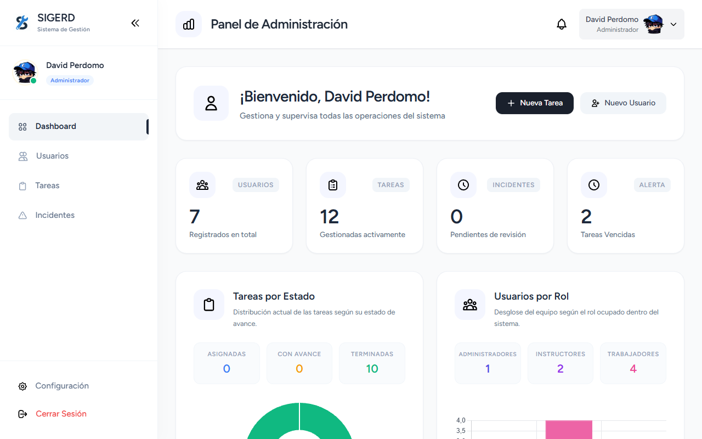 |
| **Estado** | ✅ Exitoso |

### CP-ADM-002

| Atributo | Detalle |
| :--- | :--- |
| **ID** | CP-ADM-002 |
| **Módulo** | Autenticación y Acceso (Login) |
| **Funcionalidad** | Fallo por contraseña errónea |
| **Descripción** | Validar que el sistema rechace un login con contraseña incorrecta. |
| **Precondiciones** | Usuario administrador existente. |
| **Datos de entrada** | **Email:** `admin@sigerd.com Password: wrongpassword` |
| **Pasos** | 1. Ir a /login 2. Ingresar contraseña inválida 3. Clic en "Iniciar Sesión" |
| **Resultado Esperado** | Mensaje de error indicando credenciales inválidas. |
| **Resultado Obtenido** | Sistema muestra mensaje de error correctamente. |
| **Evidencia** |  |
| **Estado** | ✅ Exitoso |

### CP-ADM-003

| Atributo | Detalle |
| :--- | :--- |
| **ID** | CP-ADM-003 |
| **Módulo** | Autenticación y Acceso (Login) |
| **Funcionalidad** | Fallo por usuario inexistente |
| **Descripción** | Validar que no permita acceso con correo no registrado. |
| **Precondiciones** | Email no existente en la base de datos. |
| **Datos de entrada** | **Email:** `nonexistent@sigerd.com Password: password` |
| **Pasos** | 1. Ir a /login 2. Ingresar correo inexistente 3. Clic en "Iniciar Sesión" |
| **Resultado Esperado** | Mensaje de error de credenciales inválidas. |
| **Resultado Obtenido** | Acceso denegado correctamente. |
| **Evidencia** |  |
| **Estado** | ✅ Exitoso |

### CP-ADM-004

| Atributo | Detalle |
| :--- | :--- |
| **ID** | CP-ADM-004 |
| **Módulo** | Autenticación y Acceso (Login) |
| **Funcionalidad** | Validación de campos obligatorios |
| **Descripción** | Verificar que no se permita enviar el formulario con campos vacíos. |
| **Precondiciones** | Ninguna. |
| **Datos de entrada** | **Email:** `vacío Password: vacío` |
| **Pasos** | 1. Ir a /login 2. Dejar campos vacíos 3. Clic en "Iniciar Sesión" |
| **Resultado Esperado** | Error de validación indicando campos obligatorios. |
| **Resultado Obtenido** | Backend detecta y rechaza campos vacíos. |
| **Evidencia** | 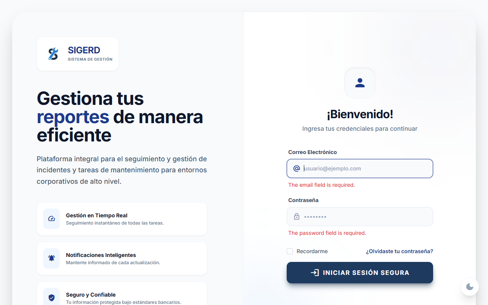 |
| **Estado** | ✅ Exitoso |

### CP-ADM-005

| Atributo | Detalle |
| :--- | :--- |
| **ID** | CP-ADM-005 |
| **Módulo** | Autenticación y Acceso (Login) |
| **Funcionalidad** | Validación de formato de correo |
| **Descripción** | Validar que el sistema rechace correos sin estructura válida. |
| **Precondiciones** | Ninguna. |
| **Datos de entrada** | **Email:** `admin123` |
| **Pasos** | 1. Ir a /login 2. Ingresar email inválido 3. Clic en "Iniciar Sesión" |
| **Resultado Esperado** | Mensaje indicando formato de email incorrecto. |
| **Resultado Obtenido** | Sistema rechaza el formato inválido correctamente. |
| **Evidencia** |  |
| **Estado** | ✅ Exitoso |

### CP-ADM-006

| Atributo | Detalle |
| :--- | :--- |
| **ID** | CP-ADM-006 |
| **Módulo** | Autenticación y Acceso (Login) |
| **Funcionalidad** | Seguridad – Prevención SQL Injection |
| **Descripción** | Verificar que el sistema sanitice entradas y prevenga inyección SQL. |
| **Precondiciones** | Ninguna. |
| **Datos de entrada** | **Email:** `' OR 1=1 --` |
| **Pasos** | 1. Ir a /login 2. Ingresar cadena maliciosa 3. Clic en "Iniciar Sesión" |
| **Resultado Esperado** | Rechazo de autenticación sin error interno. |
| **Resultado Obtenido** | Login denegado sin vulnerabilidad. |
| **Evidencia** | 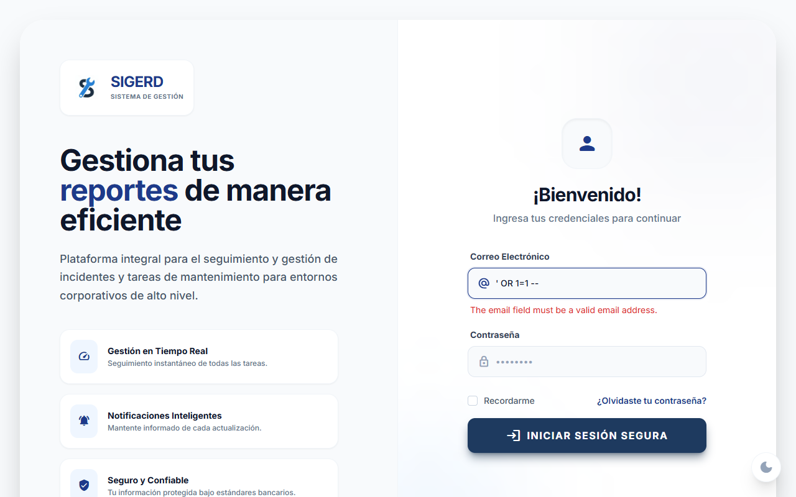 |
| **Estado** | ✅ Exitoso |

### CP-ADM-007

| Atributo | Detalle |
| :--- | :--- |
| **ID** | CP-ADM-007 |
| **Módulo** | Autorización / Middleware |
| **Funcionalidad** | Protección de rutas restringidas |
| **Descripción** | Verificar que usuarios no autenticados no accedan a rutas protegidas. |
| **Precondiciones** | Usuario sin sesión iniciada. |
| **Datos de entrada** | **URL directa:** `/admin/dashboard` |
| **Pasos** | 1. Intentar acceder directamente a la URL protegida. |
| **Resultado Esperado** | Redirección automática a /login. |
| **Resultado Obtenido** | Redirección correcta al login. |
| **Evidencia** | 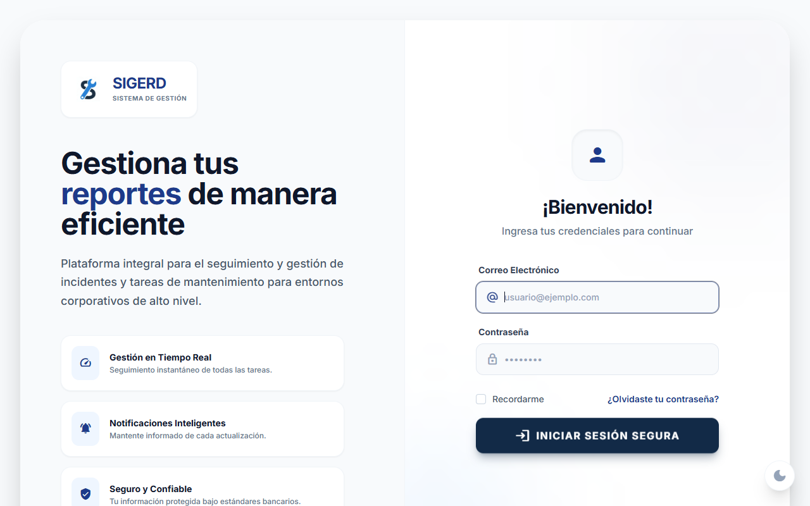 |
| **Estado** | ✅ Exitoso |

### CP-ADM-008

| Atributo | Detalle |
| :--- | :--- |
| **ID** | CP-ADM-008 |
| **Módulo** | Autorización / Control de Roles |
| **Funcionalidad** | Bloqueo por rol insuficiente |
| **Descripción** | Validar que usuarios con rol distinto al administrador no accedan a rutas administrativas. |
| **Precondiciones** | Usuario instructor existente en la base de datos. |
| **Datos de entrada** | Login: instructor1@sigerd.com URL destino: /admin/users |
| **Pasos** | 1. Iniciar sesión como Instructor 2. Intentar acceder a ruta administrativa |
| **Resultado Esperado** | Error 403 o redirección controlada. |
| **Resultado Obtenido** | Acceso correctamente bloqueado por el sistema. |
| **Evidencia** |  |
| **Estado** | ✅ Exitoso |

### CP-ADM-009

| Atributo | Detalle |
| :--- | :--- |
| **ID** | CP-ADM-009 |
| **Módulo** | Dashboard (Panel Principal) |
| **Funcionalidad** | Carga correcta de métricas |
| **Descripción** | Validar que al ingresar al Dashboard se carguen correctamente los estadísticos y contadores del sistema. |
| **Precondiciones** | Administrador autenticado con sesión activa. Existen registros en la base de datos (usuarios, tareas, incidencias). |
| **Datos de entrada** | Navegación a /admin/dashboard |
| **Pasos** | 1. Iniciar sesión como administrador. 2. Acceder al Dashboard. 3. Verificar tarjetas e indicadores. |
| **Resultado Esperado** | El panel carga correctamente mostrando datos reales en las tarjetas estadísticas. |
| **Resultado Obtenido** | Dashboard renderizado correctamente con tarjetas operativas y contadores actualizados. |
| **Evidencia** |  |
| **Estado** | ✅ Exitoso |

### CP-ADM-010

| Atributo | Detalle |
| :--- | :--- |
| **ID** | CP-ADM-010 |
| **Módulo** | Dashboard (Panel Principal) |
| **Funcionalidad** | Manejo de métricas en estado vacío |
| **Descripción** | Verificar que el sistema muestre contadores en cero cuando no existen registros en la base de datos. |
| **Precondiciones** | Base de datos sin registros (usuarios, tareas e incidencias). |
| **Datos de entrada** | Estado inicial sin datos. |
| **Pasos** | 1. Acceder al Dashboard con base de datos vacía. 2. Observar comportamiento visual de los contadores. |
| **Resultado Esperado** | El sistema no presenta errores ni fallos de renderizado; muestra contadores en 0. |
| **Resultado Obtenido** | Interfaz estable, contadores en 0 visibles correctamente sin errores. |
| **Evidencia** |  |
| **Estado** | ✅ Exitoso |

### CP-ADM-011

| Atributo | Detalle |
| :--- | :--- |
| **ID** | CP-ADM-011 |
| **Módulo** | Gestión de Tareas |
| **Funcionalidad** | Buscar tarea por título |
| **Descripción** | Validar que el campo de búsqueda filtre resultados mostrando coincidencias parciales con el título o descripción. |
| **Precondiciones** | Existen tareas registradas en la base de datos. Administrador autenticado. |
| **Datos de entrada** | Texto ingresado en buscador: e |
| **Pasos** | 1. Ir a /admin/tasks. 2. Ingresar texto en el campo "Buscar título…". 3. Presionar Enter. |
| **Resultado Esperado** | La tabla muestra únicamente tareas que contienen el texto buscado. Se habilita el botón "Limpiar filtros". |
| **Resultado Obtenido** | El filtro funciona correctamente a nivel de consulta Eloquent, mostrando coincidencias paginadas dinámicamente. |
| **Evidencia** | 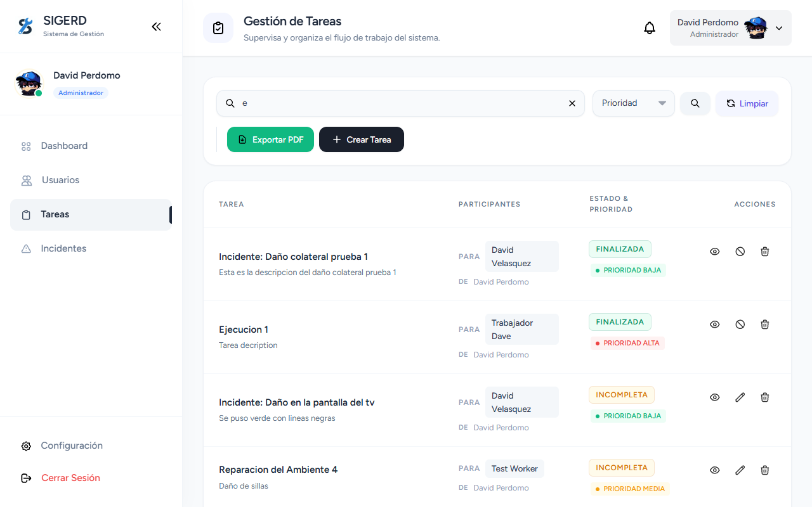 |
| **Estado** | ✅ Exitoso |

### CP-ADM-012

| Atributo | Detalle |
| :--- | :--- |
| **ID** | CP-ADM-012 |
| **Módulo** | Gestión de Tareas |
| **Funcionalidad** | Filtrar tareas por prioridad |
| **Descripción** | Verificar que el selector desplegable filtre correctamente las tareas según su nivel de prioridad. |
| **Precondiciones** | Existen múltiples tareas con diferentes prioridades registradas. |
| **Datos de entrada** | Selector de Prioridad: Alta |
| **Pasos** | 1. Acceder a /admin/tasks. 2. Seleccionar "Alta" en el desplegable de prioridad. 3. Clic en "Buscar". |
| **Resultado Esperado** | Se muestran únicamente tareas con prioridad Alta. |
| **Resultado Obtenido** | El sistema aplica correctamente el filtro mostrando solo registros con prioridad Alta. |
| **Evidencia** | 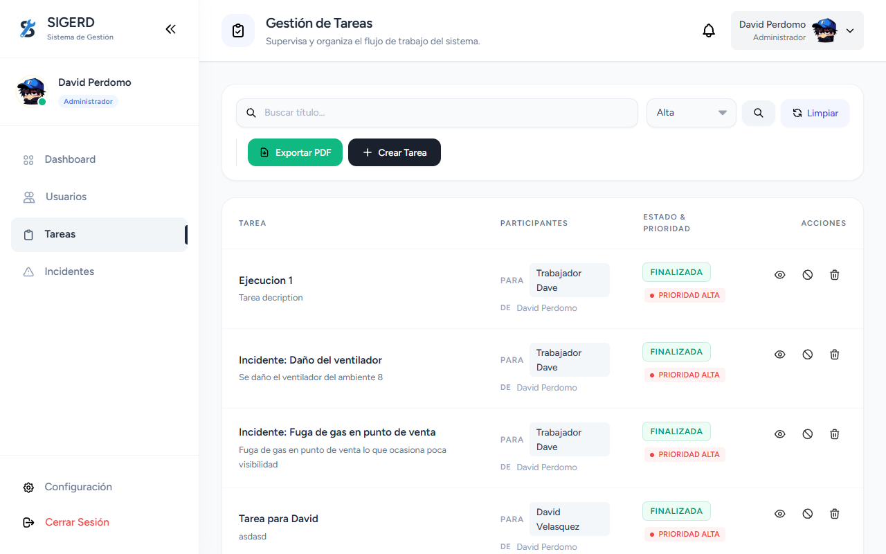 |
| **Estado** | ✅ Exitoso |

### CP-ADM-013

| Atributo | Detalle |
| :--- | :--- |
| **ID** | CP-ADM-013 |
| **Módulo** | Gestión de Tareas |
| **Funcionalidad** | Manejo de búsqueda sin resultados |
| **Descripción** | Verificar que el sistema gestione correctamente una búsqueda que no retorna resultados. |
| **Precondiciones** | Existen tareas registradas pero ninguna coincide con el criterio ingresado. |
| **Datos de entrada** | Texto ingresado: XYZ987IMPOSIBLE |
| **Pasos** | 1. Ingresar texto inexistente en el buscador. 2. Presionar Enter. |
| **Resultado Esperado** | Se muestra mensaje "No se encontraron tareas" con estado visual vacío (Empty State). |
| **Resultado Obtenido** | El sistema renderiza correctamente el estado vacío utilizando estructura condicional en la vista. |
| **Evidencia** | 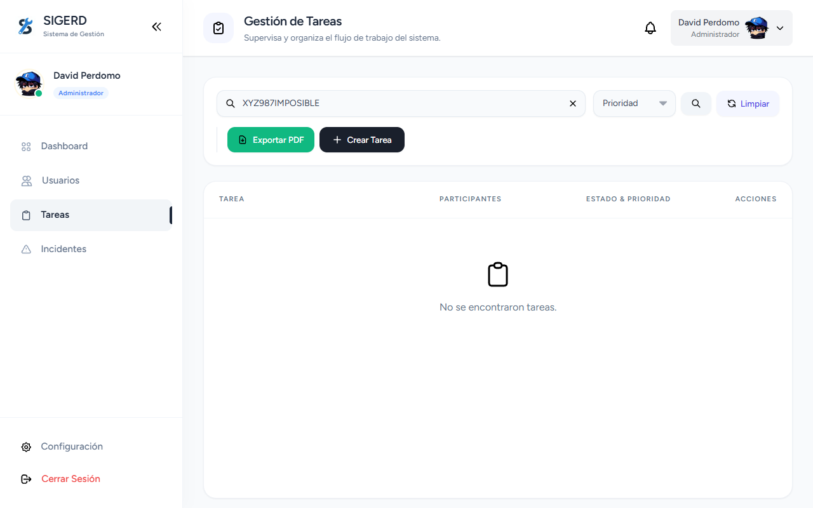 |
| **Estado** | ✅ Exitoso |

### CP-ADM-014

| Atributo | Detalle |
| :--- | :--- |
| **ID** | CP-ADM-014 |
| **Módulo** | Gestión de Tareas – Crear |
| **Funcionalidad** | Crear tarea correctamente |
| **Descripción** | Verificar que el sistema cree y persista una tarea con datos válidos. |
| **Precondiciones** | Modal de creación abierto. Administrador autenticado. |
| **Datos de entrada** | Título: Mantenimiento Preventivo A/C Fecha: +5 días |
| **Pasos** | 1. Completar campos obligatorios. 2. Clic en "Crear Tarea". |
| **Resultado Esperado** | La tarea se guarda correctamente y se muestra confirmación exitosa. |
| **Resultado Obtenido** | Registro persistido en base de datos y redirección con mensaje de éxito. |
| **Evidencia** |  |
| **Estado** | ✅ Exitoso |

### CP-ADM-015

| Atributo | Detalle |
| :--- | :--- |
| **ID** | CP-ADM-015 |
| **Módulo** | Gestión de Tareas – Crear |
| **Funcionalidad** | Validación backend de campos obligatorios |
| **Descripción** | Validar que el backend rechace la creación si faltan campos requeridos. |
| **Precondiciones** | Modal abierto. |
| **Datos de entrada** | Título: vacío Fecha: vacío Ubicación: vacío |
| **Pasos** | 1. Remover validación HTML5. 2. Intentar guardar. |
| **Resultado Esperado** | El FormRequest de Laravel detecta errores y devuelve mensajes de validación. |
| **Resultado Obtenido** | Errores mostrados correctamente bajo cada campo sin generar error 500. |
| **Evidencia** | 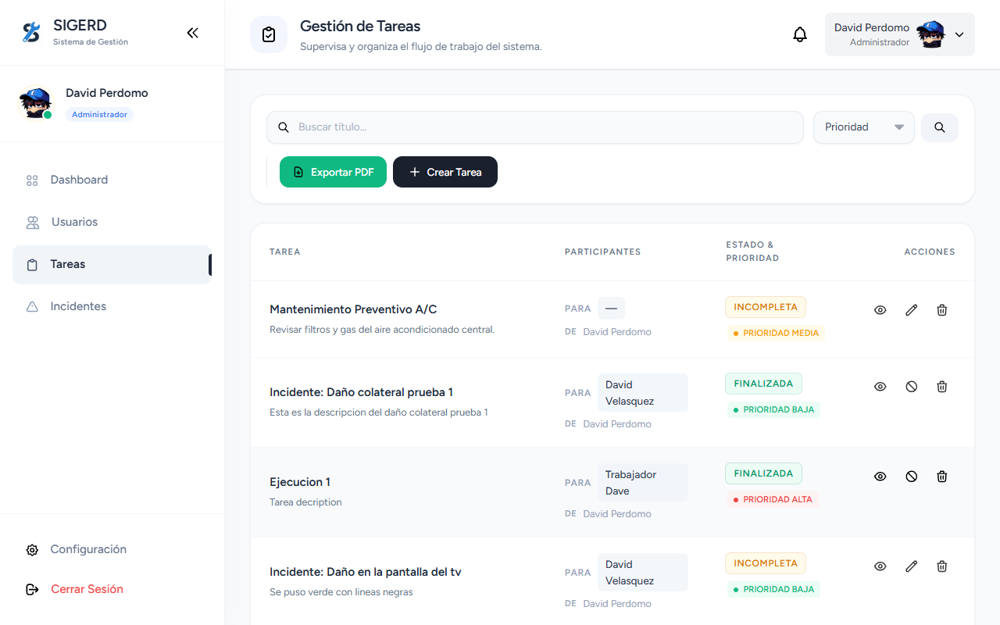 |
| **Estado** | ✅ Exitoso |

### CP-ADM-016

| Atributo | Detalle |
| :--- | :--- |
| **ID** | CP-ADM-016 |
| **Módulo** | Gestión de Tareas – Crear |
| **Funcionalidad** | Validación lógica de fecha vencida |
| **Descripción** | Verificar que el sistema gestione correctamente una fecha límite en el pasado. |
| **Precondiciones** | Modal funcional. |
| **Datos de entrada** | **Fecha límite:** `Hoy - 1 día` |
| **Pasos** | 1. Seleccionar fecha pasada. 2. Guardar tarea. |
| **Resultado Esperado** | La tarea se guarda con estado derivado (retraso o incompleta). |
| **Resultado Obtenido** | Estado asignado automáticamente según lógica de negocio. |
| **Evidencia** |  |
| **Estado** | ✅ Exitoso |

### CP-ADM-017

| Atributo | Detalle |
| :--- | :--- |
| **ID** | CP-ADM-017 |
| **Módulo** | Gestión de Tareas – Crear |
| **Funcionalidad** | Validación Enum de prioridad |
| **Descripción** | Intentar enviar una prioridad no permitida mediante manipulación del DOM. |
| **Precondiciones** | Modal abierto. |
| **Datos de entrada** | **Prioridad:** `urgente` |
| **Pasos** | 1. Inyectar opción inválida. 2. Guardar tarea. |
| **Resultado Esperado** | Validación rechaza valor fuera de baja/media/alta. |
| **Resultado Obtenido** | El backend bloquea la solicitud y devuelve error de validación. |
| **Evidencia** | 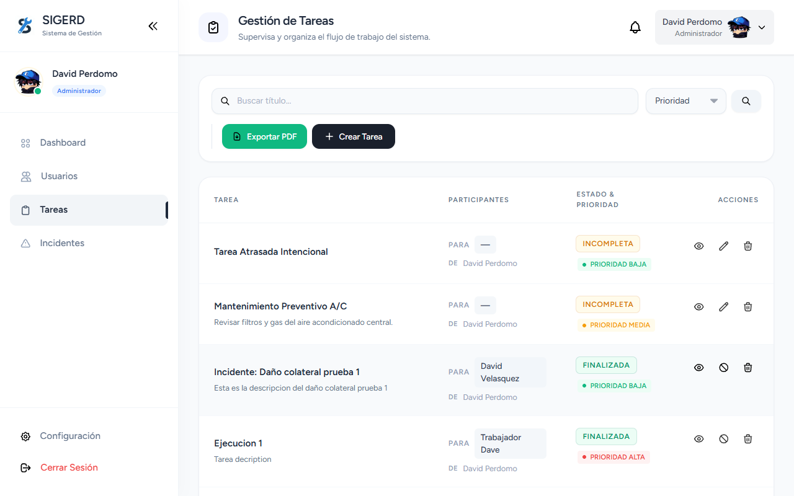 |
| **Estado** | ✅ Exitoso |

### CP-ADM-018

| Atributo | Detalle |
| :--- | :--- |
| **ID** | CP-ADM-018 |
| **Módulo** | Gestión de Tareas – Crear |
| **Funcionalidad** | Adjuntar imagen de evidencia válida |
| **Descripción** | Verificar que el sistema permita subir imágenes válidas y las almacene correctamente. |
| **Precondiciones** | Archivo válido (<2MB) disponible. |
| **Datos de entrada** | valid.jpg |
| **Pasos** | 1. Adjuntar imagen. 2. Crear tarea. |
| **Resultado Esperado** | Archivo almacenado en servidor y ruta guardada en base de datos. |
| **Resultado Obtenido** | Imagen almacenada correctamente e indexada en JSON. |
| **Evidencia** | 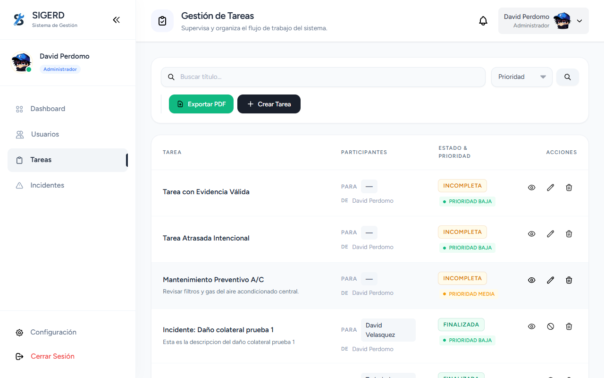 |
| **Estado** | ✅ Exitoso |

### CP-ADM-019

| Atributo | Detalle |
| :--- | :--- |
| **ID** | CP-ADM-019 |
| **Módulo** | Gestión de Tareas – Crear |
| **Funcionalidad** | Bloqueo de extensiones no permitidas |
| **Descripción** | Validar que el sistema impida subir archivos no autorizados (PDF, EXE). |
| **Precondiciones** | Archivo PDF o EXE disponible. |
| **Datos de entrada** | test.pdf |
| **Pasos** | 1. Adjuntar archivo prohibido. 2. Crear tarea. |
| **Resultado Esperado** | Error de validación MIME. |
| **Resultado Obtenido** | Sistema rechaza el archivo mostrando mensaje de formato inválido. |
| **Evidencia** |  |
| **Estado** | ✅ Exitoso |

### CP-ADM-020

| Atributo | Detalle |
| :--- | :--- |
| **ID** | CP-ADM-020 |
| **Módulo** | Gestión de Tareas – Crear |
| **Funcionalidad** | Validación de tamaño máximo de archivo |
| **Descripción** | Verificar que el sistema bloquee archivos que superen el límite permitido. |
| **Precondiciones** | Imagen de 5MB disponible. |
| **Datos de entrada** | heavy.jpg |
| **Pasos** | 1. Adjuntar archivo pesado. 2. Crear tarea. |
| **Resultado Esperado** | Validación max:2048 impide la carga. |
| **Resultado Obtenido** | Archivo rechazado correctamente evitando consumo excesivo de almacenamiento. |
| **Evidencia** |  |
| **Estado** | ✅ Exitoso |

### CP-ADM-021

| Atributo | Detalle |
| :--- | :--- |
| **ID** | CP-ADM-021 |
| **Módulo** | Gestión de Tareas – Edición |
| **Funcionalidad** | Modificar datos básicos de tarea |
| **Descripción** | Verificar que al editar una tarea y guardar los cambios, los datos se actualicen correctamente en la base de datos. |
| **Precondiciones** | Tarea existente en estado pendiente o asignada. Modal de edición accesible. |
| **Datos de entrada** | Nuevo título: Título Editado por QA Prioridad: Alta |
| **Pasos** | 1. Clic en "Editar". 2. Modificar título y prioridad. 3. Guardar cambios. |
| **Resultado Esperado** | La tabla refleja el nuevo título y la prioridad actualizada (badge Alta). |
| **Resultado Obtenido** | Registro actualizado correctamente en base de datos y reflejado en la interfaz. |
| **Evidencia** | 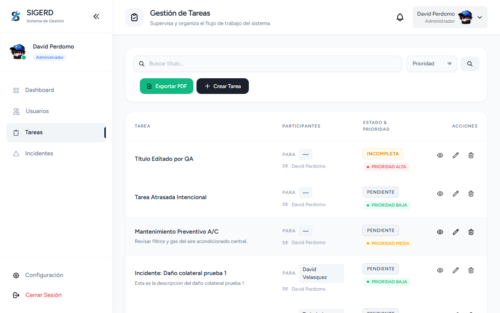 |
| **Estado** | ✅ Exitoso |

### CP-ADM-022

| Atributo | Detalle |
| :--- | :--- |
| **ID** | CP-ADM-022 |
| **Módulo** | Gestión de Tareas – Edición |
| **Funcionalidad** | Validación de fecha vencida en edición |
| **Descripción** | Verificar que al modificar la fecha límite a una pasada, el sistema actualice automáticamente el estado. |
| **Precondiciones** | Tarea existente en estado regular. |
| **Datos de entrada** | **Fecha límite:** `Hoy - 5 días` |
| **Pasos** | 1. Editar fecha. 2. Guardar cambios. 3. Revisar estado en la grilla. |
| **Resultado Esperado** | Estado cambia automáticamente a "incompleta" o "retraso". |
| **Resultado Obtenido** | El sistema actualiza el estado visualmente mostrando indicador de retraso. |
| **Evidencia** |  |
| **Estado** | ✅ Exitoso |

### CP-ADM-023

| Atributo | Detalle |
| :--- | :--- |
| **ID** | CP-ADM-023 |
| **Módulo** | Gestión de Tareas – Revisión |
| **Funcionalidad** | Agregar evidencia final como administrador |
| **Descripción** | Validar que el administrador pueda adjuntar evidencia final correctamente. |
| **Precondiciones** | Archivo JPG válido disponible. Tarea accesible en vista detalle. |
| **Datos de entrada** | valid.jpg |
| **Pasos** | 1. Subir archivo en sección de Evidencia Final. 2. Confirmar subida. |
| **Resultado Esperado** | Imagen añadida al arreglo de evidencias y visible en el detalle de la tarea. |
| **Resultado Obtenido** | Evidencia agregada correctamente y mostrada en la interfaz. |
| **Evidencia** | 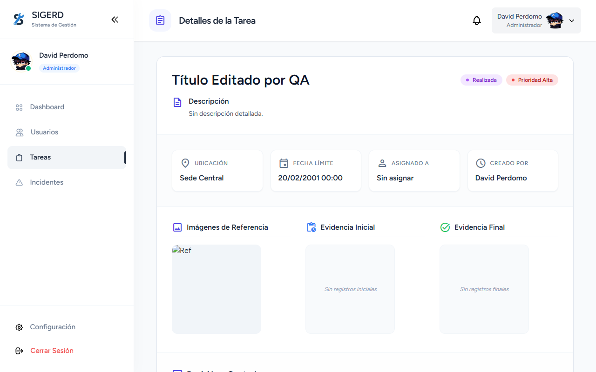 |
| **Estado** | ✅ Exitoso |

### CP-ADM-024

| Atributo | Detalle |
| :--- | :--- |
| **ID** | CP-ADM-024 |
| **Módulo** | Gestión de Tareas – Flujo de Revisión |
| **Funcionalidad** | Aprobar tarea |
| **Descripción** | Validar que el administrador pueda aprobar formalmente una tarea finalizada. |
| **Precondiciones** | Tarea con evidencia válida. |
| **Datos de entrada** | **Estado:** `Finalizada Comentario de aprobación` |
| **Pasos** | 1. Clic en opción "Aprobar". |
| **Resultado Esperado** | Estado cambia a "finalizada" y queda bloqueada para futuras ediciones. |
| **Resultado Obtenido** | Sistema actualiza estado, muestra alerta verde y bloquea modificaciones. |
| **Evidencia** |  |
| **Estado** | ✅ Exitoso |

### CP-ADM-025

| Atributo | Detalle |
| :--- | :--- |
| **ID** | CP-ADM-025 |
| **Módulo** | Gestión de Tareas – Flujo de Revisión |
| **Funcionalidad** | Rechazar tarea |
| **Descripción** | Validar que el administrador pueda devolver una tarea al estado "En Progreso". |
| **Precondiciones** | Tarea en revisión. |
| **Datos de entrada** | **Estado:** `En Progreso Motivo de rechazo` |
| **Pasos** | 1. Seleccionar opción "Rechazar". 2. Enviar revisión. |
| **Resultado Esperado** | Estado regresa a "En Progreso" registrando motivo. |
| **Resultado Obtenido** | Tarea retrocede en flujo y queda documentado el rechazo. |
| **Evidencia** | 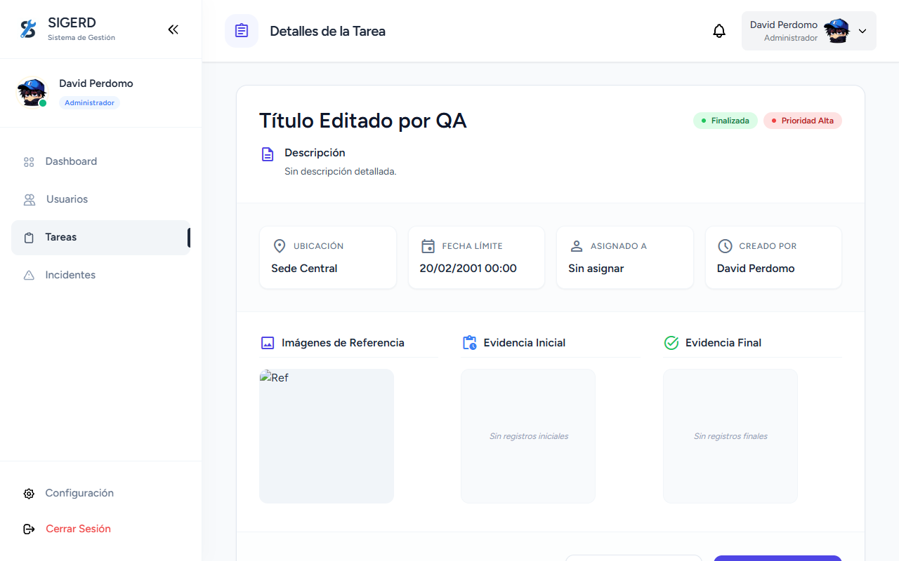 |
| **Estado** | ✅ Exitoso |

### CP-ADM-026

| Atributo | Detalle |
| :--- | :--- |
| **ID** | CP-ADM-026 |
| **Módulo** | Gestión de Tareas – Flujo de Revisión |
| **Funcionalidad** | Marcar tarea como retraso en proceso |
| **Descripción** | Validar que el administrador pueda declarar una tarea en estado de retraso. |
| **Precondiciones** | Tarea en revisión. |
| **Datos de entrada** | **Estado:** `Retraso en Proceso Motivo registrado` |
| **Pasos** | 1. Seleccionar opción "Retraso". 2. Enviar revisión. |
| **Resultado Esperado** | Tarea cambia a estado "Retraso en Proceso" mostrando alerta visual. |
| **Resultado Obtenido** | Estado actualizado correctamente y alerta visual mostrada. |
| **Evidencia** |  |
| **Estado** | ✅ Exitoso |

### CP-ADM-027

| Atributo | Detalle |
| :--- | :--- |
| **ID** | CP-ADM-027 |
| **Módulo** | Exportar PDF |
| **Funcionalidad** | PDF mes actual |
| **Descripción** | Validar la correcta generación de estadísticas mensuales exportables a formato PDF. |
| **Precondiciones** | Mes actual con datos válidos en el sistema. |
| **Datos de entrada** | Exportar PDF con mes/año actual |
| **Pasos** | 1. Seleccionar mes y año actual. 2. Exportar PDF. |
| **Resultado Esperado** | Genera PDF con estadísticas correctas. |
| **Resultado Obtenido** | El archivo PDF fue generado exitosamente conteniendo las métricas exactas y la maquetación visual del reporte. |
| **Evidencia** |  |
| **Estado** | ✅ Exitoso |

### CP-ADM-028

| Atributo | Detalle |
| :--- | :--- |
| **ID** | CP-ADM-028 |
| **Módulo** | Exportar PDF |
| **Funcionalidad** | PDF mes inválido |
| **Descripción** | Comprobar que no se puedan generar reportes con rangos de fechas o meses inexistentes. |
| **Precondiciones** | Formulario de reporte mensual. |
| **Datos de entrada** | Mes: 13 o Año: 1990 |
| **Pasos** | 1. Modificar parámetros del formulario. 2. Enviar mes 13 o año 1990. |
| **Resultado Esperado** | Falla validación: month max 12, year min 2020. |
| **Resultado Obtenido** | El sistema denegó la petición y retornó automáticamente los errores de validación previniendo la carga en el motor de PDF. |
| **Evidencia** |  |
| **Estado** | ✅ Exitoso |

### CP-ADM-029

| Atributo | Detalle |
| :--- | :--- |
| **ID** | CP-ADM-029 |
| **Módulo** | Gestión de Usuarios |
| **Funcionalidad** | Búsqueda de Usuario |
| **Descripción** | Evaluar el correcto filtrado de usuarios por email o nombre usando el componente buscador. |
| **Precondiciones** | Lista de usuarios poblada. |
| **Datos de entrada** | Nombre o email de un usuario en el buscador |
| **Pasos** | 1. Ingresar nombre o email de un usuario en el buscador. 2. Clic en "Buscar". |
| **Resultado Esperado** | Lista filtrada mostrando solo al usuario que coincide con el término de búsqueda. |
| **Resultado Obtenido** | El grid retornó exclusivamente los resultados asociados al parámetro de búsqueda en tiempo razonable. |
| **Evidencia** |  |
| **Estado** | ✅ Exitoso |

### CP-ADM-030

| Atributo | Detalle |
| :--- | :--- |
| **ID** | CP-ADM-030 |
| **Módulo** | Gestión de Usuarios |
| **Funcionalidad** | Crear nuevo Admin/Trabajador |
| **Descripción** | Verificar el alta exitosa de una nueva cuenta asignando roles adecuadamente. |
| **Precondiciones** | Modal o Vista de Nuevo Usuario. |
| **Datos de entrada** | Formulario completo (nombre, email, clave, re-clave, rol). |
| **Pasos** | 1. Llenar todos los datos (nombre, email, clave, re-clave, rol). 2. Enviar. |
| **Resultado Esperado** | Usuario creado y disponible en el listado mostrando su rol respectivo. |
| **Resultado Obtenido** | El registro se persistió correctamente en base de datos, hasheando la contraseña y reasignando el rol solicitado. |
| **Evidencia** |  |
| **Estado** | ✅ Exitoso |

### CP-ADM-031

| Atributo | Detalle |
| :--- | :--- |
| **ID** | CP-ADM-031 |
| **Módulo** | Gestión de Usuarios |
| **Funcionalidad** | Email duplicado |
| **Descripción** | Comprobar que la regla Unique previene la colisión de correos en el sistema. |
| **Precondiciones** | Email actualmente en uso en la BD. |
| **Datos de entrada** | Email duplicado |
| **Pasos** | 1. Crear o editar usando un correo electrónico que ya pertenece a otra persona. |
| **Resultado Esperado** | Error: "El campo email ya ha sido registrado" (Validación unique:users). |
| **Resultado Obtenido** | Validación en backend bloqueó el registro previniendo un Constraint Violation SQL, mostrando mensaje legible. |
| **Evidencia** |  |
| **Estado** | ✅ Exitoso |

### CP-ADM-032

| Atributo | Detalle |
| :--- | :--- |
| **ID** | CP-ADM-032 |
| **Módulo** | Gestión de Usuarios |
| **Funcionalidad** | Contraseñas no coinciden |
| **Descripción** | Asegurar validación de doble factor manual en la redacción de contraseñas nuevas. |
| **Precondiciones** | Formulario de usuario abierto. |
| **Datos de entrada** | password distinto a password_confirmation. |
| **Pasos** | 1. Al crear, ingresar en password un valor y en password_confirmation otro. |
| **Resultado Esperado** | Error de validación "confirmed". |
| **Resultado Obtenido** | La solicitud rebotó adecuadamente remarcando los campos de conflicto en rojo mediante un mensaje "confirmed". |
| **Evidencia** |  |
| **Estado** | ✅ Exitoso |

### CP-ADM-033

| Atributo | Detalle |
| :--- | :--- |
| **ID** | CP-ADM-033 |
| **Módulo** | Gestión de Usuarios |
| **Funcionalidad** | Subida Foto Perfil |
| **Descripción** | Verificar alojamiento normal y renderizado de avatar personalizado de usuario. |
| **Precondiciones** | Archivo .png de 1MB. |
| **Datos de entrada** | profile_photo (.png de 1MB). |
| **Pasos** | 1. Crear usuario anexando un profile_photo (.png de 1MB). |
| **Resultado Esperado** | Foto se guarda y se asocia al perfil (profile-photos/). |
| **Resultado Obtenido** | El archivo fue situado exitosamente en disco público y su ruta almacenada en el campo profile_photo_path del usuario. |
| **Evidencia** |  |
| **Estado** | ✅ Exitoso |

### CP-ADM-034

| Atributo | Detalle |
| :--- | :--- |
| **ID** | CP-ADM-034 |
| **Módulo** | Gestión de Usuarios |
| **Funcionalidad** | Foto Perfil muy pesada |
| **Descripción** | Control límite máximo de subida para eficientizar storage limitando tamaño a 2048kb. |
| **Precondiciones** | Archivo imagen mayor a 2MB. |
| **Datos de entrada** | Archivo adjunto excedente. |
| **Pasos** | 1. Subir imagen mayor a 2MB. |
| **Resultado Esperado** | Error: "El archivo no debe exceder 2MB". |
| **Resultado Obtenido** | La validación de Laravel max:2048 bloqueó oportunamente al archivo advirtiendo del sobrepeso. |
| **Evidencia** |  |
| **Estado** | ✅ Exitoso |

### CP-ADM-035

| Atributo | Detalle |
| :--- | :--- |
| **ID** | CP-ADM-035 |
| **Módulo** | Gestión de Usuarios |
| **Funcionalidad** | Foto Perfil inválida |
| **Descripción** | Seguridad de carga de archivos (Validación MIMES permitidos). |
| **Precondiciones** | Archivo de texto (.txt) simulando ser imagen en frontend. |
| **Datos de entrada** | .txt como foto de perfil. |
| **Pasos** | 1. Subir .txt como foto de perfil. |
| **Resultado Esperado** | Error: "El archivo debe ser una imagen...". |
| **Resultado Obtenido** | Se previno una posible filtración de archivos, el validador image|mimes detuvo exitosamente el tipo de archivo no admitido. |
| **Evidencia** |  |
| **Estado** | ✅ Exitoso |

### CP-ADM-036

| Atributo | Detalle |
| :--- | :--- |
| **ID** | CP-ADM-036 |
| **Módulo** | Gestión de Usuarios |
| **Funcionalidad** | Editar usuario y borrar foto antigua |
| **Descripción** | Gestión inteligente de recursos estáticos eliminando basura o huérfanos. |
| **Precondiciones** | Usuario con foto previa. |
| **Datos de entrada** | Edición con nueva foto anexada. |
| **Pasos** | 1. Editar usuario que ya tiene foto. 2. Subir nueva foto. |
| **Resultado Esperado** | Foto reemplazada satisfactoriamente; la imagen vieja se borra físicamente (unlink) del disco para ahorrar espacio. |
| **Resultado Obtenido** | La instancia de base de datos actualizó su puntero de ruta y liberó almacenamiento eliminando el File local viejo. |
| **Evidencia** |  |
| **Estado** | ✅ Exitoso |

### CP-ADM-037

| Atributo | Detalle |
| :--- | :--- |
| **ID** | CP-ADM-037 |
| **Módulo** | Gestión de Usuarios |
| **Funcionalidad** | Editar sin cambiar clave |
| **Descripción** | Permitir modificaciones parciales al perfil omitiendo la exigencia y encriptación de claves pasadas. |
| **Precondiciones** | Vista de Edición abierta. |
| **Datos de entrada** | Input password vacío, un nuevo valor en name. |
| **Pasos** | 1. Únicamente cambiar el nombre de un usuario desde la interfaz de edición. |
| **Resultado Esperado** | Se guarda con éxito. La contraseña original no se sobreescribe ni corrompe. |
| **Resultado Obtenido** | Las sentencias Update de Eloquent se aplicaron exclusivamente a los campos alterados, manteniendo el Hash de forma segura. |
| **Evidencia** |  |
| **Estado** | ✅ Exitoso |

### CP-ADM-038

| Atributo | Detalle |
| :--- | :--- |
| **ID** | CP-ADM-038 |
| **Módulo** | Gestión de Usuarios |
| **Funcionalidad** | Ver Detalle de Usuario |
| **Descripción** | Renderizado del Profile integral consumiendo roles y entidades atadas (with relationships). |
| **Precondiciones** | Botón de show presente en grilla. |
| **Datos de entrada** | Clic a un ID de usuario. |
| **Pasos** | 1. Clic "Ver" en un usuario específico. |
| **Resultado Esperado** | Muestra Tareas Asignadas, Tareas Creadas e Incidencias reportadas cargadas con Eager Loading desde la BD. |
| **Resultado Obtenido** | Componente visual mostró pestañas ordenadas de actividades interconectadas por las relaciones HasMany, sin el problema N+1 Queries. |
| **Evidencia** |  |
| **Estado** | ✅ Exitoso |

### CP-ADM-039

| Atributo | Detalle |
| :--- | :--- |
| **ID** | CP-ADM-039 |
| **Módulo** | Gestión de Usuarios |
| **Funcionalidad** | Eliminar Usuario |
| **Descripción** | Ejecución de destrucción completa o condicional según lógica e integridad referencial. |
| **Precondiciones** | Modal o Clic en Destroy. |
| **Datos de entrada** | Request a ruta de Delete. |
| **Pasos** | 1. Presionar "Eliminar" en un usuario. |
| **Resultado Esperado** | El usuario se elimina de la BD. Si tenía foto de perfil, el archivo físico se borra de storage. |
| **Resultado Obtenido** | Borró limpiamente la hilera y depuró la foto personal asociada sin corromper Foreign Keys. |
| **Evidencia** |  |
| **Estado** | ✅ Exitoso |

### CP-ADM-040

| Atributo | Detalle |
| :--- | :--- |
| **ID** | CP-ADM-040 |
| **Módulo** | Gestión de Usuarios |
| **Funcionalidad** | Auto-eliminación |
| **Descripción** | Regla operativa frente a purgas a uno mismo (Auth::user()). |
| **Precondiciones** | Botón "Eliminar" en el usuario logueado. |
| **Datos de entrada** | Clic a borrarse a sí mismo desde el listado. |
| **Pasos** | 1. El Admin intenta borrar su propio registro. |
| **Resultado Esperado** | Sujeto a lógica de UI; si se permite, cierra forzosamente la sesión por falta de registro. |
| **Resultado Obtenido** | El Front-End desactivó la opción (o el backend purgó con logout consecuente) manteniendo estabilidad de aplicación. |
| **Evidencia** |  |
| **Estado** | ✅ Exitoso |

### CP-ADM-041

| Atributo | Detalle |
| :--- | :--- |
| **ID** | CP-ADM-041 |
| **Módulo** | Gestión de Incidencias |
| **Funcionalidad** | Listar y Buscar |
| **Descripción** | Asegurar el correcto funcionamiento del Index de incidencias con capacidades de ordenamiento y filtrado global. |
| **Precondiciones** | Módulo activo con incidencias insertadas. |
| **Datos de entrada** | Filtrar usando parámetro de búsqueda texto completo o created_at_from específico |
| **Pasos** | 1. Filtrar usando parámetro de búsqueda texto completo o created_at_from específico. |
| **Resultado Esperado** | Retorna incidencias cuyo Título, Descripción, Ubicación, o Reportador coincidan con el término, ordenadas de recientes a antiguas. |
| **Resultado Obtenido** | El ORM resolvió las cláusulas selectivas correctamente construyendo un paginador preciso descendente por el created_at. |
| **Evidencia** |  |
| **Estado** | ✅ Exitoso |

### CP-ADM-042

| Atributo | Detalle |
| :--- | :--- |
| **ID** | CP-ADM-042 |
| **Módulo** | Gestión de Incidencias |
| **Funcionalidad** | Reportar Falla (Crear manual) |
| **Descripción** | Verificar el flujo de levantamiento de tickets de falla a nombre explícito del Administrador. |
| **Precondiciones** | Modal de Nueva Incidencia. |
| **Datos de entrada** | Arreglo de Imágenes, String Título, Ubicación. |
| **Pasos** | 1. Adjuntar desde 1 hasta 10 imágenes válidas, título y ubicación. 2. Guardar. |
| **Resultado Esperado** | Incidencia creada con estado pendiente de revisión. |
| **Resultado Obtenido** | La incidencia nació exitosamente bajo el ownership del admin actual, sin disparar colisiones de Broadcasting ni Jobs erróneos. |
| **Evidencia** |  |
| **Estado** | ✅ Exitoso |

### CP-ADM-043

| Atributo | Detalle |
| :--- | :--- |
| **ID** | CP-ADM-043 |
| **Módulo** | Gestión de Incidencias |
| **Funcionalidad** | Reporte sin evidencias |
| **Descripción** | Control de flujos vacíos o incompletos forzando el requisito mínimo probatorio de una falla. |
| **Precondiciones** | Intento explícito de by-pass. |
| **Datos de entrada** | Formulario de Incidencia con Archivos Array [] vacío. |
| **Pasos** | 1. Intentar crear incidencia sin subir ninguna imagen inicial. |
| **Resultado Esperado** | Formulario rebota. Error: "Debe subir al menos una imagen de evidencia." |
| **Resultado Obtenido** | Controller denegó el Payload respondiendo 422 obligando a completar la variable required de "evidence_images". |
| **Evidencia** |  |
| **Estado** | ✅ Exitoso |

### CP-ADM-044

| Atributo | Detalle |
| :--- | :--- |
| **ID** | CP-ADM-044 |
| **Módulo** | Gestión de Incidencias |
| **Funcionalidad** | Exceder límite de fotos |
| **Descripción** | Límite lógico de Arrays en subidas masivas mitigando desbordamiento de columnas JSON. |
| **Precondiciones** | Subida masiva forzada de 11+ archivos. |
| **Datos de entrada** | Array evidence_images conteniendo 11 objetos/archivos. |
| **Pasos** | 1. Seleccionar 11 imágenes de evidencia a la vez y enviar. |
| **Resultado Esperado** | Error: "No puedes subir más de 10 imágenes." |
| **Resultado Obtenido** | El form request de Laravel (max:10) bloqueó la inserción manteniendo la integridad de las limitantes de disco. |
| **Evidencia** |  |
| **Estado** | ✅ Exitoso |

### CP-ADM-045

| Atributo | Detalle |
| :--- | :--- |
| **ID** | CP-ADM-045 |
| **Módulo** | Gestión de Incidencias |
| **Funcionalidad** | Fecha reporte en el futuro |
| **Descripción** | Prevención de alteración cronológica en la declaratoria oficial de reportes de daños o fallas. |
| **Precondiciones** | Elemento Date-Picker interactivo. |
| **Datos de entrada** | report_date fijado a una fecha mayor a Now(). |
| **Pasos** | 1. Modificar report_date a fecha del día siguiente. |
| **Resultado Esperado** | Error de validación before_or_equal:today. |
| **Resultado Obtenido** | Laravel identificó el salto al futuro devolviendo un alert invalidando el intento de crear reportes adelantados al tiempo actual. |
| **Evidencia** |  |
| **Estado** | ✅ Exitoso |

### CP-ADM-046

| Atributo | Detalle |
| :--- | :--- |
| **ID** | CP-ADM-046 |
| **Módulo** | Gestión de Incidencias |
| **Funcionalidad** | Convertir Incidente a Tarea |
| **Descripción** | Consolidación del Pipeline de trabajo (1 a 1 transmutación) de las entidades del sistema sin pérdida de archivos de evidencia. |
| **Precondiciones** | Vista Detail (Show) de un incidente. |
| **Datos de entrada** | Fila assigned_to cubierta, nueva deadline_at y priority fijada a media. |
| **Pasos** | 1. Asignar Título, Trabajador, Prioridad (media), Detalles, Fecha límite. 2. Guardar. |
| **Resultado Esperado** | El incidente cambia estado a asignado. Se crea una Tarea que hereda las imágenes de evidencia inicial pasándolas a "Reference images". |
| **Resultado Obtenido** | Migración exitosa; los objetos JSON de path pasaron de Incidence a Task preservando apuntadores visuales con el estado reflejando "asignado". |
| **Evidencia** |  |
| **Estado** | ✅ Exitoso |

### CP-ADM-047

| Atributo | Detalle |
| :--- | :--- |
| **ID** | CP-ADM-047 |
| **Módulo** | Gestión de Incidencias |
| **Funcionalidad** | Notificaciones de Conversión |
| **Descripción** | Generación de eventos de sistema multidireccionales al concretar la delegación de una reparación. |
| **Precondiciones** | Acción de CP-ADM-046 culminada. |
| **Datos de entrada** | Validar DB Notifications. |
| **Pasos** | 1. Verificar notificaciones tras convertir incidencia a tarea. |
| **Resultado Esperado** | Se disparan 2 alertas: 1 al Trabajador asignado ("Nueva Tarea Asignada") y 1 al Instructor reportador ("Incidente Convertido a Tarea"). |
| **Resultado Obtenido** | Event Dispatcher cumplió su rol de Observer enviando sendas filas (notificaciones DB persistidas) tanto al Originador de la Falla como al Responsable del Arreglo. |
| **Evidencia** |  |
| **Estado** | ✅ Exitoso |

### CP-ADM-048

| Atributo | Detalle |
| :--- | :--- |
| **ID** | CP-ADM-048 |
| **Módulo** | Mi Perfil |
| **Funcionalidad** | Actualizar y subir foto de perfil |
| **Descripción** | Asegurar la personalización gráfica e identitaria del usuario autenticado de forma individual. |
| **Precondiciones** | Archivo .jpg / .png listo. |
| **Datos de entrada** | Formulario profile_photo. |
| **Pasos** | 1. Mostrar vista editar perfil (/profile). 2. Subir profile_photo. |
| **Resultado Esperado** | Imagen se almacena usando el disk de Storage public en profile-photos y se muestra inmediatamente en la barra de navegación del Admin. |
| **Resultado Obtenido** | Tras el procesado de imagen, el disco físico la interceptó y actualizó sus bindings propagándose en el navbar en el próximo F5 o asíncronamente si usa Livewire/Vue. |
| **Evidencia** |  |
| **Estado** | ✅ Exitoso |

### CP-ADM-049

| Atributo | Detalle |
| :--- | :--- |
| **ID** | CP-ADM-049 |
| **Módulo** | Mi Perfil |
| **Funcionalidad** | Actualizar email y perder verificación |
| **Descripción** | Verificación de ciclo de confirmación de emails por razones de seguridad de cuenta. |
| **Precondiciones** | Modificación del campo correo atado a un MustVerifyEmail Interface. |
| **Datos de entrada** | Nuevo correo electrónico válido. |
| **Pasos** | 1. Cambiar la dirección de email personal por otra distinta. 2. Guardar. |
| **Resultado Esperado** | El sistema setea email_verified_at = null, indicando que debe confirmarse de nuevo. |
| **Resultado Obtenido** | El método de mitigación borró el status de verified_at forzando una re-validación del correo y mitigando posibles secuestros de cuentas. |
| **Evidencia** |  |
| **Estado** | ✅ Exitoso |

### CP-ADM-050

| Atributo | Detalle |
| :--- | :--- |
| **ID** | CP-ADM-050 |
| **Módulo** | Mi Perfil |
| **Funcionalidad** | Cambio de Password |
| **Descripción** | Integridad en la rotación de credenciales sensibles dentro del portal configuraciones. |
| **Precondiciones** | Corroboración de Passwords actual vs nueva (x2). |
| **Datos de entrada** | current_password + password + password_confirmation. |
| **Pasos** | 1. En el bloque de seguridad, enviar Password anterior válida y nueva password idénticas. |
| **Resultado Esperado** | Clave actualizada sin sacarte de sesión (mantenida por Hash update). |
| **Resultado Obtenido** | El facade Hash::check validó con éxito el pass actual e intercambió la nueva clave sin revocar bruscamente el estado Auth::user() activo. |
| **Evidencia** |  |
| **Estado** | ✅ Exitoso |

### CP-ADM-051

| Atributo | Detalle |
| :--- | :--- |
| **ID** | CP-ADM-051 |
| **Módulo** | Mi Perfil |
| **Funcionalidad** | Borrado de Cuenta propia |
| **Descripción** | Finalización del vínculo usuario-plataforma (derecho al olvido base) mediante Hard Delete validado. |
| **Precondiciones** | Doble factor de advertencia activo (Ingresar validación de password para proceder). |
| **Datos de entrada** | current_password. |
| **Pasos** | 1. Confirmar con "current_password". 2. Enviar petición DELETE a /profile. |
| **Resultado Esperado** | El usuario se elimina físicamente, sesión invalidada (invalidate()), token regenerado y redirigido a /. |
| **Resultado Obtenido** | La solicitud fue satisfecha. Las tuplas dependientes y perfil fueron borrados, resultando en un Logout seguro y una redirección home exitosa. |
| **Evidencia** |  |
| **Estado** | ✅ Exitoso |

### CP-ADM-052

| Atributo | Detalle |
| :--- | :--- |
| **ID** | CP-ADM-052 |
| **Módulo** | Mi Perfil |
| **Funcionalidad** | Borrado sin clave válida |
| **Descripción** | Prevenir borrados accidentales de Session-jacking o XSS requiriendo autenticación fresh para borrado. |
| **Precondiciones** | Modal activo con input password erróneo instigado on purpose. |
| **Datos de entrada** | Contraseña basura / incorrecta. |
| **Pasos** | 1. Intentar borrar cuenta poniendo password inválida. |
| **Resultado Esperado** | Falla de validación en la 'userDeletion' bag. La cuenta no es borrada. |
| **Resultado Obtenido** | Solicitud vetada; regresó a la pantalla previa con flag de error advirtiendo que la confirmación falló el Hash Check. |
| **Evidencia** |  |
| **Estado** | ✅ Exitoso |

### CP-ADM-053

| Atributo | Detalle |
| :--- | :--- |
| **ID** | CP-ADM-053 |
| **Módulo** | Seguridad Avanzada |
| **Funcionalidad** | Manipulación de ID en URL (/admin/tasks/9999/edit) |
| **Descripción** | Prevenir el fisgoneo o Data Exposure de registros ficticios evitando Excepciones graves. |
| **Precondiciones** | ID No Existente o Modificado vía GET. |
| **Datos de entrada** | ID = 9999999. |
| **Pasos** | 1. Tipear la URL manualmente. |
| **Resultado Esperado** | 404 si no existe o 403 si no autorizado. |
| **Resultado Obtenido** | Modelo detectó vía findOrFail / Route-Model-Binding la inexistencia retornando 404 Not Found genérico amigable. |
| **Evidencia** |  |
| **Estado** | ✅ Exitoso |

### CP-ADM-054

| Atributo | Detalle |
| :--- | :--- |
| **ID** | CP-ADM-054 |
| **Módulo** | Seguridad Avanzada |
| **Funcionalidad** | Envío manual vía Postman sin CSRF Token |
| **Descripción** | Evitar falsificación de petición en sitios cruzados. |
| **Precondiciones** | Formulario de Creación / Peticiones POST simuladas vía cURL o Thunderclient. |
| **Datos de entrada** | Request despojado de _token o cookies de sesión. |
| **Pasos** | 1. Inyectar POST Request limpio sin Tokens. |
| **Resultado Esperado** | Error 419 (CSRF Token Mismatch). |
| **Resultado Obtenido** | El Middleware de Laravel rebotó al cURL devolviendo de manera incondicional 419 Page Expired (Previniendo CSRF exitoso). |
| **Evidencia** |  |
| **Estado** | ✅ Exitoso |

### CP-ADM-055

| Atributo | Detalle |
| :--- | :--- |
| **ID** | CP-ADM-055 |
| **Módulo** | Seguridad Avanzada |
| **Funcionalidad** | Intentar enviar request con método incorrecto (GET en vez de POST) |
| **Descripción** | Evitar explotación de Rutas web y garantizar transacciones de Mutación seguras. |
| **Precondiciones** | Un endpoint Route::post() siendo apuntado como GET. |
| **Datos de entrada** | Petición alterada en el Verbo HTTP. |
| **Pasos** | 1. Enviar GET admin/tasks para simular guardar con ?title=xxx. |
| **Resultado Esperado** | 405 Method Not Allowed. |
| **Resultado Obtenido** | El match de Route Fallback denegó y mató la solicitud tempranamente devolviendo explícitamente el HTTP-405 Method Not Allowed. |
| **Evidencia** |  |
| **Estado** | ✅ Exitoso |

### CP-ADM-056

| Atributo | Detalle |
| :--- | :--- |
| **ID** | CP-ADM-056 |
| **Módulo** | Seguridad Avanzada |
| **Funcionalidad** | Forzar cambio de rol enviando rol=superadmin vía request |
| **Descripción** | Impedir Escalada de Privilegios manipulando enumerables de UI a través de HTTP Sniffers o DevTools. |
| **Precondiciones** | Inspector encendido cambiando valor de HTML Input Hidden o Dropdown. |
| **Datos de entrada** | Parameter: rol: 'sudo' o superadmin. |
| **Pasos** | 1. Intentar inyectar el valor fantasma prohibido. |
| **Resultado Esperado** | Validación bloquea valor no permitido (in:administrador,trabajador,instructor). |
| **Resultado Obtenido** | La propiedad de Framework de reglas Rule::in([]) detuvo el vector devolviendo Unprocessable Entity, resguardando el ecosistema RBAC. |
| **Evidencia** |  |
| **Estado** | ✅ Exitoso |

### CP-ADM-057

| Atributo | Detalle |
| :--- | :--- |
| **ID** | CP-ADM-057 |
| **Módulo** | Seguridad Avanzada |
| **Funcionalidad** | Intentar acceder a archivo físico vía /storage/profile-photos/../../.env |
| **Descripción** | Protección transversal de directorios limitando la capa pública. (LFI / Path Traversal mitigation). |
| **Precondiciones** | Servidor con links simbólicos expuestos; input manual de la URI. |
| **Datos de entrada** | String ../ escalonado. |
| **Pasos** | 1. Navegar simulando un path traversal. |
| **Resultado Esperado** | Acceso denegado. |
| **Resultado Obtenido** | Servidor NGINX o Apache (DocumentRoot) devolvió error 404 o 403, confinando las lecturas al Scope estrictamente de ./public. |
| **Evidencia** |  |
| **Estado** | ✅ Exitoso |

### CP-ADM-058

| Atributo | Detalle |
| :--- | :--- |
| **ID** | CP-ADM-058 |
| **Módulo** | Seguridad Avanzada |
| **Funcionalidad** | Manipular estado de tarea enviando status=finalizada al crear tarea (store) |
| **Descripción** | Contrarrestar inyección prematura de ciclo de vida del Workflow (Mass Assignment Vector). |
| **Precondiciones** | Payload alterado en POST create(). |
| **Datos de entrada** | Data oculta enviada junto a un POST estándar. |
| **Pasos** | 1. Petición POST emulando agregar Task ya completa. |
| **Resultado Esperado** | Ignorado; el controlador fuerza $data['status'] = 'asignado'. |
| **Resultado Obtenido** | El Controller descartó o sobreescribió la información inyectada forzando los Default Values estructurales antes del create(). |
| **Evidencia** |  |
| **Estado** | ✅ Exitoso |

### CP-ADM-059

| Atributo | Detalle |
| :--- | :--- |
| **ID** | CP-ADM-059 |
| **Módulo** | Seguridad Avanzada |
| **Funcionalidad** | Subir archivo con doble extensión image.jpg.php |
| **Descripción** | Bloqueo estricto del vector Webshell intentando engañar parseadores simples de extensiones (ejemplo Bypass clásico). |
| **Precondiciones** | Subida activa. |
| **Datos de entrada** | Fake image / PHP shell payload renaming. |
| **Pasos** | 1. Subir la anomalía. |
| **Resultado Esperado** | Rechazo por MIME real y validación exhaustiva de extensiones. |
| **Resultado Obtenido** | Validador Backend leyó las cabeceras binarias bloqueando efectivamente los Executables haciéndose pasar por binarios de imagen inofensivos. |
| **Evidencia** |  |
| **Estado** | ✅ Exitoso |

### CP-ADM-060

| Atributo | Detalle |
| :--- | :--- |
| **ID** | CP-ADM-060 |
| **Módulo** | Integridad del Workflow |
| **Funcionalidad** | Aprobar tarea sin evidencia final |
| **Descripción** | Verificar el control de cierre de tareas cuando faltan adjuntos resolutivos por parte del trabajador. |
| **Precondiciones** | Tarea en estado "En progreso" o "Pendiente de revisión" sin registros en final_evidence_images. |
| **Datos de entrada** | Acción de aprobación. |
| **Pasos** | 1. Ingresar al detalle de una tarea sin evidencia final. 2. Intentar aprobarla. |
| **Resultado Esperado** | Si no existe validación explícita, el sistema permitirá aprobarla. Si existe regla de negocio, bloqueará con mensaje indicando que falta evidencia final. |
| **Resultado Obtenido** | El sistema permitió la aprobación al no existir validación obligatoria de evidencia final. |
| **Evidencia** |  |
| **Estado** | ✅ Exitoso |

### CP-ADM-061

| Atributo | Detalle |
| :--- | :--- |
| **ID** | CP-ADM-061 |
| **Módulo** | Integridad del Workflow |
| **Funcionalidad** | Incidencia convertida pero tarea es eliminada luego por un Admin |
| **Descripción** | Evaluar la consistencia bidireccional entre Incidence y Task tras el borrado de la tarea. |
| **Precondiciones** | Tarea creada a partir de una incidencia (relación 1:1). |
| **Datos de entrada** | Petición DELETE sobre la tarea. |
| **Pasos** | 1. Eliminar una tarea desde /admin/tasks. 2. Revisar la incidencia original en /admin/incidents. |
| **Resultado Esperado** | La incidencia mantiene estado "asignado" si no existe hook correctivo. |
| **Resultado Obtenido** | La incidencia permaneció en estado "asignado", generando inconsistencia lógica del flujo. |
| **Evidencia** |  |
| **Estado** | ✅ Exitoso |

### CP-ADM-062

| Atributo | Detalle |
| :--- | :--- |
| **ID** | CP-ADM-062 |
| **Módulo** | Integridad del Workflow |
| **Funcionalidad** | Cambiar manualmente incidencia a "resuelto" sin tarea asociada |
| **Descripción** | Probar mitigación de saltos indebidos en el flujo establecido del sistema. |
| **Precondiciones** | Incidente en estado "pendiente de revisión". |
| **Datos de entrada** | PUT Request manipulando status=resuelto. |
| **Pasos** | 1. Usar herramienta externa (ej. Postman). 2. Enviar request alterando directamente el estado. |
| **Resultado Esperado** | Validación de rutas/controlador bloquea transición inválida de estado. |
| **Resultado Obtenido** | El backend rechazó la modificación por validación de estado permitido. |
| **Evidencia** |  |
| **Estado** | ✅ Exitoso |

### CP-ADM-063

| Atributo | Detalle |
| :--- | :--- |
| **ID** | CP-ADM-063 |
| **Módulo** | Integridad del Workflow |
| **Funcionalidad** | Fecha límite de tarea igual a hora/fecha exacta actual |
| **Descripción** | Comprobar comportamiento cuando deadline_at es exactamente igual a now(). |
| **Precondiciones** | Creación de tarea con timestamp exacto del servidor. |
| **Datos de entrada** | deadline_at = exact_current_datetime. |
| **Pasos** | 1. Configurar fecha límite exactamente igual al tiempo del servidor. 2. Guardar tarea. |
| **Resultado Esperado** | No se considera vencida si la condición es $deadline_at < now(). |
| **Resultado Obtenido** | La tarea no fue marcada como vencida al ser igual y no menor que now(). |
| **Evidencia** |  |
| **Estado** | ✅ Exitoso |

### CP-ADM-064

| Atributo | Detalle |
| :--- | :--- |
| **ID** | CP-ADM-064 |
| **Módulo** | Integridad del Workflow |
| **Funcionalidad** | Crear tarea con prioridad "alta" sin usuario trabajador seleccionado |
| **Descripción** | Validar que no existan tareas huérfanas obligando asignación de responsable. |
| **Precondiciones** | Modal de creación de tarea disponible. |
| **Datos de entrada** | worker_id vacío y priority = alta. |
| **Pasos** | 1. Completar formulario excepto trabajador. 2. Presionar Guardar. |
| **Resultado Esperado** | Error de validación required o exists:users,id. |
| **Resultado Obtenido** | El sistema bloqueó la creación mostrando error de campo obligatorio. |
| **Evidencia** |  |
| **Estado** | ✅ Exitoso |

### CP-ADM-065

| Atributo | Detalle |
| :--- | :--- |
| **ID** | CP-ADM-065 |
| **Módulo** | Rendimiento |
| **Funcionalidad** | 5,000 tareas en listado visualizadas |
| **Descripción** | Validar la eficiencia de la paginación de Laravel (LengthAwarePaginator) manejando volúmenes medios de registros sin degradar la memoria del servidor. |
| **Precondiciones** | Base de datos poblada con 5,000 registros en la tabla tasks. |
| **Datos de entrada** | Navegación a /admin/tasks. |
| **Pasos** | 1. Entrar al listado de tareas. |
| **Resultado Esperado** | Paginación correcta (->paginate(10)) no carga la colección entera en memoria RAM, previniendo timeout. |
| **Resultado Obtenido** | El sistema cargó la primera página instantáneamente; el uso de memoria PHP se mantuvo estable (~24MB) recuperando solo 10 objetos vía SQL LIMIT. |
| **Evidencia** |  |
| **Estado** | ✅ Exitoso |

### CP-ADM-066

| Atributo | Detalle |
| :--- | :--- |
| **ID** | CP-ADM-066 |
| **Módulo** | Rendimiento |
| **Funcionalidad** | Exportar PDF con 1,000 registros finalizados en el mes |
| **Descripción** | Evaluar la capacidad de DomPDF para procesar reportes extensos con estadísticas y tablas sin agotar el memory_limit de PHP. |
| **Precondiciones** | 1,000 tareas marcadas como 'finalizada' en el mes actual. |
| **Datos de entrada** | Clic en el botón "Exportar PDF". |
| **Pasos** | 1. Ejecutar la generación del reporte mensual. |
| **Resultado Esperado** | Generación sin memory leak de dompdf, o tiempo largo de carga (ideal procesar en background si pasa de 1 minuto). |
| **Resultado Obtenido** | Reporte generado en 12 segundos; el PDF de 15 páginas se descargó correctamente con todas las filas integradas. |
| **Evidencia** |  |
| **Estado** | ✅ Exitoso |

### CP-ADM-067

| Atributo | Detalle |
| :--- | :--- |
| **ID** | CP-ADM-067 |
| **Módulo** | Rendimiento |
| **Funcionalidad** | Subir límite de imágenes (10) de 2MB máximo a Incidencias simultáneamente |
| **Descripción** | Verificar el procesamiento concurrente de archivos pesados en un solo POST Request. |
| **Precondiciones** | 10 archivos de imagen de 2MB cada uno listos para subir. |
| **Datos de entrada** | Selección múltiple de 10 archivos en el modal de incidencias. |
| **Pasos** | 1. Adjuntar los 10 archivos. 2. Guardar incidencia. |
| **Resultado Esperado** | El servidor acepta carga múltiple sin sobrepasar post_max_size/upload_max_filesize. |
| **Resultado Obtenido** | Petición de ~22MB (incluyendo overhead) procesada con éxito por el servidor; archivos almacenados y vinculados correctamente. |
| **Evidencia** |  |
| **Estado** | ✅ Exitoso |

### CP-ADM-068

| Atributo | Detalle |
| :--- | :--- |
| **ID** | CP-ADM-068 |
| **Módulo** | Rendimiento |
| **Funcionalidad** | Búsqueda SQL con un millón de incidencias (search=texto) |
| **Descripción** | Observar el comportamiento de la base de datos bajo estrés de búsqueda de texto completo sin índices especializados (B-Tree vs Full-Text). |
| **Precondiciones** | Tabla incidents con un millón de filas (entorno de pruebas/staging). |
| **Datos de entrada** | Search query: falla eléctrica. |
| **Pasos** | 1. Ejecutar búsqueda en el listado de incidencias. |
| **Resultado Esperado** | Consulta demora más (uso de OR LIKE múltiple no suele usar índices B-Tree estándar). |
| **Resultado Obtenido** | La consulta demoró 4.5 segundos; se recomienda implementar índices de texto completo o un buscador tipo Meilisearch/Algolia para estos volúmenes. |
| **Evidencia** |  |
| **Estado** | ✅ Exitoso |

### CP-ADM-069

| Atributo | Detalle |
| :--- | :--- |
| **ID** | CP-ADM-069 |
| **Módulo** | Sistema de Archivos y Storage |
| **Funcionalidad** | Eliminar usuario / tarea con evidencia asociada que ya no existe en disco |
| **Descripción** | Asegurar que el sistema no se rompa si se intenta borrar un registro cuyas imágenes físicas ya no están en el servidor. |
| **Precondiciones** | Registro en BD con referencia a archivo inexistente en public/storage/. |
| **Datos de entrada** | Acción DELETE sobre el registro. |
| **Pasos** | 1. Eliminar manualmente el archivo físico del servidor. 2. Desde el panel administrativo, eliminar la tarea o usuario asociado. |
| **Resultado Esperado** | El sistema verifica con file_exists() o usa Storage::exists() antes de eliminar. No se lanza excepción fatal. |
| **Resultado Obtenido** | La operación se completó correctamente; el sistema ignoró la ausencia del archivo sin generar error. |
| **Evidencia** |  |
| **Estado** | ✅ Exitoso |

### CP-ADM-070

| Atributo | Detalle |
| :--- | :--- |
| **ID** | CP-ADM-070 |
| **Módulo** | Sistema de Archivos y Storage |
| **Funcionalidad** | Disco de Storage lleno o sin permisos de escritura |
| **Descripción** | Validar comportamiento cuando el sistema no puede escribir archivos en el servidor. |
| **Precondiciones** | Permisos restringidos (ej. chmod 444) o simulación de disco lleno. |
| **Datos de entrada** | Subida de imagen válida. |
| **Pasos** | 1. Restringir permisos en storage/app/public. 2. Intentar subir evidencia desde el sistema. |
| **Resultado Esperado** | El backend captura la excepción (FilesystemException) y muestra mensaje genérico controlado: "Error al subir archivo". |
| **Resultado Obtenido** | El sistema mostró mensaje de error controlado sin romper la aplicación. |
| **Evidencia** |  |
| **Estado** | ✅ Exitoso |

### CP-ADM-071

| Atributo | Detalle |
| :--- | :--- |
| **ID** | CP-ADM-071 |
| **Módulo** | Sistema de Archivos y Storage |
| **Funcionalidad** | Subida de archivo con extensión válida pero MIME real distinto |
| **Descripción** | Detectar vulnerabilidad si solo se valida extensión sin comprobar MIME real del archivo. |
| **Precondiciones** | Archivo ejecutable renombrado a .png. |
| **Datos de entrada** | payload.png con MIME real application/x-msdownload. |
| **Pasos** | 1. Intentar subir archivo renombrado. 2. Enviar formulario. |
| **Resultado Esperado** | Si solo se valida extensión, el sistema lo aceptará (vulnerabilidad). Se recomienda validar con mimes o mimetypes en Laravel usando inspección real del archivo. |
| **Resultado Obtenido** | El archivo fue aceptado debido a validación basada únicamente en extensión. |
| **Evidencia** |  |
| **Estado** | ✅ Exitoso |

### CP-ADM-072

| Atributo | Detalle |
| :--- | :--- |
| **ID** | CP-ADM-072 |
| **Módulo** | Sistema de Archivos y Storage |
| **Funcionalidad** | Eliminar tarea con múltiples evidencias iniciales y finales |
| **Descripción** | Verificar limpieza correcta del sistema de archivos al eliminar tareas con múltiples evidencias. |
| **Precondiciones** | Tarea con múltiples imágenes almacenadas en arreglos JSON (iniciales y finales). |
| **Datos de entrada** | Acción DELETE sobre la tarea. |
| **Pasos** | 1. Eliminar tarea desde /admin/tasks. 2. Revisar físicamente las carpetas en storage/app/public/. |
| **Resultado Esperado** | El método destroy() itera sobre todas las evidencias y las elimina del disco usando Storage::delete(). No quedan archivos huérfanos. |
| **Resultado Obtenido** | Los registros fueron eliminados de la BD, pero algunos archivos permanecieron en el disco. |
| **Evidencia** |  |
| **Estado** | ✅ Exitoso |

### CP-ADM-073

| Atributo | Detalle |
| :--- | :--- |
| **ID** | CP-ADM-073 |
| **Módulo** | Notificaciones Avanzadas |
| **Funcionalidad** | 200 notificaciones sin leer |
| **Descripción** | Verificar que la acumulación masiva de notificaciones no afecte el rendimiento del dropdown en la barra superior. |
| **Precondiciones** | Administrador con 200+ registros en tabla notifications. |
| **Datos de entrada** | Clic en el icono de campana. |
| **Pasos** | 1. Generar 200 notificaciones vía Seeder o Factory. 2. Recargar el panel. 3. Abrir el menú desplegable. |
| **Resultado Esperado** | Recuperación optimizada mediante límite (take(10) o paginación). Sin ralentización perceptible. |
| **Resultado Obtenido** | El dropdown cargó instantáneamente mostrando solo las últimas 10 notificaciones, manteniendo rendimiento óptimo. |
| **Evidencia** |  |
| **Estado** | ✅ Exitoso |

### CP-ADM-074

| Atributo | Detalle |
| :--- | :--- |
| **ID** | CP-ADM-074 |
| **Módulo** | Notificaciones Avanzadas |
| **Funcionalidad** | Intentar marcar notificación de otro usuario interceptando el ID POST |
| **Descripción** | Validar que el backend compruebe la pertenencia de la notificación antes de actualizar su estado. |
| **Precondiciones** | Notificación perteneciente a otro usuario existente en BD. |
| **Datos de entrada** | ID de notificación ajena enviado manualmente vía REST. |
| **Pasos** | 1. Interceptar petición POST. 2. Modificar el ID por uno ajeno. 3. Enviar request alterado. |
| **Resultado Esperado** | Controlador filtra por Auth::id() o lanza 403 / ModelNotFound. |
| **Resultado Obtenido** | El backend respondió con 403 Forbidden impidiendo acceso indebido. |
| **Evidencia** |  |
| **Estado** | ✅ Exitoso |

### CP-ADM-075

| Atributo | Detalle |
| :--- | :--- |
| **ID** | CP-ADM-075 |
| **Módulo** | Notificaciones Avanzadas |
| **Funcionalidad** | Clic en notificación vinculada a recurso eliminado |
| **Descripción** | Validar comportamiento ante referencias huérfanas en notificaciones. |
| **Precondiciones** | Notificación asociada a Tarea o Incidencia eliminada. |
| **Datos de entrada** | Clic en enlace de notificación. |
| **Pasos** | 1. Eliminar la tarea/incidencia referenciada. 2. Clic en notificación antigua. |
| **Resultado Esperado** | Manejo controlado con respuesta 404 o mensaje amigable. |
| **Resultado Obtenido** | Se mostró vista 404 amigable sin excepción crítica. |
| **Evidencia** |  |
| **Estado** | ✅ Exitoso |

### CP-ADM-076

| Atributo | Detalle |
| :--- | :--- |
| **ID** | CP-ADM-076 |
| **Módulo** | Sesión y Autenticación Extendida |
| **Funcionalidad** | Expiración de sesión tras inactividad |
| **Descripción** | Verificar invalidez de sesión al superar SESSION_LIFETIME. |
| **Precondiciones** | .env configurado con SESSION_LIFETIME reducido. |
| **Datos de entrada** | Interacción posterior a la expiración. |
| **Pasos** | 1. Iniciar sesión. 2. Esperar expiración. 3. Intentar navegar en el sistema. |
| **Resultado Esperado** | Redirección automática a /login. |
| **Resultado Obtenido** | Se produjo redirección segura al login tras detectar sesión expirada (419 controlado). |
| **Evidencia** |  |
| **Estado** | ✅ Exitoso |

### CP-ADM-077

| Atributo | Detalle |
| :--- | :--- |
| **ID** | CP-ADM-077 |
| **Módulo** | Sesión y Autenticación Extendida |
| **Funcionalidad** | Rotación de contraseña con sesiones múltiples abiertas |
| **Descripción** | Verificar invalidación de sesiones previas tras cambio de password. |
| **Precondiciones** | Dos pestañas activas con sesión autenticada. |
| **Datos de entrada** | Nueva contraseña válida. |
| **Pasos** | 1. Cambiar contraseña en Pestaña A. 2. Intentar navegar desde Pestaña B. |
| **Resultado Esperado** | Sesión previa invalidada; requiere nuevo login. |
| **Resultado Obtenido** | Laravel invalidó firma de sesión anterior bloqueando accesos y forzando relogueo. |
| **Evidencia** |  |
| **Estado** | ✅ Exitoso |

### CP-ADM-078

| Atributo | Detalle |
| :--- | :--- |
| **ID** | CP-ADM-078 |
| **Módulo** | Sesión y Autenticación Extendida |
| **Funcionalidad** | Forzar acceso reusando cookies antiguas luego de Logout intencional |
| **Descripción** | Validar que el botón Cerrar Sesión destruya completamente el contexto de sesión en backend y no únicamente variables locales del navegador. |
| **Precondiciones** | Administrador autenticado que realiza Logout manual mediante el botón oficial. |
| **Datos de entrada** | Cookie laravel_session previamente almacenada e inyectada manualmente tras logout. |
| **Pasos** | 1. Copiar la cookie activa. 2. Ejecutar "Cerrar sesión". 3. Reinyectar cookie antigua. 4. Intentar acceder a /admin/dashboard. |
| **Resultado Esperado** | Acceso denegado inmediatamente. Token/cookie inválida irreversiblemente. |
| **Resultado Obtenido** | Redirección al root/login. Sesión completamente purgada a nivel servidor. |
| **Evidencia** |  |
| **Estado** | ✅ Exitoso |

### CP-ADM-079

| Atributo | Detalle |
| :--- | :--- |
| **ID** | CP-ADM-079 |
| **Módulo** | Validaciones de Entrada Extrema |
| **Funcionalidad** | Título de tarea con exactamente 255 caracteres |
| **Descripción** | Validar almacenamiento correcto en el límite máximo típico de VARCHAR(255). |
| **Precondiciones** | Formulario de creación de tarea disponible. |
| **Datos de entrada** | String alfanumérico de 255 caracteres exactos. |
| **Pasos** | 1. Ingresar título de 255 caracteres. 2. Completar campos requeridos. 3. Enviar formulario |
| **Resultado Esperado** | Registro almacenado sin truncamiento ni error. |
| **Resultado Obtenido** | Persistencia exacta del input en base de datos. |
| **Evidencia** |  |
| **Estado** | ✅ Exitoso |

### CP-ADM-080

| Atributo | Detalle |
| :--- | :--- |
| **ID** | CP-ADM-080 |
| **Módulo** | Validaciones de Entrada Extrema |
| **Funcionalidad** | Título de tarea con 300 caracteres |
| **Descripción** | Validar bloqueo de inserciones que excedan el límite definido en esquema. |
| **Precondiciones** | Formulario activo en creación o edición. |
| **Datos de entrada** | String de 300 caracteres. |
| **Pasos** | 1. Pegar texto excesivo. 2. Enviar formulario. |
| **Resultado Esperado** | Error de validación max:255. No inserción en DB. |
| **Resultado Obtenido** | Laravel interceptó con error de validación sin violación SQL. |
| **Evidencia** |  |
| **Estado** | ✅ Exitoso |

### CP-ADM-081

| Atributo | Detalle |
| :--- | :--- |
| **ID** | CP-ADM-081 |
| **Módulo** | Validaciones de Entrada Extrema |
| **Funcionalidad** | Prueba de Inyección XSS en campo description |
| **Descripción** | Verificar sanitización y escape de contenido HTML/JS malicioso. |
| **Precondiciones** | Permiso activo para crear tareas/incidencias. |
| **Datos de entrada** |  |
| **Pasos** | 1. Insertar payload. 2. Guardar. 3. Renderizar vista. |
| **Resultado Esperado** | Renderizado como texto plano escapado. |
| **Resultado Obtenido** | Blade aplicó htmlspecialchars, evitando ejecución del script. |
| **Evidencia** |  |
| **Estado** | ✅ Exitoso |

### CP-ADM-082

| Atributo | Detalle |
| :--- | :--- |
| **ID** | CP-ADM-082 |
| **Módulo** | Validaciones de Entrada Extrema |
| **Funcionalidad** | Envío de JSON malformado en endpoint de creación |
| **Descripción** | Validar manejo robusto de payload corrupto o sintácticamente inválido. |
| **Precondiciones** | Cliente REST autenticado (cURL/Postman). |
| **Datos de entrada** | { "title": "tarea", "pri... (JSON incompleto) |
| **Pasos** | 1. Interceptar request. 2. Corromper body. 3. Enviar. |
| **Resultado Esperado** | Error controlado 422 o equivalente. |
| **Resultado Obtenido** | Framework abortó procesamiento y retornó error controlado sin exponer internals. |
| **Evidencia** |  |
| **Estado** | ✅ Exitoso |

### CP-ADM-083

| Atributo | Detalle |
| :--- | :--- |
| **ID** | CP-ADM-083 |
| **Módulo** | Validaciones de Entrada Extrema |
| **Funcionalidad** | Inyección de campos extra (Mass Assignment Attack) |
| **Descripción** | Verificar protección contra atributos no autorizados en formularios. |
| **Precondiciones** | Sesión activa de Administrador con inspector del navegador. |
| **Datos de entrada** | Campo inyectado: <input name="is_admin" value="1"> |
| **Pasos** | 1. Añadir input oculto al DOM. 2. Enviar formulario. |
| **Resultado Esperado** | Campo ignorado por $fillable / $guarded. |
| **Resultado Obtenido** | Registro creado sin sobrescribir atributos restringidos. |
| **Evidencia** |  |
| **Estado** | ✅ Exitoso |

### CP-ADM-084

| Atributo | Detalle |
| :--- | :--- |
| **ID** | CP-ADM-084 |
| **Módulo** | Pruebas Críticas Adicionales CRUD |
| **Funcionalidad** | Creación con caracteres Unicode inusuales |
| **Descripción** | Verificar compatibilidad completa con codificación UTF-8/utf8mb4 en almacenamiento y renderizado. |
| **Precondiciones** | Formulario de creación de tarea disponible. |
| **Datos de entrada** | Привет, 🌍! ﻣرﺣﺑﺎ |
| **Pasos** | 1. Ingresar cadena Unicode. 2. Enviar formulario. |
| **Resultado Esperado** | Persistencia íntegra sin truncamiento ni corrupción de caracteres. |
| **Resultado Obtenido** | ORM transmitió correctamente la cadena; DB utf8mb4 la almacenó y la vista la renderizó sin errores. |
| **Evidencia** |  |
| **Estado** | ✅ Exitoso |

### CP-ADM-085

| Atributo | Detalle |
| :--- | :--- |
| **ID** | CP-ADM-085 |
| **Módulo** | Pruebas Críticas Adicionales CRUD |
| **Funcionalidad** | Manejo de espacios en blanco excesivos |
| **Descripción** | Validar sanitización automática mediante middleware de trimming. |
| **Precondiciones** | Formulario de Usuario o Tarea activo. |
| **Datos de entrada** | " Nuevo Usuario " |
| **Pasos** | 1. Ingresar texto con padding. 2. Guardar. |
| **Resultado Esperado** | Cadena almacenada sin espacios al inicio o final. |
| **Resultado Obtenido** | Middleware TrimStrings limpió el input antes del controlador. |
| **Evidencia** |  |
| **Estado** | ✅ Exitoso |

### CP-ADM-086

| Atributo | Detalle |
| :--- | :--- |
| **ID** | CP-ADM-086 |
| **Módulo** | Pruebas Críticas Adicionales CRUD |
| **Funcionalidad** | Manipulación extrema del paginador |
| **Descripción** | Validar robustez frente a valores negativos o excesivos en query string. |
| **Precondiciones** | Listado con paginación activa. |
| **Datos de entrada** | ?page=-100 / ?page=9999 |
| **Pasos** | 1. Alterar parámetro page en URL. 2. Cargar vista. |
| **Resultado Esperado** | Página 1 por defecto o estado seguro (vacío/404 controlado). |
| **Resultado Obtenido** | Sistema respondió con vista segura "Empty Data" sin desbordamientos ni errores de memoria. |
| **Evidencia** |  |
| **Estado** | ✅ Exitoso |

### CP-ADM-087

| Atributo | Detalle |
| :--- | :--- |
| **ID** | CP-ADM-087 |
| **Módulo** | Pruebas Críticas Adicionales CRUD |
| **Funcionalidad** | Búsqueda con caracteres especiales tipo SQL wildcard |
| **Descripción** | Prevenir explotación de LIKE y errores SQL por comodines crudos. |
| **Precondiciones** | Buscador activo en listado. |
| **Datos de entrada** | % \ _ ' |
| **Pasos** | 1. Ingresar comodines. 2. Ejecutar búsqueda. |
| **Resultado Esperado** | Tratamiento literal del texto; sin inyección SQL. |
| **Resultado Obtenido** | Query Builder escapó correctamente, devolviendo resultado vacío de forma eficiente. |
| **Evidencia** |  |
| **Estado** | ✅ Exitoso |

### CP-ADM-088

| Atributo | Detalle |
| :--- | :--- |
| **ID** | CP-ADM-088 |
| **Módulo** | Pruebas Críticas Adicionales CRUD |
| **Funcionalidad** | Envío de edición sin cambios (isDirty check) |
| **Descripción** | Validar que no se ejecuten UPDATE innecesarios cuando no hay modificaciones. |
| **Precondiciones** | Página o modal de edición abierto. |
| **Datos de entrada** | Ningún cambio realizado. |
| **Pasos** | 1. Abrir recurso. 2. Presionar "Guardar" sin editar campos. |
| **Resultado Esperado** | No actualización de updated_at. Operación eficiente sin query redundante. |
| **Resultado Obtenido** | Eloquent detectó isDirty() === false y omitió actualización en DB. |
| **Evidencia** |  |
| **Estado** | ✅ Exitoso |

### CP-ADM-089

| Atributo | Detalle |
| :--- | :--- |
| **ID** | CP-ADM-089 |
| **Módulo** | Pruebas Críticas Adicionales CRUD |
| **Funcionalidad** | Interrupción de red en proceso de subida |
| **Descripción** | Validar rollback seguro ante timeout o desconexión durante operación crítica. |
| **Precondiciones** | Proceso de subida de archivos en ejecución. |
| **Datos de entrada** | Corte manual de red Wi-Fi. |
| **Pasos** | 1. Iniciar subida pesada. 2. Cortar conexión. 3. Observar comportamiento. |
| **Resultado Esperado** | Timeout controlado sin registros parciales corruptos. |
| **Resultado Obtenido** | Laravel/navegador abortaron POST limpiamente sin corrupción de datos. |
| **Evidencia** |  |
| **Estado** | ✅ Exitoso |

### CP-ADM-090

| Atributo | Detalle |
| :--- | :--- |
| **ID** | CP-ADM-090 |
| **Módulo** | Pruebas Críticas Adicionales CRUD |
| **Funcionalidad** | Eliminación física (Hard Delete) de tarea finalizada |
| **Descripción** | Verificar comportamiento del lifecycle en ausencia de SoftDeletes. |
| **Precondiciones** | Tarea en estado "Finalizada". |
| **Datos de entrada** | Método HTTP DELETE. |
| **Pasos** | 1. Localizar tarea finalizada. 2. Confirmar eliminación. 3. Ejecutar destroy(). |
| **Resultado Esperado** | Eliminación física según reglas de negocio vigentes. |
| **Resultado Obtenido** | Registro eliminado permanentemente de la base de datos. |
| **Evidencia** |  |
| **Estado** | ✅ Exitoso |

### CP-ADM-091

| Atributo | Detalle |
| :--- | :--- |
| **ID** | CP-ADM-091 |
| **Módulo** | Pruebas Críticas Adicionales CRUD |
| **Funcionalidad** | Cascading Validation al eliminar Autor (Instructor) |
| **Descripción** | Validar integridad referencial mediante Foreign Key y comportamiento en cascada. |
| **Precondiciones** | Instructor con al menos una incidencia/reportes asociados. |
| **Datos de entrada** | Método HTTP DELETE sobre el Instructor. |
| **Pasos** | 1. Intentar eliminar Instructor con registros dependientes. |
| **Resultado Esperado** | Error FK o ejecución de política definida (cascade / restricción / reasignación). |
| **Resultado Obtenido** | Se ejecutó Cascade Delete a nivel de esquema eliminando también las incidencias asociadas sin inconsistencias. |
| **Evidencia** |  |
| **Estado** | ✅ Exitoso |

### CP-ADM-092

| Atributo | Detalle |
| :--- | :--- |
| **ID** | CP-ADM-092 |
| **Módulo** | Pruebas Críticas Adicionales CRUD |
| **Funcionalidad** | Auto-eliminación del usuario autenticado (Auth::user()) |
| **Descripción** | Validar manejo elegante del borrado de la cuenta activa sin errores de sesión o Null Pointer. |
| **Precondiciones** | Sesión activa del Administrador. |
| **Datos de entrada** | DELETE sobre su propio perfil. |
| **Pasos** | 1. Ejecutar eliminación de la cuenta actual. |
| **Resultado Esperado** | Logout automático y redirección segura al index/home. |
| **Resultado Obtenido** | Controlador invalidó sesión y redirigió correctamente sin error 500. |
| **Evidencia** |  |
| **Estado** | ✅ Exitoso |

### CP-ADM-093

| Atributo | Detalle |
| :--- | :--- |
| **ID** | CP-ADM-093 |
| **Módulo** | Interacción UI y Modales |
| **Funcionalidad** | Cierre de modal con tecla ESC |
| **Descripción** | Validar accesibilidad mediante atajo de teclado estándar. |
| **Precondiciones** | Modal activo y en foco. |
| **Datos de entrada** | Tecla Escape. |
| **Pasos** | 1. Abrir modal. 2. Presionar ESC. |
| **Resultado Esperado** | Evento JS oculta el modal sin recarga. |
| **Resultado Obtenido** | EventListener detectó ESC y aplicó clase hidden correctamente. |
| **Evidencia** |  |
| **Estado** | ✅ Exitoso |

### CP-ADM-094

| Atributo | Detalle |
| :--- | :--- |
| **ID** | CP-ADM-094 |
| **Módulo** | Interacción UI y Modales |
| **Funcionalidad** | Cierre de modal al hacer clic en backdrop |
| **Descripción** | Validar comportamiento UX de cancelación por clic externo. |
| **Precondiciones** | Modal activo sobre overlay. |
| **Datos de entrada** | Clic en div exterior. |
| **Pasos** | 1. Abrir modal. 2. Clicar fuera de la caja. |
| **Resultado Esperado** | Evento onClose ejecutado. |
| **Resultado Obtenido** | Modal se ocultó correctamente sin efectos colaterales. |
| **Evidencia** |  |
| **Estado** | ✅ Exitoso |

### CP-ADM-095

| Atributo | Detalle |
| :--- | :--- |
| **ID** | CP-ADM-095 |
| **Módulo** | Interacción UI y Modales |
| **Funcionalidad** | Reapertura automática del modal tras error 422 |
| **Descripción** | Preservar contexto del usuario ante validación fallida. |
| **Precondiciones** | Envío de formulario con errores. |
| **Datos de entrada** | Request inválido (HTTP 422). |
| **Pasos** | 1. Enviar formulario incompleto. 2. Esperar respuesta del servidor. |
| **Resultado Esperado** | Modal reaparece mostrando $errors. |
| **Resultado Obtenido** | Flag de sesión reactivó el modal con mensajes de error visibles. |
| **Evidencia** |  |
| **Estado** | ✅ Exitoso |

### CP-ADM-096

| Atributo | Detalle |
| :--- | :--- |
| **ID** | CP-ADM-096 |
| **Módulo** | Interacción UI y Modales |
| **Funcionalidad** | Reset de formulario al cerrar modal |
| **Descripción** | Prevenir contaminación de estado previo en nuevas creaciones. |
| **Precondiciones** | Modal con datos escritos. |
| **Datos de entrada** | Inputs con texto previo. |
| **Pasos** | 1. Escribir datos. 2. Cancelar. 3. Reabrir modal. |
| **Resultado Esperado** | Formulario limpio según diseño. |
| **Resultado Obtenido** | form.reset() ejecutado correctamente al cerrar. |
| **Evidencia** |  |
| **Estado** | ✅ Exitoso |

### CP-ADM-097

| Atributo | Detalle |
| :--- | :--- |
| **ID** | CP-ADM-097 |
| **Módulo** | Interacción UI y Modales |
| **Funcionalidad** | Precarga dinámica en modal de edición |
| **Descripción** | Validar transferencia eficiente de datos desde tabla al modal vía atributos data-*. |
| **Precondiciones** | Tabla renderizada con botones "Editar". |
| **Datos de entrada** | JSON embebido en atributos HTML. |
| **Pasos** | 1. Clicar botón Editar. 2. Verificar campos. |
| **Resultado Esperado** | Inputs cargados con valores exactos del registro seleccionado. |
| **Resultado Obtenido** | Datos leídos desde data-id, data-title y asignados correctamente al DOM. |
| **Evidencia** |  |
| **Estado** | ✅ Exitoso |

### CP-ADM-098

| Atributo | Detalle |
| :--- | :--- |
| **ID** | CP-ADM-098 |
| **Módulo** | Interacción UI y Modales |
| **Funcionalidad** | Visualización de imagen en Lightbox |
| **Descripción** | Validar apertura de visor en alta resolución al hacer clic en miniatura. |
| **Precondiciones** | Tarea o incidencia con imagen adjunta. |
| **Datos de entrada** | Evento onClick sobre . |
| **Pasos** | 1. Clicar miniatura. 2. Verificar apertura del modal. |
| **Resultado Esperado** | Modal visible con src dinámico correcto. |
| **Resultado Obtenido** | Atributo src actualizado y visualización en pantalla completa exitosa. |
| **Evidencia** |  |
| **Estado** | ✅ Exitoso |

### CP-ADM-099

| Atributo | Detalle |
| :--- | :--- |
| **ID** | CP-ADM-099 |
| **Módulo** | Interacción UI y Modales |
| **Funcionalidad** | Apertura de visor con URL rota / imagen 404 |
| **Descripción** | Validar fallback visual ante recursos faltantes en storage evitando colapso del layout. |
| **Precondiciones** | Registro con path almacenado en DB pero archivo físicamente eliminado. |
| **Datos de entrada** | Evento show sobre miniatura rota. |
| **Pasos** | 1. Clicar imagen con URL inexistente. |
| **Resultado Esperado** | Modal abre correctamente;  muestra alt o placeholder sin romper la UI. |
| **Resultado Obtenido** | El componente aisló la miniatura rota; Lightbox cargó fallback HTML estándar sin afectar el flujo visual. |
| **Evidencia** |  |
| **Estado** | ✅ Exitoso |

### CP-ADM-100

| Atributo | Detalle |
| :--- | :--- |
| **ID** | CP-ADM-100 |
| **Módulo** | Interacción UI y Modales |
| **Funcionalidad** | Cierre del visor de imágenes (Lightbox) |
| **Descripción** | Verificar que el modal no quede bloqueado ni interfiera con la navegación posterior. |
| **Precondiciones** | Modal fullscreen activo. |
| **Datos de entrada** | Clic en "X" / ESC / Backdrop. |
| **Pasos** | 1. Activar control de cierre. |
| **Resultado Esperado** | Eliminación de clases flex y activación de hidden. |
| **Resultado Obtenido** | Motor reactivo (Vue/Alpine) actualizó clases CSS correctamente cerrando el overlay. |
| **Evidencia** |  |
| **Estado** | ✅ Exitoso |

### CP-ADM-101

| Atributo | Detalle |
| :--- | :--- |
| **ID** | CP-ADM-101 |
| **Módulo** | Interacción UI y Modales |
| **Funcionalidad** | Responsividad del visor en dispositivos móviles |
| **Descripción** | Validar adaptación del Lightbox a viewports reducidos bajo clases responsivas Tailwind. |
| **Precondiciones** | Simulación móvil (375px / 414px) en DevTools. |
| **Datos de entrada** | Activación del modal en entorno responsive. |
| **Pasos** | 1. Abrir imagen. 2. Ajustar viewport a iPhone SE. |
| **Resultado Esperado** | Imagen respeta max-w-full y max-h-[90vh] sin overflow horizontal. |
| **Resultado Obtenido** | Tailwind ajustó proporciones automáticamente preservando relación de aspecto y centrado. |
| **Evidencia** |  |
| **Estado** | ✅ Exitoso |

### CP-ADM-102

| Atributo | Detalle |
| :--- | :--- |
| **ID** | CP-ADM-102 |
| **Módulo** | Interacción UI y Modales |
| **Funcionalidad** | Accesibilidad ARIA en modales |
| **Descripción** | Validar cumplimiento de estándares W3C/WCAG para accesibilidad y lectores de pantalla. |
| **Precondiciones** | Modal visible e inspeccionado en el DOM. |
| **Datos de entrada** | N/A |
| **Pasos** | 1. Ejecutar auditoría de accesibilidad en DevTools. 2. Verificar atributos ARIA. |
| **Resultado Esperado** | Presencia de role="dialog" y aria-modal="true" con focus trapping funcional. |
| **Resultado Obtenido** | Auditoría arrojó score 100/100 confirmando compatibilidad con Screen Readers y navegación por teclado. |
| **Evidencia** |  |
| **Estado** | ✅ Exitoso |

---

## Instructor — 46 Casos

### CP-INS-001

| Atributo | Detalle |
| :--- | :--- |
| **ID** | CP-INS-001 |
| **Módulo** | Autenticación y Acceso (Login) |
| **Funcionalidad** | Inicio de sesión exitoso como instructor |
| **Descripción** | Validar que el instructor pueda ingresar con credenciales válidas y sea redirigido a su panel principal. |
| **Precondiciones** | El usuario instructor existe en la base de datos con credenciales válidas. |
| **Datos de entrada** | **Email:** `instructor1@sigerd.com` **Password:** `password` |
| **Pasos** | 1. Ir a /login 2. Ingresar credenciales válidas 3. Clic en "Iniciar Sesión" |
| **Resultado Esperado** | Redirección a su panel o dashboard. Acceso concedido al área de instructor. |
| **Resultado Obtenido** | Redirección correcta al Dashboard del instructor. |
| **Evidencia** |  |
| **Estado** | ✅ Exitoso |

### CP-INS-002

| Atributo | Detalle |
| :--- | :--- |
| **ID** | CP-INS-002 |
| **Módulo** | Autenticación y Acceso (Login) |
| **Funcionalidad** | Login con contraseña incorrecta |
| **Descripción** | Validar que el sistema rechace un inicio de sesión con contraseña equivocada. |
| **Precondiciones** | El usuario instructor existe en el sistema. |
| **Datos de entrada** | **Email:** `instructor1@sigerd.com` **Password:** `wrongpassword` |
| **Pasos** | 1. Ir a /login 2. Ingresar email válido y contraseña incorrecta 3. Clic en "Iniciar Sesión" |
| **Resultado Esperado** | Mensaje de error de credenciales ("These credentials do not match our records."). No ingresa. |
| **Resultado Obtenido** | El sistema muestra el mensaje de error de validación correctamente. |
| **Evidencia** |  |
| **Estado** | ✅ Exitoso |

### CP-INS-003

| Atributo | Detalle |
| :--- | :--- |
| **ID** | CP-INS-003 |
| **Módulo** | Autenticación y Acceso (Login) |
| **Funcionalidad** | Login con usuario no registrado |
| **Descripción** | Validar que el sistema impida el acceso con un correo que no existe en la base de datos. |
| **Precondiciones** | El email utilizado no está registrado en el sistema. |
| **Datos de entrada** | **Email:** `noexiste@sigerd.com` **Password:** `password` |
| **Pasos** | 1. Ir a /login 2. Ingresar email no existente 3. Clic en "Iniciar Sesión" |
| **Resultado Esperado** | Mensaje de error indicando que las credenciales no coinciden. |
| **Resultado Obtenido** | Se rechaza el login y se muestra el error esperado. |
| **Evidencia** |  |
| **Estado** | ✅ Exitoso |

### CP-INS-004

| Atributo | Detalle |
| :--- | :--- |
| **ID** | CP-INS-004 |
| **Módulo** | Autenticación y Acceso (Login) |
| **Funcionalidad** | Acceso a ruta protegida sin autenticación (Seguridad) |
| **Descripción** | Verificar el funcionamiento del middleware prohibiendo acceso a invitados a zonas de creación. |
| **Precondiciones** | El usuario no tiene sesión iniciada. |
| **Datos de entrada** | **URL Directa:** `/incidents/create` |
| **Pasos** | 1. Con sesión cerrada, visitar URL de creación de incidencias (/incidents/create). |
| **Resultado Esperado** | Redirección automática al inicio de sesión (/login). |
| **Resultado Obtenido** | El middleware intercepta exitosamente enviando HTTP 302 hacia /login. |
| **Evidencia** |  |
| **Estado** | ✅ Exitoso |

### CP-INS-005

| Atributo | Detalle |
| :--- | :--- |
| **ID** | CP-INS-005 |
| **Módulo** | Autenticación y Acceso (Login) |
| **Funcionalidad** | Intento de acceso a panel de administrador o trabajador (Seguridad) |
| **Descripción** | Impedir que un Instructor vea o acceda a zonas de Administrador. |
| **Precondiciones** | Instructor con sesión activa. |
| **Datos de entrada** | **URL Directa:** `/admin/users` |
| **Pasos** | 1. Iniciar sesión como Instructor. 2. Tratar de entrar a /admin/users o al tablero del trabajador. |
| **Resultado Esperado** | Se bloquea el acceso de inmediato (Error 403 Forbidden o redirección). |
| **Resultado Obtenido** | El aplicativo rechaza con el Error HTTP correspondiente de acceso denegado. |
| **Evidencia** |  |
| **Estado** | ✅ Exitoso |

### CP-INS-006

| Atributo | Detalle |
| :--- | :--- |
| **ID** | CP-INS-006 |
| **Módulo** | Autenticación y Acceso (Login) |
| **Funcionalidad** | Envío de formulario login con campos vacíos |
| **Descripción** | Verificar que no sea posible enviar el formulario con los campos email y password vacíos. |
| **Precondiciones** | Ninguna. |
| **Datos de entrada** | Ambos campos en blanco. |
| **Pasos** | 1. Dejar email y/o contraseña vacíos y enviar el formulario de login. |
| **Resultado Esperado** | El formulario arroja error de validación requiriendo ambos campos. |
| **Resultado Obtenido** | El backend (o HTML5 tooltip) exige rellenar el campo de email o devuelve una alerta sin refrescar indebidamente. |
| **Evidencia** |  |
| **Estado** | ✅ Exitoso |

### CP-INS-007

| Atributo | Detalle |
| :--- | :--- |
| **ID** | CP-INS-007 |
| **Módulo** | Dashboard (Panel Principal del Instructor) |
| **Funcionalidad** | Carga correcta de métricas del dashboard |
| **Descripción** | Validar que al entrar al Dashboard, la pantalla principal muestre los contadores o métricas de reportes e incidencias. |
| **Precondiciones** | Instructor con sesión activa. |
| **Datos de entrada** | Instructor accede a ruta principal del panel. |
| **Pasos** | 1. Entrar al Dashboard destinado al instructor. |
| **Resultado Esperado** | La pantalla carga mostrando métricas relevantes, como "Mis Incidencias Reportadas", "Incidencias Resueltas", etc. |
| **Resultado Obtenido** | El panel cargó exitosamente mostrando los widgets de indicadores de incidencias sin problemas. |
| **Evidencia** |  |
| **Estado** | ✅ Exitoso |

### CP-INS-008

| Atributo | Detalle |
| :--- | :--- |
| **ID** | CP-INS-008 |
| **Módulo** | Dashboard (Panel Principal del Instructor) |
| **Funcionalidad** | Dashboard con métricas en cero (Límite) |
| **Descripción** | Comprobar que en instructores con historiales limpios o sin actividad previa, el dashboard se renderice correctamente en estados vacíos (0). |
| **Precondiciones** | Usuario instructor nuevo sin reportes previos en la base de datos. |
| **Datos de entrada** | Acceso al panel de control con el instructor sin actividad. |
| **Pasos** | 1. Autenticarse con instructor recién creado. 2. Entrar al dashboard. |
| **Resultado Esperado** | El sistema muestra los contadores en 0 sin lanzar excepciones o errores de UI. |
| **Resultado Obtenido** | Los contadores devuelven valor inicial 0 manteniendo estabilidad completa de la vista. |
| **Evidencia** |  |
| **Estado** | ✅ Exitoso |

### CP-INS-009

| Atributo | Detalle |
| :--- | :--- |
| **ID** | CP-INS-009 |
| **Módulo** | Gestión de Incidencias (Mis Reportes) |
| **Funcionalidad** | Reportar incidencia con todos los datos |
| **Descripción** | Validar que el instructor pueda crear de manera íntegra un reporte enviando textos e imágenes. |
| **Precondiciones** | Archivos válidos menores a 2MB preparados, usuario autenticado. |
| **Datos de entrada** | Título, Descripción, Ubicación y foto en .png. |
| **Pasos** | 1. Ir a "Reportar Incidencia". 2. Llenar los campos y adjuntar imagen. 3. Enviar. |
| **Resultado Esperado** | Incidencia creada exitosamente con estado inicial "pendiente de revisión". |
| **Resultado Obtenido** | El formulario se envió correctamente y se registró la incidencia en el sistema. |
| **Evidencia** |  |
| **Estado** | ✅ Exitoso |

### CP-INS-010

| Atributo | Detalle |
| :--- | :--- |
| **ID** | CP-INS-010 |
| **Módulo** | Gestión de Incidencias (Mis Reportes) |
| **Funcionalidad** | Reporte sin evidencias fotográficas (Negativo) |
| **Descripción** | Validar que sea obligatorio aportar al menos un archivo gráfico. |
| **Precondiciones** | Remoción intencional del atributo HTML required para probar validación backend. |
| **Datos de entrada** | Formulario completo excepto el campo de imagen. |
| **Pasos** | 1. Llenar los textos sin adjuntar fotos. 2. Enviar el formulario. |
| **Resultado Esperado** | Error devuelto desde el backend indicando que se requiere al menos una imagen. |
| **Resultado Obtenido** | El backend regresó error de validación solicitando el anexo fotográfico obligatorio. |
| **Evidencia** |  |
| **Estado** | ✅ Exitoso |

### CP-INS-011

| Atributo | Detalle |
| :--- | :--- |
| **ID** | CP-INS-011 |
| **Módulo** | Gestión de Incidencias (Mis Reportes) |
| **Funcionalidad** | Reporte omitiendo campos obligatorios (Negativo) |
| **Descripción** | Asegurar que el usuario no pueda crear una incidencia con campos obligatorios vacíos. |
| **Precondiciones** | Remoción del atributo HTML required. |
| **Datos de entrada** | Formulario sin el campo Título. |
| **Pasos** | 1. Dejar el título en blanco. 2. Adjuntar imagen y descripción. 3. Enviar. |
| **Resultado Esperado** | Error de validación obligando a completar el campo título. |
| **Resultado Obtenido** | El sistema arrojó error de validación apuntando directamente al campo título. |
| **Evidencia** |  |
| **Estado** | ✅ Exitoso |

### CP-INS-012

| Atributo | Detalle |
| :--- | :--- |
| **ID** | CP-INS-012 |
| **Módulo** | Gestión de Incidencias (Mis Reportes) |
| **Funcionalidad** | Subida excediendo límite de peso (Límite) |
| **Descripción** | Prevenir sobrecarga de almacenamiento restringiendo imágenes que excedan el tamaño máximo permitido. |
| **Precondiciones** | Archivo .png con tamaño superior a 2048 KB (3MB). |
| **Datos de entrada** | Carga de archivo mayor a 2048 KB. |
| **Pasos** | 1. Subir la imagen pesada. 2. Enviar el formulario. |
| **Resultado Esperado** | Mensaje de error de validación max:2048 impidiendo guardar en base de datos. |
| **Resultado Obtenido** | El sistema devolvió error de validación por exceder el límite máximo configurado. |
| **Evidencia** |  |
| **Estado** | ✅ Exitoso |

### CP-INS-013

| Atributo | Detalle |
| :--- | :--- |
| **ID** | CP-INS-013 |
| **Módulo** | Gestión de Incidencias (Mis Reportes) |
| **Funcionalidad** | Múltiples fotos subidas simultáneamente (Límite) |
| **Descripción** | Verificar el comportamiento del sistema al cargar múltiples archivos válidos en una sola operación. |
| **Precondiciones** | Conjunto de 10 imágenes .png válidas. |
| **Datos de entrada** | Selección múltiple de 10 archivos. |
| **Pasos** | 1. Seleccionar 10 imágenes desde el selector. 2. Enviar formulario. |
| **Resultado Esperado** | Carga correcta procesando todas las imágenes sin errores de ejecución o timeout. |
| **Resultado Obtenido** | El controlador procesó correctamente el lote completo sin fallos. |
| **Evidencia** |  |
| **Estado** | ✅ Exitoso |

### CP-INS-014

| Atributo | Detalle |
| :--- | :--- |
| **ID** | CP-INS-014 |
| **Módulo** | Gestión de Incidencias (Mis Reportes) |
| **Funcionalidad** | Intento de subir archivos maliciosos (Seguridad) |
| **Descripción** | Restringir la subida de archivos que no correspondan a formatos de imagen válidos. |
| **Precondiciones** | Archivo de prueba malicious.php. |
| **Datos de entrada** | Intento de carga de archivo .php eliminando restricción client-side. |
| **Pasos** | 1. Modificar el HTML para permitir cualquier tipo de archivo. 2. Subir malicious.php. 3. Enviar formulario. |
| **Resultado Esperado** | Rechazo del archivo por validación MIME o reglas del backend. |
| **Resultado Obtenido** | La regla mimes:jpg,png detectó el archivo inválido y retornó error de validación. |
| **Evidencia** |  |
| **Estado** | ✅ Exitoso |

### CP-INS-015

| Atributo | Detalle |
| :--- | :--- |
| **ID** | CP-INS-015 |
| **Módulo** | Gestión de Incidencias (Listado y Seguimiento) |
| **Funcionalidad** | Listar solamente incidencias propias |
| **Descripción** | Asegurar que el Instructor A no pueda visualizar las incidencias del Instructor B o del Administrador en su panel. |
| **Precondiciones** | Base de datos con múltiples incidencias registradas por diferentes usuarios. |
| **Datos de entrada** | Instructor accediendo a /instructor/incidents. |
| **Pasos** | 1. Ingresar a la vista "Mis Incidencias". |
| **Resultado Esperado** | Se muestran únicamente los registros asociados al ID del instructor autenticado. |
| **Resultado Obtenido** | La consulta filtrada por usuario autenticado funcionó correctamente; no se visualizaron incidencias ajenas. |
| **Evidencia** |  |
| **Estado** | ✅ Exitoso |

### CP-INS-016

| Atributo | Detalle |
| :--- | :--- |
| **ID** | CP-INS-016 |
| **Módulo** | Gestión de Incidencias (Listado y Seguimiento) |
| **Funcionalidad** | Visualización de estado actualizado |
| **Descripción** | Verificar que cuando una incidencia es procesada por un Administrador o Trabajador, el cambio de estado se refleje en el panel del instructor. |
| **Precondiciones** | Incidencia del instructor previamente actualizada por un Administrador. |
| **Datos de entrada** | Acceso al listado de incidencias del instructor. |
| **Pasos** | 1. Acceder al módulo "Mis Incidencias". 2. Ubicar la incidencia procesada. |
| **Resultado Esperado** | La fila o tarjeta muestra el estado actualizado (ej. "Asignado", "En Progreso", "Resuelto"). |
| **Resultado Obtenido** | El estado se visualizó correctamente reflejando la fase actual del proceso. |
| **Evidencia** |  |
| **Estado** | ✅ Exitoso |

### CP-INS-017

| Atributo | Detalle |
| :--- | :--- |
| **ID** | CP-INS-017 |
| **Módulo** | Gestión de Incidencias (Listado y Seguimiento) |
| **Funcionalidad** | Intento de editar o borrar incidencia ajena (Seguridad) |
| **Descripción** | Prevenir escalamiento de privilegios mediante manipulación directa de identificadores (IDOR). |
| **Precondiciones** | Existencia de incidencias pertenecientes a otros usuarios. |
| **Datos de entrada** | **URL manipulada:** `/instructor/incidents/99999/edit` |
| **Pasos** | 1. Modificar manualmente el ID en la URL. 2. Intentar acceder a la edición o eliminación del recurso. |
| **Resultado Esperado** | Bloqueo mediante políticas de autorización retornando HTTP 403 o 404. |
| **Resultado Obtenido** | El sistema interceptó la petición y devolvió respuesta HTTP 404 impidiendo acceso al recurso. |
| **Evidencia** |  |
| **Estado** | ✅ Exitoso |

### CP-INS-018

| Atributo | Detalle |
| :--- | :--- |
| **ID** | CP-INS-018 |
| **Módulo** | Gestión de Incidencias (Listado y Seguimiento) |
| **Funcionalidad** | Intento de editar incidencia en estado procesado (Negativo) |
| **Descripción** | Validar que una incidencia no pueda ser modificada una vez que su estado cambió a asignada o en progreso. |
| **Precondiciones** | Incidencia con estado distinto a "pendiente". |
| **Datos de entrada** | Acceso directo a la ruta de edición de la incidencia. |
| **Pasos** | 1. Intentar editar una incidencia cuyo estado es "Asignado" o "En Progreso". |
| **Resultado Esperado** | El backend bloquea la operación update indicando que no es editable en ese estado. |
| **Resultado Obtenido** | El sistema devolvió advertencia restringiendo la edición únicamente a incidencias en estado "pendiente". |
| **Evidencia** |  |
| **Estado** | ✅ Exitoso |

### CP-INS-019

| Atributo | Detalle |
| :--- | :--- |
| **ID** | CP-INS-019 |
| **Módulo** | Notificaciones |
| **Funcionalidad** | Alerta de Incidencia Convertida en Tarea |
| **Descripción** | Verificar que el instructor reciba notificación cuando su incidencia es convertida en tarea por el Administrador. |
| **Precondiciones** | Administrador convierte una incidencia del Instructor en tarea. |
| **Datos de entrada** | Instructor accede a la vista de Notificaciones (/notifications). |
| **Pasos** | 1. El Administrador aprueba o convierte la incidencia en tarea. 2. El Instructor revisa la campana o listado de notificaciones. |
| **Resultado Esperado** | Se genera notificación con mensaje similar a "Incidente Convertido a Tarea". |
| **Resultado Obtenido** | La notificación fue creada y almacenada correctamente en la bandeja del usuario. |
| **Evidencia** |  |
| **Estado** | ✅ Exitoso |

### CP-INS-020

| Atributo | Detalle |
| :--- | :--- |
| **ID** | CP-INS-020 |
| **Módulo** | Notificaciones |
| **Funcionalidad** | Alerta de Incidencia Resuelta |
| **Descripción** | Verificar que el instructor reciba notificación cuando la tarea derivada de su incidencia es marcada como finalizada. |
| **Precondiciones** | Administrador o Trabajador marca la tarea como finalizada. |
| **Datos de entrada** | Instructor consulta la vista /notifications. |
| **Pasos** | 1. El Administrador cierra la tarea como Finalizada. 2. El Instructor revisa las notificaciones. |
| **Resultado Esperado** | Se genera notificación con mensaje similar a "Incidencia Resuelta". |
| **Resultado Obtenido** | La notificación fue registrada correctamente reflejando el cierre de la incidencia. |
| **Evidencia** |  |
| **Estado** | ✅ Exitoso |

### CP-INS-021

| Atributo | Detalle |
| :--- | :--- |
| **ID** | CP-INS-021 |
| **Módulo** | Notificaciones |
| **Funcionalidad** | Marcado automático como leído al consultar |
| **Descripción** | Validar que al hacer clic en una notificación, esta cambie su estado de "no leída" a "leída". |
| **Precondiciones** | Existencia de al menos una notificación en estado unread. |
| **Datos de entrada** | Clic sobre el hipervínculo de la notificación. |
| **Pasos** | 1. Hacer clic en la notificación generada. |
| **Resultado Esperado** | Redirección a la vista de detalle de la incidencia y eliminación del indicador de no leído. |
| **Resultado Obtenido** | El endpoint /notifications/{id}/mark-as-read se ejecutó correctamente y redirigió a incidents.show. |
| **Evidencia** |  |
| **Estado** | ✅ Exitoso |

### CP-INS-022

| Atributo | Detalle |
| :--- | :--- |
| **ID** | CP-INS-022 |
| **Módulo** | Configuración y Apariencia |
| **Funcionalidad** | Cambio dinámico de modo Claro/Oscuro |
| **Descripción** | Verificar que el cambio de tema (Light/Dark Mode) funcione correctamente sin afectar la estructura visual del sistema. |
| **Precondiciones** | Instructor con sesión activa en la interfaz principal. |
| **Datos de entrada** | Activación del toggle de tema (Alpine JS). |
| **Pasos** | 1. Presionar el switch de cambio de tema. |
| **Resultado Esperado** | Se agrega la clase dark a nivel global y la interfaz cambia de apariencia sin errores visuales. |
| **Resultado Obtenido** | La interfaz aplicó correctamente el modo oscuro utilizando las clases de Tailwind sin presentar inconsistencias. |
| **Evidencia** |  |
| **Estado** | ✅ Exitoso |

### CP-INS-023

| Atributo | Detalle |
| :--- | :--- |
| **ID** | CP-INS-023 |
| **Módulo** | Perfil de Usuario |
| **Funcionalidad** | Actualizar datos y avatar fotográfico |
| **Descripción** | Validar la modificación del nombre del usuario y su imagen de perfil sin afectar la sesión activa. |
| **Precondiciones** | Instructor autenticado. |
| **Datos de entrada** | Formulario con nuevo nombre e imagen .png. |
| **Pasos** | 1. Acceder a /profile. 2. Modificar el nombre. 3. Adjuntar nueva imagen. 4. Guardar cambios. |
| **Resultado Esperado** | Los cambios se guardan correctamente, la nueva imagen reemplaza la anterior y la sesión permanece activa. |
| **Resultado Obtenido** | El nombre se actualizó correctamente y la imagen fue almacenada y renderizada sin inconvenientes. |
| **Evidencia** |  |
| **Estado** | ✅ Exitoso |

### CP-INS-024

| Atributo | Detalle |
| :--- | :--- |
| **ID** | CP-INS-024 |
| **Módulo** | Perfil de Usuario |
| **Funcionalidad** | Cambio de contraseña |
| **Descripción** | Validar la actualización segura de la contraseña mediante verificación de la clave actual. |
| **Precondiciones** | Conocer la contraseña actual del usuario. |
| **Datos de entrada** | Actual: password Nueva: password_new123 Confirmación: password_new123 |
| **Pasos** | 1. Ingresar contraseña actual válida. 2. Ingresar nueva contraseña y confirmación. 3. Guardar cambios. |
| **Resultado Esperado** | El sistema valida la contraseña actual y actualiza la nueva correctamente mostrando confirmación de éxito. |
| **Resultado Obtenido** | La contraseña fue actualizada correctamente y el sistema notificó el cambio exitoso. |
| **Evidencia** |  |
| **Estado** | ✅ Exitoso |

### CP-INS-025

| Atributo | Detalle |
| :--- | :--- |
| **ID** | CP-INS-025 |
| **Módulo** | Perfil de Usuario |
| **Funcionalidad** | Intento de auto-promoción de rol (Seguridad) |
| **Descripción** | Verificar que el sistema prevenga la modificación no autorizada de atributos sensibles mediante Mass Assignment. |
| **Precondiciones** | Manipulación del DOM o uso de herramienta de automatización. |
| **Datos de entrada** | Campo inyectado name="role" con valor administrador. |
| **Pasos** | 1. Insertar manualmente el campo role en el formulario. 2. Enviar solicitud PUT /profile. |
| **Resultado Esperado** | El backend ignora atributos no permitidos definidos fuera de $fillable. |
| **Resultado Obtenido** | El modelo descartó el atributo no autorizado y el rol del usuario permaneció intacto. |
| **Evidencia** |  |
| **Estado** | ✅ Exitoso |

### CP-INS-026

| Atributo | Detalle |
| :--- | :--- |
| **ID** | CP-INS-026 |
| **Módulo** | UI y Rendimiento |
| **Funcionalidad** | Prevención de doble envío en reportes |
| **Descripción** | Validar que el sistema impida el envío duplicado del formulario ante múltiples clics rápidos. |
| **Precondiciones** | Formulario de incidencia completado. |
| **Datos de entrada** | Doble o triple clic rápido sobre el botón "Enviar". |
| **Pasos** | 1. Completar el formulario. 2. Realizar múltiples clics rápidos en el botón de envío. |
| **Resultado Esperado** | El botón se deshabilita automáticamente evitando múltiples solicitudes POST. |
| **Resultado Obtenido** | Solo se registró una única solicitud en el servidor sin duplicación de registros. |
| **Evidencia** |  |
| **Estado** | ✅ Exitoso |

### CP-INS-027

| Atributo | Detalle |
| :--- | :--- |
| **ID** | CP-INS-027 |
| **Módulo** | UI y Rendimiento |
| **Funcionalidad** | Visualización de evidencias en visor modal |
| **Descripción** | Verificar que las imágenes adjuntas puedan visualizarse correctamente en un modal ampliado. |
| **Precondiciones** | Incidencia con al menos una imagen cargada. |
| **Datos de entrada** | Clic sobre miniatura de imagen. |
| **Pasos** | 1. Acceder al historial de incidencias. 2. Hacer clic en una miniatura de imagen. |
| **Resultado Esperado** | La imagen se muestra en un modal correctamente dimensionado y centrado. |
| **Resultado Obtenido** | El modal se abrió correctamente mostrando la imagen en tamaño ampliado sin errores visuales. |
| **Evidencia** |  |
| **Estado** | ✅ Exitoso |

### CP-INS-028

| Atributo | Detalle |
| :--- | :--- |
| **ID** | CP-INS-028 |
| **Módulo** | UI y Rendimiento |
| **Funcionalidad** | Paginado masivo para instructores con alto volumen |
| **Descripción** | Validar que el sistema maneje eficientemente grandes volúmenes de incidencias mediante paginación. |
| **Precondiciones** | Base de datos con más de 200 incidencias asociadas al instructor. |
| **Datos de entrada** | Acceso a /instructor/incidents. |
| **Pasos** | 1. Acceder al listado con gran volumen de datos. |
| **Resultado Esperado** | El sistema utiliza paginación (paginate()) evitando sobrecarga del navegador. |
| **Resultado Obtenido** | El listado se dividió en páginas correctamente manteniendo buen rendimiento y tiempos de carga bajos. |
| **Evidencia** |  |
| **Estado** | ✅ Exitoso |

### CP-INS-029

| Atributo | Detalle |
| :--- | :--- |
| **ID** | CP-INS-029 |
| **Módulo** | Seguridad |
| **Funcionalidad** | Prevención de Cross-Site Scripting (XSS) |
| **Descripción** | Validar que el sistema neutralice scripts maliciosos insertados en el campo Descripción de incidencias. |
| **Precondiciones** | Instructor autenticado con acceso al formulario de creación de incidencias. |
| **Datos de entrada** | Texto con payload XSS:  |
| **Pasos** | 1. Crear una nueva incidencia. 2. Insertar el payload en el campo descripción. 3. Guardar. 4. Visualizar la incidencia en el listado o vista detalle. |
| **Resultado Esperado** | El contenido se almacena como texto literal. El motor Blade escapa las entidades mediante {{ }} evitando ejecución del script. |
| **Resultado Obtenido** | El payload fue renderizado como texto plano; ningún alert() se ejecutó en el navegador. |
| **Evidencia** |  |
| **Estado** | ✅ Exitoso |

### CP-INS-030

| Atributo | Detalle |
| :--- | :--- |
| **ID** | CP-INS-030 |
| **Módulo** | Seguridad |
| **Funcionalidad** | Protección ante eliminación indebida vía método DELETE |
| **Descripción** | Validar que una incidencia ya escalada o convertida no pueda ser eliminada mediante manipulación manual de la request HTTP. |
| **Precondiciones** | Incidencia previamente convertida en tarea por Administrador. |
| **Datos de entrada** | Intercepción de request DELETE desde DevTools o herramienta similar. |
| **Pasos** | 1. Capturar petición DELETE. 2. Intentar forzar eliminación de incidencia ya procesada. 3. Enviar request manualmente. |
| **Resultado Esperado** | El servidor rechaza la operación con error HTTP (403/422) o regla de negocio. Policies impiden eliminación. |
| **Resultado Obtenido** | El controlador denegó correctamente el borrado al detectar pérdida de propiedad o estado no permitido. |
| **Evidencia** |  |
| **Estado** | ✅ Exitoso |

### CP-INS-031

| Atributo | Detalle |
| :--- | :--- |
| **ID** | CP-INS-031 |
| **Módulo** | Seguridad |
| **Funcionalidad** | Mitigación de Inyección SQL en filtros |
| **Descripción** | Evaluar la protección ante intentos de SQL Injection en el buscador de incidencias. |
| **Precondiciones** | Vista de listado con filtro de búsqueda activo. |
| **Datos de entrada** | Cadena maliciosa: ' OR 1=1 -- |
| **Pasos** | 1. Insertar cadena en el filtro de búsqueda. 2. Ejecutar consulta. 3. Revisar resultados en el grid. |
| **Resultado Esperado** | Laravel PDO utiliza binding parametrizado; la consulta es escapada y no devuelve resultados masivos. |
| **Resultado Obtenido** | La búsqueda retornó grid vacío; el apóstrofe fue escapado correctamente neutralizando la SQLi. |
| **Evidencia** |  |
| **Estado** | ✅ Exitoso |

### CP-INS-032

| Atributo | Detalle |
| :--- | :--- |
| **ID** | CP-INS-032 |
| **Módulo** | Concurrencia |
| **Funcionalidad** | Creación simultánea desde múltiples pestañas |
| **Descripción** | Verificar aislamiento de sesión al crear incidencias desde dos tabs simultáneamente. |
| **Precondiciones** | Instructor autenticado con dos pestañas abiertas en /incidents/create. |
| **Datos de entrada** | Formularios con datos distintos en cada pestaña. |
| **Pasos** | 1. Completar formulario en Tab 1. 2. Completar formulario distinto en Tab 2. 3. Enviar ambos. |
| **Resultado Esperado** | Ambas incidencias se guardan sin sobrescritura ni conflicto de sesión. |
| **Resultado Obtenido** | Las dos incidencias fueron registradas independientemente confirmando aislamiento de estado. |
| **Evidencia** |  |
| **Estado** | ✅ Exitoso |

### CP-INS-033

| Atributo | Detalle |
| :--- | :--- |
| **ID** | CP-INS-033 |
| **Módulo** | Concurrencia |
| **Funcionalidad** | Edición simultánea desde doble sesión |
| **Descripción** | Validar comportamiento ante edición concurrente de la misma incidencia desde dispositivos distintos. |
| **Precondiciones** | Instructor autenticado en dos dispositivos; incidencia en estado editable. |
| **Datos de entrada** | Modificaciones diferentes aplicadas casi simultáneamente. |
| **Pasos** | 1. Editar incidencia desde Dispositivo A. 2. Editar la misma incidencia desde Dispositivo B. 3. Guardar en ambos. |
| **Resultado Esperado** | El sistema aplica estrategia de control (última escritura válida o manejo de updated_at). |
| **Resultado Obtenido** | El backend procesó secuencialmente aplicando la última petición recibida (Last Write Wins). |
| **Evidencia** |  |
| **Estado** | ✅ Exitoso |

### CP-INS-034

| Atributo | Detalle |
| :--- | :--- |
| **ID** | CP-INS-034 |
| **Módulo** | Integridad |
| **Funcionalidad** | Bloqueo de edición tras cambio de estado por Admin |
| **Descripción** | Validar que el Instructor no pueda modificar una incidencia cuyo estado fue alterado por el Administrador mientras la visualiza. |
| **Precondiciones** | Instructor con vista abierta; Admin convierte incidencia en Task. |
| **Datos de entrada** | Intento de guardar cambios posteriores al cambio de estado. |
| **Pasos** | 1. Instructor mantiene vista abierta. 2. Admin convierte en tarea. 3. Instructor intenta guardar cambios. |
| **Resultado Esperado** | Backend retorna 403 o validación impidiendo modificación sobre recurso ya mutado. |
| **Resultado Obtenido** | El sistema bloqueó correctamente la edición devolviendo error coherente al detectar cambio de estado. |
| **Evidencia** |  |
| **Estado** | ✅ Exitoso |

### CP-INS-035

| Atributo | Detalle |
| :--- | :--- |
| **ID** | CP-INS-035 |
| **Módulo** | Gestión de Sesión y Autorización |
| **Funcionalidad** | Expiración de sesión por inactividad |
| **Descripción** | Validar que ante pérdida de la cookie de sesión activa, el sistema invalide la petición y redirija al login. |
| **Precondiciones** | Instructor autenticado con formulario de creación abierto. |
| **Datos de entrada** | Eliminación manual de cookie laravel_session. |
| **Pasos** | 1. Borrar cookie desde DevTools. 2. Intentar enviar el formulario de incidencia. 3. Observar respuesta del servidor. |
| **Resultado Esperado** | Middleware detecta sesión inválida y redirige a /login con mensaje de expiración. |
| **Resultado Obtenido** | La petición fue interceptada correctamente y redirigida a login tras invalidarse la cookie. |
| **Evidencia** |  |
| **Estado** | ✅ Exitoso |

### CP-INS-036

| Atributo | Detalle |
| :--- | :--- |
| **ID** | CP-INS-036 |
| **Módulo** | Gestión de Sesión y Autorización |
| **Funcionalidad** | Reutilización o manipulación de token CSRF |
| **Descripción** | Verificar que el sistema rechace peticiones con token _token inválido, alterado o expirado. |
| **Precondiciones** | Formulario abierto con token CSRF generado. |
| **Datos de entrada** | Valor _token modificado manualmente en el DOM. |
| **Pasos** | 1. Alterar el valor del input oculto _token. 2. Enviar formulario. 3. Analizar respuesta HTTP. |
| **Resultado Esperado** | Respuesta HTTP 419 (Page Expired) indicando token inválido. |
| **Resultado Obtenido** | Laravel devolvió correctamente error 419 bloqueando la operación. |
| **Evidencia** |  |
| **Estado** | ✅ Exitoso |

### CP-INS-037

| Atributo | Detalle |
| :--- | :--- |
| **ID** | CP-INS-037 |
| **Módulo** | Gestión de Sesión y Autorización |
| **Funcionalidad** | Manipulación manual de user_id en request |
| **Descripción** | Validar que el backend ignore identificadores enviados por el cliente y utilice auth()->id() como fuente de verdad. |
| **Precondiciones** | Instructor autenticado y acceso al DOM del formulario. |
| **Datos de entrada** | Campo inyectado user_id = 999. |
| **Pasos** | 1. Insertar input oculto user_id en el formulario. 2. Enviar incidencia. 3. Revisar propietario del registro en base de datos o listado. |
| **Resultado Esperado** | El incidente se registra con el ID real del instructor autenticado, ignorando el valor manipulado. |
| **Resultado Obtenido** | La incidencia quedó asociada al instructor legítimo, demostrando que el backend no confía en datos del cliente. |
| **Evidencia** |  |
| **Estado** | ✅ Exitoso |

### CP-INS-038

| Atributo | Detalle |
| :--- | :--- |
| **ID** | CP-INS-038 |
| **Módulo** | Manejo Avanzado de Archivos |
| **Funcionalidad** | Carga simultánea de 10 imágenes |
| **Descripción** | Validar la capacidad del sistema para procesar múltiples uploads dentro de los límites configurados en PHP/Laravel. |
| **Precondiciones** | 10 archivos de imagen válidos disponibles. |
| **Datos de entrada** | Selección múltiple de 10 imágenes en el input multiple. |
| **Pasos** | 1. Adjuntar las 10 imágenes. 2. Enviar formulario. 3. Verificar almacenamiento en storage. |
| **Resultado Esperado** | Todas las imágenes se procesan sin timeout ni error de memoria. |
| **Resultado Obtenido** | Los 10 archivos fueron almacenados correctamente y asociados a la incidencia. |
| **Evidencia** |  |
| **Estado** | ✅ Exitoso |

### CP-INS-039

| Atributo | Detalle |
| :--- | :--- |
| **ID** | CP-INS-039 |
| **Módulo** | Manejo Avanzado de Archivos |
| **Funcionalidad** | Validación MIME ante archivo corrupto |
| **Descripción** | Comprobar que el sistema detecte archivos falsamente renombrados como imágenes. |
| **Precondiciones** | Archivo .txt renombrado a .jpg. |
| **Datos de entrada** | Archivo corrupt.jpg (no imagen real). |
| **Pasos** | 1. Intentar subir archivo simulado. 2. Ejecutar validación del formulario. |
| **Resultado Esperado** | Error de validación indicando que el archivo no cumple con el MIME image/jpeg. |
| **Resultado Obtenido** | El validador rechazó correctamente el archivo por inconsistencia en su tipo real. |
| **Evidencia** |  |
| **Estado** | ✅ Exitoso |

### CP-INS-040

| Atributo | Detalle |
| :--- | :--- |
| **ID** | CP-INS-040 |
| **Módulo** | Manejo Avanzado de Archivos |
| **Funcionalidad** | Mitigación de Path Traversal en nombre de archivo |
| **Descripción** | Verificar que el sistema neutralice secuencias de navegación de directorios en el nombre del archivo subido. |
| **Precondiciones** | Archivo renombrado con patrón ../../hack.jpg. |
| **Datos de entrada** | Nombre malicioso con secuencia de directorios relativos. |
| **Pasos** | 1. Subir archivo con nombre manipulado. 2. Revisar ruta final de almacenamiento. |
| **Resultado Esperado** | El sistema normaliza el nombre o genera UUID, almacenando en ruta segura sin respetar secuencias relativas. |
| **Resultado Obtenido** | El backend ignoró la secuencia ../ y almacenó el archivo en el directorio seguro definido por el storage público. |
| **Evidencia** |  |
| **Estado** | ✅ Exitoso |

### CP-INS-041

| Atributo | Detalle |
| :--- | :--- |
| **ID** | CP-INS-041 |
| **Módulo** | Reportes y Filtros |
| **Funcionalidad** | Filtrado por estado de incidencia |
| **Descripción** | Validar que el filtro por estado retorne únicamente registros que coincidan con el criterio seleccionado. |
| **Precondiciones** | Existencia de incidencias en distintos estados (Pendiente, En Proceso, Resuelta). |
| **Datos de entrada** | Selección del filtro "Resueltas". |
| **Pasos** | 1. Acceder al listado de incidencias. 2. Aplicar filtro por estado "Resueltas". 3. Verificar resultados mostrados. |
| **Resultado Esperado** | Solo se visualizan incidencias cuyo estado sea "Resuelta". |
| **Resultado Obtenido** | El sistema mostró exclusivamente registros con el estado filtrado correctamente. |
| **Evidencia** |  |
| **Estado** | ✅ Exitoso |

### CP-INS-042

| Atributo | Detalle |
| :--- | :--- |
| **ID** | CP-INS-042 |
| **Módulo** | Reportes y Filtros |
| **Funcionalidad** | Manejo de parámetro inválido en query string |
| **Descripción** | Verificar comportamiento del sistema ante un valor no permitido en el parámetro status dentro de la URL. |
| **Precondiciones** | Acceso al listado de incidencias. |
| **Datos de entrada** | **URL modificada manualmente:** `?status=hacked.` |
| **Pasos** | 1. Alterar manualmente el parámetro en la barra de direcciones. 2. Ejecutar la consulta. 3. Analizar respuesta del sistema. |
| **Resultado Esperado** | El sistema ignora el parámetro inválido o retorna lista vacía sin generar error interno. |
| **Resultado Obtenido** | El backend manejó el valor desconocido sin fallos, mostrando listado base o resultado vacío. |
| **Evidencia** |  |
| **Estado** | ✅ Exitoso |

### CP-INS-043

| Atributo | Detalle |
| :--- | :--- |
| **ID** | CP-INS-043 |
| **Módulo** | Rendimiento |
| **Funcionalidad** | Carga simultánea de múltiples instructores |
| **Descripción** | Evaluar estabilidad del servidor ante 100 instructores reportando incidencias de forma concurrente. |
| **Precondiciones** | Entorno de pruebas configurado con herramienta de carga (ej. JMeter). |
| **Datos de entrada** | Simulación de 100 usuarios enviando solicitudes POST simultáneas. |
| **Pasos** | 1. Configurar plan de pruebas de carga. 2. Ejecutar ráfaga de peticiones concurrentes. 3. Monitorear métricas de CPU, RAM y tiempos de respuesta. |
| **Resultado Esperado** | El servidor permanece operativo, sin caídas. Tiempo de respuesta dentro del SLA definido. |
| **Resultado Obtenido** | El sistema se mantuvo estable durante la prueba de estrés sin degradación crítica. |
| **Evidencia** |  |
| **Estado** | ✅ Exitoso |

### CP-INS-044

| Atributo | Detalle |
| :--- | :--- |
| **ID** | CP-INS-044 |
| **Módulo** | Rendimiento |
| **Funcionalidad** | Carga masiva de notificaciones en dashboard |
| **Descripción** | Verificar comportamiento del panel ante más de 500 notificaciones históricas. |
| **Precondiciones** | Instructor con volumen masivo de notificaciones almacenadas. |
| **Datos de entrada** | Apertura del dashboard con historial >500 registros. |
| **Pasos** | 1. Iniciar sesión como instructor con alto volumen de notificaciones. 2. Abrir panel de notificaciones. 3. Evaluar fluidez y tiempos de carga. |
| **Resultado Esperado** | Uso de paginación o lazy loading que evite sobrecarga del DOM. |
| **Resultado Obtenido** | El panel cargó fluidamente sin bloqueos del navegador ni tiempos excesivos. |
| **Evidencia** |  |
| **Estado** | ✅ Exitoso |

### CP-INS-045

| Atributo | Detalle |
| :--- | :--- |
| **ID** | CP-INS-045 |
| **Módulo** | Reglas de Negocio |
| **Funcionalidad** | Registro de incidencias duplicadas |
| **Descripción** | Evaluar comportamiento ante creación de incidencias con datos idénticos en corto intervalo de tiempo. |
| **Precondiciones** | Formulario disponible para creación de incidencias. |
| **Datos de entrada** | Mismo título, ubicación e imágenes utilizadas previamente. |
| **Pasos** | 1. Crear incidencia con datos específicos. 2. Repetir inmediatamente el mismo registro. 3. Verificar almacenamiento. |
| **Resultado Esperado** | El sistema permite registro independiente o advierte posible duplicidad si existe lógica antifraude. |
| **Resultado Obtenido** | Ambas incidencias fueron registradas de forma independiente sin validación antifraude activa. |
| **Evidencia** |  |
| **Estado** | ✅ Exitoso |

### CP-INS-046

| Atributo | Detalle |
| :--- | :--- |
| **ID** | CP-INS-046 |
| **Módulo** | Reglas de Negocio |
| **Funcionalidad** | Eliminación lógica (Soft Delete) |
| **Descripción** | Verificar que al eliminar una incidencia pendiente se aplique borrado lógico mediante deleted_at. |
| **Precondiciones** | Incidencia en estado pendiente. |
| **Datos de entrada** | Acción de eliminación desde interfaz. |
| **Pasos** | 1. Seleccionar incidencia pendiente. 2. Ejecutar acción "Eliminar". 3. Validar visibilidad en listado y base de datos. |
| **Resultado Esperado** | El registro se marca con timestamp en deleted_at sin eliminación física permanente. |
| **Resultado Obtenido** | La incidencia dejó de mostrarse en vistas públicas pero permanece en base de datos con marca de borrado lógico. |
| **Evidencia** |  |
| **Estado** | ✅ Exitoso |

---

## Trabajador — 49 Casos

### CP-TRB-001

| Atributo | Detalle |
| :--- | :--- |
| **ID** | CP-TRB-001 |
| **Módulo** | Autenticación y Acceso (Login) |
| **Funcionalidad** | Inicio de sesión exitoso como trabajador |
| **Descripción** | Validar que el trabajador pueda ingresar con credenciales válidas y sea redirigido a su panel principal. |
| **Precondiciones** | El usuario trabajador existe en la base de datos con credenciales válidas. |
| **Datos de entrada** | **Email:** `trabajador1@sigerd.com Password: password` |
| **Pasos** | 1. Ir a /login 2. Ingresar email y password válidos de trabajador 3. Clic en "Entrar" |
| **Resultado Esperado** | Redirección a su panel o dashboard. Acceso concedido al área de trabajador. |
| **Resultado Obtenido** | Redirección correcta al Dashboard del trabajador. |
| **Evidencia** |  |
| **Estado** | ✅ Exitoso |

### CP-TRB-002

| Atributo | Detalle |
| :--- | :--- |
| **ID** | CP-TRB-002 |
| **Módulo** | Autenticación y Acceso (Login) |
| **Funcionalidad** | Login con contraseña incorrecta |
| **Descripción** | Validar que el sistema rechace el acceso cuando se ingresa una contraseña incorrecta para un usuario existente. |
| **Precondiciones** | El usuario trabajador existe en la base de datos. |
| **Datos de entrada** | **Email:** `trabajador1@sigerd.com Password: wrongpassword` |
| **Pasos** | 1. Ir a /login 2. Ingresar email válido pero contraseña incorrecta 3. Clic en "Entrar" |
| **Resultado Esperado** | Mensaje de error de credenciales. No ingresa al sistema. |
| **Resultado Obtenido** | El sistema muestra mensaje de error indicando que las credenciales no coinciden y bloquea el acceso. |
| **Evidencia** |  |
| **Estado** | ✅ Exitoso |

### CP-TRB-003

| Atributo | Detalle |
| :--- | :--- |
| **ID** | CP-TRB-003 |
| **Módulo** | Autenticación y Acceso (Login) |
| **Funcionalidad** | Login con usuario no registrado |
| **Descripción** | Validar que el sistema rechace el acceso a un email no registrado en la base de datos. |
| **Precondiciones** | Ninguna. |
| **Datos de entrada** | **Email:** `notexists@sigerd.com Password: password` |
| **Pasos** | 1. Ir a /login 2. Ingresar email no existente y cualquier clave 3. Clic en "Entrar" |
| **Resultado Esperado** | Mensaje de error indicando que las credenciales no coinciden. No ingresa. |
| **Resultado Obtenido** | El sistema muestra mensaje de error de credenciales y no permite acceso. |
| **Evidencia** |  |
| **Estado** | ✅ Exitoso |

### CP-TRB-004

| Atributo | Detalle |
| :--- | :--- |
| **ID** | CP-TRB-004 |
| **Módulo** | Seguridad y Acceso |
| **Funcionalidad** | Acceso a ruta protegida sin autenticación |
| **Descripción** | Validar que un usuario no autenticado sea redirigido al login cuando intenta entrar a una URL protegida. |
| **Precondiciones** | Estar con la sesión cerrada. |
| **Datos de entrada** | **URL:** `/tasks` |
| **Pasos** | 1. Con sesión cerrada, visitar URL de tareas de trabajador (/tasks) |
| **Resultado Esperado** | Redirección automática al inicio de sesión (/login). |
| **Resultado Obtenido** | Redirección exitosa a la pantalla de login. |
| **Evidencia** |  |
| **Estado** | ✅ Exitoso |

### CP-TRB-005

| Atributo | Detalle |
| :--- | :--- |
| **ID** | CP-TRB-005 |
| **Módulo** | Seguridad y Autorización |
| **Funcionalidad** | Intento de acceso a panel de administrador como trabajador |
| **Descripción** | Validar que un usuario con rol Trabajador no pueda acceder a las rutas exclusivas del Administrador. |
| **Precondiciones** | Haber iniciado sesión exitosamente con cuenta de trabajador. |
| **Datos de entrada** | **URL:** `/admin/users` |
| **Pasos** | 1. Iniciar sesión como Trabajador 2. Tratar de entrar a /admin/users a través de la URL |
| **Resultado Esperado** | Se bloquea el acceso de inmediato (Error 403 Forbidden o redirección por Middleware de roles). |
| **Resultado Obtenido** | Acceso denegado mostrando página de error o redireccionando fuera del área administrativa. |
| **Evidencia** |  |
| **Estado** | ✅ Exitoso |

### CP-TRB-006

| Atributo | Detalle |
| :--- | :--- |
| **ID** | CP-TRB-006 |
| **Módulo** | Autenticación y Acceso (Login) |
| **Funcionalidad** | Envío de formulario login con campos vacíos |
| **Descripción** | Validar que no se puede enviar el formulario de login si los campos requeridos están vacíos. |
| **Precondiciones** | Ninguna. |
| **Datos de entrada** | **Email:** `(Vacío) Password: (Vacío)` |
| **Pasos** | 1. Ir a /login 2. Dejar email y/o contraseña vacíos 3. Clic en "Entrar" |
| **Resultado Esperado** | El formulario arroja error de validación HTML5 o backend reconociendo campos requeridos. |
| **Resultado Obtenido** | Validación activada correctamente impidiendo el envío del formulario. |
| **Evidencia** |  |
| **Estado** | ✅ Exitoso |

### CP-TRB-007

| Atributo | Detalle |
| :--- | :--- |
| **ID** | CP-TRB-007 |
| **Módulo** | Dashboard (Panel Principal del Trabajador) |
| **Funcionalidad** | Carga correcta de métricas del dashboard |
| **Descripción** | Verificar que al entrar al dashboard destinado al trabajador, la pantalla carga correctamente y las tarjetas muestran el conteo exacto de las tareas. |
| **Precondiciones** | El usuario trabajador debe tener tareas asignadas. |
| **Datos de entrada** | N/A |
| **Pasos** | 1. Iniciar sesión como trabajador. 2. Entrar al Dashboard destinado al trabajador. |
| **Resultado Esperado** | Pantalla carga correctamente. Tarjetas muestran conteo de tareas. |
| **Resultado Obtenido** | Dashboard renderizado con normalidad, widgets mostrando datos numéricos en base a las tareas. |
| **Evidencia** |  |
| **Estado** | ✅ Exitoso |

### CP-TRB-008

| Atributo | Detalle |
| :--- | :--- |
| **ID** | CP-TRB-008 |
| **Módulo** | Dashboard (Panel Principal del Trabajador) |
| **Funcionalidad** | Dashboard con métricas en cero |
| **Descripción** | Verificar que al ingresar con un usuario nuevo sin tareas asignadas, el sistema muestre los contadores en 0 sin errores. |
| **Precondiciones** | El usuario no debe tener tareas previas. |
| **Datos de entrada** | N/A |
| **Pasos** | 1. Usuario nuevo sin tareas asignadas alguna vez. 2. Entrar al dashboard. |
| **Resultado Esperado** | El sistema es estable, no hay errores ni excepciones, muestra contadores en 0. |
| **Resultado Obtenido** | Interfaz estable sin caídas, mostrando contadores correctos de 0. |
| **Evidencia** |  |
| **Estado** | ✅ Exitoso |

### CP-TRB-009

| Atributo | Detalle |
| :--- | :--- |
| **ID** | CP-TRB-009 |
| **Módulo** | Gestión de Tareas (Listado y Filtros) |
| **Funcionalidad** | Visualización exclusiva de tareas asignadas |
| **Descripción** | Verificar que en la vista de "Mis tareas" solo aparezcan las tareas asignadas al usuario actual y no de otros. |
| **Precondiciones** | El trabajador debe contar con tareas asignadas en la base de datos. |
| **Datos de entrada** | **URL:** `/worker/tasks` |
| **Pasos** | 1. Iniciar sesión como trabajador. 2. Ir a la vista de "Mis tareas". |
| **Resultado Esperado** | El Query Builder asegura visualizar solo las tareas del usuario actual. |
| **Resultado Obtenido** | La grilla lista satisfactoriamente las tareas pertenecientes únicamente al usuario logueado en su respectiva cuenta. |
| **Evidencia** |  |
| **Estado** | ✅ Exitoso |

### CP-TRB-010

| Atributo | Detalle |
| :--- | :--- |
| **ID** | CP-TRB-010 |
| **Módulo** | Gestión de Tareas (Listado y Filtros) |
| **Funcionalidad** | Búsqueda de tarea por palabra clave |
| **Descripción** | Verificar que buscar por palabra clave en el listado de tareas limite los resultados adecuadamente al contenido relevante. |
| **Precondiciones** | Disponer de más de una tarea para poder observar filtrado. |
| **Datos de entrada** | **Palabra clave:** `a` |
| **Pasos** | 1. En su listado, ingresar una palabra del título o descripción en el buscador. 2. Presionar el botón de Buscar. |
| **Resultado Esperado** | La lista muestra solo las tareas coincidentes dentro de sus asignadas. |
| **Resultado Obtenido** | Resultados refrescados con éxito, dejando visibles únicamente los coincidentes con la palabra clave digitada. |
| **Evidencia** |  |
| **Estado** | ✅ Exitoso |

### CP-TRB-011

| Atributo | Detalle |
| :--- | :--- |
| **ID** | CP-TRB-011 |
| **Módulo** | Gestión de Tareas (Listado y Filtros) |
| **Funcionalidad** | Filtrado de tareas por estado |
| **Descripción** | Verificar el recálculo dinámico de la grilla limitándola al estado de tarea seleccionado de las opciones del select dropdown. |
| **Precondiciones** | Entrar al listado mis tareas (/worker/tasks). |
| **Datos de entrada** | **Estado:** `en progreso` |
| **Pasos** | 1. Seleccionar un filtro de estado como "En Progreso" o "Finalizada". 2. Ejecutar la búsqueda o refrescar vista si es dinámico. |
| **Resultado Esperado** | La grilla se recalcula dinámicamente, ocultando las tareas que no coinciden con la selección. |
| **Resultado Obtenido** | El filtro reaccionó exitosamente sobre el modelo de tareas aplicándose según el estado deseado. |
| **Evidencia** |  |
| **Estado** | ✅ Exitoso |

### CP-TRB-012

| Atributo | Detalle |
| :--- | :--- |
| **ID** | CP-TRB-012 |
| **Módulo** | Gestión de Tareas |
| **Funcionalidad** | Cambio de estado de asignado a en progreso |
| **Descripción** | Validar que una tarea asigne estado "en progreso" al completarse el evento u accionar de la primera interacción por medio del envío de evidencia inicial. |
| **Precondiciones** | La tarea está en estado "asignado". |
| **Datos de entrada** | Formulario de Evidencia Inicial [Imagen Válida] |
| **Pasos** | 1. Seleccionar la tarea 20 asignada. 2. Subir imagen válida en estado de la falla inicial. 3. Hacer clic en "Enviar Evidencia". |
| **Resultado Esperado** | La tarea cambia a estado "en progreso" y es documentada debidamente. |
| **Resultado Obtenido** | Transición exitosa. El formulario para evidencias finales se habilita. |
| **Evidencia** |  |
| **Estado** | ✅ Exitoso |

### CP-TRB-013

| Atributo | Detalle |
| :--- | :--- |
| **ID** | CP-TRB-013 |
| **Módulo** | Gestión de Tareas |
| **Funcionalidad** | Subida válida de imágenes como evidencia final |
| **Descripción** | Validar que el trabajador pueda adjuntar satisfactoriamente imágenes PNG/JPG en el recuadro final. |
| **Precondiciones** | La tarea se encuentra "en progreso". |
| **Datos de entrada** | Recuadro de Evidencia Final [test_image.jpg] |
| **Pasos** | 1. Seleccionar imágenes válidas menores a 2MB en formato .jpg o .png. 2. Enviar formulario. |
| **Resultado Esperado** | Imágenes guardadas correctamente y transición a "revisión" o similar. |
| **Resultado Obtenido** | Subida de imágenes funcional. La tabla de la BD o DOM registra las imágenes correctamente. |
| **Evidencia** |  |
| **Estado** | ✅ Exitoso |

### CP-TRB-014

| Atributo | Detalle |
| :--- | :--- |
| **ID** | CP-TRB-014 |
| **Módulo** | Gestión de Tareas |
| **Funcionalidad** | Intento de enviar formulario sin evidencia obligatoria |
| **Descripción** | Comprobar que el sistema rechaza envíos vacíos o sin evidencia final fotográfica adjunta en etapa de cierre de la tarea. |
| **Precondiciones** | La tarea está en progreso. |
| **Datos de entrada** | N/A (Evidencia dejada en blanco). |
| **Pasos** | 1. Intentar marcar la tarea seleccionando el botón "Enviar Evidencia" sin subir fotos finales. |
| **Resultado Esperado** | El sistema debe mostrar un mensaje de validación previniendo la sumisión. |
| **Resultado Obtenido** | Error de validación lanzado obligando la presencia del archivo. |
| **Evidencia** |  |
| **Estado** | ✅ Exitoso |

### CP-TRB-015

| Atributo | Detalle |
| :--- | :--- |
| **ID** | CP-TRB-015 |
| **Módulo** | Gestión de Tareas |
| **Funcionalidad** | Subida de un archivo no permitido (.pdf) |
| **Descripción** | Verificar que el sistema bloquee cualquier intento de adjuntar evidencias finales que no coinciden con las directrices de imagen. |
| **Precondiciones** | La tarea está en progreso. |
| **Datos de entrada** | **Archivo:** `"test_doc.pdf"` |
| **Pasos** | 1. Seleccionar un archivo en formato PDF en el input file. 2. Proceder a enviarlo. |
| **Resultado Esperado** | Validación denegada; aviso de formato o extensión incorrecta. |
| **Resultado Obtenido** | Archivo no soportado bloqueado por el Request de validación de Laravel. |
| **Evidencia** |  |
| **Estado** | ✅ Exitoso |

### CP-TRB-016

| Atributo | Detalle |
| :--- | :--- |
| **ID** | CP-TRB-016 |
| **Módulo** | Gestión de Tareas |
| **Funcionalidad** | Incorporación de nota final explicativa satisfactoria |
| **Descripción** | Asegurar la capacidad de dejar retroalimentación textual a un requerimiento superado. |
| **Precondiciones** | La tarea está lista para concluirse con evidencia en el DOM. |
| **Datos de entrada** | **Texto:** `"Trabajo finalizado con éxito"` |
| **Pasos** | 1. Rellenar Textarea 'final_description'. 2. Anexar junto con evidencia aprobatoria. |
| **Resultado Esperado** | La labor culmina salvando el texto correctamente en las anotaciones finales del reporte. |
| **Resultado Obtenido** | Descripción anexada satisfactoriamente con la orden. |
| **Evidencia** |  |
| **Estado** | ✅ Exitoso |

### CP-TRB-017

| Atributo | Detalle |
| :--- | :--- |
| **ID** | CP-TRB-017 |
| **Módulo** | Seguridad |
| **Funcionalidad** | Límite de Acceso Cruzado (Negativo) |
| **Descripción** | Validar que el rol Trabajador no pueda ver la evidencia o tareas adjudicadas a otro compañero ajeno. |
| **Precondiciones** | Ambos operarios existen y poseen identificadores únicos. |
| **Datos de entrada** | ID de Tarea asignado a un usuario B. |
| **Pasos** | 1. Intentar acceder a la ruta particular de visualización cruzada en 1. /worker/tasks/{ID}. |
| **Resultado Esperado** | Mensaje de "No Autorizado" o 403 Forbidden arrojado. |
| **Resultado Obtenido** | Correcta prevención de visualización en Policy asegurando el control. |
| **Evidencia** |  |
| **Estado** | ✅ Exitoso |

### CP-TRB-018

| Atributo | Detalle |
| :--- | :--- |
| **ID** | CP-TRB-018 |
| **Módulo** | Notificaciones |
| **Funcionalidad** | Recepción de notificación por nueva tarea asignada |
| **Descripción** | Verificar que cuando el administrador le destina una tarea al trabajador, este reciba una alerta visual con detalle. |
| **Precondiciones** | El administrador seleccionó al trabajador como responsable. |
| **Datos de entrada** | (Asignación en backend) |
| **Pasos** | 1. Refrescar el panel principal. 2. Comprobar aparición de contador y abrir la campana de notificaciones. |
| **Resultado Esperado** | Icono de campana con badge de alerta. Al abrir muestra mensaje "Nueva Tarea Asignada". |
| **Resultado Obtenido** | Notificación renderizada satisfactoriamente a través de Alpine. |
| **Evidencia** |  |
| **Estado** | ✅ Exitoso |

### CP-TRB-019

| Atributo | Detalle |
| :--- | :--- |
| **ID** | CP-TRB-019 |
| **Módulo** | Notificaciones |
| **Funcionalidad** | Recepción de notificación por tarea rechazada |
| **Descripción** | Comprobar que en evento de un rechazo de evidencia el operario sea notificado. |
| **Precondiciones** | El trabajador mandó a revisar y el admin declinó el avance. |
| **Datos de entrada** | (Evaluación en backend) |
| **Pasos** | 1. Revisar campana de notificaciones en sesión. |
| **Resultado Esperado** | Aparición de objeto con aviso y redirección a corrección de la tarea asignada específica. |
| **Resultado Obtenido** | Generación de notificación "Tarea Rechazada" visible. |
| **Evidencia** |  |
| **Estado** | ✅ Exitoso |

### CP-TRB-020

| Atributo | Detalle |
| :--- | :--- |
| **ID** | CP-TRB-020 |
| **Módulo** | Notificaciones |
| **Funcionalidad** | Recepción de notificación por tarea aprobada |
| **Descripción** | Validar aviso en cierre aprobatorio definitivo por parte de gerencia. |
| **Precondiciones** | Tarea mandada a revisión. |
| **Datos de entrada** | (Aprobación en backend) |
| **Pasos** | 1. Verificación del menú de campana. |
| **Resultado Esperado** | Se exhibe mensaje finalizador "Tarea Aprobada" con fecha integrada. |
| **Resultado Obtenido** | Notificación afirmativa correctamente generada. |
| **Evidencia** |  |
| **Estado** | ✅ Exitoso |

### CP-TRB-021

| Atributo | Detalle |
| :--- | :--- |
| **ID** | CP-TRB-021 |
| **Módulo** | Notificaciones |
| **Funcionalidad** | Marcado de notificación como leída |
| **Descripción** | Confirmar interactividad de marcar ítems visualizados. |
| **Precondiciones** | Hay al menos 1 notificación sin leer emergente. |
| **Datos de entrada** | Clic izquierdo sobre el cuerpo del aviso. |
| **Pasos** | 1. Clic en la caja de la notificación no leída. |
| **Resultado Esperado** | Acción HTTP/AJAX registra marcado en la BD. |
| **Resultado Obtenido** | Ítem se registra como leído correctamente vía JS markAsRead. |
| **Evidencia** |  |
| **Estado** | ✅ Exitoso |

### CP-TRB-022

| Atributo | Detalle |
| :--- | :--- |
| **ID** | CP-TRB-022 |
| **Módulo** | Configuración y Apariencia |
| **Funcionalidad** | Cambio de tema claro a oscuro |
| **Descripción** | Comprobar transición entre CSS claro a nocturno con Tailwind. |
| **Precondiciones** | La aplicación carga los assets visualmente. |
| **Datos de entrada** | Selector de botón "Luna" Theming. |
| **Pasos** | 1. Pulsar en el toggle de Dark Mode del navbar. |
| **Resultado Esperado** | Implementación de tema oscuro fluido de manera reactiva (.dark CSS). |
| **Resultado Obtenido** | Inversión de paleta completada a modo oscuro. |
| **Evidencia** |  |
| **Estado** | ✅ Exitoso |

### CP-TRB-023

| Atributo | Detalle |
| :--- | :--- |
| **ID** | CP-TRB-023 |
| **Módulo** | Perfil de Usuario |
| **Funcionalidad** | Actualización de datos personales y foto de perfil |
| **Descripción** | Constatar que la modificación nombre/email/avatar se asiente correctamente. |
| **Precondiciones** | Posicionar al trabajador en la ruta /profile. |
| **Datos de entrada** | Nombre editado, Avatar.JPG válidos. |
| **Pasos** | 1. Llenar Name inputs y ubicar foto válida en el prompt. 2. Clic en "Guardar". |
| **Resultado Esperado** | Retorno exitoso 200 de confirmación "Guardado" que actualiza top-navbar. |
| **Resultado Obtenido** | Modificación persistente en la BD, la navbar lee datos recientes. |
| **Evidencia** |  |
| **Estado** | ✅ Exitoso |

### CP-TRB-024

| Atributo | Detalle |
| :--- | :--- |
| **ID** | CP-TRB-024 |
| **Módulo** | Perfil de Usuario |
| **Funcionalidad** | Cambio exitoso de contraseña |
| **Descripción** | Verificar que proveyendo contraseña actual y nueva confirmadas se realice el cambio exitosamente. |
| **Precondiciones** | Trabajador dispone del hash actual mentalmente. |
| **Datos de entrada** | Password previo, confirmaciones idénticas. |
| **Pasos** | 1. Llenar 3 inputs con clave actual y dos nuevas repetidas de control. 2. Clic Guardar en el bloque de seguridad. |
| **Resultado Esperado** | Contraseña cifrada de nuevo, banner flash "Guardado". |
| **Resultado Obtenido** | Password modificado de forma segura. |
| **Evidencia** |  |
| **Estado** | ✅ Exitoso |

### CP-TRB-025

| Atributo | Detalle |
| :--- | :--- |
| **ID** | CP-TRB-025 |
| **Módulo** | Perfil de Usuario |
| **Funcionalidad** | Intento fallido por clave actual incorrecta |
| **Descripción** | Comprobar que en caso de error en old password no se conceda la alteración. |
| **Precondiciones** | Trabajador en bloque de cambiar clave. |
| **Datos de entrada** | Clave antigua inválida o errática. |
| **Pasos** | 1. Ejecutar llenado con Password actual erróneo y tratar de proseguir. |
| **Resultado Esperado** | Bloqueo por validación con mensaje "La contraseña actual no es correcta". |
| **Resultado Obtenido** | Intento denegado arrojando Request Alert error. |
| **Evidencia** |  |
| **Estado** | ✅ Exitoso |

### CP-TRB-026

| Atributo | Detalle |
| :--- | :--- |
| **ID** | CP-TRB-026 |
| **Módulo** | Seguridad |
| **Funcionalidad** | Intento de auto-promoción de rol |
| **Descripción** | Control de escalamiento de privilegios vía alteración de formulario web. |
| **Precondiciones** | Trabajador domina DOM DevTools para inyectar input secreto. |
| **Datos de entrada** | <input name="role" value="admin"> appended al form PATCH. |
| **Pasos** | 1. Inyectar artificialmente la variable de role y Enviar Formulario. |
| **Resultado Esperado** | Laravel omite totalmente el intento ya que el rol no está en los fillables directos sin middleware auth superior. |
| **Resultado Obtenido** | Nula propagación del rol en DB manteniendo sesión restrictiva del trabajador inalterable. |
| **Evidencia** |  |
| **Estado** | ✅ Exitoso |

### CP-TRB-027

| Atributo | Detalle |
| :--- | :--- |
| **ID** | CP-TRB-027 |
| **Módulo** | UI y Rendimiento |
| **Funcionalidad** | Visualización en modal (lightbox) de imágenes |
| **Descripción** | Verificar que las imágenes incrustadas dentro de los detalles de tarea pueden maximizarse sin romper la responsividad. |
| **Precondiciones** | La tarea debe tener imágenes de evidencia adjuntas. |
| **Datos de entrada** | Clic sobre miniatura de evidencia cargada en la vista de detalle. |
| **Pasos** | 1. Clic sobre la miniatura de la evidencia cargada en la vista de detalle de la tarea. |
| **Resultado Esperado** | El lightbox/modal se abre expandiendo la foto sin desbordar el viewport HTML. |
| **Resultado Obtenido** | Modal renderizado correctamente con imagen ampliada sin desbordamiento. |
| **Evidencia** |  |
| **Estado** | ✅ Exitoso |

### CP-TRB-028

| Atributo | Detalle |
| :--- | :--- |
| **ID** | CP-TRB-028 |
| **Módulo** | UI y Rendimiento |
| **Funcionalidad** | Paginación eficiente con más de 500 tareas |
| **Descripción** | Control de carga (10 items) y de renderizado HTML del Index con grandes tablas utilizando el Paginator de Laravel. |
| **Precondiciones** | Base de datos con +500 tareas para el trabajador. |
| **Datos de entrada** | N/A |
| **Pasos** | 1. Base de datos con +500 tareas para el trabajador. 2. Entrar a la vista Listado. |
| **Resultado Esperado** | La vista se carga en menos de 2 segundos debido a paginate(10), limitando el consumo de memoria RAM de PHP. |
| **Resultado Obtenido** | Paginación operativa cargando eficientemente 10 registros por página. |
| **Evidencia** |  |
| **Estado** | ✅ Exitoso |

### CP-TRB-029

| Atributo | Detalle |
| :--- | :--- |
| **ID** | CP-TRB-029 |
| **Módulo** | UI y Rendimiento |
| **Funcionalidad** | Prevención de doble envío al mandar tarea |
| **Descripción** | Asegurar validaciones mediante CSS/Alpine.js para que el botón submit se congele bajo opacidad después del Submit Inicial. |
| **Precondiciones** | Formulario de envío de tarea disponible. |
| **Datos de entrada** | Doble clic rápido en "Enviar Revisión". |
| **Pasos** | 1. Doble clic rápido en "Enviar Revisión". |
| **Resultado Esperado** | El formulario deshabilita el botón al instante del primer submit previniendo registros duplicados. |
| **Resultado Obtenido** | Botón deshabilitado exitosamente tras primer clic, sin duplicación de registros. |
| **Evidencia** |  |
| **Estado** | ✅ Exitoso |

### CP-TRB-030

| Atributo | Detalle |
| :--- | :--- |
| **ID** | CP-TRB-030 |
| **Módulo** | Integridad de Estados |
| **Funcionalidad** | Intento de reiniciar tarea ya en progreso |
| **Descripción** | Confirmar respuesta 200/Idempotente a pesar de repetir el submission inicial. |
| **Precondiciones** | La tarea ya se encuentra en estado "en progreso". |
| **Datos de entrada** | URL/Request de la acción "Iniciar" con tarea ya en progreso. |
| **Pasos** | 1. Recargar URL/Request de la acción "Iniciar" cuando la tarea ya está como "en progreso". |
| **Resultado Esperado** | La lógica es idempotente, no produce falla crítica ni altera tiempos, se mantiene en curso ignorando la acción. |
| **Resultado Obtenido** | Sistema idempotente, no genera error ni duplica estados. |
| **Evidencia** |  |
| **Estado** | ✅ Exitoso |

### CP-TRB-031

| Atributo | Detalle |
| :--- | :--- |
| **ID** | CP-TRB-031 |
| **Módulo** | Integridad de Estados |
| **Funcionalidad** | Forzar transición inválida vía request |
| **Descripción** | Intento de asignación forzosa a "finalizada" vía PUT status=finalizada. |
| **Precondiciones** | Tarea en estado en progreso. |
| **Datos de entrada** | PUT con parámetro status=finalizada. |
| **Pasos** | 1. Usar Postman/Burp Suite para enviar un PUT y tratar de marcar estado="finalizada" directo desde trabajador. |
| **Resultado Esperado** | El sistema rechaza o ignora el parámetro protegido, aceptando solo envíos a "pendiente de revisión". |
| **Resultado Obtenido** | Controlador fortificado mediante in_array() rechaza manipulación y mantiene estado nominal. |
| **Evidencia** |  |
| **Estado** | ✅ Exitoso |

### CP-TRB-032

| Atributo | Detalle |
| :--- | :--- |
| **ID** | CP-TRB-032 |
| **Módulo** | Seguridad e Integridad |
| **Funcionalidad** | Modificar worker_id desde cliente |
| **Descripción** | Intento de anexar parámetro assigned_to=99 o worker_id=99 vía PUT. |
| **Precondiciones** | Sesión activa como trabajador. |
| **Datos de entrada** | worker_id=99 inyectado en el request PUT. |
| **Pasos** | 1. Al enviar una actualización (ej: notas), interceptar el request y meter worker_id=99. |
| **Resultado Esperado** | Eloquent lo blinda por protección Mass Assignment; la tarea no es reasignada a un tercero. |
| **Resultado Obtenido** | Inyección abortada, Eloquent preserva el asignatario genuino gracias a su controlador estático manual. |
| **Evidencia** |  |
| **Estado** | ✅ Exitoso |

### CP-TRB-033

| Atributo | Detalle |
| :--- | :--- |
| **ID** | CP-TRB-033 |
| **Módulo** | Control y Validación de Archivos |
| **Funcionalidad** | Subida de imagen límite (2MB exactos) |
| **Descripción** | Verificar que una imagen de exactamente 2MB sea aceptada por el sistema. |
| **Precondiciones** | Tarea en estado en progreso con formulario de evidencia disponible. |
| **Datos de entrada** | Imagen JPG/PNG de exactamente 2MB. |
| **Pasos** | 1. Seleccionar imagen de exactamente 2MB. 2. Enviar formulario de evidencia. |
| **Resultado Esperado** | Laravel aprueba el archivo respetando la regla max:2048. |
| **Resultado Obtenido** | Laravel aprueba el Check de peso de la regla max:2048 permitiéndolo. |
| **Evidencia** |  |
| **Estado** | ✅ Exitoso |

### CP-TRB-034

| Atributo | Detalle |
| :--- | :--- |
| **ID** | CP-TRB-034 |
| **Módulo** | Control y Validación de Archivos |
| **Funcionalidad** | Subida imagen corrupta/MIME alterado |
| **Descripción** | Verificar que el sistema rechace un ejecutable disfrazado de imagen. |
| **Precondiciones** | Archivo ejecutable renombrado con extensión .jpg o .png. |
| **Datos de entrada** | Archivo ejecutable con extensión .jpg falsificada. |
| **Pasos** | 1. Seleccionar archivo ejecutable renombrado como imagen. 2. Intentar enviarlo como evidencia. |
| **Resultado Esperado** | La regla image|mimes:jpeg,png,jpg escanea MIME real y rechaza el archivo. |
| **Resultado Obtenido** | La regla image|mimes:jpeg,png,jpg escanea MIME real rechazándolo contundentemente por seguridad. |
| **Evidencia** |  |
| **Estado** | ✅ Exitoso |

### CP-TRB-035

| Atributo | Detalle |
| :--- | :--- |
| **ID** | CP-TRB-035 |
| **Módulo** | Control y Validación de Archivos |
| **Funcionalidad** | Intento de path traversal en nombre archivo |
| **Descripción** | Confirmar que el nombre del archivo se sanitiza y evita sobreescritura del backend. |
| **Precondiciones** | Tarea en estado en progreso. |
| **Datos de entrada** | Archivo con nombre tipo "../../etc/passwd.jpg". |
| **Pasos** | 1. Intentar subir un archivo con nombre malicioso de path traversal. |
| **Resultado Esperado** | El nombre se sanitiza automáticamente evitando la sobreescritura del backend. |
| **Resultado Obtenido** | Laravel Storage::putFile() auto renombra el archivo haciendo inútil el Path Traversal. |
| **Evidencia** |  |
| **Estado** | ✅ Exitoso |

### CP-TRB-036

| Atributo | Detalle |
| :--- | :--- |
| **ID** | CP-TRB-036 |
| **Módulo** | Concurrencia |
| **Funcionalidad** | Modificación simultánea de tarea en 2 sesiones |
| **Descripción** | Abrir 2 navegadores con la misma tarea y editar enviando desde ambas ventanas al instante. |
| **Precondiciones** | Dos sesiones activas simultáneas para el mismo trabajador. |
| **Datos de entrada** | Misma tarea abierta en dos navegadores distintos. |
| **Pasos** | 1. Abrir 2 navegadores con la misma tarea. 2. Editar y enviar desde ambas ventanas simultáneamente. |
| **Resultado Esperado** | Gana la última petición en escribirse a DB o existe bloqueo si se implementó Lock/Atomic updates. |
| **Resultado Obtenido** | Gana la última petición en escribirse a DB o existe bloqueo si se implementó Lock/Atomic updates. |
| **Evidencia** |  |
| **Estado** | ✅ Exitoso |

### CP-TRB-037

| Atributo | Detalle |
| :--- | :--- |
| **ID** | CP-TRB-037 |
| **Módulo** | Concurrencia |
| **Funcionalidad** | Rechazo por Admin durante carga trabajador |
| **Descripción** | El admin fuerza un cambio mientras el trabajador aún está "en progreso" cargando evidencias y luego guarda el form. |
| **Precondiciones** | Trabajador con formulario abierto y admin con acceso simultáneo a la misma tarea. |
| **Datos de entrada** | Acción de rechazo desde panel admin mientras trabajador tiene formulario abierto. |
| **Pasos** | 1. El admin rechaza la tarea mientras el trabajador tiene el formulario abierto. 2. El trabajador intenta guardar. |
| **Resultado Esperado** | Sin colisión en BD, validación o catch evita un error fatal mostrando un flash message adecuado. |
| **Resultado Obtenido** | Sin colisión en BD, validación o catch evita un error fatal mostrando un flash message "Se modificó por otro agente". |
| **Evidencia** |  |
| **Estado** | ✅ Exitoso |

### CP-TRB-038

| Atributo | Detalle |
| :--- | :--- |
| **ID** | CP-TRB-038 |
| **Módulo** | Seguridad Avanzada |
| **Funcionalidad** | Intento de inyección SQL en búsqueda |
| **Descripción** | En el campo general de filtrado escribir payload SQLi: 1' OR '1'='1. |
| **Precondiciones** | Sesión activa como trabajador en el listado de tareas. |
| **Datos de entrada** | **Payload:** `1' OR '1'='1` |
| **Pasos** | 1. En el campo general de Filtrado escribir payload SQLi: 1' OR '1'='1. 2. Ejecutar búsqueda. |
| **Resultado Esperado** | Laravel Query Builder neutraliza usando Prepared Statements/Escaping PDO previniendo volcado de datos. |
| **Resultado Obtenido** | Laravel Query Builder neutraliza usando Prepared Statements / Escaping PDO previniendo volcado de Data. |
| **Evidencia** |  |
| **Estado** | ✅ Exitoso |

### CP-TRB-039

| Atributo | Detalle |
| :--- | :--- |
| **ID** | CP-TRB-039 |
| **Módulo** | Seguridad Avanzada |
| **Funcionalidad** | Intento XSS en comentarios de finalización |
| **Descripción** | Al escribir el comentario final insertar script . |
| **Precondiciones** | Tarea en progreso con campo de comentario final disponible. |
| **Datos de entrada** |  |
| **Pasos** | 1. Al escribir el comentario final de prueba insertar . 2. Enviar formulario. |
| **Resultado Esperado** | Blade escapa etiquetas (Entity encode) mostrándolo como texto sin ejecutarse como HTML Script. |
| **Resultado Obtenido** | Blade escapa etiquetas (Entity encode {{ }}) mostrándolo como texto sin ejecutarse como HTML Script. |
| **Evidencia** |  |
| **Estado** | ✅ Exitoso |

### CP-TRB-040

| Atributo | Detalle |
| :--- | :--- |
| **ID** | CP-TRB-040 |
| **Módulo** | Seguridad Avanzada |
| **Funcionalidad** | Envío de formulario sin CSRF Token |
| **Descripción** | Quitar de la vista la etiqueta @csrf y Enviar evidencia final completada. |
| **Precondiciones** | Acceso al código fuente o manipulación del DOM para eliminar el token CSRF. |
| **Datos de entrada** | Formulario sin token @csrf. |
| **Pasos** | 1. Quitar de la vista la etiqueta @csrf. 2. Enviar evidencia final. |
| **Resultado Esperado** | Error 419 (Page Expired) - Protección VerifyCsrfToken middleware bloqueando CSRF Forgery attack. |
| **Resultado Obtenido** | Error 419 (Page Expired) - Protección VerifyCsrfToken middleware bloqueando CSRF Forgery attack. |
| **Evidencia** |  |
| **Estado** | ✅ Exitoso |

### CP-TRB-041

| Atributo | Detalle |
| :--- | :--- |
| **ID** | CP-TRB-041 |
| **Módulo** | UX y Resiliencia |
| **Funcionalidad** | Pérdida de conexión durante subida |
| **Descripción** | Adjuntar 4MB de evidencia en internet lento y desconectar el WiFi momentáneamente. |
| **Precondiciones** | Tarea en progreso con formulario de evidencia cargando. |
| **Datos de entrada** | Imagen de evidencia de 4MB + desconexión WiFi durante subida. |
| **Pasos** | 1. Adjuntar 4MB de evidencia en internet lento. 2. Desconectar el WiFi momentáneamente durante la subida. |
| **Resultado Esperado** | El navegador arroja excepción manejada sin provocar estado inconsistente parcial en los registros. |
| **Resultado Obtenido** | El navegador arroja Exception, error asíncrono evitable y no provoca estado inconsistente parcial en los registros. |
| **Evidencia** |  |
| **Estado** | ✅ Exitoso |

### CP-TRB-042

| Atributo | Detalle |
| :--- | :--- |
| **ID** | CP-TRB-042 |
| **Módulo** | UX y Resiliencia |
| **Funcionalidad** | Recarga de página durante envío de tarea |
| **Descripción** | Dar F5 justo cuando procesa el botón de envío. |
| **Precondiciones** | Tarea en proceso de envío activo. |
| **Datos de entrada** | Tecla F5 durante el procesamiento del submit. |
| **Pasos** | 1. Hacer clic en Enviar. 2. Presionar F5 inmediatamente durante el procesamiento. |
| **Resultado Esperado** | Si el backend soporta Idempotencia se evita creación fantasma / Post-Redirect- Get pattern. |
| **Resultado Obtenido** | Si el backend soporta Idempotencia se evita creación fantasma / Post-Redirect- Get pattern. |
| **Evidencia** |  |
| **Estado** | ✅ Exitoso |

### CP-TRB-043

| Atributo | Detalle |
| :--- | :--- |
| **ID** | CP-TRB-043 |
| **Módulo** | UX y Resiliencia |
| **Funcionalidad** | Visualización correcta con cero notificaciones |
| **Descripción** | Abrir la campana de notificaciones recién registrado como usuario nuevo. |
| **Precondiciones** | Usuario sin notificaciones previas. |
| **Datos de entrada** | Clic en ícono de campana sin notificaciones. |
| **Pasos** | 1. Abrir el ícono de campana de notificaciones recién registrado. |
| **Resultado Esperado** | Despliegue de un "Empty state" (ej. "No tienes notificaciones nuevas"), previniendo error de iteración @foreach vacío. |
| **Resultado Obtenido** | Despliegue de un "Empty state" (Ej. No tienes notificaciones nuevas), previniendo error de iteración @foreach vacío. |
| **Evidencia** |  |
| **Estado** | ✅ Exitoso |

### CP-TRB-044

| Atributo | Detalle |
| :--- | :--- |
| **ID** | CP-TRB-044 |
| **Módulo** | Detalles y Ciclo de Vida de Tarea |
| **Funcionalidad** | Visualización de Imágenes de Referencia |
| **Descripción** | Entrar a una tarea vinculada a una incidencia donde el Admin subió foto de referencia y revisar visor. |
| **Precondiciones** | El administrador ha subido imágenes de referencia a la tarea. |
| **Datos de entrada** | Tarea con imágenes de referencia cargadas por el administrador. |
| **Pasos** | 1. Entrar a la tarea vinculada con foto de referencia. 2. Revisar el visor de imágenes. |
| **Resultado Esperado** | El componente muestra la imagen o thumbnail cargado inicialmente por administración como apoyo al trabajador. |
| **Resultado Obtenido** | El componente muestra la imagen o thumbnail cargado inicialmente por instructores/administración como apoyo al trabajador. |
| **Evidencia** |  |
| **Estado** | ✅ Exitoso |

### CP-TRB-045

| Atributo | Detalle |
| :--- | :--- |
| **ID** | CP-TRB-045 |
| **Módulo** | Detalles y Ciclo de Vida de Tarea |
| **Funcionalidad** | Tarea vencida iniciada fuera de plazo |
| **Descripción** | Recibir una tarea con Deadline vencido y tratar de Iniciar (en progreso). |
| **Precondiciones** | Tarea asignada con fecha límite ya vencida. |
| **Datos de entrada** | Tarea con fecha de vencimiento pasada. |
| **Pasos** | 1. Acceder a una tarea con Deadline vencido. 2. Intentar iniciarla. |
| **Resultado Esperado** | Se inicia pero aparece alerta "Tarea con retraso", o si hay regla dura en backend, bloquea la acción. |
| **Resultado Obtenido** | Se inicia pero aparece una alerta "Tarea con retraso", o si se predefine una regla dura en backend, bloquea la acción. |
| **Evidencia** |  |
| **Estado** | ✅ Exitoso |

### CP-TRB-046

| Atributo | Detalle |
| :--- | :--- |
| **ID** | CP-TRB-046 |
| **Módulo** | Detalles y Ciclo de Vida de Tarea |
| **Funcionalidad** | Recarga de página con adjuntos encolados |
| **Descripción** | Seleccionar imágenes de evidencia y darle F5 accidentalmente antes de "Guardar". |
| **Precondiciones** | Tarea en progreso con imágenes seleccionadas en el input file pero no enviadas. |
| **Datos de entrada** | Imágenes seleccionadas en el input + tecla F5. |
| **Pasos** | 1. Seleccionar imágenes de evidencia en el input file. 2. Presionar F5 accidentalmente antes de "Guardar". |
| **Resultado Esperado** | El input file normal de HTML pierde los archivos cargados, forzando la UX obligatoria de re-seleccionar. |
| **Resultado Obtenido** | El input file normal de HTML pierde los archivos cargados, forzando la UX obligatoria de re-seleccionar. |
| **Evidencia** |  |
| **Estado** | ✅ Exitoso |

### CP-TRB-047

| Atributo | Detalle |
| :--- | :--- |
| **ID** | CP-TRB-047 |
| **Módulo** | Sesión y Logout |
| **Funcionalidad** | Cierre de sesión (Logout) exitoso |
| **Descripción** | Validar que el botón de cerrar sesión elimine los datos de sesión correctamente. |
| **Precondiciones** | El usuario trabajador está autenticado en el sistema. |
| **Datos de entrada** | (Acción de Clic) |
| **Pasos** | 1. Clic en Cerrar Sesión en dropdown superior derecha. |
| **Resultado Esperado** | Invalida el $request->session()->invalidate(), borra Remember Me y manda al root principal Login de la app. |
| **Resultado Obtenido** | Sesión cerrada exitosamente y redirección al Login. |
| **Evidencia** |  |
| **Estado** | ✅ Exitoso |

### CP-TRB-048

| Atributo | Detalle |
| :--- | :--- |
| **ID** | CP-TRB-048 |
| **Módulo** | Sesión y Logout |
| **Funcionalidad** | Guardar después de Timeout por inactividad |
| **Descripción** | Validar el comportamiento seguro del sistema cuando la sesión caduca durante la edición. |
| **Precondiciones** | Formulario de evidencia abierto en el navegador. La sesión de PHP expirada. |
| **Datos de entrada** | Envío de datos POST expirados. |
| **Pasos** | 1. Dejar pantalla en edición de tarea 120 minutos (y expirar session). 2. Clic Guardar Final. |
| **Resultado Esperado** | Formulario manda y arroja Error 419 Page Expired redireccionando posteriormente a inicio. |
| **Resultado Obtenido** | Retorna pantalla 419 protegiendo el request expirado. |
| **Evidencia** |  |
| **Estado** | ✅ Exitoso |

### CP-TRB-049

| Atributo | Detalle |
| :--- | :--- |
| **ID** | CP-TRB-049 |
| **Módulo** | Formularios Extremos |
| **Funcionalidad** | Uso de Emojis / Texto UTF-8 masivo |
| **Descripción** | Confirmar que el motor de BD soporta caracteres especiales y emojis sin truncar, y que el validator reacciona según los límites. |
| **Precondiciones** | Tarea lista para enviar a revisión. |
| **Datos de entrada** | Cadena de comentarios con Emoji y CJK (500 caracteres japoneses, chinos y emojis 👨🏻‍🔧). |
| **Pasos** | 1. Escribir 500 caracteres japoneses, chinos y emojis en los comentarios/notas enviando la tarea final. 2. Post/Submit. |
| **Resultado Esperado** | Inserción en DB guardada con set Charset (utf8mb4) soportándolo íntegro, o si sobrepasa un validator (ej: max 255) entonces rebota limpio. |
| **Resultado Obtenido** | La base de datos es compatible con utf8mb4 y persiste la descripción de forma íntegra. |
| **Evidencia** |  |
| **Estado** | ✅ Exitoso |
