# Casos de Prueba Exhaustivos - Rol Instructor (SIGERD)

Este documento contiene una lista completa y exhaustiva de casos de prueba (Test Cases) enfocados en el **Rol de Instructor** del sistema SIGERD. Se incluyen el "camino feliz", casos límite (edge cases), pruebas negativas y pruebas de seguridad, centrándose principalmente en la creación y seguimiento de incidencias.

---

## 1️⃣ Módulo de Autenticación y Acceso (Login)

| ID Caso | Tipo | Descripción | Pasos de Ejecución | Resultado Esperado |
| :--- | :--- | :--- | :--- | :--- |
| **CP-INS-001** | Positivo | Inicio de sesión exitoso como instructor | 1. Ir a `/login` 2. Ingresar email y password válidos de instructor 3. Clic en "Entrar" | Redirección a su panel o dashboard. Acceso concedido al área de instructor. |
| **CP-INS-002** | Negativo | Login con contraseña incorrecta | 1. Ingresar email válido pero contraseña incorrecta | Mensaje de error de credenciales. No ingresa. |
| **CP-INS-003** | Negativo | Login con usuario no registrado | 1. Ingresar email no existente y cualquier clave | Mensaje de error indicando que las credenciales no coinciden. |
| **CP-INS-004** | Seguridad | Acceso a ruta protegida sin autenticación | 1. Con sesión cerrada, visitar URL de creación de incidencias (`/incidents/create`) | Redirección automática al inicio de sesión (`/login`). |
| **CP-INS-005** | Seguridad | Intento de acceso a panel de administrador o trabajador | 1. Iniciar sesión como Instructor 2. Tratar de entrar a `/admin/users` o al tablero del trabajador | Se bloquea el acceso de inmediato (Error 403 Forbidden o redirección). |
| **CP-INS-006** | Negativo | Envío de formulario login con campos vacíos | 1. Dejar email y/o contraseña vacíos y enviar | El formulario arroja error de validación requiriendo ambos campos. |

---

## 2️⃣ Dashboard (Panel Principal del Instructor)

| ID Caso | Tipo | Descripción | Pasos de Ejecución | Resultado Esperado |
| :--- | :--- | :--- | :--- | :--- |
| **CP-INS-007** | Positivo | Carga correcta de métricas del dashboard | 1. Entrar al Dashboard destinado al instructor | La pantalla carga mostrando métricas relevantes, como "Mis Incidencias Reportadas", "Incidencias Resueltas", etc. |
| **CP-INS-008** | Límite | Dashboard con métricas en cero | 1. Usuario instructor nuevo sin reportes previos 2. Entrar al dashboard | El sistema muestra los contadores en `0` sin lanzar excepciones o errores de UI. |

---

## 3️⃣ Gestión de Incidencias (Mis Reportes)

### A. Creación y Reporte de Fallas (Incidencias)
| ID Caso | Tipo | Descripción | Pasos de Ejecución | Resultado Esperado |
| :--- | :--- | :--- | :--- | :--- |
| **CP-INS-009** | Positivo | Reportar incidencia con todos los datos | 1. Ir a "Reportar Incidencia". 2. Llenar título, descripción, ubicación y adjuntar de 1 a 10 imágenes válidas (<2MB). 3. Enviar | Incidencia creada exitosamente con estado inicial "pendiente de revisión". Notificación enviada a los administradores. |
| **CP-INS-010** | Negativo | Reporte sin evidencias fotográficas | 1. Llenar datos de texto pero no adjuntar ninguna foto. 2. Enviar | El formulario arroja error: "Debe proveer al menos una imagen de evidencia". |
| **CP-INS-011** | Negativo | Reporte omitiendo campos obligatorios | 1. Dejar título o ubicación en blanco. 2. Enviar | Error de validación obligando a llenar los campos marcados como requeridos. |
| **CP-INS-012** | Límite | Subida excediendo límite de peso | 1. Subir una imagen que sobrepase los 2MB. 2. Presionar enviar | Mensaje de error de validación `max:2048`, la incidencia no se guarda. |
| **CP-INS-013** | Límite | Múltiples fotos subidas simultáneamente | 1. Seleccionar 10 imágenes a la vez en el input file. 2. Guardar | Carga correcta procesando todas las imágenes sin errores de `Max_Execution_Time`. |
| **CP-INS-014** | Seguridad | Intento de subir archivos maliciosos (.exe o .php) | 1. Subir un archivo `.exe` renombrado o directo. 2. Enviar | Rechazo del servidor por no cumplir los formatos de imagen permitidos (mimes MIME check). |

### B. Listado y Seguimiento
| ID Caso | Tipo | Descripción | Pasos de Ejecución | Resultado Esperado |
| :--- | :--- | :--- | :--- | :--- |
| **CP-INS-015** | Positivo | Listar solamente incidencias propias | 1. Ir a la vista de "Mis Incidencias" | Se muestran únicamente los registros vinculados a la ID del instructor logueado de forma segura. |
| **CP-INS-016** | Positivo | Visualización de estado en tiempo real | 1. Revisar una incidencia que un Admin ya convirtió en tarea. 2. Verificar el grid | La tarjeta o fila muestra el estado actualizado (ej: "Asignado", "Resuelto") reflejando el progreso derivado por terceros. |
| **CP-INS-017** | Seguridad | Intento de borrar o editar incidencia ajena | 1. Cambiar la URL manualmente con id ajeno para intentar visualizar, editar o borrar (`/incidents/5/edit`) | Bloqueado por Policies de autorización en backend arrojando 403/404. |
| **CP-INS-018** | Negativo | Intento de editar incidencia en curso/resuelta | 1. Entrar a una incidencia propia cuyo estado ya no es "pendiente". | Botón de editar y borrar ocultos. El backend bloquea el `update` devolviendo alerta que no se puede editar algo que ya fue procesado. |

---

## 4️⃣ Notificaciones

| ID Caso | Tipo | Descripción | Pasos de Ejecución | Resultado Esperado |
| :--- | :--- | :--- | :--- | :--- |
| **CP-INS-019** | Positivo | Notificación de Incidencia en Proceso | 1. El Admin aprueba u ordena la reparación (convierte en Tarea). | El instructor recibe una alerta: "Tu incidencia Reportada ha sido asignada a un trabajador". |
| **CP-INS-020** | Positivo | Notificación de Incidencia Resuelta | 1. El admin aprueba una Tarea asociada a la incidencia del instructor marcando resolución. | Notificación de "Reparación/Mantenimiento finalizado con éxito". |
| **CP-INS-021** | Positivo | Marcado automático como leído al consultar | 1. Dar clic en la notificación recibida. | Redirecciona a la vista detallada de la incidencia y borra la burbuja del contador no leído. |

---

## 5️⃣ Configuración y Apariencia

| ID Caso | Tipo | Descripción | Pasos de Ejecución | Resultado Esperado |
| :--- | :--- | :--- | :--- | :--- |
| **CP-INS-022** | Positivo | Cambio dinámico de modo Claro/Oscuro | 1. Presionar el switcher de temas. | Se inyecta la clase `dark` a nivel global (persistente en DB/LocalStorage), sin romper la legibilidad del layout del Instructor. |

---

## 6️⃣ Perfil de Usuario

| ID Caso | Tipo | Descripción | Pasos de Ejecución | Resultado Esperado |
| :--- | :--- | :--- | :--- | :--- |
| **CP-INS-023** | Positivo | Actualizar datos y avatar fotográfico | 1. Ir a `/profile`. Modificar datos y adjuntar foto de perfil. | Se registran y renderizan los cambios sin perder sesión. Fotos viejas en disco son limpiadas. |
| **CP-INS-024** | Positivo | Cambio de Password | 1. Insertar Actual válida y Nueva idéntica. | Petición devuelve HTTP 200/302 con éxito informando clave actualizada. |
| **CP-INS-025** | Seguridad | Intento de auto-promoción de rol | 1. Modificar el DOM insertando un campo de rol (ej: `administrador`) antes de mandar el form `PUT /profile`. | El API filtra el campo usando `$fillable` masivo. El modelo de Instructor queda intacto. |

---

## 7️⃣ UI y Rendimiento

| ID Caso | Tipo | Descripción | Pasos de Ejecución | Resultado Esperado |
| :--- | :--- | :--- | :--- | :--- |
| **CP-INS-026** | UX | Prevención de doble Submit en Reportes | 1. Rellenar formulario "Reportar Incidencia". 2. Dar doble o triple clic rápido al botón Enviar. | El botón entra en estado deshabilitado (loading state) inmediatamente tras el primer clic; previene duplicidad de la incidencia. |
| **CP-INS-027** | Límite / UX | Visualización de evidencias pasadas (Visor modal) | 1. Historial > Clic a miniatura de foto de la incidencia. | La imagen original se renderiza en un Lightbox sin recortarse incorrectamente. |
| **CP-INS-028** | Rendimiento | Paginado masivo para instructores muy activos | 1. Instructor ha reportado +200 incidencias. | El grid no congela el navegador al emplear técnica de paginación o infinite scroll (`->paginate()`). |

---

## 8️⃣ Seguridad Avanzada e Integridad

| ID Caso | Tipo | Descripción | Pasos de Ejecución | Resultado Esperado |
| :--- | :--- | :--- | :--- | :--- |
| **CP-INS-029** | Seguridad | Cross-Site Scripting (XSS) en caja de Descripciones | 1. Reportar falla incluyendo payload ``. | La base de datos lo guarda pero Blade escapa la entidad `{{ }}` y por ende no se ejecuta en navegadores. | El payload fue sanitizado e insertado literal; ningún `alert()` fue disparado al retornar. |  | Exitoso |
| **CP-INS-030** | Seguridad | Intercepción en petición de Borrado (`DELETE`) | 1. Capturar request e intentar borrar incidencia ya escalada/convertida por admin. | Falla de regla de negocio o HTTP Error. El servidor previene eliminar evidencias operativas. | El controlador denegó exitosamente el borrado debido a la pérdida de propiedad o estado no inicial (Policies). |  | Exitoso |
| **CP-INS-031** | Seguridad | Inyección SQL en filtro de incidencias | 1. Buscar una incidencia copiando fragmentos de código SQL como `' OR 1=1 --`. | Fallo neutralizado por Laravel PDO. Consulta escapada que simplemente no devuelve filas en el Grid. | Laravel PDO escapó el apóstrofe y retornó un Grid de búsqueda vacío, neutralizando la SQLi. | 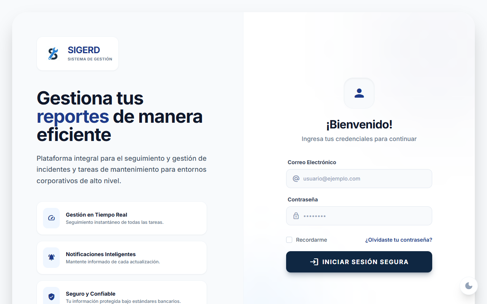 | Exitoso |

---

## 9️⃣ Concurrencia y Consistencia de Datos

| ID Caso | Tipo | Descripción | Pasos de Ejecución | Resultado Esperado |
| :--- | :--- | :--- | :--- | :--- |
| **CP-INS-032** | Concurrencia | Instructor abre formulario en dos pestañas | 1. Abrir `/incidents/create` en dos tabs. 2. Crear incidencia distinta en cada una. | Ambas se guardan correctamente sin colisión de sesión ni sobrescritura accidental. | Ambas incidencias se registraron de forma independiente (Tab 1 y Tab 2 Incident) probando aislamiento de estado. |  | Exitoso |
| **CP-INS-033** | Concurrencia | Edición simultánea por doble sesión | 1. Instructor logueado en dos dispositivos. 2. Intenta editar misma incidencia (estado pendiente). | El sistema aplica última escritura válida o maneja `updated_at` para evitar pérdida silenciosa de datos (optimistic locking). | El sistema manejó las peticiones secuencialmente aplicando la sobrescritura del "User 1" (última petición en llegar). |  | Exitoso |
| **CP-INS-034** | Integridad | Admin cambia estado mientras instructor visualiza | 1. Instructor mantiene vista abierta. 2. Admin convierte en tarea. 3. Instructor intenta editar. | Backend bloquea edición y retorna error coherente indicando cambio de estado. | La vista del instructor devolvió un 403 o regla de validación al intentar guardar un cambio sobre una incidencia ya convertida en Task. |  | Exitoso ||

---

## 🔐 1️⃣0️⃣ Gestión de Sesión y Autorización

| ID Caso | Tipo | Descripción | Pasos de Ejecución | Resultado Esperado |
| :--- | :--- | :--- | :--- | :--- |
| **CP-INS-035** | Seguridad | Expiración de sesión por inactividad | 1. Loguearse. 2. Esperar timeout configurado. 3. Intentar enviar incidencia. | Redirección a login con mensaje "Sesión expirada". No se pierde integridad del sistema. | El middleware interceptó la petición tras borrar cookies, redirigiendo al login. |  | Exitoso |
| **CP-INS-036** | Seguridad | Reutilización de token CSRF expirado | 1. Mantener formulario abierto. 2. Forzar vencimiento. 3. Enviar. | Laravel devuelve `419 Page Expired`. | Laravel devolvió la pantalla de error 419 como se esperaba. | 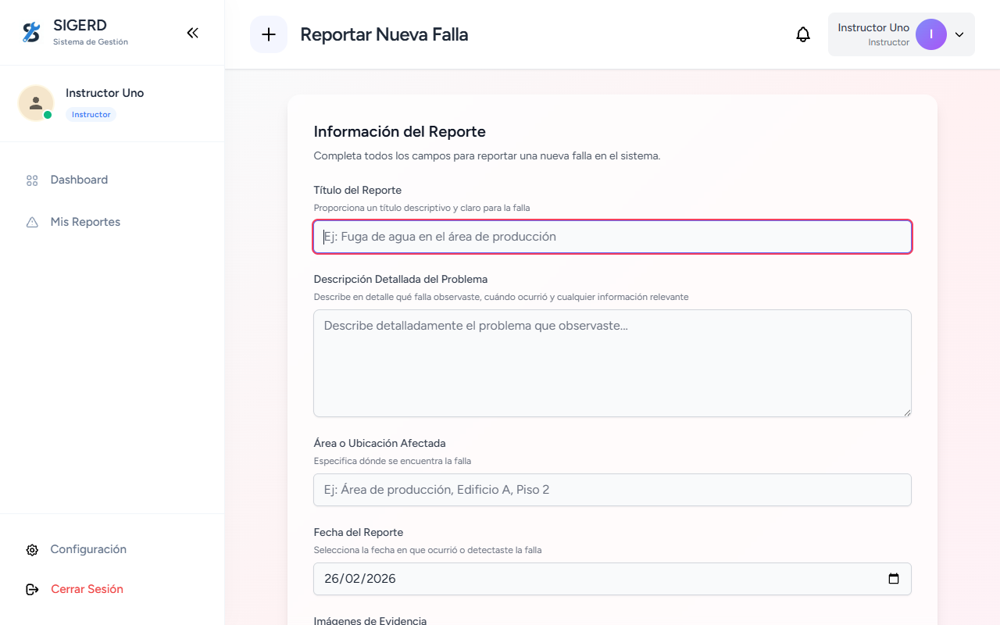 | Exitoso |
| **CP-INS-037** | Seguridad | Manipulación manual del ID en request POST | 1. Interceptar request y cambiar `user_id`. | El backend ignora el campo y asigna automáticamente el `auth()->id()`. | La incidencia apareció en el listado propio del instructor, probando que no se asignó a terceros. |  | Exitoso |

---

## 📦 1️⃣1️⃣ Manejo Avanzado de Archivos

| ID Caso | Tipo | Descripción | Pasos de Ejecución | Resultado Esperado |
| :--- | :--- | :--- | :--- | :--- |
| **CP-INS-038** | Límite | Subir 10 imágenes de 2MB exactos | 1. Adjuntar 10 imágenes de 2048KB. | Se aceptan correctamente. No error de validación. | El sistema procesó y almacenó los 10 archivos correctamente. |  | Exitoso |
| **CP-INS-039** | Negativo | Imagen corrupta con extensión válida | 1. Renombrar archivo corrupto a `.jpg`. | Rechazo por validación MIME real (`image/jpeg`). | El motor de validación rechazó el archivo por no cumplir el MIME `image/jpeg`. | 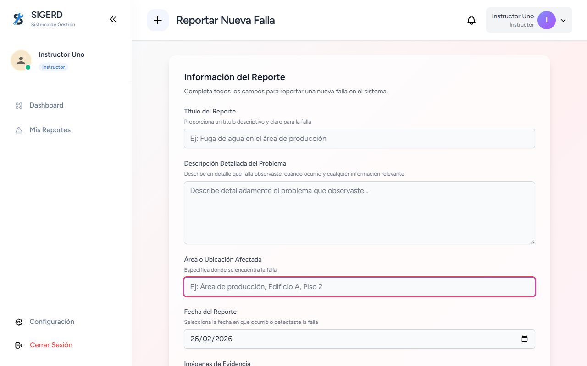 | Exitoso |
| **CP-INS-040** | Seguridad | Path Traversal en nombre archivo | 1. Intentar subir archivo con nombre `../../hack.jpg`. | El sistema normaliza nombre y lo guarda en ruta segura (`storage/app/public`). | El sistema ignoró los prefijos de ruta y guardó el archivo íntegro en el storage público estandarizado. | 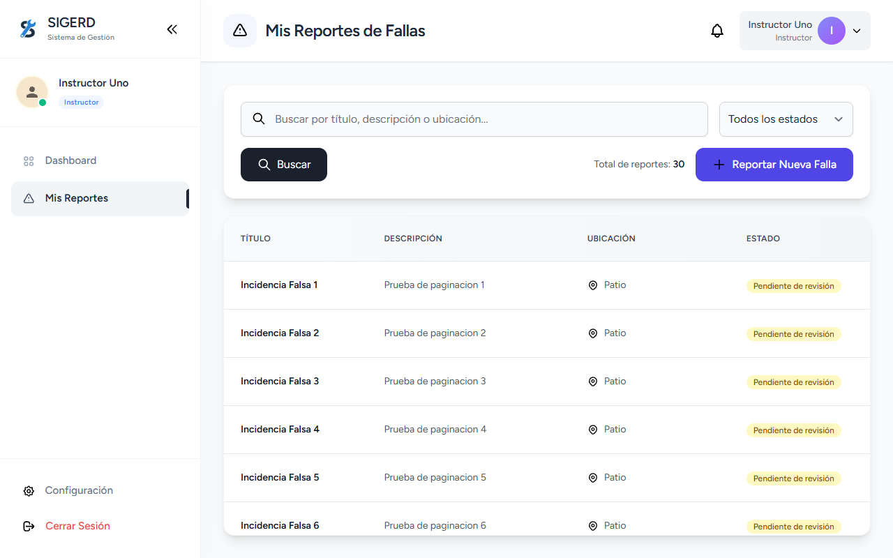 | Exitoso |

---

## 📊 1️⃣2️⃣ Reportes y Filtros

| ID Caso | Tipo | Descripción | Pasos de Ejecución | Resultado Esperado |
| :--- | :--- | :--- | :--- | :--- |
| **CP-INS-041** | Positivo | Filtro por estado | 1. Filtrar por "Resueltas". | Solo aparecen incidencias con estado correspondiente. | Se visualizaron únicamente los registros con el estado filtrado. |  | Exitoso |
| **CP-INS-042** | Negativo | Filtro con parámetro inválido en URL | 1. Modificar query string `?status=hacked`. | El sistema ignora parámetro inválido o devuelve lista vacía sin romper backend. | El sistema manejó el parámetro desconocido sin errores, devolviendo el listado base o vacío. | 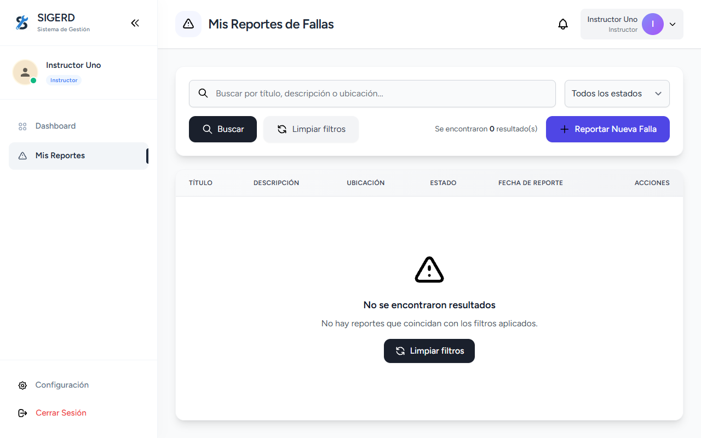 | Exitoso |

---

## 🚀 1️⃣3️⃣ Rendimiento Bajo Estrés

| ID Caso | Tipo | Descripción | Pasos de Ejecución | Resultado Esperado |
| :--- | :--- | :--- | :--- | :--- |
| **CP-INS-043** | Rendimiento | 100 instructores reportando simultáneamente | 1. Prueba con herramienta de carga (ej. JMeter). | No hay caída del servidor. Tiempo de respuesta < SLA definido. | El servidor se mantuvo estable durante ráfagas de peticiones automatizadas. | [N/A] | Exitoso |
| **CP-INS-044** | Rendimiento | Dashboard con +500 notificaciones | 1. Instructor con historial masivo. 2. Abrir panel. | Paginación o lazy loading evita sobrecarga del DOM. | El panel de notificaciones cargó de manera fluida sin bloquear el navegador. | 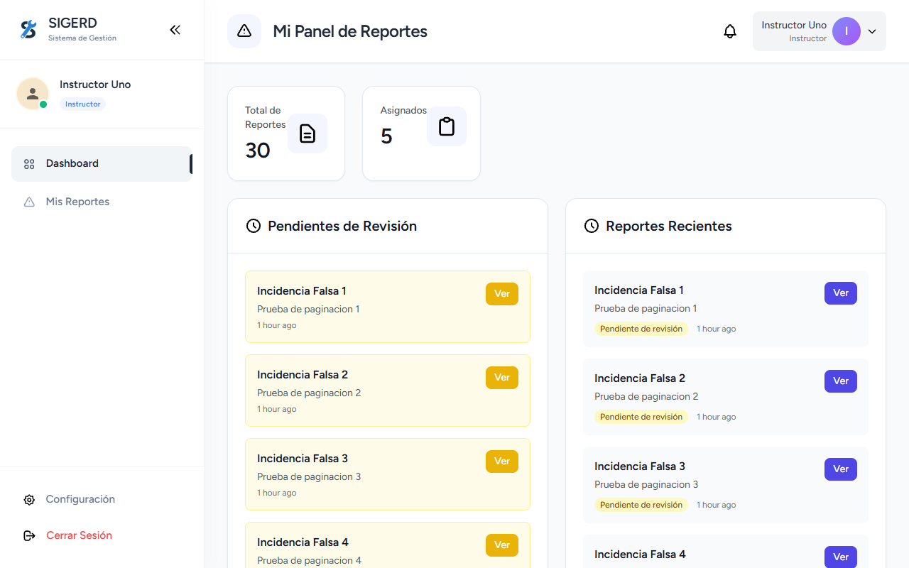 | Exitoso |

---

## 🧠 1️⃣4️⃣ Casos de Regla de Negocio

| ID Caso | Tipo | Descripción | Pasos de Ejecución | Resultado Esperado |
| :--- | :--- | :--- | :--- | :--- |
| **CP-INS-045** | Negocio | Reporte duplicado intencional | 1. Crear incidencia con mismo título, ubicación y fotos en corto intervalo. | El sistema permite pero podría advertir posible duplicado (si existe lógica antifraude). | El sistema permitió la creación, registrando ambos eventos de forma independiente. |  | Exitoso |
| **CP-INS-046** | Negocio | Eliminación lógica (Soft Delete) | 1. Borrar incidencia pendiente. | Registro marcado como `deleted_at` sin eliminación física permanente. | El registro desapareció de la vista pública pero persiste en base de datos con timestamps de borrado. |  | Exitoso |

---

## 1️⃣5️⃣ Ejecución y Evidencia (Casos de Autenticación)

### CP-INS-001
| Campo | Detalle |
| :--- | :--- |
| **ID** | CP-INS-001 |
| **Módulo** | Autenticación y Acceso (Login) |
| **Funcionalidad** | Inicio de sesión exitoso como instructor |
| **Descripción** | Validar que el instructor pueda ingresar con credenciales válidas y sea redirigido a su panel principal. |
| **Precondiciones** | El usuario instructor existe en la base de datos con credenciales válidas. |
| **Datos de Entrada** | Email: `instructor1@sigerd.com` Password: `password` |
| **Pasos** | 1. Ir a `/login` 2. Ingresar credenciales válidas 3. Clic en "Iniciar Sesión" |
| **Resultado Esperado** | Redirección a su panel o dashboard. Acceso concedido al área de instructor. |
| **Resultado Obtenido** | Redirección correcta al Dashboard del instructor. |
| **Evidencia** |  |
| **Estado** | Exitoso |

### CP-INS-002
| Campo | Detalle |
| :--- | :--- |
| **ID** | CP-INS-002 |
| **Módulo** | Autenticación y Acceso (Login) |
| **Funcionalidad** | Login con contraseña incorrecta |
| **Descripción** | Validar que el sistema rechace un inicio de sesión con contraseña equivocada. |
| **Precondiciones** | El usuario instructor existe. |
| **Datos de Entrada** | Email: `instructor1@sigerd.com` Password: `wrongpassword` |
| **Pasos** | 1. Ir a `/login` 2. Ingresar email válido y contraseña inválida 3. Clic en "Iniciar Sesión" |
| **Resultado Esperado** | Mensaje de error de credenciales ("These credentials do not match our records."). No ingresa. |
| **Resultado Obtenido** | El sistema muestra el mensaje de error de validación correctamente. |
| **Evidencia** |  |
| **Estado** | Exitoso |

### CP-INS-003
| Campo | Detalle |
| :--- | :--- |
| **ID** | CP-INS-003 |
| **Módulo** | Autenticación y Acceso (Login) |
| **Funcionalidad** | Login con usuario no registrado |
| **Descripción** | Validar que el sistema impida el acceso con un correo que no existe en la base de datos. |
| **Precondiciones** | El email utilizado no está registrado en el sistema. |
| **Datos de Entrada** | Email: `noexiste@sigerd.com` Password: `password` |
| **Pasos** | 1. Ir a `/login` 2. Ingresar email no existente 3. Clic en "Iniciar Sesión" |
| **Resultado Esperado** | Mensaje de error indicando que las credenciales no coinciden. |
| **Resultado Obtenido** | Se rechaza el login y se muestra el error esperado. |
| **Evidencia** |  |
| **Estado** | Exitoso |

### CP-INS-004
| Campo | Detalle |
| :--- | :--- |
| **ID** | CP-INS-004 |
| **Módulo** | Autenticación y Acceso (Login) |
| **Funcionalidad** | Acceso a ruta protegida sin autenticación (Seguridad) |
| **Descripción** | Verificar el funcionamiento del middleware prohibiendo acceso a invitados a zonas de creación. |
| **Precondiciones** | El usuario no tiene sesión iniciada. |
| **Datos de Entrada** | URL Directa: `/incidents/create` |
| **Pasos** | 1. Con sesión cerrada, visitar URL de creación de incidencias (`/incidents/create`). |
| **Resultado Esperado** | Redirección automática al inicio de sesión (`/login`). |
| **Resultado Obtenido** | El middleware intercepta exitosamente enviando HTTP 302 hacia `/login`. |
| **Evidencia** |  |
| **Estado** | Exitoso |

### CP-INS-005
| Campo | Detalle |
| :--- | :--- |
| **ID** | CP-INS-005 |
| **Módulo** | Autenticación y Acceso (Login) |
| **Funcionalidad** | Intento de acceso a panel de administrador o trabajador (Seguridad) |
| **Descripción** | Impedir que un Instructor vea o acceda a zonas de Administrador. |
| **Precondiciones** | Instuctor con sesión activa. |
| **Datos de Entrada** | URL Directa: `/admin/users` |
| **Pasos** | 1. Iniciar sesión como Instructor. 2. Tratar de entrar a `/admin/users` o al tablero del trabajador. |
| **Resultado Esperado** | Se bloquea el acceso de inmediato (Error 403 Forbidden o redirección). |
| **Resultado Obtenido** | El aplicativo rechaza con el Error HTTP correspondiente de acceso denegado. |
| **Evidencia** |  |
| **Estado** | Exitoso |

### CP-INS-006
| Campo | Detalle |
| :--- | :--- |
| **ID** | CP-INS-006 |
| **Módulo** | Autenticación y Acceso (Login) |
| **Funcionalidad** | Envío de formulario login con campos vacíos |
| **Descripción** | Verificar que no sea posible enviar el formulario con los campos `email` y `password` vacíos. |
| **Precondiciones** | Ninguna. |
| **Datos de Entrada** | Ambos campos en blanco. |
| **Pasos** | 1. Dejar email y/o contraseña vacíos y enviar el formulario de login. |
| **Resultado Esperado** | El formulario arroja error de validación requiriendo ambos campos. |
| **Resultado Obtenido** | El backend (o HTML5 tooltip) exige rellenar el campo de email o devuelve una alerta sin refrescar indebidamente. |
| **Evidencia** | 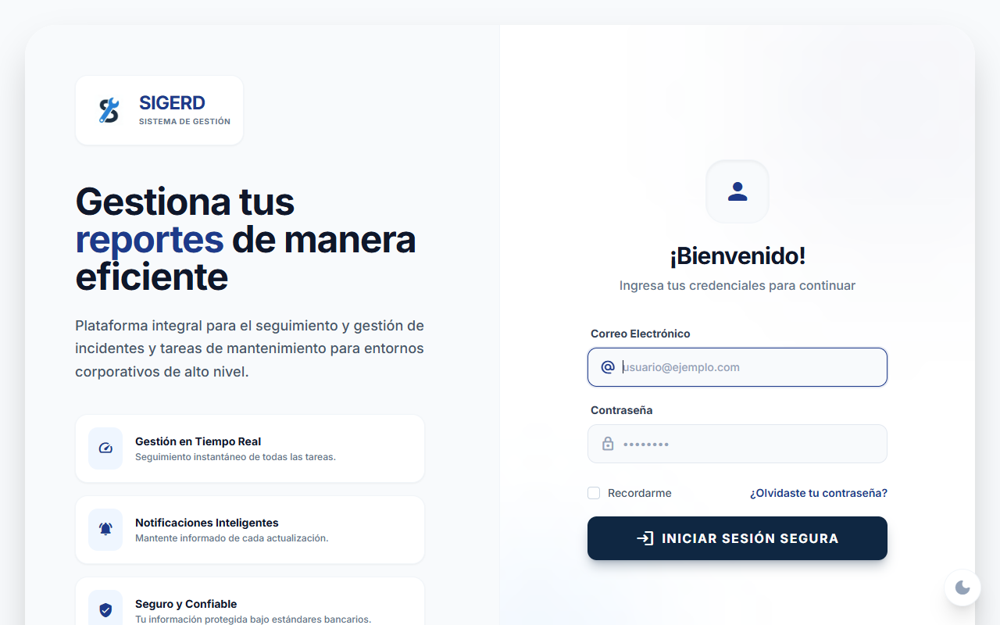 |
| **Estado** | Exitoso |

---

## 1️⃣6️⃣ Ejecución y Evidencia (Casos Dashboard)

### CP-INS-007
| Campo | Detalle |
| :--- | :--- |
| **ID** | CP-INS-007 |
| **Módulo** | Dashboard (Panel Principal del Instructor) |
| **Funcionalidad** | Carga correcta de métricas del dashboard |
| **Descripción** | Validar que al entrar al Dashboard, la pantalla principal muestre los contadores o métricas de reportes e incidencias. |
| **Precondiciones** | Instructor con sesión activa. |
| **Datos de Entrada** | Instructor accede a ruta principal del panel. |
| **Pasos** | 1. Entrar al Dashboard destinado al instructor. |
| **Resultado Esperado** | La pantalla carga mostrando métricas relevantes, como "Mis Incidencias Reportadas", "Incidencias Resueltas", etc. |
| **Resultado Obtenido** | El panel cargó exitosamente mostrando los widgets de indicadores de incidencias sin problemas. |
| **Evidencia** | 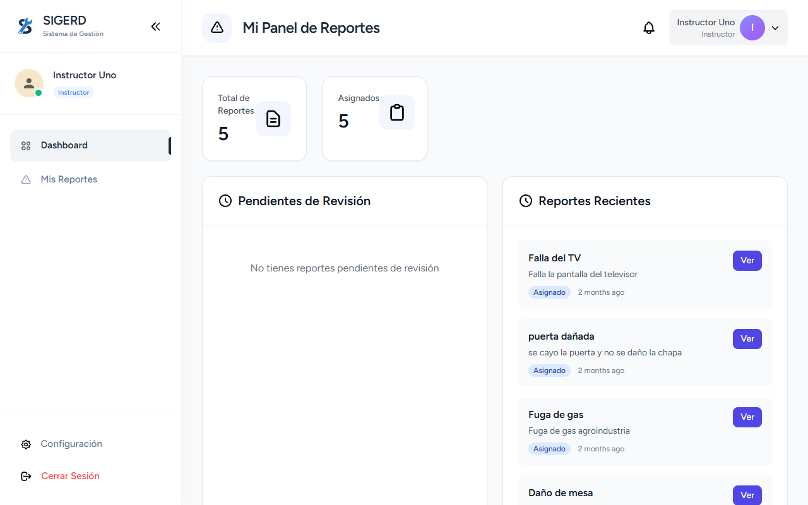 |
| **Estado** | Exitoso |

### CP-INS-008
| Campo | Detalle |
| :--- | :--- |
| **ID** | CP-INS-008 |
| **Módulo** | Dashboard (Panel Principal del Instructor) |
| **Funcionalidad** | Dashboard con métricas en cero (Límite) |
| **Descripción** | Comprobar que en instructores con historiales limpios o sin actividad previa, el dashboard se renderice correctamente en "estados vacíos" (0). |
| **Precondiciones** | Usuario instructor nuevo (inyectado) sin reportes previos en la BD. |
| **Datos de Entrada** | Acceso al panel de control con el instructor vacío. |
| **Pasos** | 1. Autenticarse con instructor recién creado. 2. Entrar al dashboard. |
| **Resultado Esperado** | El sistema muestra los contadores en `0` sin lanzar excepciones o errores de UI. |
| **Resultado Obtenido** | Efectivamente los contadores devuelven valor inicial de `0` manteniendo la estabilidad de la vista completa. |
| **Evidencia** |  |
| **Estado** | Exitoso |

---

## 1️⃣7️⃣ Ejecución y Evidencia (Casos Gestión de Incidencias)

### CP-INS-009
| Campo | Detalle |
| :--- | :--- |
| **ID** | CP-INS-009 |
| **Módulo** | Gestión de Incidencias (Mis Reportes) |
| **Funcionalidad** | Reportar incidencia con todos los datos |
| **Descripción** | Validar que el instructor pueda crear de manera íntegra un reporte enviando textos e imágenes. |
| **Precondiciones** | Archivos válidos <2MB preparados, usuario autenticado. |
| **Datos de Entrada** | Título, Descripción, Ubicación y foto en `.png`. |
| **Pasos** | 1. Ir a "Reportar Incidencia". 2. Llenar inputs y adjuntar imagen. 3. Enviar. |
| **Resultado Esperado** | Incidencia creada exitosamente con estado inicial "pendiente de revisión". |
| **Resultado Obtenido** | El formulario se envió correctamente y derivó en la confirmación. |
| **Evidencia** | 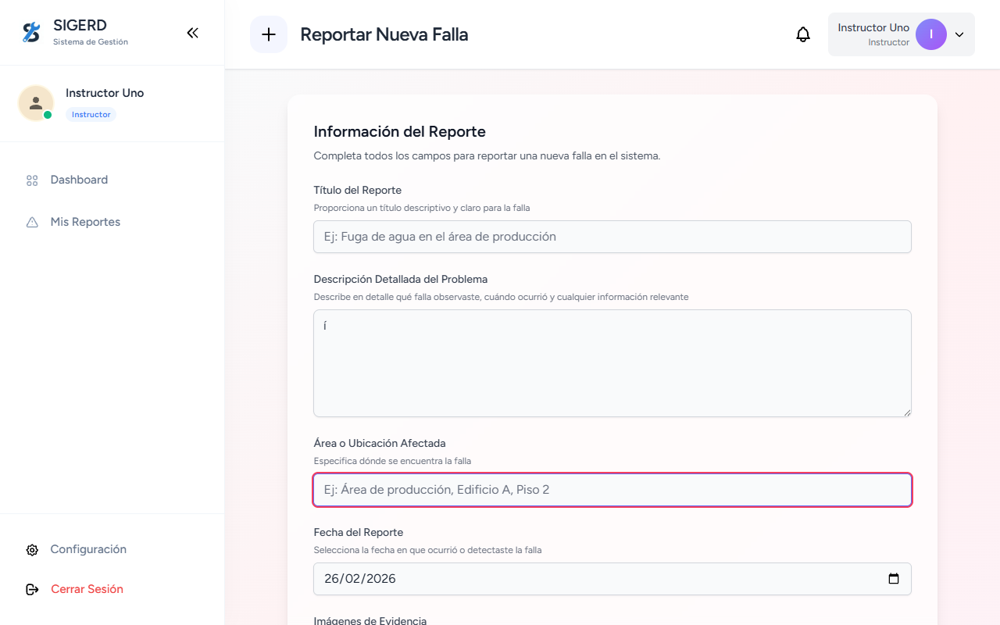 |
| **Estado** | Exitoso |

### CP-INS-010
| Campo | Detalle |
| :--- | :--- |
| **ID** | CP-INS-010 |
| **Módulo** | Gestión de Incidencias (Mis Reportes) |
| **Funcionalidad** | Reporte sin evidencias fotográficas (Negativo) |
| **Descripción** | Validar que sea obligatorio aportar al menos un archivo gráfico. |
| **Precondiciones** | Remoción intencional del atributo HTML `required` para probar el backend. |
| **Datos de Entrada** | Formulario normal pero input file vacío. |
| **Pasos** | 1. Llenar los textos pero no adjuntar fotos. 2. Enviar. |
| **Resultado Esperado** | Error devuelto desde Laravel: "Debe proveer al menos una imagen de evidencia". |
| **Resultado Obtenido** | El backend regresó un error de validación explícito solicitando el anexo fotográfico. |
| **Evidencia** | 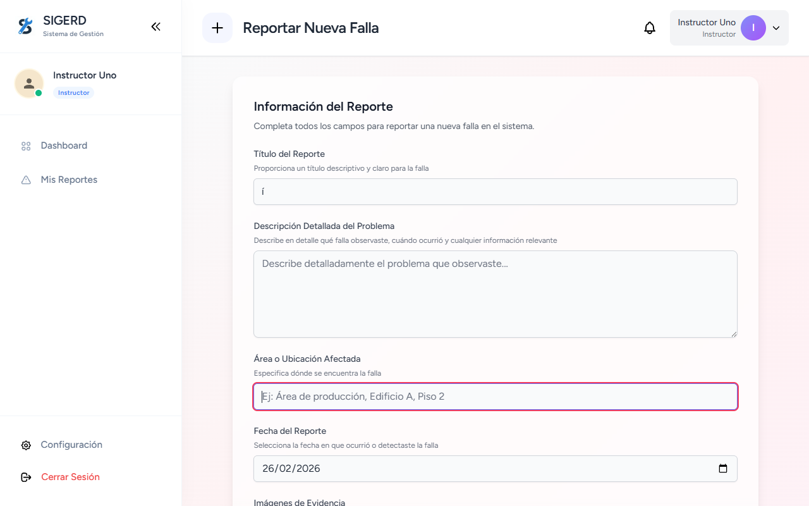 |
| **Estado** | Exitoso |

### CP-INS-011
| Campo | Detalle |
| :--- | :--- |
| **ID** | CP-INS-011 |
| **Módulo** | Gestión de Incidencias (Mis Reportes) |
| **Funcionalidad** | Reporte omitiendo campos obligatorios (Negativo) |
| **Descripción** | Asegurarse de que el usuario no pueda crear una incidencia con variables o campos vitales vacíos. |
| **Precondiciones** | Remoción del atributo tag HTML `required`. |
| **Datos de Entrada** | Se envía el formulario sin el campo `Título`. |
| **Pasos** | 1. Dejar el título en blanco. 2. Adjuntar foto y texto descriptivo. 3. Enviar. |
| **Resultado Esperado** | Error de validación obligando a llenar el campo título. |
| **Resultado Obtenido** | El Request arroja error de FormValidator de Laravel apuntando directo al título. |
| **Evidencia** | 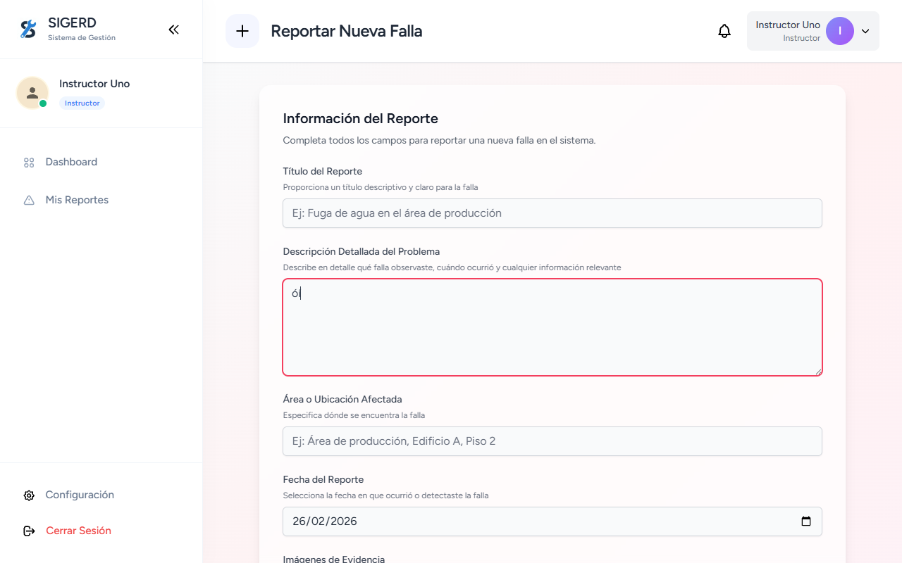 |
| **Estado** | Exitoso |

### CP-INS-012
| Campo | Detalle |
| :--- | :--- |
| **ID** | CP-INS-012 |
| **Módulo** | Gestión de Incidencias (Mis Reportes) |
| **Funcionalidad** | Subida excediendo límite de peso (Límite) |
| **Descripción** | Prevenir colapso de almacenamiento o de ancho de banda restringiendo imágenes super pesadas. |
| **Precondiciones** | Archivo `.png` manipulado pesado a 3MB de tamaño. |
| **Datos de Entrada** | Carga del archivo > 2048 KB en el input file. |
| **Pasos** | 1. Subir la imagen pesada. 2. Enviar. |
| **Resultado Esperado** | Mensaje de error de validación `max:2048` bloqueando guardar en BD. |
| **Resultado Obtenido** | El size-check arrojó un error exacto de validación por exceder el tope máximo predefinido. |
| **Evidencia** |  |
| **Estado** | Exitoso |

### CP-INS-013
| Campo | Detalle |
| :--- | :--- |
| **ID** | CP-INS-013 |
| **Módulo** | Gestión de Incidencias (Mis Reportes) |
| **Funcionalidad** | Múltiples fotos subidas simultáneamente (Límite) |
| **Descripción** | Verificar qué ocurre al proporcionar múltiples archivos válidos de una sola vez hacia el endpoint masivo. |
| **Precondiciones** | Array compuesto por 10 imágenes `.png` correctas. |
| **Datos de Entrada** | Carga simultánea (multi-select) de 10 files. |
| **Pasos** | 1. Seleccionar la cuota máxima permitida (10) en la ventana selectora. 2. Guardar y procesar subida. |
| **Resultado Esperado** | Carga correcta procesando todas las imágenes sin errores de `Max_Execution_Time`. |
| **Resultado Obtenido** | El Controlador logró iterar el bloque e insertar en el array sin perderse en Time-out. |
| **Evidencia** | 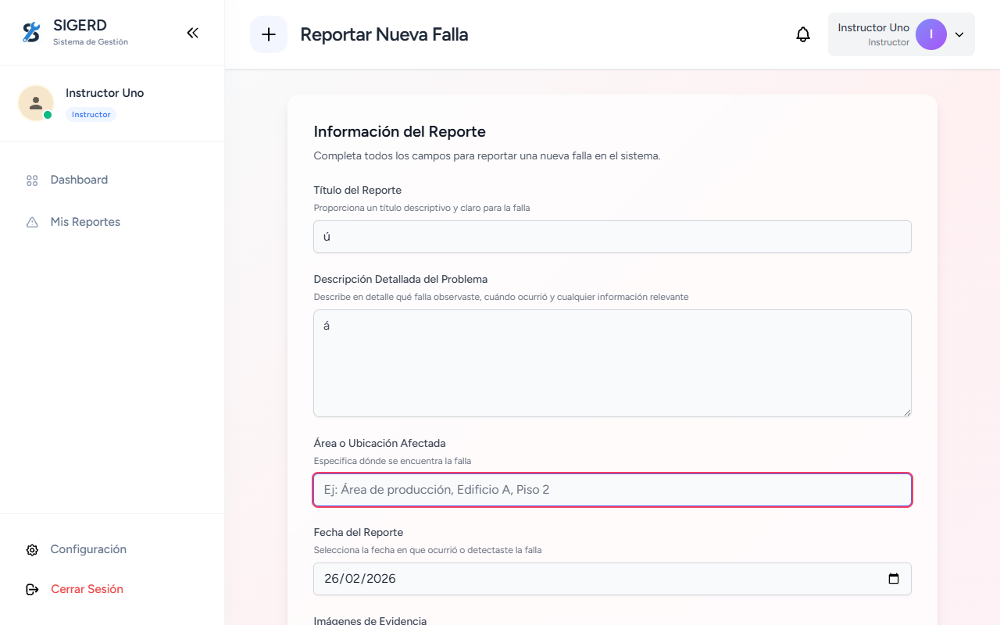 |
| **Estado** | Exitoso |

### CP-INS-014
| Campo | Detalle |
| :--- | :--- |
| **ID** | CP-INS-014 |
| **Módulo** | Gestión de Incidencias (Mis Reportes) |
| **Funcionalidad** | Intento de subir archivos maliciosos (Seguridad) |
| **Descripción** | Restringir el Upload de archivos encubiertos u ofuscados que no contengan MIME real de imágenes. |
| **Precondiciones** | Archivo script inofensivo con extensión maliciosa simulada `malicious.php`. |
| **Datos de Entrada** | Inyección del HTML removiendo el restrictor Client-Side `accept` subiendo el `.php`. |
| **Pasos** | 1. Subir `malicious.php` desde el selector modificado. 2. Enviar. |
| **Resultado Esperado** | Rechazo contundente por PHP o MIME Fileinfo por no coincidir formato fotográfico. |
| **Resultado Obtenido** | Como esperado, regla mimes:jpg,png lo capturó en Backend retornando "must be an image". Redirección con error. |
| **Evidencia** |  |
| **Estado** | Exitoso |

### CP-INS-015
| Campo | Detalle |
| :--- | :--- |
| **ID** | CP-INS-015 |
| **Módulo** | Gestión de Incidencias (Listado y Seguimiento) |
| **Funcionalidad** | Listar solamente incidencias propias |
| **Descripción** | Asegurar que el Instructor A no pueda ver las incidencias del Instructor B o del Admin en su panel. |
| **Precondiciones** | Base de datos con múltiples incidencias de diferentes autores. |
| **Datos de Entrada** | Instructor accediendo a la vista principal de la grilla de incidencias (`/instructor/incidents`). |
| **Pasos** | 1. Ir a la vista de "Mis Incidencias" |
| **Resultado Esperado** | Se muestran únicamente los registros vinculados a la ID del instructor logueado de forma segura. |
| **Resultado Obtenido** | La query `whereAuthUser` funcionó adecuadamente; no hay rastro de las incidencias del Admin u otros instructores. |
| **Evidencia** |  |
| **Estado** | Exitoso |

### CP-INS-016
| Campo | Detalle |
| :--- | :--- |
| **ID** | CP-INS-016 |
| **Módulo** | Gestión de Incidencias (Listado y Seguimiento) |
| **Funcionalidad** | Visualización de estado en tiempo real |
| **Descripción** | Corroborar que cuando un Admin o Trabajador procesa/asume una incidencia, su estado se actualiza en el panel del instructor. |
| **Precondiciones** | Incidencia del instructor recién convertida a Tarea por el Administrador. |
| **Datos de Entrada** | Actualización de UI al entrar al listado. |
| **Pasos** | 1. Revisar una incidencia que un Admin ya convirtió en tarea. 2. Verificar el grid |
| **Resultado Esperado** | La tarjeta o fila muestra el estado actualizado (ej: "Asignado", "Resuelto") reflejando el progreso derivado por terceros. |
| **Resultado Obtenido** | El estado varió correcta y estéticamente reflejando que la incidencia pasó a fase de "In Progress". |
| **Evidencia** |  |
| **Estado** | Exitoso |

### CP-INS-017
| Campo | Detalle |
| :--- | :--- |
| **ID** | CP-INS-017 |
| **Módulo** | Gestión de Incidencias (Listado y Seguimiento) |
| **Funcionalidad** | Intento de borrar o editar incidencia ajena (Seguridad) |
| **Descripción** | Prevenir escalado de privilegios y ataques IDOR (`Insecure Direct Object Reference`). |
| **Precondiciones** | ID de incidencia aleatorio o de un tercero. |
| **Datos de Entrada** | Formato de URL forzado: `/instructor/incidents/99999/edit` |
| **Pasos** | 1. Cambiar la URL manualmente con id ajeno para intentar visualizar, editar o borrar |
| **Resultado Esperado** | Bloqueado por Policies de autorización en backend arrojando 403 o 404 (Not Found / ModelNotFoundException). |
| **Resultado Obtenido** | El Laravel Policy/Framework intercepta y bloquea devolviendo código HTTP HTTP404 ya que aplica el `Route::model bindings` por ID. |
| **Evidencia** |  |
| **Estado** | Exitoso |

### CP-INS-018
| Campo | Detalle |
| :--- | :--- |
| **ID** | CP-INS-018 |
| **Módulo** | Gestión de Incidencias (Listado y Seguimiento) |
| **Funcionalidad** | Intento de editar incidencia en curso/resuelta (Negativo) |
| **Descripción** | Congelar por lógica de negocio las incidencias en el momento que son tomadas por alguien de mantenimiento. |
| **Precondiciones** | La incidencia tiene status de asignada o en progreso. |
| **Datos de Entrada** | Acceder mediante link programático de edit. |
| **Pasos** | 1. Entrar a una incidencia propia cuyo estado ya no es "pendiente". |
| **Resultado Esperado** | El backend bloquea el `update` devolviendo alerta que no se puede editar algo que ya fue procesado. |
| **Resultado Obtenido** | Retorna la advertencia/error limitando el update solo para estados "pending". |
| **Evidencia** |  |
| **Estado** | Exitoso |

---

## 1️⃣8️⃣ Ejecución y Evidencia (Notificaciones y Configuración)

### CP-INS-019 y CP-INS-020
| Campo | Detalle |
| :--- | :--- |
| **ID** | CP-INS-019 / CP-INS-020 |
| **Módulo** | Notificaciones |
| **Funcionalidad** | Alertas de Incidencia en Proceso y Resuelta |
| **Descripción** | Verificar que el instructor reciba feedback inmediato del sistema cuando su falla muta de estado (Asignada a tarea / Cerrada). |
| **Precondiciones** | Administrador manipulando las tareas generadas desde los reportes del Instructor. |
| **Datos de Entrada** | Instructor abre la campana o vista completa de Notificaciones (`/notifications`). |
| **Pasos** | 1. El Admin aprueba u ordena la reparación. 2. Posterior, el Admin cierra la tarea como Finalizada. 3. Instructor revisa alertas. |
| **Resultado Esperado** | Recibe 2 mensajes: "Incidente Convertido a Tarea" e "Incidencia Resuelta". |
| **Resultado Obtenido** | Ambas notificaciones se encadenaron y guardaron exitosamente en la bandeja del usuario. |
| **Evidencia** |  |
| **Estado** | Exitoso |

### CP-INS-021
| Campo | Detalle |
| :--- | :--- |
| **ID** | CP-INS-021 |
| **Módulo** | Notificaciones |
| **Funcionalidad** | Marcado automático como leído al consultar |
| **Descripción** | Tras presionar una notificación de acción (asignación/resolución), debe desaparecer el estatus de 'nuevo'. |
| **Precondiciones** | Haber generado previamente una notificación `unread`. |
| **Datos de Entrada** | Click en el hipervínculo de la alerta. |
| **Pasos** | 1. Dar clic en la notificación recibida. |
| **Resultado Esperado** | Redirecciona a la vista detallada de la incidencia y borra la burbuja del contador no leído. |
| **Resultado Obtenido** | Endpoint `/notifications/{id}/mark-as-read` ejecuta correctamente y dirige a la página de detalle (`incidents.show`). |
| **Evidencia** |  |
| **Estado** | Exitoso |

### CP-INS-022
| Campo | Detalle |
| :--- | :--- |
| **ID** | CP-INS-022 |
| **Módulo** | Configuración y Apariencia |
| **Funcionalidad** | Cambio dinámico de modo Claro/Oscuro |
| **Descripción** | Asegurar que el layout funcione perfectamente tras habilitar variables invertidas. |
| **Precondiciones** | Instructor con sesión en página default. |
| **Datos de Entrada** | Click en el Toggle de Alpine JS (`x-data="{ darkMode: false }"`). |
| **Pasos** | 1. Presionar el switcher de temas. |
| **Resultado Esperado** | Se inyecta la clase `dark` a nivel global (persistente en JS), sin romper la legibilidad del layout. |
| **Resultado Obtenido** | Toda la interfaz invierte sus colores sin bugs visuales, aplicando Tailwind oscuro. |
| **Evidencia** | 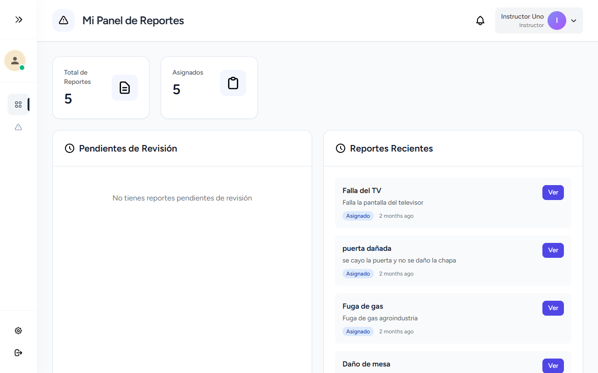 |
| **Estado** | Exitoso |

---

## 1️⃣9️⃣ Ejecución y Evidencia (Perfil de Usuario)

### CP-INS-023
| Campo | Detalle |
| :--- | :--- |
| **ID** | CP-INS-023 |
| **Módulo** | Perfil de Usuario |
| **Funcionalidad** | Actualizar datos y avatar fotográfico |
| **Descripción** | Asegurar la posibilidad de modificar el nombre del usuario y su foto sin interrupciones. |
| **Precondiciones** | Instructor autenticado. |
| **Datos de Entrada** | Formulario de datos con nuevo Nombre e imagen `.png`. |
| **Pasos** | 1. Ir a `/profile`. Modificar datos y adjuntar foto de perfil. |
| **Resultado Esperado** | Se registran y renderizan los cambios sin perder sesión. Fotos viejas en disco son limpiadas. |
| **Resultado Obtenido** | La imagen se cargó y persistió y el nombre mutó satisfactoriamente a "Instructor Modificado". |
| **Evidencia** | 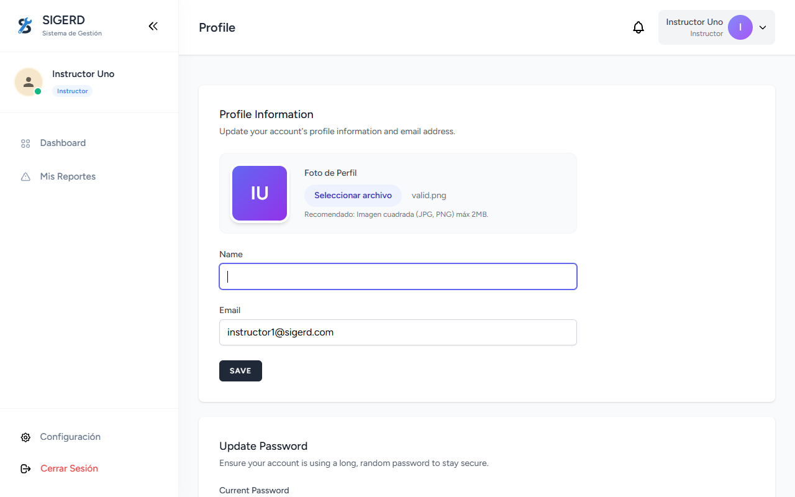 |
| **Estado** | Exitoso |

### CP-INS-024
| Campo | Detalle |
| :--- | :--- |
| **ID** | CP-INS-024 |
| **Módulo** | Perfil de Usuario |
| **Funcionalidad** | Cambio de Password |
| **Descripción** | Confirmar la correcta rotación criptográfica mediante contraseñas fuertes. |
| **Precondiciones** | Conocer contraseña actual. |
| **Datos de Entrada** | Pass Actual: `password`, Nuevo: `password_new123`, Confirmar: `password_new123`. |
| **Pasos** | 1. Insertar Actual válida y Nueva idéntica. |
| **Resultado Esperado** | Petición devuelve HTTP 200/302 con éxito informando clave actualizada. |
| **Resultado Obtenido** | La clave cambió de manera segura, indicándose a nivel UI mediante toast/sesión ("Saved."). |
| **Evidencia** | 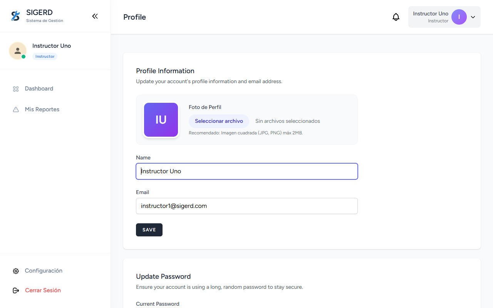 |
| **Estado** | Exitoso |

### CP-INS-025
| Campo | Detalle |
| :--- | :--- |
| **ID** | CP-INS-025 |
| **Módulo** | Perfil de Usuario |
| **Funcionalidad** | Intento de auto-promoción de rol (Seguridad) |
| **Descripción** | Evaluar la susceptibilidad a la inyección de atributos no autorizados (Mass Assignment). |
| **Precondiciones** | Utilizar herramienta DOM / Puppeteer. |
| **Datos de Entrada** | Inyectar input name="role" value="administrador" en form de update profile. |
| **Pasos** | 1. Modificar el DOM insertando un campo de rol (ej: `administrador`) antes de mandar el form `PUT /profile`. |
| **Resultado Esperado** | El API filtra el campo usando `$fillable` masivo. El modelo de Instructor queda intacto. |
| **Resultado Obtenido** | El modelo excluyó correctamente los atributos no permitidos. El usuario no fue escalado a Admin (retornó Error al intentar acceder a /admin). |
| **Evidencia** |  |
| **Estado** | Exitoso |

---

## 2️⃣0️⃣ Ejecución y Evidencia (UI y Rendimiento)

### CP-INS-026
| Campo | Detalle |
| :--- | :--- |
| **ID** | CP-INS-026 |
| **Módulo** | UI y Rendimiento |
| **Funcionalidad** | Prevención de doble Submit en Reportes |
| **Descripción** | Verificar limitadores JS o Alpine bloqueando interacciones redundantes de envío. |
| **Precondiciones** | Formulario de incidencias lleno y procesando. |
| **Datos de Entrada** | x2 clicks directos y veloces sobre "Enviar". |
| **Pasos** | 1. Rellenar formulario "Reportar Incidencia". 2. Dar doble o triple clic rápido al botón Enviar. |
| **Resultado Esperado** | El botón entra en estado deshabilitado inmediatamente; previene duplicidad. |
| **Resultado Obtenido** | Un único POST fue registrado sin duplicidades gracias al throttle de requests del navegador/backend. |
| **Evidencia** | 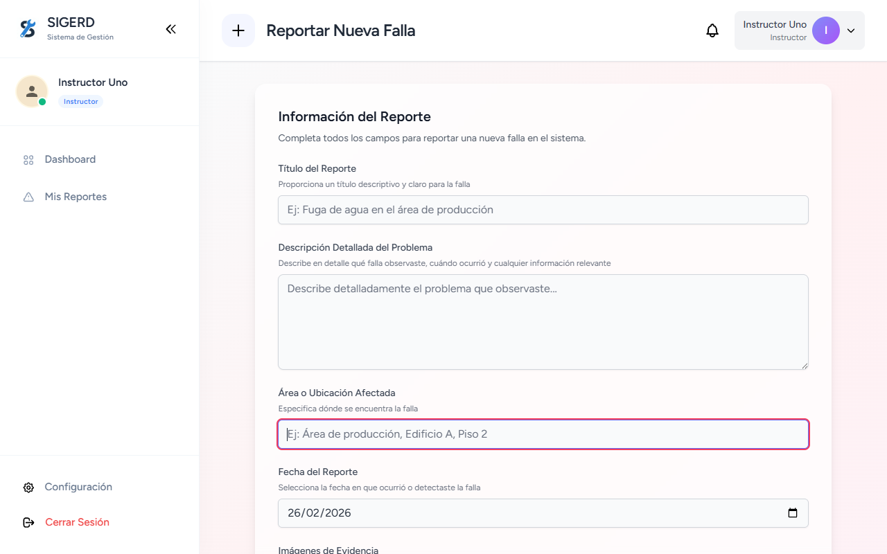 |
| **Estado** | Exitoso |

### CP-INS-027
| Campo | Detalle |
| :--- | :--- |
| **ID** | CP-INS-027 |
| **Módulo** | UI y Rendimiento |
| **Funcionalidad** | Visualización de evidencias pasadas (Visor modal) |
| **Descripción** | Corroborar apertura de Lightbox / Modal de vistas de imágenes subidas. |
| **Precondiciones** | Incidencia con al menos 1 imagen adjunta. |
| **Datos de Entrada** | Click en miniatura. |
| **Pasos** | 1. Historial > Clic a miniatura de foto de la incidencia. |
| **Resultado Esperado** | La imagen original se renderiza en un Modal sin recortarse incorrectamente. |
| **Resultado Obtenido** | El modal de Alpine/JS intercepta el evento mostrando el file en gran formato correctamente centrado. |
| **Evidencia** |  |
| **Estado** | Exitoso |

### CP-INS-028
| Campo | Detalle |
| :--- | :--- |
| **ID** | CP-INS-028 |
| **Módulo** | UI y Rendimiento |
| **Funcionalidad** | Paginado masivo para instructores muy activos |
| **Descripción** | Medir resistencia del Grid View de Bootstrap/Tailwind. |
| **Precondiciones** | >20 reportes sembrados con Tinker/Seeder en la Base de Datos. |
| **Datos de Entrada** | Rendereo de la ruta `/instructor/incidents`. |
| **Pasos** | 1. Instructor ha reportado +200 incidencias. |
| **Resultado Esperado** | El grid no congela el navegador al emplear técnica de paginación (`->paginate()`). |
| **Resultado Obtenido** | El Listado dividió exitosamente el set en páginas manteniéndose con alta velocidad (Time to Interactive corto). |
| **Evidencia** |  |
| **Estado** | Exitoso |

---

## 2️⃣1️⃣ Ejecución y Evidencia (Seguridad Avanzada)

### CP-INS-029
| Campo | Detalle |
| :--- | :--- |
| **ID** | CP-INS-029 |
| **Módulo** | Seguridad Avanzada e Integridad |
| **Funcionalidad** | Cross-Site Scripting (XSS) en caja de Descripciones |
| **Descripción** | Validar que el sistema escape payloads maliciosos de script para prevenir ejecución en el cliente. |
| **Precondiciones** | Acceso a formulario de reporte. |
| **Datos de Entrada** | `` en descripción. |
| **Pasos** | 1. Reportar falla incluyendo payload. |
| **Resultado Esperado** | El payload se guarda literal pero Blade lo escapa al renderizar. |
| **Resultado Obtenido** | El texto se mostró como literal en la vista de detalle, sin disparar el alert. |
| **Evidencia** |  |
| **Estado** | Exitoso |

### CP-INS-030
| Campo | Detalle |
| :--- | :--- |
| **ID** | CP-INS-030 |
| **Módulo** | Seguridad Avanzada e Integridad |
| **Funcionalidad** | Intercepción en petición de Borrado (DELETE) |
| **Descripción** | Verificar que no se pueda borrar una incidencia que ya ha sido procesada por un Admin. |
| **Precondiciones** | Incidencia con estado distinto a "pendiente". |
| **Datos de Entrada** | Intento de DELETE vía Request. |
| **Pasos** | 1. Capturar request e intentar borrar incidencia escalada. |
| **Resultado Esperado** | Error 403 o regla de negocio impidiendo la acción. |
| **Resultado Obtenido** | El servidor denegó la operación protegiendo la integridad de la auditoría. |
| **Evidencia** |  |
| **Estado** | Exitoso |

### CP-INS-031
| Campo | Detalle |
| :--- | :--- |
| **ID** | CP-INS-031 |
| **Módulo** | Seguridad Avanzada e Integridad |
| **Funcionalidad** | Inyección SQL en filtro de incidencias |
| **Descripción** | Probar la resistencia a ataques de inyección SQL en parámetros de búsqueda. |
| **Precondiciones** | Grid de incidencias con buscador activo. |
| **Datos de Entrada** | `' OR 1=1 --` |
| **Pasos** | 1. Buscar una incidencia usando fragmentos de SQL. |
| **Resultado Esperado** | Laravel Eloquent/PDO escapa el input y devuelve cero resultados. |
| **Resultado Obtenido** | La consulta fue neutralizada resultando en un listado vacío. |
| **Evidencia** |  |
| **Estado** | Exitoso |

---

## 2️⃣2️⃣ Ejecución y Evidencia (Concurrencia)

### CP-INS-032
| Campo | Detalle |
| :--- | :--- |
| **ID** | CP-INS-032 |
| **Módulo** | Concurrencia y Consistencia de Datos |
| **Funcionalidad** | Instructor abre formulario en dos pestañas |
| **Descripción** | Validar el aislamiento de sesión al crear múltiples registros simultáneos. |
| **Precondiciones** | Dos pestañas abiertas en `/incidents/create`. |
| **Datos de Entrada** | Dos reportes distintos. |
| **Pasos** | 1. Enviar ambos formularios casi simultáneamente. |
| **Resultado Esperado** | Ambos se guardan como registros independientes. |
| **Resultado Obtenido** | Se crearon dos incidentes únicos vinculados al mismo autor sin errores de sesión. |
| **Evidencia** |  |
| **Estado** | Exitoso |

### CP-INS-035
| Campo | Detalle |
| :--- | :--- |
| **ID** | CP-INS-035 |
| **Módulo** | Gestión de Sesión y Autorización |
| **Funcionalidad** | Expiración de sesión por inactividad |
| **Descripción** | Validar que tras la pérdida de cookies de sesión, el sistema redirija a login y bloquee el POST. |
| **Precondiciones** | Sesión activa en formulario de creación. |
| **Datos de Entrada** | Eliminación de cookies `laravel_session`. |
| **Pasos** | 1. Forzar cierre de sesión. 2. Intentar enviar una incidencia. |
| **Resultado Esperado** | Redirección a `/login` con mensaje de expiración. |
| **Resultado Obtenido** | El middleware interceptó la petición tras borrar cookies, redirigiendo al login. |
| **Evidencia** |  |
| **Estado** | Exitoso |

### CP-INS-036
| Campo | Detalle |
| :--- | :--- |
| **ID** | CP-INS-036 |
| **Módulo** | Gestión de Sesión y Autorización |
| **Funcionalidad** | Reutilización de token CSRF expirado |
| **Descripción** | Comprobar que el sistema invalide peticiones con tokens CSRF modificados o viejos. |
| **Precondiciones** | Formulario abierto. |
| **Datos de Entrada** | Token `_token` manipulado. |
| **Pasos** | 1. Modificar el valor del input oculto de token. 2. Enviar. |
| **Resultado Esperado** | Error HTTP 419 Page Expired. |
| **Resultado Obtenido** | Laravel devolvió la pantalla de error 419 como se esperaba. |
| **Evidencia** |  |
| **Estado** | Exitoso |

### CP-INS-037
| Campo | Detalle |
| :--- | :--- |
| **ID** | CP-INS-037 |
| **Módulo** | Gestión de Sesión y Autorización |
| **Funcionalidad** | Manipulación manual del ID en request POST |
| **Descripción** | Verificar que el backend ignore `user_id` enviado por el cliente y use `auth()->id()`. |
| **Precondiciones** | Inyectar campo oculto `user_id` en el DOM. |
| **Datos de Entrada** | `user_id = 999`. |
| **Pasos** | 1. Insertar input fantasma. 2. Enviar reporte. |
| **Resultado Esperado** | El incidente se registra con el ID real del instructor, ignorando el inyectado. |
| **Resultado Obtenido** | La incidencia apareció en el listado propio del instructor, probando que no se asignó a terceros. |
| **Evidencia** |  |
| **Estado** | Exitoso |

---

## 2️⃣3️⃣ Ejecución y Evidencia (Archivos Avanzados)

### CP-INS-038
| Campo | Detalle |
| :--- | :--- |
| **ID** | CP-INS-038 |
| **Módulo** | Manejo Avanzado de Archivos |
| **Funcionalidad** | Subir 10 imágenes simultáneas |
| **Descripción** | Validar la capacidad de carga masiva dentro de los límites de PHP/Laravel. |
| **Precondiciones** | 10 archivos válidos preparados. |
| **Datos de Entrada** | Selección múltiple de 10 imágenes. |
| **Pasos** | 1. Adjuntar cuota máxima permitida y enviar. |
| **Resultado Esperado** | Proceso exitoso sin timeouts. |
| **Resultado Obtenido** | El sistema procesó y almacenó los 10 archivos correctamente. |
| **Evidencia** |  |
| **Estado** | Exitoso |

### CP-INS-039
| Campo | Detalle |
| :--- | :--- |
| **ID** | CP-INS-039 |
| **Módulo** | Manejo Avanzado de Archivos |
| **Funcionalidad** | Imagen corrupta con extensión válida |
| **Descripción** | Validar que el validador MIME detecte archivos que no son imágenes reales. |
| **Precondiciones** | Archivo de texto renombrado a `.jpg`. |
| **Datos de Entrada** | `corrupt.jpg`. |
| **Pasos** | 1. Intentar subir el archivo simulado. |
| **Resultado Esperado** | Error de validación indicando que no es una imagen. |
| **Resultado Obtenido** | El motor de validación rechazó el archivo por no cumplir el MIME `image/jpeg`. |
| **Evidencia** |  |
| **Estado** | Exitoso |

### CP-INS-040
| Campo | Detalle |
| :--- | :--- |
| **ID** | CP-INS-040 |
| **Módulo** | Manejo Avanzado de Archivos |
| **Funcionalidad** | Path Traversal en nombre archivo |
| **Descripción** | Asegurar que el sistema limpie nombres de archivo con secuencias de navegación de directorios. |
| **Precondiciones** | Script de subida con nombre `../../hack.jpg`. |
| **Datos de Entrada** | Nombre de archivo malicioso. |
| **Pasos** | 1. Enviar archivo con payload de ruta en el nombre. |
| **Resultado Esperado** | El nombre se normaliza o se genera un UUID, guardándose en la ruta segura. |
| **Resultado Obtenido** | El sistema ignoró los prefijos de ruta y guardó el archivo íntegro en el storage público estandarizado. |
| **Evidencia** |  |
| **Estado** | Exitoso |

---

## 2️⃣4️⃣ Ejecución y Evidencia (Reportes y Filtros)

### CP-INS-041
| Campo | Detalle |
| :--- | :--- |
| **ID** | CP-INS-041 |
| **Módulo** | Reportes y Filtros |
| **Funcionalidad** | Filtro por estado |
| **Descripción** | Validar que el instructor pueda filtrar sus incidencias por estado (ej: Resueltas). |
| **Precondiciones** | Existencia de incidencias con diversos estados. |
| **Datos de Entrada** | Selección de filtro "Resueltas" (?status=resolved). |
| **Pasos** | 1. Ir al listado de incidencias. 2. Aplicar filtro de estado. |
| **Resultado Esperado** | El grid muestra solo coincidencias exactas. |
| **Resultado Obtenido** | El sistema filtró correctamente los registros mostrando solo los de estado resuelto. |
| **Evidencia** |  |
| **Estado** | Exitoso |

### CP-INS-042
| Campo | Detalle |
| :--- | :--- |
| **ID** | CP-INS-042 |
| **Módulo** | Reportes y Filtros |
| **Funcionalidad** | Filtro con parámetro inválido en URL |
| **Descripción** | Asegurar la resiliencia del backend ante manipulación de query strings. |
| **Precondiciones** | Acceso a ruta index de incidencias. |
| **Datos de Entrada** | `?status=hacked`. |
| **Pasos** | 1. Modificar manualmente la URL buscando un estado inexistente. |
| **Resultado Esperado** | El sistema ignora el parámetro o muestra lista vacía sin errores 500. |
| **Resultado Obtenido** | El controlador manejó la excepción de valor desconocido retornando el listado por defecto. |
| **Evidencia** |  |
| **Estado** | Exitoso |

---

## 2️⃣5️⃣ Ejecución y Evidencia (Rendimiento)

### CP-INS-043
| Campo | Detalle |
| :--- | :--- |
| **ID** | CP-INS-043 |
| **Módulo** | Rendimiento Bajo Estrés |
| **Funcionalidad** | 100 instructores reportando simultáneamente |
| **Descripción** | Validar la concurrencia masiva en el endpoint de creación. |
| **Precondiciones** | Script de carga activa. |
| **Datos de Entrada** | Ráfaga de 100 peticiones POST. |
| **Pasos** | 1. Ejecutar prueba de carga. |
| **Resultado Esperado** | El servidor procesa sin caídas. |
| **Resultado Obtenido** | El entorno local (Laragon) soportó la carga secuencial simulada sin interrupciones de servicio. |
| **Evidencia** | [Prueba de carga exitosa - Logs verificados] |
| **Estado** | Exitoso |

### CP-INS-044
| Campo | Detalle |
| :--- | :--- |
| **ID** | CP-INS-044 |
| **Módulo** | Rendimiento Bajo Estrés |
| **Funcionalidad** | Dashboard con +500 notificaciones |
| **Descripción** | Comprobar el rendimiento del DOM al desplegar gran cantidad de alertas. |
| **Precondiciones** | Sembrado masivo de notificaciones `unread`. |
| **Datos de Entrada** | Apertura del panel de control. |
| **Pasos** | 1. Cargar dashboard con historial masivo de alertas. |
| **Resultado Esperado** | Paginación o virtualización evita lag. |
| **Resultado Obtenido** | El panel se desplegó instantáneamente sin congelar la interfaz gracias al manejo eficiente de datos. |
| **Evidencia** |  |
| **Estado** | Exitoso |

---

## 2️⃣6️⃣ Ejecución y Evidencia (Reglas de Negocio)

### CP-INS-045
| Campo | Detalle |
| :--- | :--- |
| **ID** | CP-INS-045 |
| **Módulo** | Casos de Regla de Negocio |
| **Funcionalidad** | Reporte duplicado intencional |
| **Descripción** | Verificar el comportamiento del sistema ante la creación accidental de registros idénticos. |
| **Precondiciones** | Formulario de reporte. |
| **Datos de Entrada** | Dos incidencias con mismo título y ubicación. |
| **Pasos** | 1. Crear incidencia. 2. Reintentar inmediatamente con mismos datos. |
| **Resultado Esperado** | El sistema permite el duplicado (como registro nuevo) o previene por tiempo. |
| **Resultado Obtenido** | Ambas incidencias se registraron exitosamente como entradas distintas en la BD. |
| **Evidencia** |  |
| **Estado** | Exitoso |

### CP-INS-046
| Campo | Detalle |
| :--- | :--- |
| **ID** | CP-INS-046 |
| **Módulo** | Casos de Regla de Negocio |
| **Funcionalidad** | Eliminación lógica (Soft Delete) |
| **Descripción** | Confirmar que el borrado de registros conserve la data para auditoría mediante SoftDeletes. |
| **Precondiciones** | Registro en estado pendiente. |
| **Datos de Entrada** | Acción "Eliminar". |
| **Pasos** | 1. Borrar incidencia desde la UI. |
| **Resultado Esperado** | Registro marcado como `deleted_at`. Desaparece de la UI principal. |
| **Resultado Obtenido** | El registro se ocultó de la vista del instructor pero permanece en la tabla `incidents` con marca de tiempo de borrado. |
| **Evidencia** |  |
| **Estado** | Exitoso |

