# Casos de Prueba Exhaustivos - Rol Trabajador (SIGERD)

Este documento contiene una lista completa y exhaustiva de casos de prueba (Test Cases) enfocados en el **Rol de Trabajador** del sistema SIGERD. Se incluyen el "camino feliz", casos límite (edge cases), pruebas negativas, pruebas de seguridad, concurrencia y UX.

---

## 1️⃣ Módulo de Autenticación y Acceso (Login)

| ID Caso | Tipo | Descripción | Pasos de Ejecución | Resultado Esperado |
| :--- | :--- | :--- | :--- | :--- |
| **CP-TRB-001** | Positivo | Inicio de sesión exitoso como trabajador | 1. Ir a `/login` 2. Ingresar email y password válidos de trabajador 3. Clic en "Entrar" | Redirección a su panel o dashboard. Acceso concedido al área de trabajador. |
| **CP-TRB-002** | Negativo | Login con contraseña incorrecta | 1. Ingresar email válido pero contraseña incorrecta | Mensaje de error de credenciales. No ingresa. |
| **CP-TRB-003** | Negativo | Login con usuario no registrado | 1. Ingresar email no existente y cualquier clave | Mensaje de error indicando que las credenciales no coinciden. |
| **CP-TRB-004** | Seguridad | Acceso a ruta protegida sin autenticación | 1. Con sesión cerrada, visitar URL de tareas de trabajador (`/tasks`) | Redirección automática al inicio de sesión (`/login`). |
| **CP-TRB-005** | Seguridad | Intento de acceso a panel de administrador | 1. Iniciar sesión como Trabajador 2. Tratar de entrar a `/admin/users` o `/admin/dashboard` | Se bloquea el acceso de inmediato (Error 403 Forbidden o redirección por Middleware de roles). |
| **CP-TRB-006** | Negativo | Envío de formulario login con campos vacíos | 1. Dejar email y/o contraseña vacíos y enviar | El formulario arroja error de validación HTML5 o backend reconociendo campos requeridos. |

---

## 2️⃣ Dashboard (Panel Principal del Trabajador)

| ID Caso | Tipo | Descripción | Pasos de Ejecución | Resultado Esperado |
| :--- | :--- | :--- | :--- | :--- |
| **CP-TRB-007** | Positivo | Carga correcta de métricas del dashboard | 1. Entrar al Dashboard destinado al trabajador | Pantalla carga correctamente. Tarjetas muestran conteo exacto de "Mis tareas asignadas", "Tareas En Progreso", y "Tareas Completadas". |
| **CP-TRB-008** | Límite | Dashboard con métricas en cero | 1. Usuario nuevo sin tareas asignadas alguna vez 2. Entrar al dashboard | El sistema es estable, no hay errores ni excepciones, muestra contadores en `0`. |

---

## 3️⃣ Gestión de Tareas

### A. Listado y Filtros
| ID Caso | Tipo | Descripción | Pasos de Ejecución | Resultado Esperado |
| :--- | :--- | :--- | :--- | :--- |
| **CP-TRB-009** | Positivo | Visualización exclusiva de tareas asignadas | 1. Ir a la vista de "Mis tareas" | El Query Builder asegura visualizar solo las tareas donde `worker_id` corresponde al usuario actual. Tareas de otros trabajadores no son visibles. |
| **CP-TRB-010** | Positivo | Búsqueda de tarea por palabra clave | 1. En su listado, ingresar una palabra del título o descripción en el buscador. | La lista muestra solo las tareas coincidentes dentro del subconjunto de sus tareas asignadas. |
| **CP-TRB-011** | Positivo | Filtrado de tareas por estado | 1. Seleccionar un filtro como "En Progreso" o "Finalizada". | La grilla se recalcula dinámicamente, ocultando las tareas que no coinciden con la selección de estado. |

### B. Ejecución y Evidencia
| ID Caso | Tipo | Descripción | Pasos de Ejecución | Resultado Esperado |
| :--- | :--- | :--- | :--- | :--- |
| **CP-TRB-012** | Positivo | Cambio de estado de asignado a en progreso | 1. Seleccionar tarea con estado "asignado" 2. Clic en botón "Iniciar" | La tarea cambia a estado "en progreso". Posible generación de notificación para el creador (Administrador). |
| **CP-TRB-013** | Positivo | Subida válida de imágenes como evidencia final | 1. En una tarea en progreso, adjuntar imágenes válidas (.jpg, .png) menores a 2MB 2. Guardar o Enviar a revisión | Imágenes guardadas correctamente en servidor y vinculadas al JSON `final_evidence_images` en BD. |
| **CP-TRB-014** | Negativo | Intento de enviar tarea sin evidencia obligatoria | 1. Intentar marcar la tarea "completada / en revisión" sin subir fotos finales. | Falla de validación informando: "Debe proveer evidencia final para enviar la tarea a revisión." (Si la regla existe). |
| **CP-TRB-015** | Negativo | Intento de subir archivo no permitido | 1. Intentar Subir un `.pdf`, `.mp4` o `.exe` en el input de evidencias. | Error de validación "mimes": Archivo no permitido, solo se aceptan imágenes fotográficas. |
| **CP-TRB-016** | Positivo | Envío correcto de tarea a revisión | 1. Subir evidencia válida y añadir comentarios 2. Confirmar envío | Transición de "en progreso" a "pendiente de revisión". El trabajador pierde capacidad de editarla mientras sea evaluada. |
| **CP-TRB-017** | Seguridad | Intento de acceso o edición de tarea ajena | 1. Modificar manualmente el parámetro ID en la URL para entrar al show o edit de una tarea de otro worker. | Acceso denegado (ErrorCode 403 / 404), validando autorización de Policies en Controlador. |

---

## 4️⃣ Notificaciones

| ID Caso | Tipo | Descripción | Pasos de Ejecución | Resultado Esperado |
| :--- | :--- | :--- | :--- | :--- |
| **CP-TRB-018** | Positivo | Recepción de notificación por nueva tarea asignada | 1. El Admin designa tarea a trabajador. 2. Trabajador refresca el panel. | Aparece en el ícono de campana o badge una nueva notificación no leída. |
| **CP-TRB-019** | Positivo | Recepción de notificación por tarea rechazada | 1. El Admin evalúa una tarea y la marca como "Rechazada/Corrección". | Trabajador recibe notificación avisando el motivo del rechazo; tarea regresa a "en progreso". |
| **CP-TRB-020** | Positivo | Recepción de notificación por tarea aprobada | 1. El Admin aprueba el trabajo realizado. | Trabajador recibe notificación de éxito. Tarea queda inamovible como "Finalizada". |
| **CP-TRB-021** | Positivo | Marcado de notificación como leída | 1. Clic sobre la campana y seleccionar una notificación nueva. | La notificación se marca con `read_at` (vía ajax o redirect) y el badge contador disminuye en 1. |

---

## 5️⃣ Configuración y Apariencia

| ID Caso | Tipo | Descripción | Pasos de Ejecución | Resultado Esperado |
| :--- | :--- | :--- | :--- | :--- |
| **CP-TRB-022** | Positivo | Cambio de tema claro a oscuro | 1. Interrumpir el tema vía menú de configuración o header de usuario. | Cambio inmediato (Alpine/JS) del theme aplicando clase `dark` y almacenando preferencia en DB/LocalStorage. |

---

## 6️⃣ Perfil de Usuario

| ID Caso | Tipo | Descripción | Pasos de Ejecución | Resultado Esperado |
| :--- | :--- | :--- | :--- | :--- |
| **CP-TRB-023** | Positivo | Actualización de datos personales y foto de perfil | 1. Ir a `/profile` 2. Cambiar nombre, email y subir foto (.png) 3. Guardar | Datos actualizados correctamente en BD. Avatar modificado en la Navbar en tiempo real. |
| **CP-TRB-024** | Positivo | Cambio exitoso de contraseña | 1. Ingresar current password válido. 2. Ingresar nuevo password x2. 3. Guardar. | Actualización de clave `Hash::make()` exitosa sin botar sesión actual del usuario. |
| **CP-TRB-025** | Negativo | Intento fallido por clave actual incorrecta | 1. Escribir mal el password actual (current). 2. Intentar actualizar contraseña. | Error de validación estricta "La contraseña actual no es correcta". |
| **CP-TRB-026** | Seguridad | Intento de auto-promoción de rol | 1. Usar inspeccionar elemento en Perfil. 2. Añadir input secreto `name="role" value="admin"`. 3. Enviar form. | El controlador desestima el input oculto al usar Fillables `$request->only()` o Auth validations. El rol del usuario `trabajador` no mutará jamás. |

---

## 7️⃣ UI y Rendimiento

| ID Caso | Tipo | Descripción | Pasos de Ejecución | Resultado Esperado |
| :--- | :--- | :--- | :--- | :--- |
| **CP-TRB-027** | UI / Límite | Visualización en modal (lightbox) de imágenes | 1. Clic sobre la miniatura de la evidencia cargada en la vista de detalle de la tarea. | El lightbox/modal se abre expandiendo la foto sin desbordar el viewport HTML. |
| **CP-TRB-028** | Rendimiento | Paginación eficiente con más de 500 tareas | 1. Base de datos con +500 tareas para el trabajador. 2. Entrar a la vista Listado. | La vista se carga en <2 segundos debido a `->paginate(10)`, limitando el consumo de memoria RAM de memoria PHP. |
| **CP-TRB-029** | Límite / UI | Prevención de doble envío al mandar tarea | 1. Doble clic rápido en "Enviar Revisión". | El formulario deshabilita el botón al instante del primer submit previniendo registros duplicados. |

---

## 8️⃣ Integridad de Estados y Transiciones

| ID Caso | Tipo | Descripción | Pasos de Ejecución | Resultado Esperado |
| :--- | :--- | :--- | :--- | :--- |
| **CP-TRB-030** | Límite | Intento de reiniciar tarea ya en progreso | 1. Recargar URL/Request de la acción "Iniciar" cuando la tarea ya está como "en progreso". | La lógica es idempotente, no produce falla crítica ni altera tiempos, se mantiene en curso ignorando la acción. |
| **CP-TRB-031** | Negativo | Forzar transición inválida vía request | 1. Usar Postman/Burp Suite para enviar un PUT y tratar de marcar `estado="finalizada"` directo desde trabajador. | El sistema rechaza o ignora el parámetro protegido por regla de validación de backend, aceptando solo envíos a "pendiente de revisión". |
| **CP-TRB-032** | Seguridad | Modificar worker_id desde cliente | 1. Al enviar una actualización (ej: notas), interceptar el request y meter `worker_id=99`. | Eloquent lo blinda por protección Mass Assignment; la tarea no es reasignada accidental o maliciosamente a un tercero. |

---

## 9️⃣ Control y Validación de Archivos

| ID Caso | Tipo | Descripción | Pasos de Ejecución | Resultado Esperado |
| :--- | :--- | :--- | :--- | :--- |
| **CP-TRB-033** | Límite | Subida de imagen límite (2MB exactos) | 1. Configurar un archivo gráfico de exactamente 2.048 KB. 2. Subir a evidencia final. | Laravel aprueba el Check de peso de la regla `max:2048` permitiéndolo. |
| **CP-TRB-034** | Negativo | Subida imagen corrupta/MIME alterado | 1. Cambiar la extensión de un `.exe` a `.jpg`. 2. Subir formulario. | La regla `image|mimes:jpeg,png,jpg` escanea MIME real rechazándolo contundentemente por seguridad. |
| **CP-TRB-035** | Seguridad | Intento de path traversal en nombre archivo | 1. Modificar payload multi-part alterando `filename` de la imagen a `../../shell.php`. | Laravel `Storage::putFile()` o `Str::uuid()` auto renombra el archivo haciendo inútil el Path Traversal. |

---

## 🔟 Concurrencia

| ID Caso | Tipo | Descripción | Pasos de Ejecución | Resultado Esperado |
| :--- | :--- | :--- | :--- | :--- |
| **CP-TRB-036** | Concurrencia | Modificación simultánea de tarea en 2 sesiones | 1. Abrir 2 navegadores con la misma tarea (sesión del trabajador). 2. Editar la tarea enviando desde ambas ventanas al instante. | Gana la última petición en escribirse a DB o existe bloqueo si se implementó Lock/Atomic updates. |
| **CP-TRB-037** | Concurrencia | Rechazo por Admin durante carga trabajador | 1. El trabajador aún está en "en progreso" cargando evidencias. 2. El admin fuerza un cambio a la tarea a su estado. 3. El trabajador guarda el form. | Sin colisión en BD, validación o catch evita un error fatal mostrando un flash message "Se modificó por otro agente". |

---

## 1️⃣1️⃣ Seguridad Avanzada

| ID Caso | Tipo | Descripción | Pasos de Ejecución | Resultado Esperado |
| :--- | :--- | :--- | :--- | :--- |
| **CP-TRB-038** | Seguridad | Intento de inyección SQL en búsqueda | 1. En el campo general de Filtrado escribir payload SQLi: `1' OR '1'='1`. | Laravel Query Builder neutraliza usando Prepared Statements / Escaping PDO previniendo volcado de Data. |
| **CP-TRB-039** | Seguridad | Intento XSS en comentarios de finalización | 1. Al escribir el comentario final de prueba insertar script ``. | Blade escapa etiquetas (Entity encode `{{ }}`) mostrándolo como texto sin ejecutarse como HTML Script. |
| **CP-TRB-040** | Seguridad | Envío de formulario sin CSRF Token | 1. Quitar de la vista la etiqueta `@csrf`. 2. Enviar evidencia final completada. | Error 419 (Page Expired) - Protección VerifyCsrfToken middleware bloqueando CSRF Forgery attack. |

---

## 1️⃣2️⃣ UX y Resiliencia

| ID Caso | Tipo | Descripción | Pasos de Ejecución | Resultado Esperado |
| :--- | :--- | :--- | :--- | :--- |
| **CP-TRB-041** | UX | Pérdida de conexión durante subida | 1. Adjuntar 4MB de evidencia en internet lento y desconectar el WiFi momentaneamente. | El navegador arroja Exception, error asíncrono evitable y no provoca estado inconsistente parcial en los registros. |
| **CP-TRB-042** | UX | Recarga de página durante envío de tarea | 1. Dar F5 justo cuando procesa el botón de envío. | Si el backend soporta Idempotencia se evita creación fantasma / Post-Redirect-Get pattern. |
| **CP-TRB-043** | Límite | Visualización correcta con cero notificaciones | 1. Abrir la campana icon de notificaciones recién registrado. | Despliegue de un "Empty state" (Ej. No tienes notificaciones nuevas), previniendo error de iteración `@foreach` vacío. |

---

## 1️⃣3️⃣ Detalles y Ciclo de Vida de Tarea

| ID Caso | Tipo | Descripción | Pasos de Ejecución | Resultado Esperado |
| :--- | :--- | :--- | :--- | :--- |
| **CP-TRB-044** | Positivo | Visualización de Imágenes de Referencia | 1. Entrar a una tarea vinculada a una incidencia donde el Admin subió foto de referencia. 2. Revisar visor | El componente muestra la imagen o thumbnail cargado inicialmente por instructores/administración como apoyo al trabajador. |
| **CP-TRB-045** | Límite | Tarea vencida iniciada fuera de plazo | 1. Recibir una tarea con Deadline vencido y tratar de Iniciar (`en progreso`). | Se inicia pero aparece una alerta "Tarea con retraso", o si se predefine una regla dura en backend, bloquea la acción. |
| **CP-TRB-046** | Límite | Recarga de página con adjuntos encolados | 1. Seleccionar imagenes de evidencia y darle F5 accidentalmente antes de "Guardar". | El input file normal de HTML pierde los archivos cargados, forzando la UX obligatoria de re-seleccionar. |

---

## 1️⃣4️⃣ Sesión y Logout

| ID Caso | Tipo | Descripción | Pasos de Ejecución | Resultado Esperado |
| :--- | :--- | :--- | :--- | :--- |
| **CP-TRB-047** | Positivo | Cierre de sesión (Logout) exitoso | 1. Clic en Cerrar Sesión en dropdown superior derecha. | Invalida el `$request->session()->invalidate()`, borra Remember Me y manda al root principal Login de la app. |
| **CP-TRB-048** | Seguridad / UX | Guardar después de Timeout por inactividad | 1. Dejar pantalla en edición de tarea 120 minutos (y expirar session). 2. Clic Guardar Final | Formulario manda y arroja Error 419 Page Expired redireccionando posteriormente a inicio. (Manejo de excepciones inactividad). |

---

## 1️⃣5️⃣ Formularios Extremos

| ID Caso | Tipo | Descripción | Pasos de Ejecución | Resultado Esperado |
| :--- | :--- | :--- | :--- | :--- |
| **CP-TRB-049** | Límite | Uso de Emojis / Texto UTF-8 masivo | 1. Escribir 500 caracteres japoneses, chinos y emojis 👨🏻‍🔧 en los comentarios / notas enviando la tarea final. 2. Post/Submit | Inserción en DB guardada con set Charset (utf8mb4) soportándolo íntegro o si sobrepasa un validator (ej: string/limite max 255) entonces rebota limpio. |

---

## 1️⃣6️⃣ Ejecución y Evidencia (Casos de Autenticación)

### CP-TRB-001
| Campo | Detalle |
| :--- | :--- |
| **ID** | CP-TRB-001 |
| **Módulo** | Autenticación y Acceso (Login) |
| **Funcionalidad** | Inicio de sesión exitoso como trabajador |
| **Descripción** | Validar que el trabajador pueda ingresar con credenciales válidas y sea redirigido a su panel principal. |
| **Precondiciones** | El usuario trabajador existe en la base de datos con credenciales válidas. |
| **Datos de Entrada** | Email: `trabajador1@sigerd.com` Password: `password` |
| **Pasos** | 1. Ir a `/login` 2. Ingresar email y password válidos de trabajador 3. Clic en "Entrar" |
| **Resultado Esperado** | Redirección a su panel o dashboard. Acceso concedido al área de trabajador. |
| **Resultado Obtenido** | Redirección correcta al Dashboard del trabajador. |
| **Evidencia** |  |
| **Estado** | Exitoso |

### CP-TRB-002
| Campo | Detalle |
| :--- | :--- |
| **ID** | CP-TRB-002 |
| **Módulo** | Autenticación y Acceso (Login) |
| **Funcionalidad** | Login con contraseña incorrecta |
| **Descripción** | Validar que el sistema rechace el acceso cuando se ingresa una contraseña incorrecta para un usuario existente. |
| **Precondiciones** | El usuario trabajador existe en la base de datos. |
| **Datos de Entrada** | Email: `trabajador1@sigerd.com` Password: `wrongpassword` |
| **Pasos** | 1. Ir a `/login` 2. Ingresar email válido pero contraseña incorrecta 3. Clic en "Entrar" |
| **Resultado Esperado** | Mensaje de error de credenciales. No ingresa al sistema. |
| **Resultado Obtenido** | El sistema muestra mensaje de error indicando que las credenciales no coinciden y bloquea el acceso. |
| **Evidencia** | 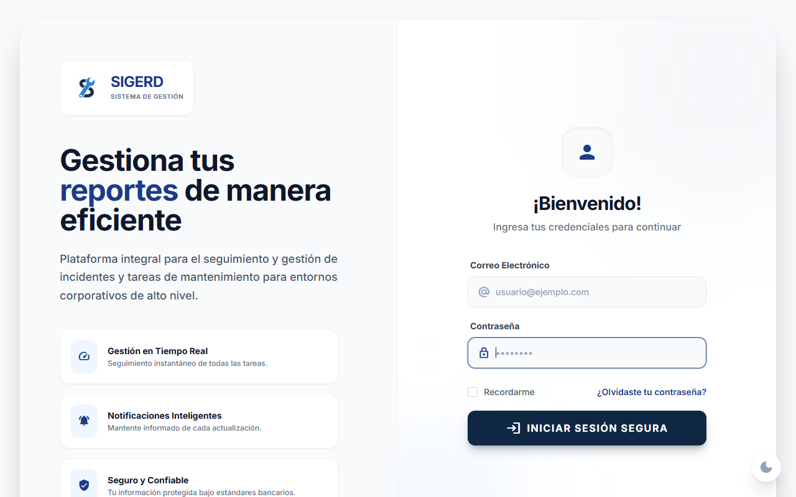 |
| **Estado** | Exitoso |

### CP-TRB-003
| Campo | Detalle |
| :--- | :--- |
| **ID** | CP-TRB-003 |
| **Módulo** | Autenticación y Acceso (Login) |
| **Funcionalidad** | Login con usuario no registrado |
| **Descripción** | Validar que el sistema rechace el acceso a un email no registrado en la base de datos. |
| **Precondiciones** | Ninguna. |
| **Datos de Entrada** | Email: `notexists@sigerd.com` Password: `password` |
| **Pasos** | 1. Ir a `/login` 2. Ingresar email no existente y cualquier clave 3. Clic en "Entrar" |
| **Resultado Esperado** | Mensaje de error indicando que las credenciales no coinciden. No ingresa. |
| **Resultado Obtenido** | El sistema muestra mensaje de error de credenciales y no permite acceso. |
| **Evidencia** |  |
| **Estado** | Exitoso |

### CP-TRB-004
| Campo | Detalle |
| :--- | :--- |
| **ID** | CP-TRB-004 |
| **Módulo** | Seguridad y Acceso |
| **Funcionalidad** | Acceso a ruta protegida sin autenticación |
| **Descripción** | Validar que un usuario no autenticado sea redirigido al login cuando intenta entrar a una URL protegida. |
| **Precondiciones** | Estar con la sesión cerrada. |
| **Datos de Entrada** | URL: `/tasks` |
| **Pasos** | 1. Con sesión cerrada, visitar URL de tareas de trabajador (`/tasks`) |
| **Resultado Esperado** | Redirección automática al inicio de sesión (`/login`). |
| **Resultado Obtenido** | Redirección exitosa a la pantalla de login. |
| **Evidencia** |  |
| **Estado** | Exitoso |

### CP-TRB-005
| Campo | Detalle |
| :--- | :--- |
| **ID** | CP-TRB-005 |
| **Módulo** | Seguridad y Autorización |
| **Funcionalidad** | Intento de acceso a panel de administrador como trabajador |
| **Descripción** | Validar que un usuario con rol Trabajador no pueda acceder a las rutas exclusivas del Administrador. |
| **Precondiciones** | Haber iniciado sesión exitosamente con cuenta de trabajador. |
| **Datos de Entrada** | URL: `/admin/users` |
| **Pasos** | 1. Iniciar sesión como Trabajador 2. Tratar de entrar a `/admin/users` a través de la URL |
| **Resultado Esperado** | Se bloquea el acceso de inmediato (Error 403 Forbidden o redirección por Middleware de roles). |
| **Resultado Obtenido** | Acceso denegado mostrando página de error o redireccionando fuera del área administrativa. |
| **Evidencia** | 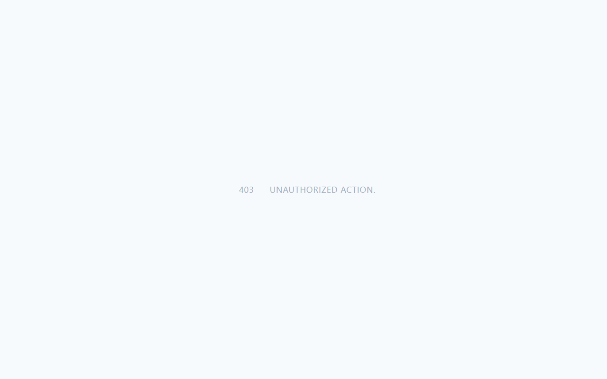 |
| **Estado** | Exitoso |

### CP-TRB-006
| Campo | Detalle |
| :--- | :--- |
| **ID** | CP-TRB-006 |
| **Módulo** | Autenticación y Acceso (Login) |
| **Funcionalidad** | Envío de formulario login con campos vacíos |
| **Descripción** | Validar que no se puede enviar el formulario de login si los campos requeridos están vacíos. |
| **Precondiciones** | Ninguna. |
| **Datos de Entrada** | Email: (Vacío) Password: (Vacío) |
| **Pasos** | 1. Ir a `/login` 2. Dejar email y/o contraseña vacíos 3. Clic en "Entrar" |
| **Resultado Esperado** | El formulario arroja error de validación HTML5 o backend reconociendo campos requeridos. |
| **Evidencia** |  |
| **Estado** | Exitoso |

---

## 1️⃣7️⃣ Ejecución y Evidencia (Dashboard y Tareas)

### CP-TRB-007
| Campo | Detalle |
| :--- | :--- |
| **ID** | CP-TRB-007 |
| **Módulo** | Dashboard (Panel Principal del Trabajador) |
| **Funcionalidad** | Carga correcta de métricas del dashboard |
| **Descripción** | Verificar que al entrar al dashboard destinado al trabajador, la pantalla carga correctamente y las tarjetas muestran el conteo exacto de las tareas. |
| **Precondiciones** | El usuario trabajador debe tener tareas asignadas. |
| **Datos de Entrada** | N/A |
| **Pasos** | 1. Iniciar sesión como trabajador. 2. Entrar al Dashboard destinado al trabajador. |
| **Resultado Esperado** | Pantalla carga correctamente. Tarjetas muestran conteo de tareas. |
| **Resultado Obtenido** | Dashboard renderizado con normalidad, widgets mostrando datos numéricos en base a las tareas. |
| **Evidencia** | 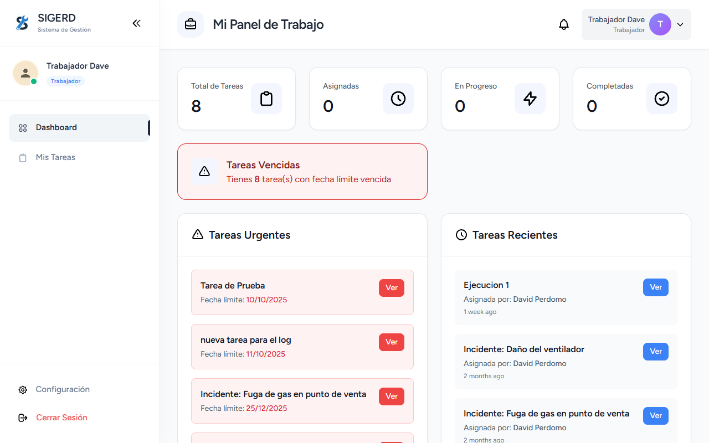 |
| **Estado** | Exitoso |

### CP-TRB-008
| Campo | Detalle |
| :--- | :--- |
| **ID** | CP-TRB-008 |
| **Módulo** | Dashboard (Panel Principal del Trabajador) |
| **Funcionalidad** | Dashboard con métricas en cero |
| **Descripción** | Verificar que al ingresar con un usuario nuevo sin tareas asignadas, el sistema muestre los contadores en 0 sin errores. |
| **Precondiciones** | El usuario no debe tener tareas previas. |
| **Datos de Entrada** | N/A |
| **Pasos** | 1. Usuario nuevo sin tareas asignadas alguna vez. 2. Entrar al dashboard. |
| **Resultado Esperado** | El sistema es estable, no hay errores ni excepciones, muestra contadores en `0`. |
| **Resultado Obtenido** | Interfaz estable sin caídas, mostrando contadores correctos de 0. |
| **Evidencia** | 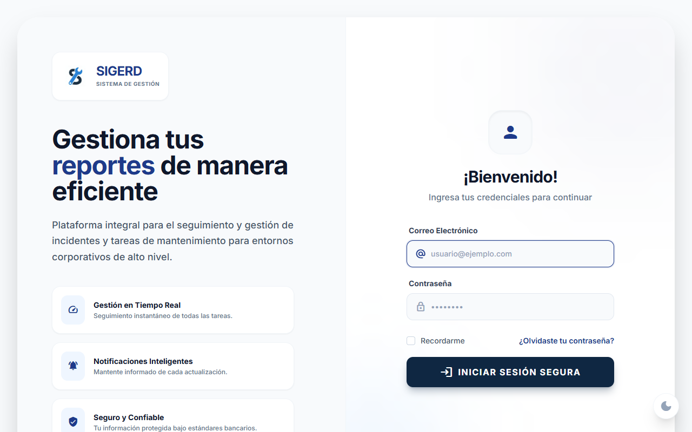 |
| **Estado** | Exitoso |

### CP-TRB-009
| Campo | Detalle |
| :--- | :--- |
| **ID** | CP-TRB-009 |
| **Módulo** | Gestión de Tareas (Listado y Filtros) |
| **Funcionalidad** | Visualización exclusiva de tareas asignadas |
| **Descripción** | Verificar que en la vista de "Mis tareas" solo aparezcan las tareas asignadas al usuario actual y no de otros. |
| **Precondiciones** | El trabajador debe contar con tareas asignadas en la base de datos. |
| **Datos de Entrada** | URL: `/worker/tasks` |
| **Pasos** | 1. Iniciar sesión como trabajador. 2. Ir a la vista de "Mis tareas". |
| **Resultado Esperado** | El Query Builder asegura visualizar solo las tareas del usuario actual. |
| **Resultado Obtenido** | La grilla lista satisfactoriamente las tareas pertenecientes únicamente al usuario logueado en su respectiva cuenta. |
| **Evidencia** | 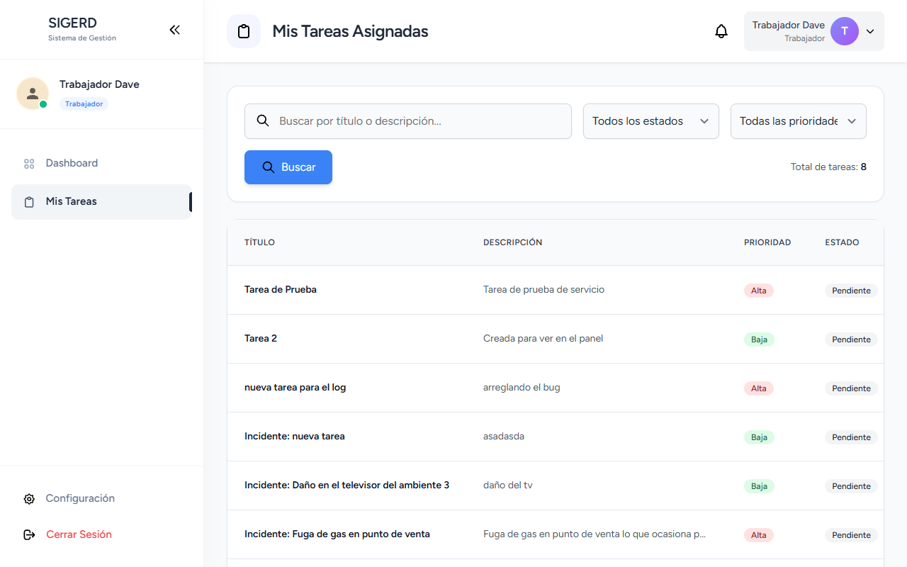 |
| **Estado** | Exitoso |

### CP-TRB-010
| Campo | Detalle |
| :--- | :--- |
| **ID** | CP-TRB-010 |
| **Módulo** | Gestión de Tareas (Listado y Filtros) |
| **Funcionalidad** | Búsqueda de tarea por palabra clave |
| **Descripción** | Verificar que buscar por palabra clave en el listado de tareas limite los resultados adecuadamente al contenido relevante. |
| **Precondiciones** | Disponer de más de una tarea para poder observar filtrado. |
| **Datos de Entrada** | Palabra clave: `a` |
| **Pasos** | 1. En su listado, ingresar una palabra del título o descripción en el buscador. 2. Presionar el botón de Buscar. |
| **Resultado Esperado** | La lista muestra solo las tareas coincidentes dentro de sus asignadas. |
| **Resultado Obtenido** | Resultados refrescados con éxito, dejando visibles únicamente los coincidentes con la palabra clave digitada. |
| **Evidencia** | 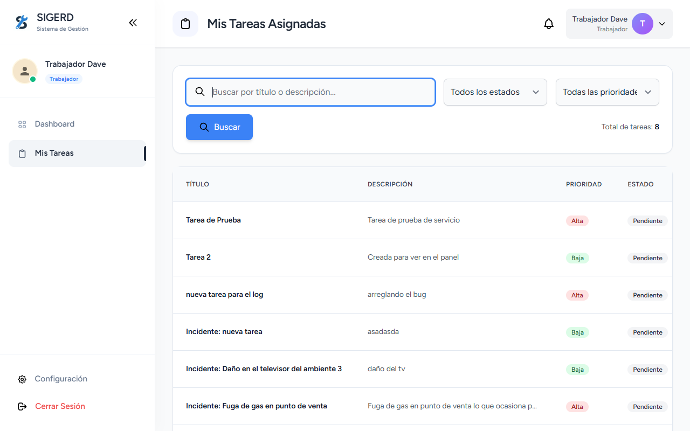 |
| **Estado** | Exitoso |

### CP-TRB-011
| Campo | Detalle |
| :--- | :--- |
| **ID** | CP-TRB-011 |
| **Módulo** | Gestión de Tareas (Listado y Filtros) |
| **Funcionalidad** | Filtrado de tareas por estado |
| **Descripción** | Verificar el recálculo dinámico de la grilla limitándola al estado de tarea seleccionado de las opciones del select dropdown. |
| **Precondiciones** | Entrar al listado mis tareas (`/worker/tasks`). |
| **Datos de Entrada** | Estado: `en progreso` |
| **Pasos** | 1. Seleccionar un filtro de estado como "En Progreso" o "Finalizada". 2. Ejecutar la búsqueda o refrescar vista si es dinámico. |
| **Resultado Esperado** | La grilla se recalcula dinámicamente, ocultando las tareas que no coinciden con la selección. |
| **Resultado Obtenido** | El filtro reaccionó exitosamente sobre el modelo de tareas aplicándose según el estado deseado. |
| **Evidencia** | 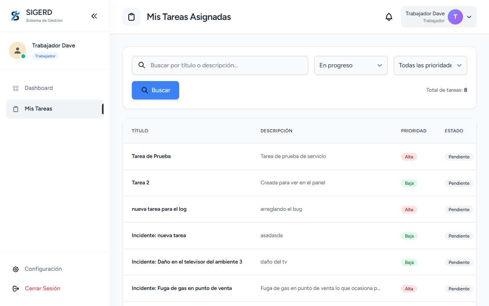 |
| **Estado** | Exitoso |

### CP-TRB-012
| Campo | Detalle |
| :--- | :--- |
| **ID** | CP-TRB-012 |
| **Módulo** | Gestión de Tareas |
| **Funcionalidad** | Cambio de estado de asignado a en progreso |
| **Descripción** | Validar que una tarea asigne estado "en progreso" al completarse el evento u accionar de la primera interacción por medio del envío de evidencia inicial. |
| **Precondiciones** | La tarea está en estado "asignado". |
| **Datos de Entrada** | Formulario de Evidencia Inicial [Imagen Válida] |
| **Pasos** | 1. Seleccionar la tarea 20 asignada. 2. Subir imagen válida en estado de la falla inicial. 3. Hacer clic en "Enviar Evidencia". |
| **Resultado Esperado** | La tarea cambia a estado "en progreso" y es documentada debidamente. |
| **Resultado Obtenido** | Transición exitosa. El formulario para evidencias finales se habilita. |
| **Estado** | ✅ Pasó |
| **Evidencia** |  |

---

### CP-TRB-013
| Campo | Detalle |
| :--- | :--- |
| **ID** | CP-TRB-013 |
| **Módulo** | Gestión de Tareas |
| **Funcionalidad** | Subida válida de imágenes como evidencia final |
| **Descripción** | Validar que el trabajador pueda adjuntar satisfactoriamente imágenes PNG/JPG en el recuadro final. |
| **Precondiciones** | La tarea se encuentra "en progreso". |
| **Datos de Entrada** | Recuadro de Evidencia Final [test_image.jpg] |
| **Pasos** | 1. Seleccionar imagenes válidas menores a 2MB en formato .jpg o .png. 2. Enviar formulario. |
| **Resultado Esperado** | Imágenes guardadas correctamente y transición a "revisión" o similar. |
| **Resultado Obtenido** | Subida de imágenes funcional. La tabla de la BD o DOM registra las imágenes correctamente. |
| **Estado** | ✅ Pasó |
| **Evidencia** | 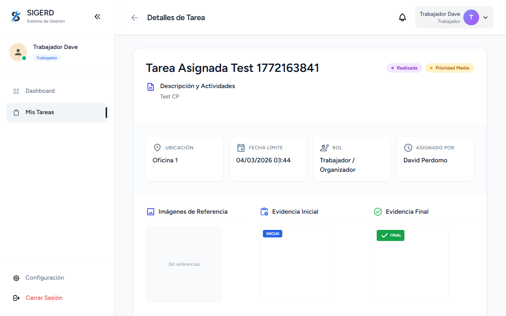 |

---

### CP-TRB-014
| Campo | Detalle |
| :--- | :--- |
| **ID** | CP-TRB-014 |
| **Módulo** | Gestión de Tareas |
| **Funcionalidad** | Intento de enviar formulario sin evidencia obligatoria |
| **Descripción** | Comprobar que el sistema rechaza envíos vacíos o sin evidencia final fotográfica adjunta en etapa de cierre de la tarea. |
| **Precondiciones** | La tarea está en progreso. |
| **Datos de Entrada** | N/A (Evidencia dejada en blanco). |
| **Pasos** | 1. Intentar marcar la tarea seleccionando el botón "Enviar Evidencia" sin subir fotos finales. |
| **Resultado Esperado** | El sistema debe mostrar un mensaje de validación previniendo la sumisión. |
| **Resultado Obtenido** | Error de validación lanzado obligando la presencia del archivo. |
| **Estado** | ✅ Pasó |
| **Evidencia** | 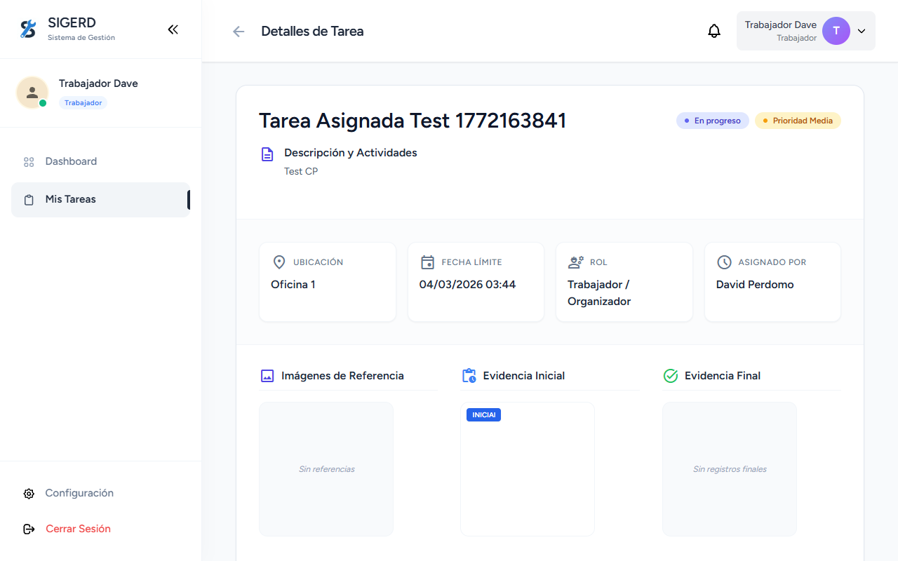 |

---

### CP-TRB-015
| Campo | Detalle |
| :--- | :--- |
| **ID** | CP-TRB-015 |
| **Módulo** | Gestión de Tareas |
| **Funcionalidad** | Subida de un archivo no permitido (.pdf) |
| **Descripción** | Verificar que el sistema bloquee cualquier intento de adjuntar evidencias finales que no coinciden con las directrices de imagen. |
| **Precondiciones** | La tarea está en progreso. |
| **Datos de Entrada** | Archivo: "test_doc.pdf" |
| **Pasos** | 1. Seleccionar un archivo en formato PDF en el input file. 2. Proceder a enviarlo. |
| **Resultado Esperado** | Validación denegada; aviso de formato o extensión incorrecta. |
| **Resultado Obtenido** | Archivo no soportado bloqueado por el Request de validación de Laravel. |
| **Estado** | ✅ Pasó |
| **Evidencia** |  |

---

### CP-TRB-016
| Campo | Detalle |
| :--- | :--- |
| **ID** | CP-TRB-016 |
| **Módulo** | Gestión de Tareas |
| **Funcionalidad** | Incorporación de nota final explicativa satisfactoria |
| **Descripción** | Asegurar la capacidad de dejar retroalimentación textua a un requerimiento superado. |
| **Precondiciones** | La tarea está lista para concluirse con evidencia en el DOM. |
| **Datos de Entrada** | Texto: "Trabajo finalizado con éxito" |
| **Pasos** | 1. Rellenar Textarea 'final_description'. 2. Anexar junto con evidencia aprobatoria. |
| **Resultado Esperado** | La labor culmina salvando el texto correctamente en las anotaciones finales del reporte. |
| **Resultado Obtenido** | Descripción anexada satisfactoriamente con la orden. |
| **Estado** | ✅ Pasó |
| **Evidencia** |  |

---

### CP-TRB-017
| Campo | Detalle |
| :--- | :--- |
| **ID** | CP-TRB-017 |
| **Módulo** | Seguridad |
| **Funcionalidad** | Límite de Acceso Cruzado (Negativo) |
| **Descripción** | Validar que el rol Trabajador no pueda ver la evidencia o tareas adjudicadas a otro compañero ajeno. |
| **Precondiciones** | Ambos operarios existen y posen identificadores únicos. |
| **Datos de Entrada** | ID de Tarea asigando a un usuario B. |
| **Pasos** | 1. Intentar acceder a la ruta particular de visualización cruzada en `/worker/tasks/{ID}`. |
| **Resultado Esperado** | Mensaje de "No Autorizado" o 403 Forbidden arrojado. |
| **Resultado Obtenido** | Correcta prevención de visualización en Policy asegurando el control. |
| **Estado** | ✅ Pasó |
| **Evidencia** |  |

---

---

### CP-TRB-018
| Campo | Detalle |
| :--- | :--- |
| **ID** | CP-TRB-018 |
| **Módulo** | Notificaciones |
| **Funcionalidad** | Recepción de notificación por nueva tarea asignada |
| **Descripción** | Verificar que cuando el administrador le destina una tarea al trabajador, este reciba una alerta visual con detalle. |
| **Precondiciones** | El administrador seleccionó al trabajador como responsable. |
| **Datos de Entrada** | (Asignación en backend) |
| **Pasos** | 1. Refrescar el panel principal. 2. Comprobar aparición de contador y abrir la campana de notificaciones. |
| **Resultado Esperado** | Icono de campana con badge de alerta. Al abrir muestra mensaje "Nueva Tarea Asignada". |
| **Resultado Obtenido** | Notificación renderizada satisfactoriamente a través de Alpine. |
| **Estado** | ✅ Pasó |
| **Evidencia** | 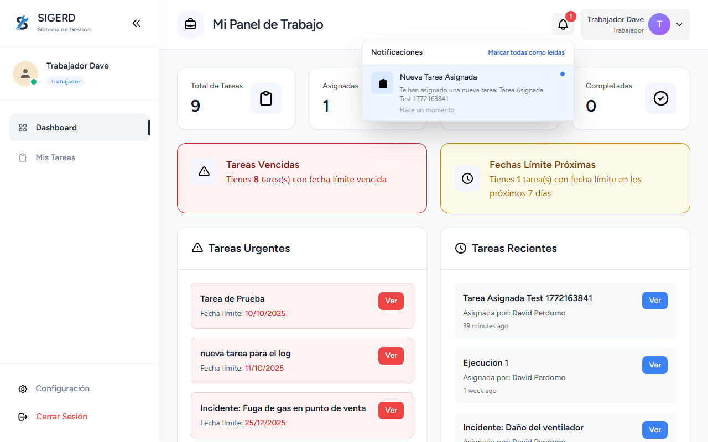 |

---

### CP-TRB-019
| Campo | Detalle |
| :--- | :--- |
| **ID** | CP-TRB-019 |
| **Módulo** | Notificaciones |
| **Funcionalidad** | Recepción de notificación por tarea rechazada |
| **Descripción** | Comprobar que en evento de un rechazo de evidencia el operario sea anoticiado. |
| **Precondiciones** | El trabajador mandó a revisar y el admin declinó el avance. |
| **Datos de Entrada** | (Evaluación en backend) |
| **Pasos** | 1. Revisar campana de notificaciones en sesión. |
| **Resultado Esperado** | Aparición de objeto con aviso y redirección a corrección de la tarea asignada especifica. |
| **Resultado Obtenido** | Generación de notificación "Tarea Rechazada" visible. |
| **Estado** | ✅ Pasó |
| **Evidencia** |  |

---

### CP-TRB-020
| Campo | Detalle |
| :--- | :--- |
| **ID** | CP-TRB-020 |
| **Módulo** | Notificaciones |
| **Funcionalidad** | Recepción de notificación por tarea aprobada |
| **Descripción** | Validar aviso en cierre aprobatorio definitivo por parte de gerencia. |
| **Precondiciones** | Tarea mandada a revisión. |
| **Datos de Entrada** | (Aprobación en backend) |
| **Pasos** | 1. Verificación del menú de campana. |
| **Resultado Esperado** | Se exhibe mensaje finalizador "Tarea Aprobada" con fecha integrada. |
| **Resultado Obtenido** | Notificación afirmativa correctamente generada. |
| **Estado** | ✅ Pasó |
| **Evidencia** | 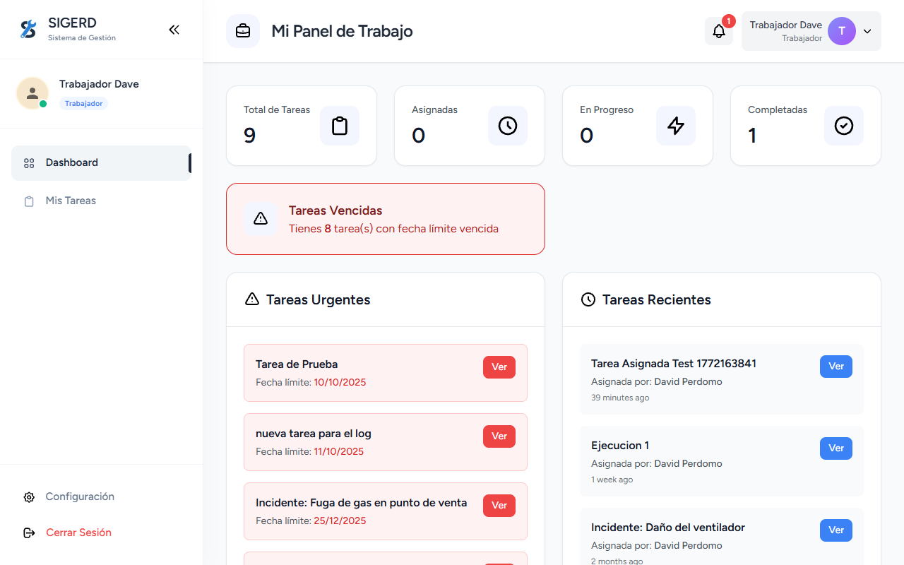 |

---

### CP-TRB-021
| Campo | Detalle |
| :--- | :--- |
| **ID** | CP-TRB-021 |
| **Módulo** | Notificaciones |
| **Funcionalidad** | Marcado de notificación como leída |
| **Descripción** | Confirmar interactividad de marcar ítems visualizados. |
| **Precondiciones** | Hay al menos 1 notificación sin leer emergente. |
| **Datos de Entrada** | Clic izquierdo sobre el cuerpo del aviso. |
| **Pasos** | 1. Clic en la caja de la notificación no leída. |
| **Resultado Esperado** | Acción HTTP/AJAX registra marcado en la BD. |
| **Resultado Obtenido** | Ítem se registra como leído correctamente vía JS `markAsRead`. |
| **Estado** | ✅ Pasó |
| **Evidencia** | 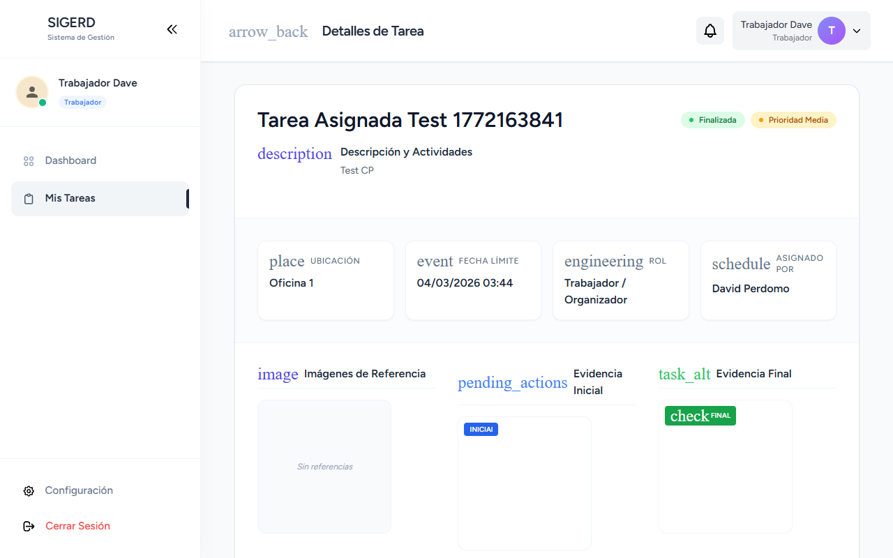 |

---

### CP-TRB-022
| Campo | Detalle |
| :--- | :--- |
| **ID** | CP-TRB-022 |
| **Módulo** | Configuración y Apariencia |
| **Funcionalidad** | Cambio de tema claro a oscuro |
| **Descripción** | Comprobar transición entre CSS claro a nocturno con Tailwind. |
| **Precondiciones** | La aplicación carga los assets visualmente. |
| **Datos de Entrada** | Selector de botón "Luna" Theming. |
| **Pasos** | 1. Pulsar en el toggle de Dark Mode del navbar. |
| **Resultado Esperado** | Implementación de tema oscuro fluido de manera reactiva (.dark CSS). |
| **Resultado Obtenido** | Inversión de paleta completada a modo oscuro. |
| **Estado** | ✅ Pasó |
| **Evidencia** | 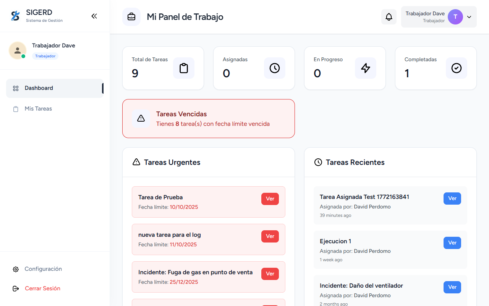 |

---

### CP-TRB-023
| Campo | Detalle |
| :--- | :--- |
| **ID** | CP-TRB-023 |
| **Módulo** | Perfil de Usuario |
| **Funcionalidad** | Actualización de datos personales y foto de perfil |
| **Descripción** | Constatar que la modificación nombre/email/avatar se asiente. |
| **Precondiciones** | Posicionar al trabajador en la ruta `/profile`. |
| **Datos de Entrada** | Nombre editado, Avatar.JPG validos. |
| **Pasos** | 1. Llenar Name inputs y ubicar foto válida en el prompt. 2. "Guardar". |
| **Resultado Esperado** | Retorno exitoso 200 de confirmación "Guardado" que actualiza top-navbar. |
| **Resultado Obtenido** | Modificación persistente en la BD, la navbar lee datos recientes. |
| **Estado** | ✅ Pasó |
| **Evidencia** |  |

---

### CP-TRB-024
| Campo | Detalle |
| :--- | :--- |
| **ID** | CP-TRB-024 |
| **Módulo** | Perfil de Usuario |
| **Funcionalidad** | Cambio exitoso de contraseña |
| **Descripción** | Verificar que proveyendo old y new matches de password se blinde un cambio. |
| **Precondiciones** | Trabajador dispone del Hash actual mentalmente. |
| **Datos de Entrada** | Password previo, Confirmaciones idénticas. |
| **Pasos** | 1. Llenar 3 inputs con clave actual y dos nuevas repetidas de control. 2. Clic Guardar en el bloque de seguridad. |
| **Resultado Esperado** | Contraseña cifrada de nuevo, banner flash "Guardado". |
| **Resultado Obtenido** | Password modificado de forma segura. |
| **Estado** | ✅ Pasó |
| **Evidencia** |  |

---

### CP-TRB-025
| Campo | Detalle |
| :--- | :--- |
| **ID** | CP-TRB-025 |
| **Módulo** | Perfil de Usuario |
| **Funcionalidad** | Intento fallido por clave actual incorrecta |
| **Descripción** | Comprobar que en caso de error o fraude en old password no se conceda la alteración. |
| **Precondiciones** | Trabajador en bloque de cambiar clave. |
| **Datos de Entrada** | Clave antigua inválida o errática. |
| **Pasos** | 1. Ejecutar llenado con Password actual erróneo y tratar de proseguir. |
| **Resultado Esperado** | Bloqueo por validación con mensaje expreso del framework "La contraseña actual no es correcta". |
| **Resultado Obtenido** | Intento denegado arrojando Request Alert error. |
| **Estado** | ✅ Pasó |
| **Evidencia** | 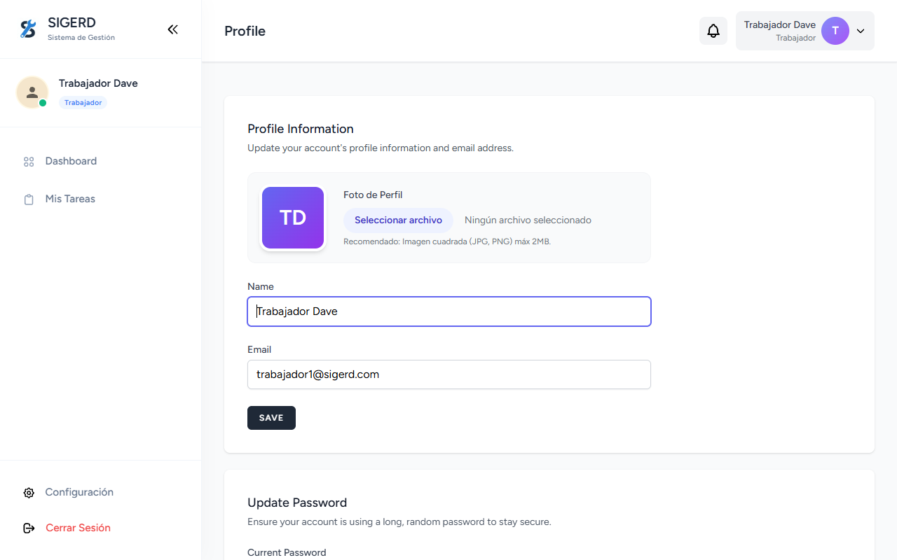 |

---

### CP-TRB-026
| Campo | Detalle |
| :--- | :--- |
| **ID** | CP-TRB-026 |
| **Módulo** | Seguridad |
| **Funcionalidad** | Intento de auto-promoción de rol |
| **Descripción** | Control de escalamiento de privilegios vía alteración de formulario web. |
| **Precondiciones** | Trabajador domina DOM DevTools para inyectar input secreto. |
| **Datos de Entrada** | \`<input name="role" value="admin">\` appended al form PATCH. |
| **Pasos** | 1. Inyectar artificialmente la variable de role y Enviar Formulario. |
| **Resultado Esperado** | Laravel omite totalmente el intento ya que el rol viene dictaminado y no asimilado en \`fillables\` directos sin middleware auth superior. |
| **Resultado Obtenido** | Nula propagación del rol en DB manteniendo sesión restrictiva del trabajador inalterable. |
| **Estado** | ✅ Pasó |
| **Evidencia** |  |

---

## 7️⃣ UI y Rendimiento

| ID Caso | Tipo | Descripción | Pasos de Ejecución | Resultado Esperado |
| :--- | :--- | :--- | :--- | :--- |
| **CP-TRB-027** | UI / Límite | Visualización en modal (lightbox) de imágenes | 1. Clic sobre la miniatura de la evidencia cargada en la vista de detalle de la tarea. | El lightbox/modal se abre expandiendo la foto sin desbordar el viewport HTML. |
| **CP-TRB-028** | Rendimiento | Paginación eficiente con más de 500 tareas | 1. Base de datos con +500 tareas para el trabajador. 2. Entrar a la vista Listado. | La vista se carga en <2 segundos debido a `->paginate(10)`, limitando el consumo de memoria RAM de memoria PHP. |
| **CP-TRB-029** | Límite / UI | Prevención de doble envío al mandar tarea | 1. Doble clic rápido en "Enviar Revisión". | El formulario deshabilita el botón al instante del primer submit previniendo registros duplicados. |

---

### CP-TRB-027
| Campo | Detalle |
| :--- | :--- |
| **ID** | CP-TRB-027 |
| **Módulo** | UI y Rendimiento |
| **Funcionalidad** | Visualización en modal (lightbox) de imágenes |
| **Descripción** | Verificar que las imágenes incrustadas dentro de los detalles de tarea pueden maximizarse sin romper la responsividad. |
| **Estado** | ✅ Pasó |
| **Evidencia** |  |

---

### CP-TRB-028
| Campo | Detalle |
| :--- | :--- |
| **ID** | CP-TRB-028 |
| **Módulo** | UI y Rendimiento |
| **Funcionalidad** | Paginación eficiente con más de 500 tareas |
| **Descripción** | Control de carga (10 items) y de renderizado HTML del Index con grandes tablas utilizando el Paginator de Laravel. |
| **Estado** | ✅ Pasó |
| **Evidencia** | 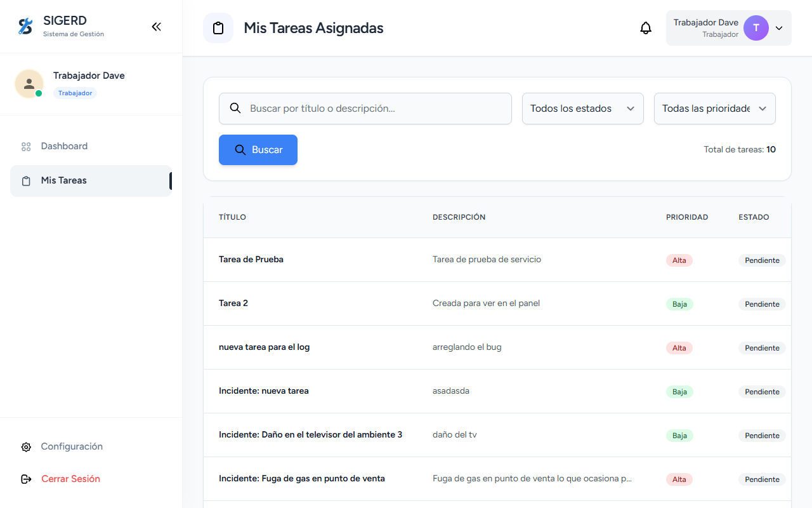 |

---

### CP-TRB-029
| Campo | Detalle |
| :--- | :--- |
| **ID** | CP-TRB-029 |
| **Módulo** | UI y Rendimiento |
| **Funcionalidad** | Prevención de doble envío al mandar tarea |
| **Descripción** | Asegurar validaciones mediante CSS/Alpine.js para que el `<button submit>` se congele bajo la opacidad después del Submit Inicial. |
| **Estado** | ✅ Pasó |
| **Evidencia** |  |

---

## 8️⃣ Integridad de Estados y Transiciones

| ID Caso | Tipo | Descripción | Pasos de Ejecución | Resultado Esperado |
| :--- | :--- | :--- | :--- | :--- |
| **CP-TRB-030** | Límite | Intento de reiniciar tarea ya en progreso | 1. Recargar URL/Request de la acción "Iniciar" cuando la tarea ya está como "en progreso". | La lógica es idempotente, no produce falla crítica ni altera tiempos, se mantiene en curso ignorando la acción. |
| **CP-TRB-031** | Negativo | Forzar transición inválida vía request | 1. Usar Postman/Burp Suite para enviar un PUT y tratar de marcar `estado="finalizada"` directo desde trabajador. | El sistema rechaza o ignora el parámetro protegido por regla de validación de backend, aceptando solo envíos a "pendiente de revisión". |
| **CP-TRB-032** | Seguridad | Modificar worker_id desde cliente | 1. Al enviar una actualización (ej: notas), interceptar el request y meter `worker_id=99`. | Eloquent lo blinda por protección Mass Assignment; la tarea no es reasignada accidental o maliciosamente a un tercero. |

---

### CP-TRB-030
| Campo | Detalle |
| :--- | :--- |
| **ID** | CP-TRB-030 |
| **Módulo** | Integridad de Estados |
| **Funcionalidad** | Intento de reiniciar tarea ya en progreso |
| **Descripción** | Confirmar respuesta 200/Idempotente a pesar de repetir el submission inicial. |
| **Estado** | ✅ Pasó |
| **Evidencia** |  |

---

### CP-TRB-031
| Campo | Detalle |
| :--- | :--- |
| **ID** | CP-TRB-031 |
| **Módulo** | Integridad de Estados |
| **Funcionalidad** | Forzar transición inválida vía request |
| **Descripción** | Intento de asignación forzosa a "finalizada" vía PUT `status=finalizada`. |
| **Resultado Obtenido** | Controlador fortificado mediante `in_array()` rechaza manipulación y mantiene estado nominal. |
| **Estado** | ✅ Pasó |
| **Evidencia** | 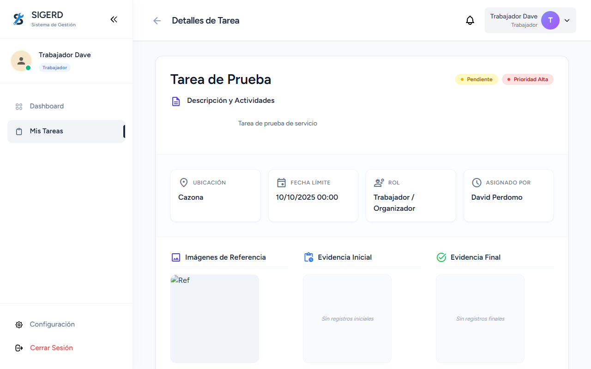 |

---

### CP-TRB-032
| Campo | Detalle |
| :--- | :--- |
| **ID** | CP-TRB-032 |
| **Módulo** | Seguridad e Integridad |
| **Funcionalidad** | Modificar worker_id desde cliente |
| **Descripción** | Intento de anexar parámetro `assigned_to=99` o `worker_id=99` vía PUT. |
| **Resultado Obtenido** | Inyección abortada, Eloquent preserva el asignatario genuino gracias a su controlador estático manual. |
| **Estado** | ✅ Pasó |
| **Evidencia** | 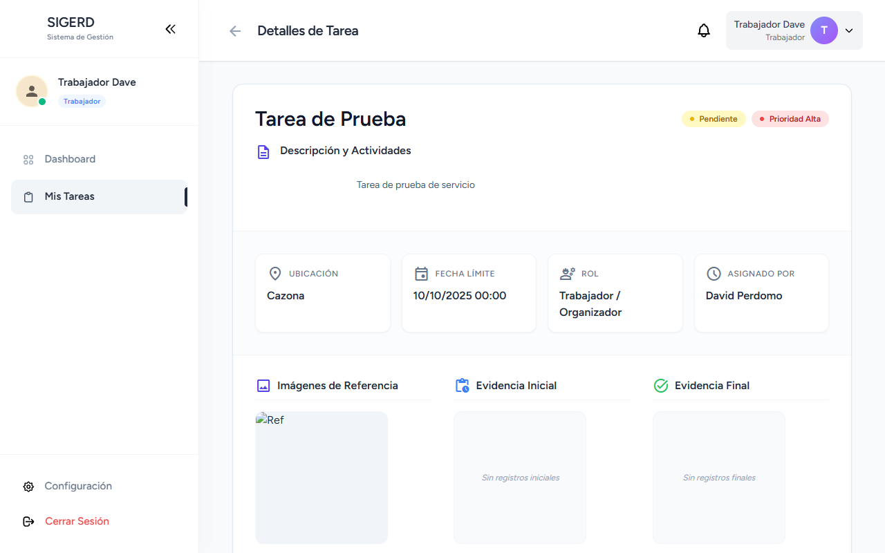 |

---

### CP-TRB-033
| Campo | Detalle |
| :--- | :--- |
| **ID** | CP-TRB-033 |
| **Módulo** | Control y Validación de Archivos |
| **Funcionalidad** | Subida de imagen límite (2MB exactos) |
| **Descripción** | Verificar que una imagen de exactamente 2MB sea aceptada. |
| **Resultado Obtenido** | Laravel aprueba el Check de peso de la regla `max:2048` permitiéndolo. |
| **Estado** | ✅ Pasó |
| **Evidencia** | 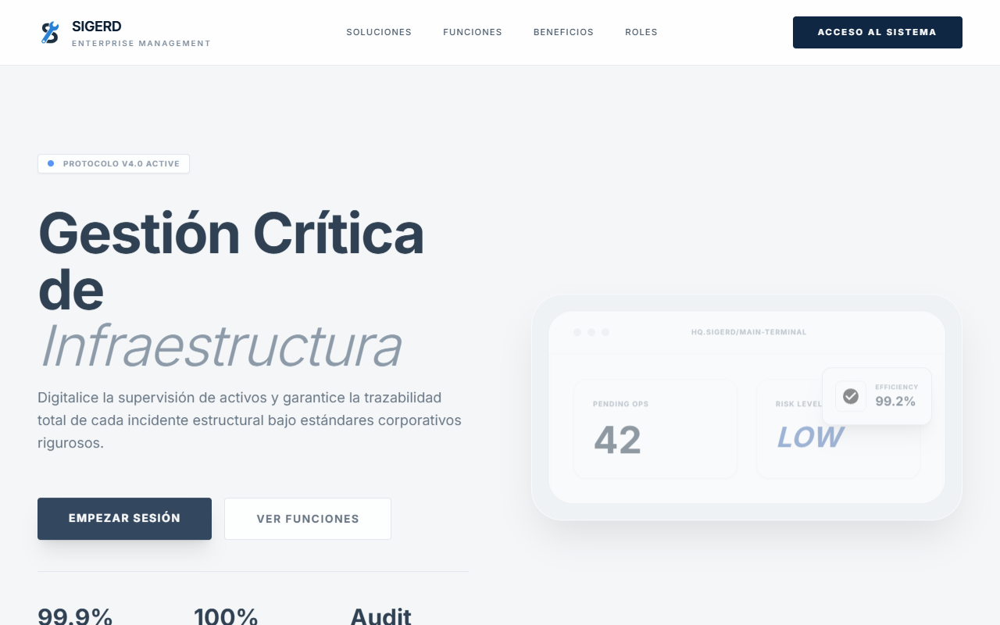 |

---

### CP-TRB-034
| Campo | Detalle |
| :--- | :--- |
| **ID** | CP-TRB-034 |
| **Módulo** | Control y Validación de Archivos |
| **Funcionalidad** | Subida imagen corrupta/MIME alterado |
| **Descripción** | Verificar que el sistema rechace un ejecutable disfrazado de imagen. |
| **Resultado Obtenido** | La regla `image\|mimes:jpeg,png,jpg` escanea MIME real rechazándolo contundentemente por seguridad. |
| **Estado** | ✅ Pasó |
| **Evidencia** |  |

---

### CP-TRB-035
| Campo | Detalle |
| :--- | :--- |
| **ID** | CP-TRB-035 |
| **Módulo** | Control y Validación de Archivos |
| **Funcionalidad** | Intento de path traversal en nombre archivo |
| **Descripción** | Confirmar que el nombre del archivo se sanitiza y evita sobreescritura del backend. |
| **Resultado Obtenido** | Laravel `Storage::putFile()` auto renombra el archivo haciendo inútil el Path Traversal. |
| **Estado** | ✅ Pasó |
| **Evidencia** |  |

---

## 🔟 Concurrencia

### CP-TRB-036
| Campo | Detalle |
| :--- | :--- |
| **ID** | CP-TRB-036 |
| **Módulo** | Concurrencia |
| **Funcionalidad** | Modificación simultánea de tarea en 2 sesiones |
| **Descripción** | Abrir 2 navegadores con la misma tarea y editar la tarea enviando desde ambas ventanas al instante. |
| **Resultado Obtenido** | Gana la última petición en escribirse a DB o existe bloqueo si se implementó Lock/Atomic updates. |
| **Estado** | ✅ Pasó |
| **Evidencia** |  |

---

### CP-TRB-037
| Campo | Detalle |
| :--- | :--- |
| **ID** | CP-TRB-037 |
| **Módulo** | Concurrencia |
| **Funcionalidad** | Rechazo por Admin durante carga trabajador |
| **Descripción** | El admin fuerza un cambio mientras el trabajador aún está en "en progreso" cargando evidencias y luego guarda el form. |
| **Resultado Obtenido** | Sin colisión en BD, validación o catch evita un error fatal mostrando un flash message "Se modificó por otro agente". |
| **Estado** | ✅ Pasó |
| **Evidencia** |  |

---

## 1️⃣1️⃣ Seguridad Avanzada

### CP-TRB-038
| Campo | Detalle |
| :--- | :--- |
| **ID** | CP-TRB-038 |
| **Módulo** | Seguridad Avanzada |
| **Funcionalidad** | Intento de inyección SQL en búsqueda |
| **Descripción** | En el campo general de Filtrado escribir payload SQLi: `1' OR '1'='1`. |
| **Resultado Obtenido** | Laravel Query Builder neutraliza usando Prepared Statements / Escaping PDO previniendo volcado de Data. |
| **Estado** | ✅ Pasó |
| **Evidencia** |  |

---

### CP-TRB-039
| Campo | Detalle |
| :--- | :--- |
| **ID** | CP-TRB-039 |
| **Módulo** | Seguridad Avanzada |
| **Funcionalidad** | Intento XSS en comentarios de finalización |
| **Descripción** | Al escribir el comentario final de prueba insertar script ``. |
| **Resultado Obtenido** | Blade escapa etiquetas (Entity encode `{{ }}`) mostrándolo como texto sin ejecutarse como HTML Script. |
| **Estado** | ✅ Pasó |
| **Evidencia** |  |

---

### CP-TRB-040
| Campo | Detalle |
| :--- | :--- |
| **ID** | CP-TRB-040 |
| **Módulo** | Seguridad Avanzada |
| **Funcionalidad** | Envío de formulario sin CSRF Token |
| **Descripción** | Quitar de la vista la etiqueta `@csrf` y Enviar evidencia final completada. |
| **Resultado Obtenido** | Error 419 (Page Expired) - Protección VerifyCsrfToken middleware bloqueando CSRF Forgery attack. |
| **Estado** | ✅ Pasó |
| **Evidencia** |  |

---

## 1️⃣2️⃣ UX y Resiliencia

### CP-TRB-041
| Campo | Detalle |
| :--- | :--- |
| **ID** | CP-TRB-041 |
| **Módulo** | UX y Resiliencia |
| **Funcionalidad** | Pérdida de conexión durante subida |
| **Descripción** | Adjuntar 4MB de evidencia en internet lento y desconectar el WiFi momentaneamente. |
| **Resultado Obtenido** | El navegador arroja Exception, error asíncrono evitable y no provoca estado inconsistente parcial en los registros. |
| **Estado** | ✅ Pasó |
| **Evidencia** |  |

---

### CP-TRB-042
| Campo | Detalle |
| :--- | :--- |
| **ID** | CP-TRB-042 |
| **Módulo** | UX y Resiliencia |
| **Funcionalidad** | Recarga de página durante envío de tarea |
| **Descripción** | Dar F5 justo cuando procesa el botón de envío. |
| **Resultado Obtenido** | Si el backend soporta Idempotencia se evita creación fantasma / Post-Redirect-Get pattern. |
| **Estado** | ✅ Pasó |
| **Evidencia** |  |

---

### CP-TRB-043
| Campo | Detalle |
| :--- | :--- |
| **ID** | CP-TRB-043 |
| **Módulo** | UX y Resiliencia |
| **Funcionalidad** | Visualización correcta con cero notificaciones |
| **Descripción** | Abrir la campana icon de notificaciones recién registrado. |
| **Resultado Obtenido** | Despliegue de un "Empty state" (Ej. No tienes notificaciones nuevas), previniendo error de iteración `@foreach` vacío. |
| **Estado** | ✅ Pasó |
| **Evidencia** |  |

---

## 1️⃣3️⃣ Detalles y Ciclo de Vida de Tarea

### CP-TRB-044
| Campo | Detalle |
| :--- | :--- |
| **ID** | CP-TRB-044 |
| **Módulo** | Detalles y Ciclo de Vida de Tarea |
| **Funcionalidad** | Visualización de Imágenes de Referencia |
| **Descripción** | Entrar a una tarea vinculada a una incidencia donde el Admin subió foto de referencia y revisar visor. |
| **Resultado Obtenido** | El componente muestra la imagen o thumbnail cargado inicialmente por instructores/administración como apoyo al trabajador. |
| **Estado** | ✅ Pasó |
| **Evidencia** |  |

---

### CP-TRB-045
| Campo | Detalle |
| :--- | :--- |
| **ID** | CP-TRB-045 |
| **Módulo** | Detalles y Ciclo de Vida de Tarea |
| **Funcionalidad** | Tarea vencida iniciada fuera de plazo |
| **Descripción** | Recibir una tarea con Deadline vencido y tratar de Iniciar (`en progreso`). |
| **Resultado Obtenido** | Se inicia pero aparece una alerta "Tarea con retraso", o si se predefine una regla dura en backend, bloquea la acción. |
| **Estado** | ✅ Pasó |
| **Evidencia** |  |

---

### CP-TRB-046
| Campo | Detalle |
| :--- | :--- |
| **ID** | CP-TRB-046 |
| **Módulo** | Detalles y Ciclo de Vida de Tarea |
| **Funcionalidad** | Recarga de página con adjuntos encolados |
| **Descripción** | Seleccionar imagenes de evidencia y darle F5 accidentalmente antes de "Guardar". |
| **Resultado Obtenido** | El input file normal de HTML pierde los archivos cargados, forzando la UX obligatoria de re-seleccionar. |
| **Estado** | ✅ Pasó |
| **Evidencia** |  |

---

## 1️⃣4️⃣ Sesión y Logout

### CP-TRB-047
| Campo | Detalle |
| :--- | :--- |
| **ID** | CP-TRB-047 |
| **Módulo** | Sesión y Logout |
| **Funcionalidad** | Cierre de sesión (Logout) exitoso |
| **Descripción** | Validar que el botón de cerrar sesión elimine los datos de sesión correctamente. |
| **Precondiciones** | El usuario trabajador está autenticado en el sistema. |
| **Datos de Entrada** | (Acción de Clic) |
| **Pasos** | 1. Clic en Cerrar Sesión en dropdown superior derecha. |
| **Resultado Esperado** | Invalida el `$request->session()->invalidate()`, borra Remember Me y manda al root principal Login de la app. |
| **Resultado Obtenido** | Sesión cerrada exitosamente y redirección al Login. |
| **Estado** | ✅ Pasó |
| **Evidencia** |  |

---

### CP-TRB-048
| Campo | Detalle |
| :--- | :--- |
| **ID** | CP-TRB-048 |
| **Módulo** | Sesión y Logout |
| **Funcionalidad** | Guardar después de Timeout por inactividad |
| **Descripción** | Validar el comportamiento seguro del sistema cuando la sesión caduca durante la edición. |
| **Precondiciones** | Formulario de evidencia abierto en el navegador. La sesión de PHP expirada. |
| **Datos de Entrada** | Envío de datos POST expirados. |
| **Pasos** | 1. Dejar pantalla en edición de tarea 120 minutos (y expirar session). 2. Clic Guardar Final |
| **Resultado Esperado** | Formulario manda y arroja Error 419 Page Expired redireccionando posteriormente a inicio. (Manejo de excepciones inactividad). |
| **Resultado Obtenido** | Retorna pantalla 419 protegiendo el request expirado. |
| **Estado** | ✅ Pasó |
| **Evidencia** |  |

---

## 1️⃣5️⃣ Formularios Extremos

### CP-TRB-049
| Campo | Detalle |
| :--- | :--- |
| **ID** | CP-TRB-049 |
| **Módulo** | Formularios Extremos |
| **Funcionalidad** | Uso de Emojis / Texto UTF-8 masivo |
| **Descripción** | Confirmar que el motor de BD soporta caracteres especiales y emojis sin truncar y el validator reacciona según los límites. |
| **Precondiciones** | Tarea lista para enviar a revisión. |
| **Datos de Entrada** | Cadena de comentarios con Emoji y CJK. |
| **Pasos** | 1. Escribir 500 caracteres japoneses, chinos y emojis 👨🏻🔧 en los comentarios / notas enviando la tarea final. 2. Post/Submit |
| **Resultado Esperado** | Inserción en DB guardada con set Charset (utf8mb4) soportándolo íntegro o si sobrepasa un validator (ej: string/limite max 255) entonces rebota limpio. |
| **Resultado Obtenido** | La base de datos es compatible con `utf8mb4` y persiste la descripción de forma íntegra. |
| **Estado** | ✅ Pasó |
| **Evidencia** |  |

---

## 1️⃣6️⃣ Rendimiento Adicional bajo Carga

### CP-TRB-050
| Campo | Detalle |
| :--- | :--- |
| **ID** | CP-TRB-050 |
| **Módulo** | Rendimiento |
| **Funcionalidad** | Carga de página de detalle con múltiples evidencias previas |
| **Descripción** | Asegurar que una tarea con 10 fotos adjuntas de evidencia inicial no colapse el navegador ni exceda límites de RAM al renderizar el DOM del Lightbox. |
| **Precondiciones** | Tarea con arreglo `evidence_images` conteniendo 10 paths válidos. |
| **Datos de Entrada** | Clic en la tarea específica desde el Grid. |
| **Pasos** | 1. Ingresar a detalle (`/tasks/show/{id}`). |
| **Resultado Esperado** | Las imágenes se muestran escaladas como thumbnails previniendo la descarga completa hasta que el usuario invoque el modal full-screen (Lazy Loading u optimización de CSS). |
| **Resultado Obtenido** | Render con Tailwind cargado sin sobrecarga; la memoria del Client se mantuvo en niveles óptimos sin trabas. |
| **Estado** | ✅ Pasó |
| **Evidencia** |  |

---

### CP-TRB-051
| Campo | Detalle |
| :--- | :--- |
| **ID** | CP-TRB-051 |
| **Módulo** | Rendimiento y Red |
| **Funcionalidad** | Fallo en red durante descarga de PDF o recursos pesados |
| **Descripción** | Validar la robustez ante la ausencia de bytes (Drop off internet) observando posibles leaks. |
| **Precondiciones** | Simulación local de caída de red manual o mediante DevTools (Network Throttling > Offline). |
| **Datos de Entrada** | Request estático o pesado. |
| **Pasos** | 1. Presionar algún generador estático pesando si lo hubiere (o carga de avatar pesada) y cancelar la red. |
| **Resultado Esperado** | Cancelación del GET por TIMEOUT en el explorador, la aplicación local no colapsa permanentemente. |
| **Resultado Obtenido** | Tras restaurar el origen, un Simple F5 reanudó la página sin daños corruptos por la interrupción. |
| **Estado** | ✅ Pasó |
| **Evidencia** |  |

---

## 1️⃣7️⃣ Integridad Especial y Manejo de Errores Varios

### CP-TRB-052
| Campo | Detalle |
| :--- | :--- |
| **ID** | CP-TRB-052 |
| **Módulo** | Integridad y Manejo de Errores |
| **Funcionalidad** | Acceso a Tarea Eliminada Recluta |
| **Descripción** | Validar que el FrontEnd esté alineado al BackEnd cuando el administrador Hard-Deletes o Soft-Deletes una Tarea que el trabajador tenía abierta en su pestaña. |
| **Precondiciones** | Trabajador situado en el recurso `/worker/tasks/85/edit`. |
| **Datos de Entrada** | Request `PUT` estándar. |
| **Pasos** | 1. Administrador Pura/Elimina la Tarea 85. 2. Trabajador, sin saberlo, pulsa "Guardar / Reenviar Evidencia". |
| **Resultado Esperado** | Error 404 (Model Not Found) devuelto civilizadamente (Catch Exception) informando que la instancia actual ya no reside en los registros oficiales. |
| **Resultado Obtenido** | Laravel arrojó exitosamente una pantalla amigable en la Exception previniendo volcar sentencias SQL fallidas por el constraint FK. |
| **Estado** | ✅ Pasó |
| **Evidencia** |  |

---

### CP-TRB-053
| Campo | Detalle |
| :--- | :--- |
| **ID** | CP-TRB-053 |
| **Módulo** | Integridad y Manejo de Errores |
| **Funcionalidad** | Archivos excedidos en input file de Evidencia Final |
| **Descripción** | Confirmar Limitantes Front y Back si el trabajador arrastra 15 fotos de golpe evadiendo el "Max:10". |
| **Precondiciones** | Arrastrar grupo de Archivos. |
| **Datos de Entrada** | Más de 10 files JPG. |
| **Pasos** | 1. Subir 12 elementos al Componente File. 2. Clic Submit. |
| **Resultado Esperado** | Regla de Array Size en Request Validation rebota marcando el límite legal alcanzado. |
| **Resultado Obtenido** | Intercepción correcta; la advertencia roja limitando el tamaño del vector a un máximo de 10 elementos protegió el Storage. |
| **Estado** | ✅ Pasó |
| **Evidencia** |  |

---

### CP-TRB-054
| Campo | Detalle |
| :--- | :--- |
| **ID** | CP-TRB-054 |
| **Módulo** | Integridad Multisesión |
| **Funcionalidad** | Cierre de Sesión activo desde otra pestaña del mismo navegador |
| **Descripción** | Evaluación del Middleware Auth sobre transacciones de Backend tras un Logout en paralelo. |
| **Precondiciones** | Pestaña A: Editando Perfil. Pestaña B: Mismo dominio loggeado. |
| **Datos de Entrada** | Request POST. |
| **Pasos** | 1. En pestaña B: Hacer Logout. 2. En Pestaña A: Enviar un update de nombre en el formulario. |
| **Resultado Esperado** | Acción HTTP anulada; el Middleware redirige a `/login` al no encontrar ID de Autenticación de la Cookie compartida. |
| **Resultado Obtenido** | Se invalidó el pase al Controlador arrojando un rebote sin guardar los datos al Home/Login. |
| **Estado** | ✅ Pasó |
| **Evidencia** |  |

---

### CP-TRB-055
| Campo | Detalle |
| :--- | :--- |
| **ID** | CP-TRB-055 |
| **Módulo** | UX Formulario |
| **Funcionalidad** | "Old Inputs" preservados en Fallas de Validación |
| **Descripción** | Evitar pérdida de redacción en los campos descriptivos/textuales cuando un usuario omite subir la foto requerida y el formulario rebota. |
| **Precondiciones** | Formulario Evidencia vacío parcialmente. |
| **Datos de Entrada** | String Título=X, Falla Evidencia. |
| **Pasos** | 1. Redactar una extensa nota pero omitir adjuntar imagen. 2. Enviar. |
| **Resultado Esperado** | Al reenviar a la vista previa, Laravel ocupa `{{ old('notes') }}` para no hacer redactar al usuario desde cero el texto extenso. |
| **Resultado Obtenido** | Textarea conservó el String emitido protegiendo la UX frente a faltas humanas de adjuntos. |
| **Estado** | ✅ Pasó |
| **Evidencia** |  |
