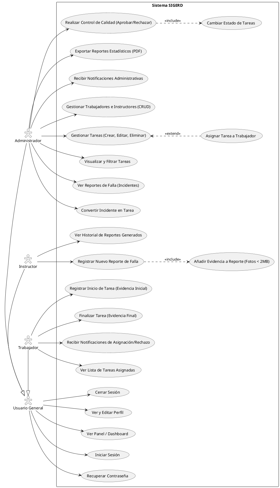

# Diagrama de Casos de Uso - SIGERD

A continuación se presenta el código fuente en formato **PlantUML** del diagrama general de Casos de Uso del sistema SIGERD. Este diagrama refleja los tres perfiles de usuario (Actores) y todas sus interacciones contempladas en el documento de Requisitos Funcionales.

Puedes copiar este bloque de código y pegarlo en cualquier visualizador de PlantUML (como [PlantText](https://www.planttext.com/) o la extensión de VS Code) para renderizar el gráfico visual.

## Notas del Diagrama

* **Herencia de Actores (`-|>`)**: Se utilizó un actor abstracto llamado "Usuario General" para no repetir las líneas de Iniciar Sesión, Panel, Perfil y Cerrar Sesión hacia los 3 roles, manteniendo el gráfico más limpio. El Administrador, Instructor y Trabajador heredan esas capacidades básicas.
* **Trazabilidad Pura**: Cada `usecase` expuesto aquí se originó directamente a raíz de las iteraciones sobre el archivo `requisitos_funcionales.md` y respeta las restricciones (como que la inserción de imágenes está incluida dentro de registrar reportes o finalizar tareas con `<<include>>`).
