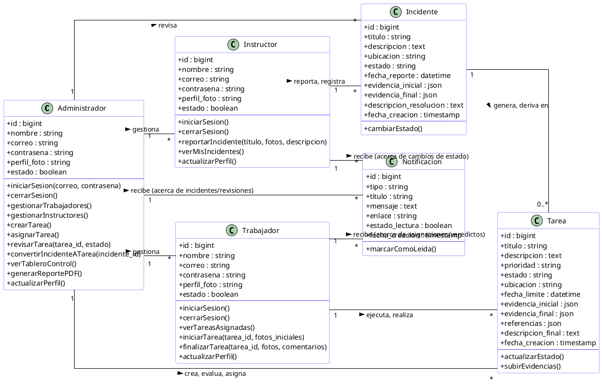

# Diagrama de Clases - SIGERD

A continuación se presenta el código fuente en formato **PlantUML** del diagrama conceptual de clases del sistema SIGERD, basado en los roles, objetos principales y funciones reales del software. Este diagrama organiza los perfiles como clases individuales, respetando las operaciones lógicas que asumen en el código.

---

## Código PlantUML

### Notas sobre el diagrama
- La organización visual, responsabilidades y atributos mapean directamente las operaciones ejecutadas por los controladores en SIGERD (`Admin/TaskController`, `Worker/TaskController`, `Instructor/IncidentController`).
- Aunque el modelo en base de datos de Laravel es unificado en `User`, la abstracción de diagramas orientados a objetos exige la clara separación conductual para reflejar explícitamente qué métodos asume cada iteración o "rol" ante el negocio, coincidiendo con la imagen de referencia.
