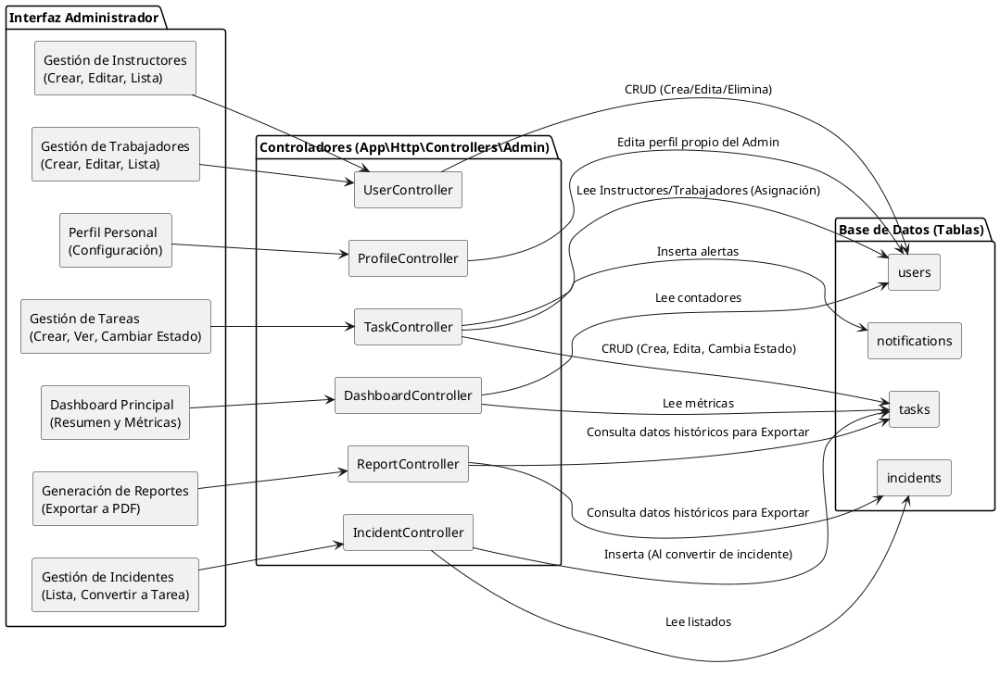
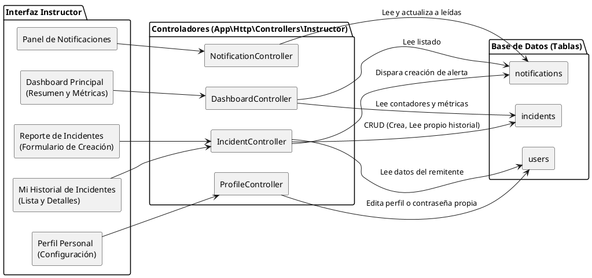
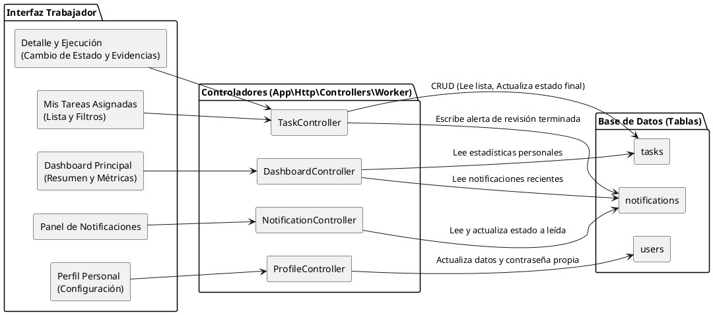

# Diagrama de Componentes - SIGERD

A continuación se presenta el código fuente en formato **PlantUML** de los diagramas de componentes estructurales del sistema SIGERD, divididos por el rol del usuario.

---

## 1. Diagrama de Componentes: Rol Administrador

Este diagrama representa el flujo directo desde las interfaces visuales (Vistas Blade) a las que tiene acceso el Administrador, pasando por sus verdaderos Controladores lógicos, hasta impactar en las Tablas estrictas de la base de datos MySQL.

---

## 2. Diagrama de Componentes: Rol Instructor

Este diagrama representa el flujo directo desde las interfaces visuales (Vistas Blade) a las que tiene acceso el Instructor, pasando por sus Controladores lógicos, hasta impactar en las Tablas de la base de datos MySQL.

---

## 3. Diagrama de Componentes: Rol Trabajador

Este diagrama despliega la arquitectura de componentes exclusiva para el entorno del Trabajador de campo. Resalta cómo sus acciones en las Vistas Blade impactan sus Controladores lógicos y modifican de forma directa las Tablas de tareas asigandas.

