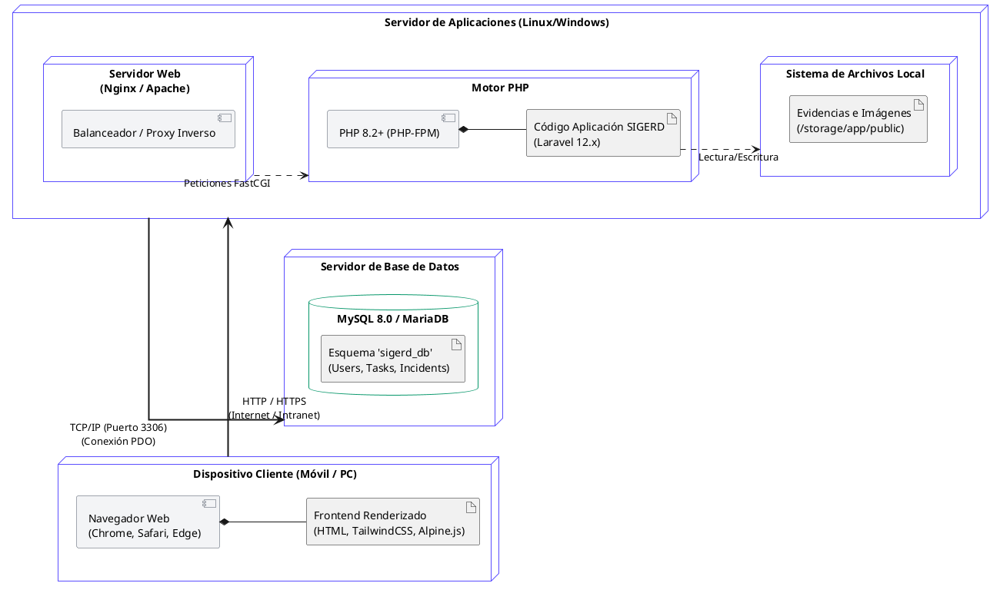

# Diagrama de Despliegue - SIGERD

A continuación se presenta el código fuente en formato **PlantUML** del diagrama de despliegue del sistema SIGERD. Este diagrama ilustra la arquitectura física e infraestructura de red donde se hospeda y ejecuta la aplicación, basándose estrictamente en los requerimientos técnicos del software (Laravel, MySQL, Nginx/Apache).

---

## Código PlantUML

### Descripción de la Arquitectura de Despliegue
1. **Capa Cliente:** Representa cualquier dispositivo (PC, Tablet o Celular) desde el cual los roles (Admin, Trabajador, Instructor) acceden a la plataforma mediante un navegador web moderno.
2. **Servidor de Aplicaciones:** El nodo central donde reside el código de Laravel. Un servidor Nginx o Apache recibe las peticiones HTTP y las pasa a PHP-FPM para procesar la lógica de negocio. Además, incluye el volumen de almacenamiento local físico donde se guardan las fotografías y evidencias técnicas (`storage/app/public`).
3. **Servidor de Base de Datos:** Nodo (que puede estar en el mismo servidor o en uno dedicado) que ejecuta MySQL o MariaDB y aloja el esquema relacional estructurado del sistema SIGERD.
