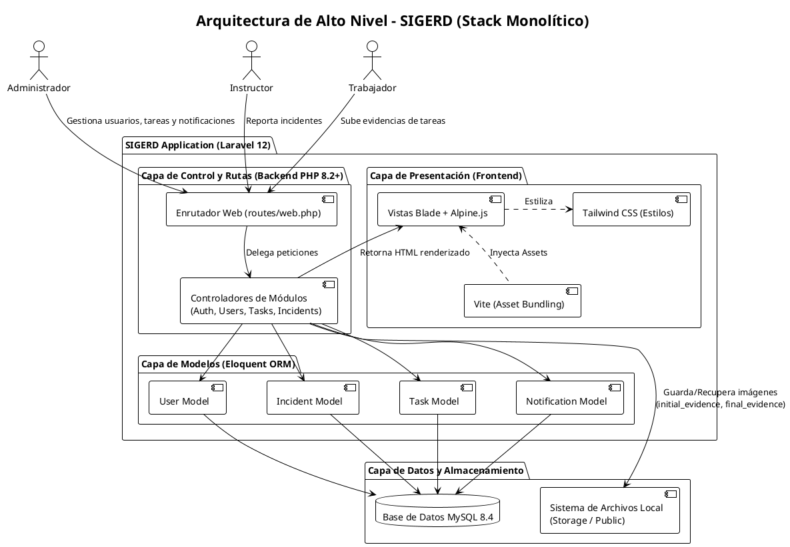

# Arquitectura de Alto Nivel: SIGERD

Este documento presenta la arquitectura de alto nivel del Sistema de Gestión de Reportes y Tareas (SIGERD).

## Diagrama (PlantUML)

### Componentes Clave:
1. **Frontend (Capa de Presentación)**: Interfaz de usuario construida con vistas **Blade** (motor de plantillas de Laravel) intercaladas con interactividad ágil de **Alpine.js** y estilos utilitarios de **Tailwind CSS**. Estos activos (CSS/JS) son procesados y empaquetados por **Vite**.
2. **Backend (Control y Rutas)**: Capa central de **Laravel 12 (PHP 8.2+)** que maneja todo el enrutamiento web, la lógica de negocio (mediante Controladores) y las políticas de acceso para las tres figuras de actores.
3. **Capa de Modelos (ORM)**: Integrada al backend, utiliza **Eloquent ORM** para mapear las abstracciones de negocio mediante clases (Models) a tablas concretas en la base de datos (Ej: `User`, `Incident`, `Task`, `Notification`).
4. **Capa de Datos y Almacenamiento**: Compuesta por una base de datos relacional **MySQL 8.4** asegurando la consistencia transaccional, y el propio sistema de archivos locales (discos de almacenamiento de Laravel) para guardar de forma estática las evidencias fotográficas de los reportes e intervenciones. 
