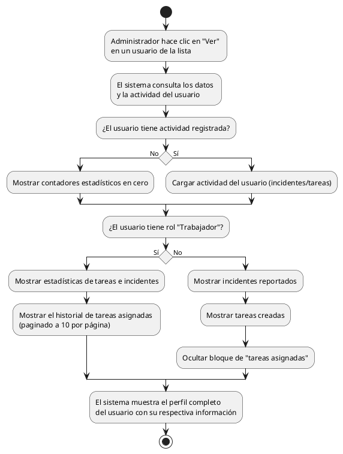

# Diagrama de Actividades: HU-ADM-010 (Ver Perfil e Historial de Usuario)

**Historia de Usuario:** HU-ADM-010
**Rol:** Administrador
**Acción:** Ver el perfil completo y el historial de actividad de un usuario específico.
**Propósito:** Monitorear el rendimiento y las actividades del personal.

**Casos de Uso:**
1. **Perfil de trabajador:** Muestra estadísticas de tareas, incidentes e historial de tareas paginado (10/página).
2. **Perfil de administrador o instructor:** Muestra incidentes reportados y tareas creadas (sin bloque de tareas asignadas).
3. **Usuario sin actividad:** Muestra todos los contadores estadísticos en cero.

---

### Código PlantUML

