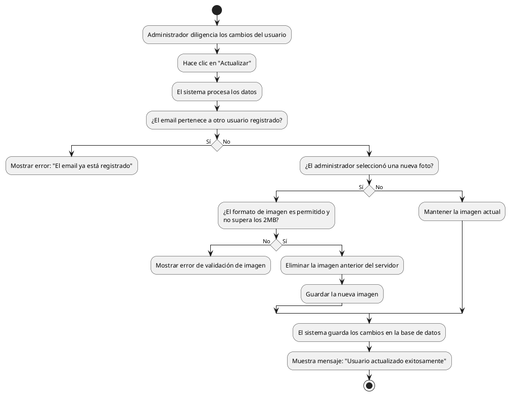

# Diagrama de Actividades: HU-ADM-011 (Editar Usuario)

**Historia de Usuario:** HU-ADM-011
**Rol:** Administrador
**Acción:** Editar los datos de un usuario existente en el sistema.
**Propósito:** Mantener la información actualizada o corregir datos incorrectos.

**Casos de Uso:**
1. **Edición exitosa:** Guarda los cambios y muestra mensaje de éxito.
2. **Email duplicado:** Muestra error si el email pertenece a otro usuario.
3. **Actualización de foto:** Si hay nueva foto, elimina la anterior y guarda la nueva.
4. **Imagen inválida:** Error si el formato no está permitido o supera los 2MB.

---

### Código PlantUML

