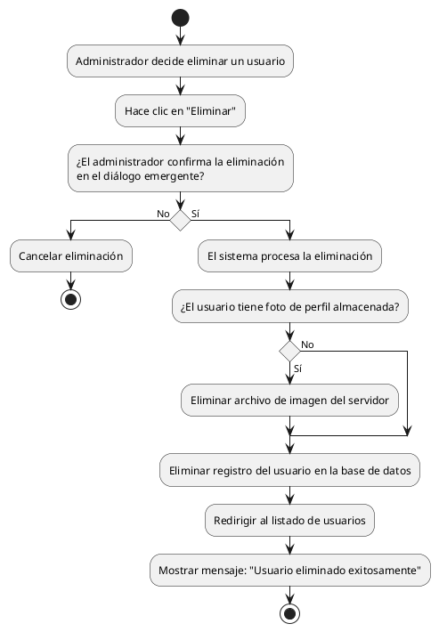

# Diagrama de Actividades: HU-ADM-012 (Eliminar Usuario)

**Historia de Usuario:** HU-ADM-012
**Rol:** Administrador
**Acción:** Eliminar un usuario del sistema de forma permanente.
**Propósito:** Revocar el acceso a usuarios que ya no pertenecen al personal.

**Casos de Uso:**
1. **Eliminación exitosa:** Confirma, elimina de base de datos y redirige mostrando mensaje.
2. **Eliminación con foto de perfil:** Si el usuario tiene foto, elimina el archivo del servidor.

---

### Código PlantUML

