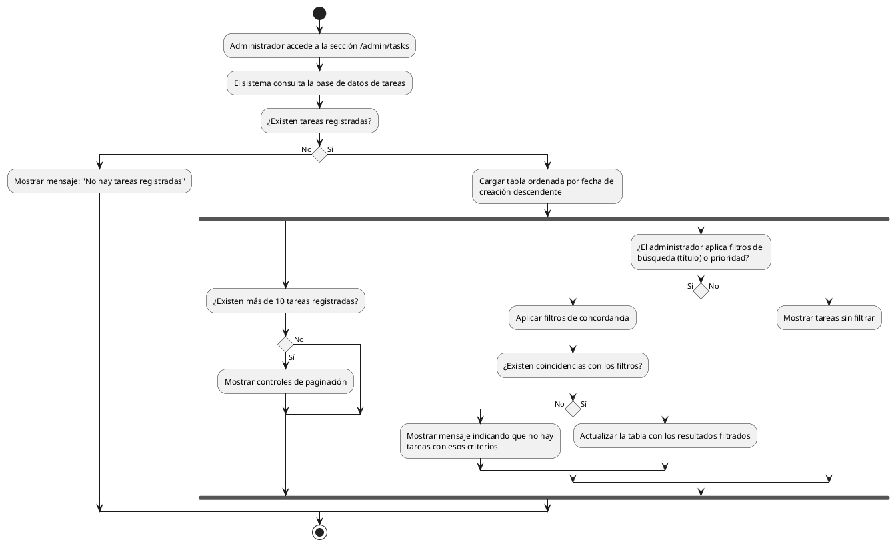

# Diagrama de Actividades: HU-ADM-013 (Listado de Tareas)

**Historia de Usuario:** HU-ADM-013
**Rol:** Administrador
**Acción:** Ver el listado de todas las tareas registradas en el sistema.
**Propósito:** Supervisar el estado y progreso de todas las actividades de mantenimiento.

**Casos de Uso:**
1. **Lista de tareas con datos:** Muestra tabla paginada (10 tareas/página) ordenada desc.
2. **Lista de tareas vacía:** Si no hay tareas, muestra un mensaje informativo.
3. **Filtrado por título:** Filtra tareas por título ingresado.
4. **Filtrado por prioridad:** Filtra tareas por baja, media o alta.
5. **Combinación de filtros:** Aplica ambos filtros texto y prioridad conjuntamente.
6. **Sin resultados:** Muestra mensaje si no hay coincidencias con filtros.

---

### Código PlantUML

