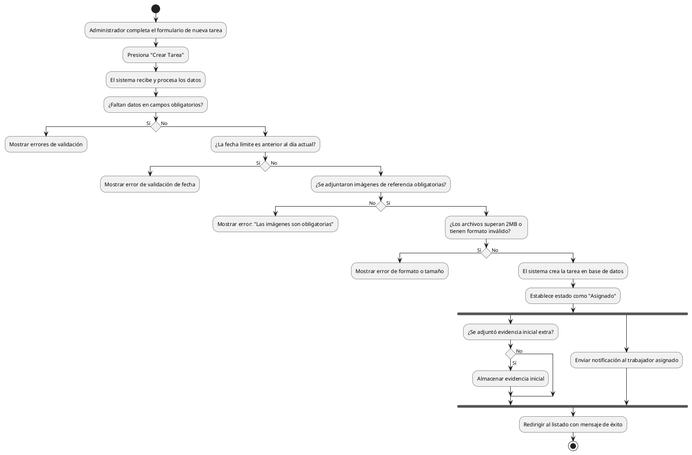

# Diagrama de Actividades: HU-ADM-014 (Crear Tareas de Mantenimiento)

**Historia de Usuario:** HU-ADM-014
**Rol:** Administrador
**Acción:** Crear nuevas tareas de mantenimiento y asignarlas a un trabajador.
**Propósito:** Organizar y delegar las actividades de mantenimiento.

**Casos de Uso:**
1. **Creación exitosa:** Crea la tarea (estado "asignado"), notifica, redirige.
2. **Fecha límite inválida:** Muestra error si la fecha es anterior al día de hoy.
3. **Campos obligatorios vacíos:** Errores de validación si faltan datos requeridos.
4. **Imágenes obligatorias:** Error si no se adjunta evidencia de referencia.
5. **Formato de imagen inválido:** Error de formato.
6. **Imagen supera tamaño:** Error si la imagen excede 2MB.
7. **Notificación al trabajador:** Informa al asignado al momento de crearla.
8. **Evidencia inicial opcional:** Almacena evidencia subida por el administrador. (Aunque dice imágenes obligatorias en CU4, dice evidencia inicial opcional en CU8. Asumiremos adjuntos de referencia obligatorios).

---

### Código PlantUML

