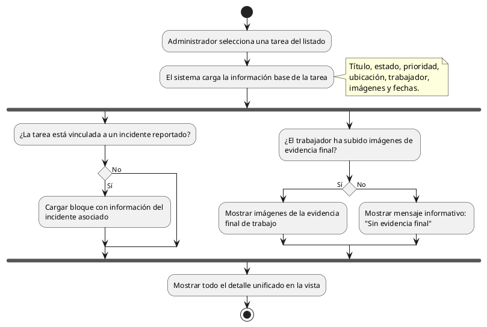

# Diagrama de Actividades: HU-ADM-015 (Detalle de Tarea)

**Historia de Usuario:** HU-ADM-015
**Rol:** Administrador
**Acción:** Ver el detalle completo de una tarea específica.
**Propósito:** Revisar toda la información y evidencia relacionada.

**Casos de Uso:**
1. **Ver detalle completo:** Muestra título, estado, prioridad, ubicación, trabajador, imágenes, fechas.
2. **Tarea vinculada a incidente:** Si hay un incidente previo, muestra la info relacionada.
3. **Sin evidencia final:** Si no se ha subido evidencia, muestra apartado vacío o texto informativo.

---

### Código PlantUML

