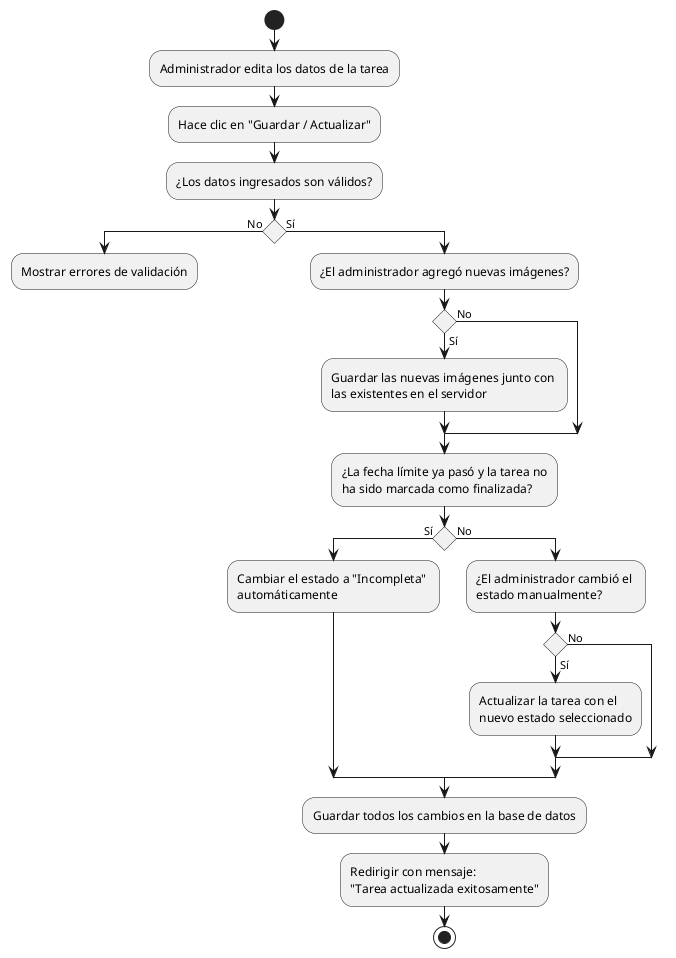

# Diagrama de Actividades: HU-ADM-016 (Editar Tarea)

**Historia de Usuario:** HU-ADM-016
**Rol:** Administrador
**Acción:** Editar los datos de una tarea existente.
**Propósito:** Actualizar información o reasignar recursos.

**Casos de Uso:**
1. **Edición exitosa:** Guarda los cambios y muestra mensaje de éxito.
2. **Cambio de estado:** Actualiza el estado seleccionado de la tarea.
3. **Adición de imágenes:** Guarda nuevas imágenes junto con las existentes.
4. **Fecha límite vencida:** Si la fecha pasó y no está finalizada, el estado cambia automáticamente a "incompleta".

---

### Código PlantUML

