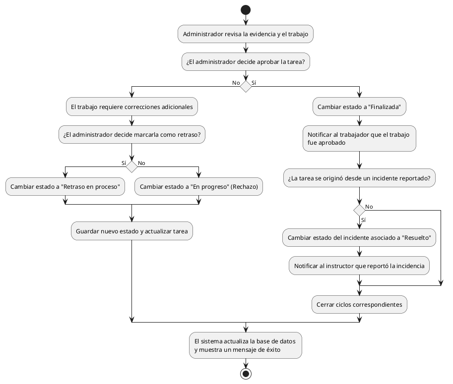

# Diagrama de Actividades: HU-ADM-017 (Revisar y Aprobar Trabajo)

**Historia de Usuario:** HU-ADM-017
**Rol:** Administrador
**Acción:** Revisar y aprobar el trabajo realizado en una tarea.
**Propósito:** Asegurar la calidad antes de cerrar la actividad.

**Casos de Uso:**
1. **Aprobación de tarea:** Cambia estado a "finalizada" y notifica al trabajador.
2. **Aprobación con incidente:** Si viene de incidente, lo pasa a "resuelto" y notifica al instructor.
3. **Rechazo de tarea:** Cambia el estado a "en progreso" si requiere corrección.
4. **Tarea en retraso:** Marca como "retraso en proceso" si hay demoras.
5. **Notificación al instructor:** El sistema notifica al instructor (al resolverse un incidente conexo).

---

### Código PlantUML

