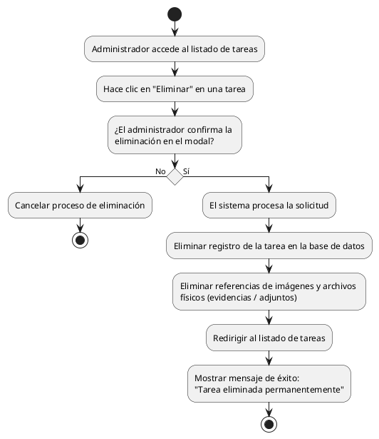

# Diagrama de Actividades: HU-ADM-018 (Eliminar Tarea)

**Historia de Usuario:** HU-ADM-018
**Rol:** Administrador
**Acción:** Eliminar una tarea del sistema de forma permanente.
**Propósito:** Limpiar registros incorrectos o innecesarios.

**Casos de Uso:**
1. **Eliminación exitosa:** Confirma la acción, se elimina de BD y se muestra mensaje de éxito.

---

### Código PlantUML

