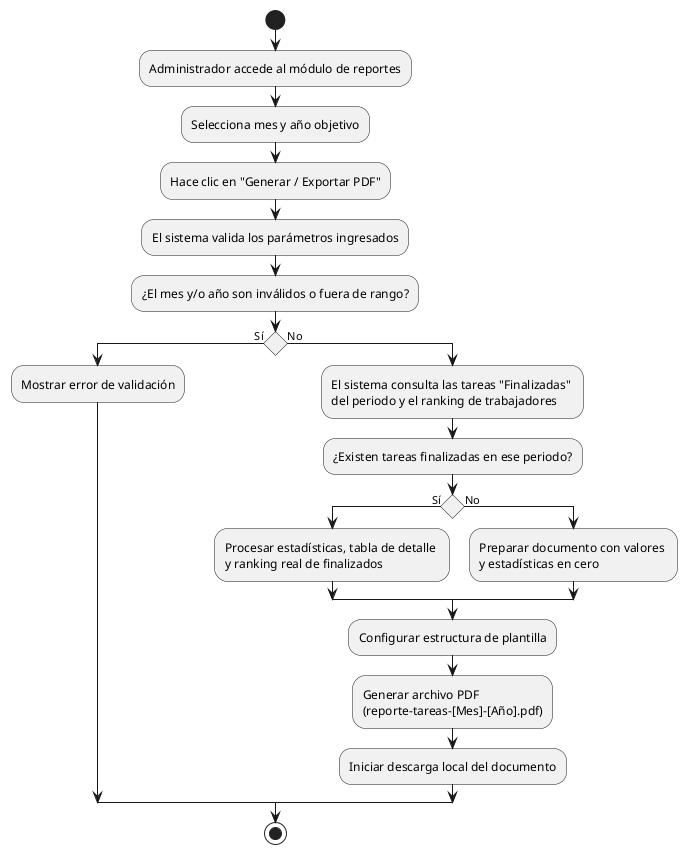

# Diagrama de Actividades: HU-ADM-019 (Exportar Reporte de Tareas)

**Historia de Usuario:** HU-ADM-019
**Rol:** Administrador
**Acción:** Exportar un reporte mensual de tareas finalizadas en PDF.
**Propósito:** Generar informes de gestión sobre el trabajo finalizado.

**Casos de Uso:**
1. **Exportación con datos:** Si hay finalizadas, descarga reporte-tareas-[Mes]-[Año].pdf.
2. **Exportación sin datos:** Genera el PDF con valores en cero si no hay registros en ese periodo.
3. **Mes o año inválido:** Muestra error de validación si valores están fuera de rango.
4. **Contenido del reporte:** El sistema incluye estadísticas, tablas de tareas y ranking.

---

### Código PlantUML

