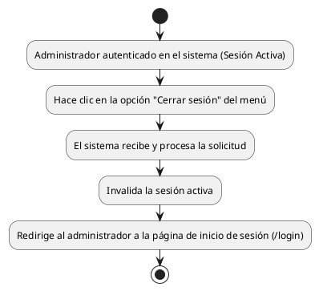

# Diagrama de Actividades: HU-ADM-002 (Cierre de Sesión)

**Historia de Usuario:** HU-ADM-002
**Rol:** Administrador
**Acción:** Cerrar la sesión activa en el sistema
**Propósito:** Proteger la información y asegurar que ningún usuario no autorizado pueda acceder al panel.

**Casos de Uso:**
1. Cierre de sesión exitoso.
   - **Precondición:** El administrador se encuentra autenticado en el sistema.
   - **Desencadenante:** Cuando el administrador hace clic en la opción "Cerrar sesión" del menú.
   - **Resultado:** El sistema invalida la sesión activa y redirige al administrador a la página de inicio de sesión `/login`.

---

### Código PlantUML

