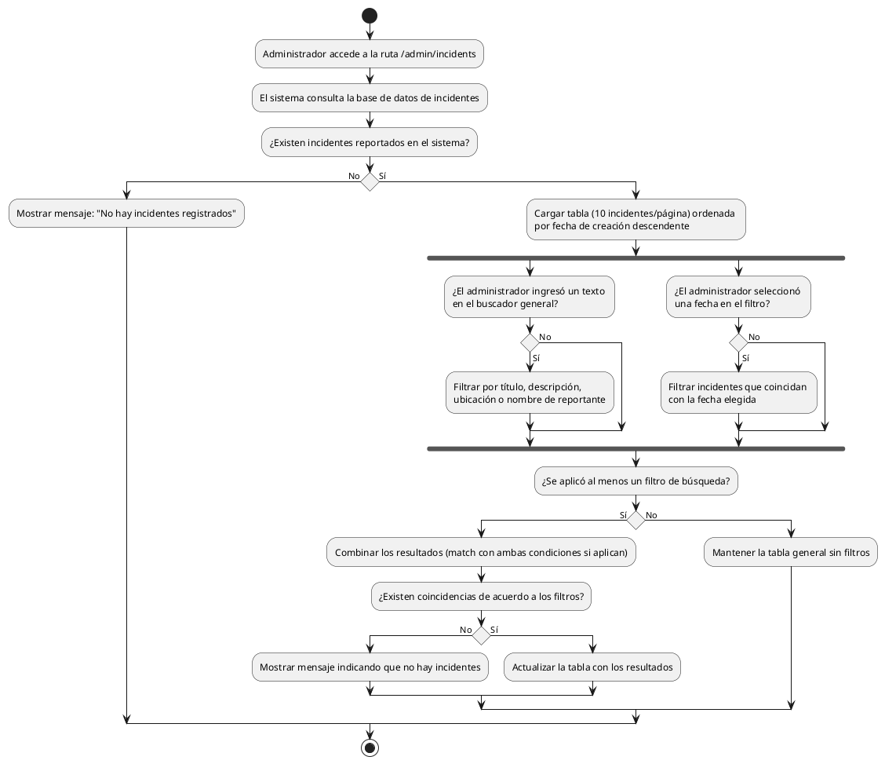

# Diagrama de Actividades: HU-ADM-020 (Listado de Incidentes)

**Historia de Usuario:** HU-ADM-020
**Rol:** Administrador
**Acción:** Ver el listado completo de todos los incidentes reportados.
**Propósito:** Supervisar y gestionar todas las fallas o novedades reportadas.

**Casos de Uso:**
1. **Lista con datos:** Muestra tabla paginada (10/página) ordenada por fecha de creación desc.
2. **Lista vacía:** Muestra mensaje si no hay incidentes.
3. **Búsqueda general:** Filtra por título, descripción, ubicación o reportante.
4. **Filtrado por fecha:** Filtra incidentes reportados en una fecha específica.
5. **Filtros combinados:** El sistema aplica los dos criterios simultáneamente si están activos.

---

### Código PlantUML

