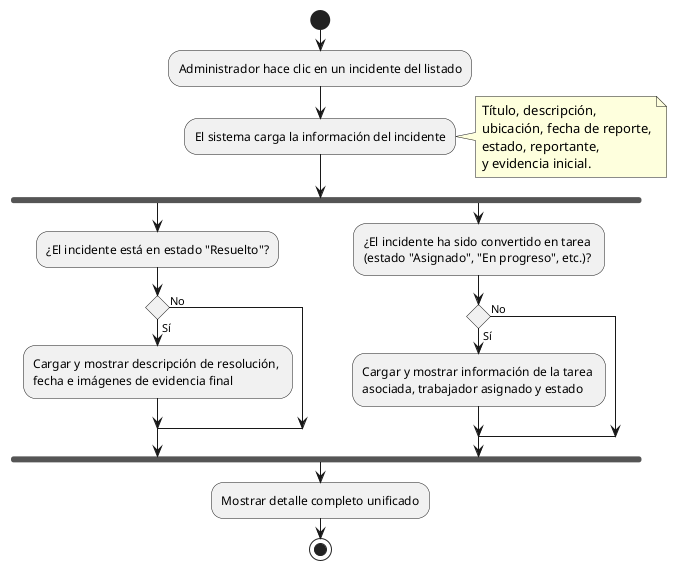

# Diagrama de Actividades: HU-ADM-021 (Detalle de Incidente)

**Historia de Usuario:** HU-ADM-021
**Rol:** Administrador
**Acción:** Ver el detalle completo de un incidente específico.
**Propósito:** Analizar la información de la falla, su evidencia fotográfica y tomar decisiones sobre su atención.

**Casos de Uso:**
1. **Ver detalle completo:** Muestra información base, creador y evidencias iniciales.
2. **Incidente resuelto con evidencia:** Muestra descripción de resolución, fecha y fotos finales.
3. **Incidente con tarea vinculada:** Muestra información de tarea, trabajador y estado de la tarea.

---

### Código PlantUML

