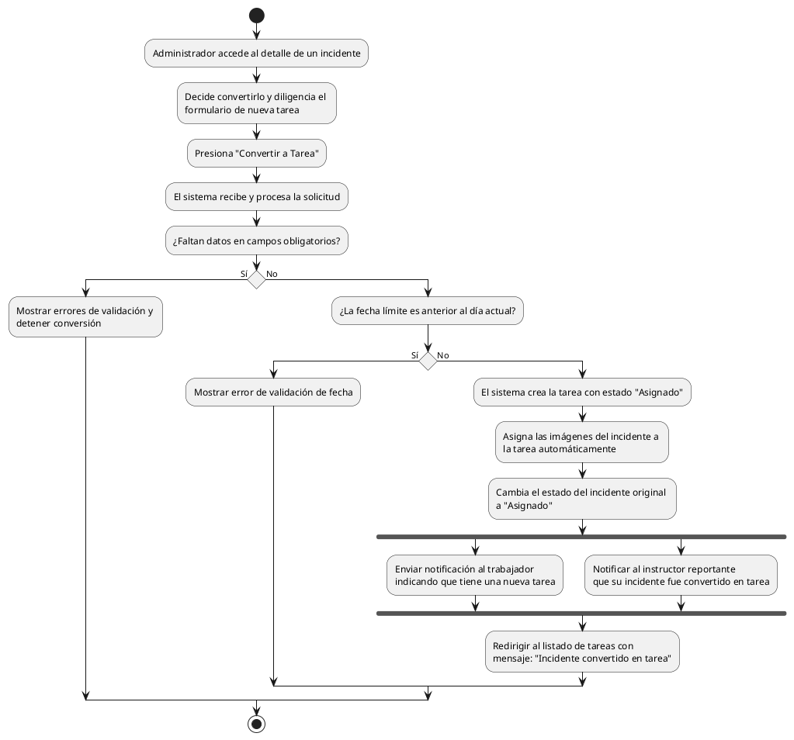

# Diagrama de Actividades: HU-ADM-022 (Convertir Incidente a Tarea)

**Historia de Usuario:** HU-ADM-022
**Rol:** Administrador
**Acción:** Convertir un incidente reportado en una tarea de mantenimiento.
**Propósito:** Gestionar la atención de las fallas reportadas asignando el trabajo al personal correspondiente.

**Casos de Uso:**
1. **Conversión exitosa:** Crea tarea con imágenes del incidente y cambia estado a asignado.
2. **Notificación al trabajador:** Informa al trabajador de su nueva asignación.
3. **Notificación al instructor:** Informa al creador del incidente que se está trabajando.
4. **Campos incompletos:** Muestra errores de validación.
5. **Fecha inválida:** Muestra error si la fecha de tarea es anterior al día actual.
6. **Reutilización:** Imágenes asocian automáticamente a la nueva tarea.

---

### Código PlantUML

