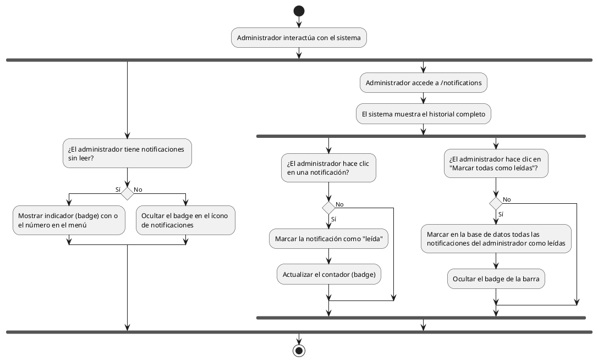

# Diagrama de Actividades: HU-ADM-023 (Notificaciones)

**Historia de Usuario:** HU-ADM-023
**Rol:** Administrador
**Acción:** Recibir y visualizar notificaciones sobre eventos importantes del sistema.
**Propósito:** Estar al tanto de las actualizaciones y cambios realizados por otros usuarios.

**Casos de Uso:**
1. **Contador de no leídas:** Muestra un badge sobre la campana de notificaciones.
2. **Sin no leídas:** Oculta el badge de la barra de navegación.
3. **Listado:** Acceder al historial completo en `/notifications`.
4. **Marcar una como leída:** Al hacer clic en la notificación específica.
5. **Marcar todas como leídas:** Acción general en la vista.

---

### Código PlantUML

