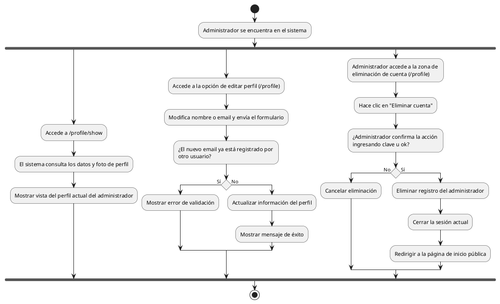

# Diagrama de Actividades: HU-ADM-024 (Perfil Personal)

**Historia de Usuario:** HU-ADM-024
**Rol:** Administrador
**Acción:** Ver y editar mi información de perfil personal dentro del sistema.
**Propósito:** Mantener mis datos actualizados y gestionar la seguridad de mi cuenta.

**Casos de Uso:**
1. **Visualización:** Muestra nombre, email, rol y foto en `/profile/show`.
2. **Edición:** Modifica nombre o email con éxito en `/profile`.
3. **Email duplicado:** Error de validación si el nuevo correo pertenece a alguien más.
4. **Eliminación propia:** Elimina registro y cierra la sesión redirigiendo al home.

---

### Código PlantUML

