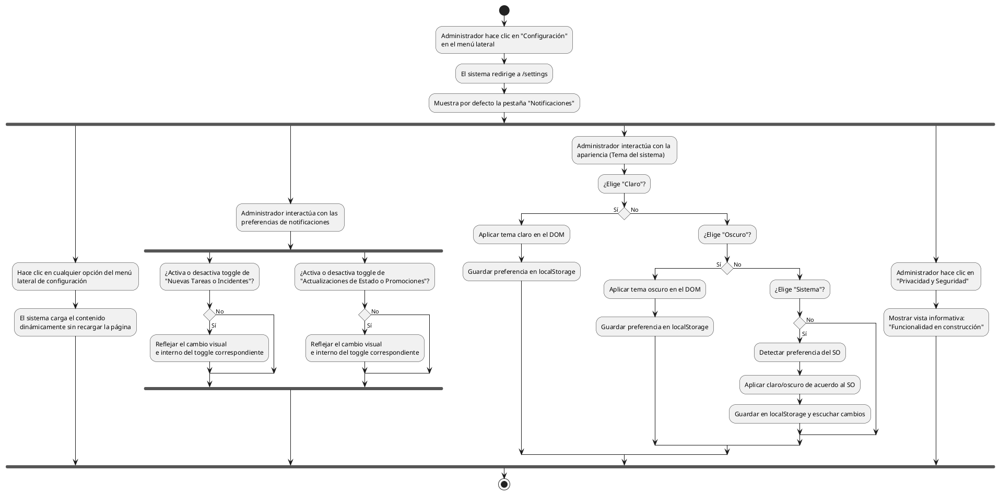

# Diagrama de Actividades: HU-ADM-025 (Configuraciones y Preferencias)

**Historia de Usuario:** HU-ADM-025
**Rol:** Administrador
**Acción:** Acceder y configurar las preferencias personales del sistema desde la sección de configuración.
**Propósito:** Personalizar la apariencia de la plataforma, gestionar notificaciones y revisar opciones de privacidad y seguridad.

**Casos de Uso:**
1. **Acceso a configuraciones:** Redirige a /settings activando Notificaciones por defecto.
2. **Navegación:** Visualiza secciones sin recargar la página (hash Alpine.js).
3. **Notificaciones (Nuevas Tareas/Incidentes):** Refleja visualmente si están activas.
4. **Notificaciones (Actualizaciones):** Refleja visualmente el cambio del toggle.
5. **Notificaciones (Alertas Promocionales):** Inactiva por defecto, refleja cambios visuales.
6. **Tema Claro:** Aplica tema, guarda en localStorage y marca la opción.
7. **Tema Oscuro:** Aplica tema, guarda en localStorage y marca la opción.
8. **Tema Sistema:** Detecta SO, aplica el que corresponda y guarda en localStorage.
9. **Privacidad y Seguridad:** Muestra funcionalidad en construcción.
10. **Persistencia:** Al recargar la página, se carga el tema preferido de localStorage.

---

### Código PlantUML

