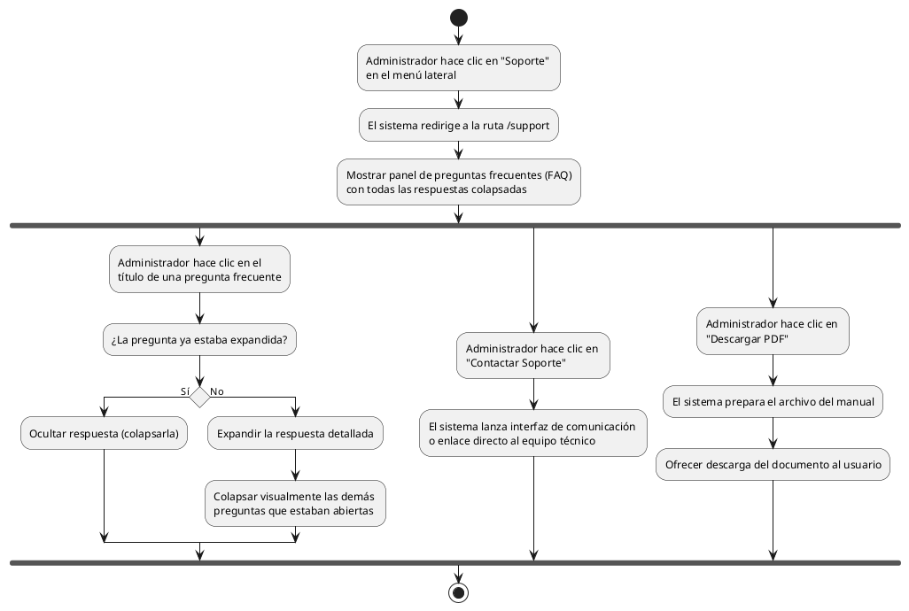

# Diagrama de Actividades: HU-ADM-026 (Ayuda y Soporte)

**Historia de Usuario:** HU-ADM-026
**Rol:** Administrador
**Acción:** Acceder a la sección de ayuda y soporte del sistema.
**Propósito:** Consultar preguntas frecuentes, contactar soporte técnico y descargar documentación.

**Casos de Uso:**
1. **Acceso a soporte:** Redirige a /support y muestra preguntas frecuentes (FAQ).
2. **Visualización de FAQ:** Las preguntas se muestran colapsadas inicialmente.
3. **Expandir pregunta:** Al hacer clic, se abre y colapsa las demás.
4. **Colapsar pregunta:** Si hace clic en una abierta, se vuelve a ocultar.
5. **Contacto:** Opción para comunicarse con soporte técnico.
6. **Descarga de manual:** Descarga en PDF de la documentación/manual técnico.

---

### Código PlantUML

