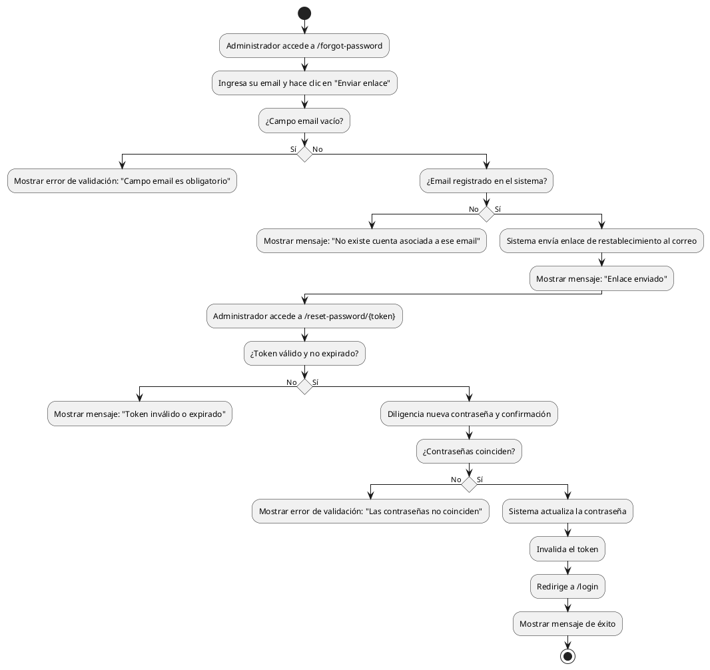

# Diagrama de Actividades: HU-ADM-003 (Recuperar Contraseña)

**Historia de Usuario:** HU-ADM-003
**Rol:** Administrador
**Acción:** Recuperar el acceso a mi cuenta cuando olvido mi contraseña
**Propósito:** Restablecer mi contraseña de forma segura a través de mi correo electrónico registrado.

**Casos de Uso:**
1. **Solicitud de restablecimiento con email válido:** Envía enlace de restablecimiento.
2. **Solicitud con email no registrado:** Muestra mensaje de cuenta no existente.
3. **Campo email vacío:** Muestra error de validación (campo obligatorio).
4. **Restablecimiento exitoso mediante token:** Actualiza contraseña e invalida token.
5. **Contraseñas no coinciden:** Error de validación al intentar cambiar la contraseña.
6. **Token inválido o expirado:** Error que impide el cambio de contraseña.

---

### Código PlantUML

