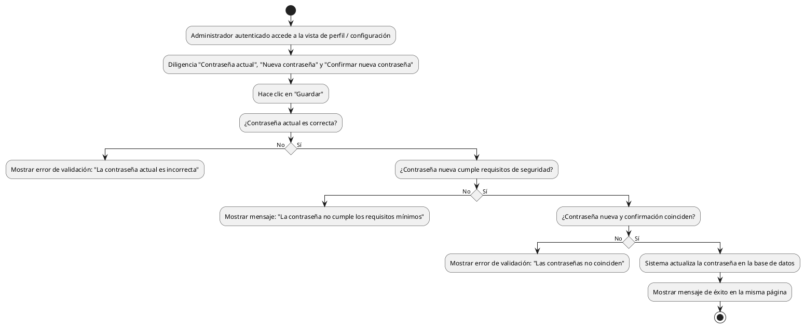

# Diagrama de Actividades: HU-ADM-004 (Cambiar Contraseña Estando Autenticado)

**Historia de Usuario:** HU-ADM-004
**Rol:** Administrador
**Acción:** Cambiar mi contraseña actual estando autenticado en el sistema.
**Propósito:** Actualizar credenciales de acceso por razones de seguridad.

**Casos de Uso:**
1. **Cambio exitoso de contraseña:** El administrador ingresa correctamente su contraseña actual y la nueva.
2. **Contraseña actual incorrecta:** La contraseña actual ingresada no coincide con la almacenada.
3. **Contraseñas nuevas no coinciden:** La nueva contraseña y su confirmación son diferentes.
4. **Contraseña no cumple requisitos:** La nueva contraseña no cumple con las reglas mínimas de seguridad.

---

### Código PlantUML

