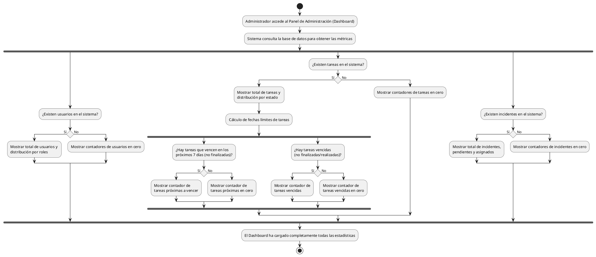

# Diagrama de Actividades: HU-ADM-005 (Resumen del Dashboard)

**Historia de Usuario:** HU-ADM-005
**Rol:** Administrador
**Acción:** Ver un resumen general del estado del sistema al ingresar al panel de administración.
**Propósito:** Tener una visión global y en tiempo real del desempeño operativo del centro.

**Casos de Uso:**
1. **Estadísticas de usuarios:** Muestra total y distribución por roles (administradores, instructores, trabajadores).
2. **Estadísticas de tareas:** Muestra total y distribución por estados.
3. **Tareas con fecha límite próxima:** Muestra tareas que vencen en 7 días y no están finalizadas/canceladas.
4. **Tareas vencidas:** Muestra tareas con fecha límite superada que no están finalizadas/canceladas/realizadas.
5. **Estadísticas de incidentes:** Muestra total, pendientes de revisión y asignados.
6. **Dashboard sin datos:** Muestra todos los contadores en cero sin errores si no hay datos.

---

### Código PlantUML

