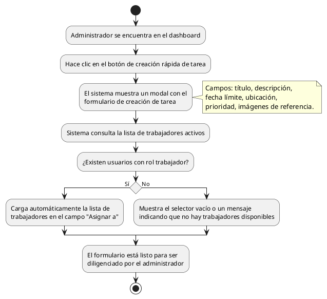

# Diagrama de Actividades: HU-ADM-006 (Creación Rápida de Tarea)

**Historia de Usuario:** HU-ADM-006
**Rol:** Administrador
**Acción:** Crear una nueva tarea de mantenimiento directamente desde el panel de control.
**Propósito:** Agilizar la asignación de tareas sin necesidad de navegar a otro módulo.

**Casos de Uso:**
1. **Apertura del modal de creación rápida:** Muestra un modal con el formulario de creación de tarea (título, descripción, fecha límite, ubicación, prioridad, trabajador asignado e imágenes de referencia).
2. **Listado de trabajadores disponibles:** Si existen trabajadores activos, el sistema los carga automáticamente en el campo "Asignar a".
3. **Sin trabajadores disponibles:** Si no existen trabajadores activos, el sistema muestra el selector vacío o un mensaje.

---

### Código PlantUML

