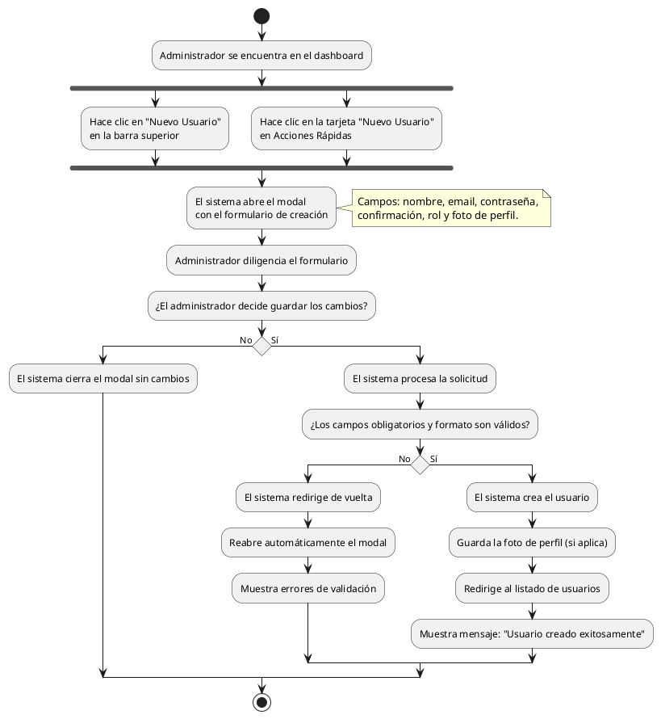

# Diagrama de Actividades: HU-ADM-007 (Crear Nuevo Usuario desde Dashboard)

**Historia de Usuario:** HU-ADM-007
**Rol:** Administrador
**Acción:** Crear un nuevo usuario directamente desde el panel de control sin salir del dashboard.
**Propósito:** Registrar nuevos miembros del personal de forma ágil sin necesidad de navegar al módulo de usuarios.

**Casos de Uso:**
1. **Apertura de modal (Botón superior):** Abre el modal completo.
2. **Apertura de modal (Acciones rápidas):** Abre el modal completo.
3. **Creación exitosa:** Crea el usuario, guarda foto y redirige al listado de usuarios con éxito.
4. **Campos obligatorios:** Muestra errores de validación en campos requeridos.
5. **Reapertura automática:** Ante errores de servidor, reabre el modal y muestra los mensajes.
6. **Cierre sin guardar:** Al cancelar, hacer clic fuera o presionar ESC.

---

### Código PlantUML

