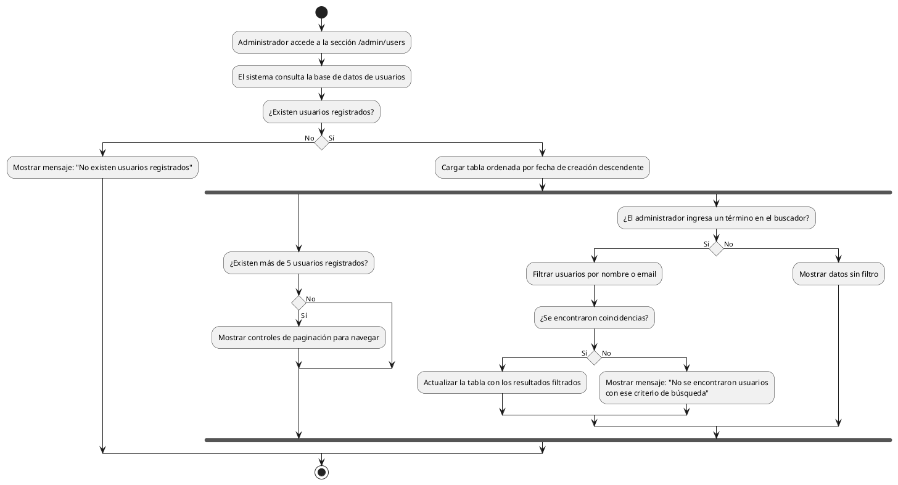

# Diagrama de Actividades: HU-ADM-008 (Listado de Usuarios Registrados)

**Historia de Usuario:** HU-ADM-008
**Rol:** Administrador
**Acción:** Ver el listado completo de todos los usuarios registrados en el sistema.
**Propósito:** Tener control y visibilidad total sobre los usuarios que pueden acceder a la plataforma.

**Casos de Uso:**
1. **Lista de usuarios con datos:** Muestra tabla paginada (5/página), ordenada por creación descendente (nombre, email y rol).
2. **Lista de usuarios vacía:** Muestra un mensaje indicando que no existen usuarios registrados.
3. **Paginación:** Si hay más de 5 usuarios, se muestran controles para navegar páginas.
4. **Búsqueda de usuario:** Filtra usuarios cuyo nombre o email contengan el término.
5. **Búsqueda sin resultados:** Muestra mensaje de "No se encontraron usuarios" si la búsqueda falla.

---

### Código PlantUML

