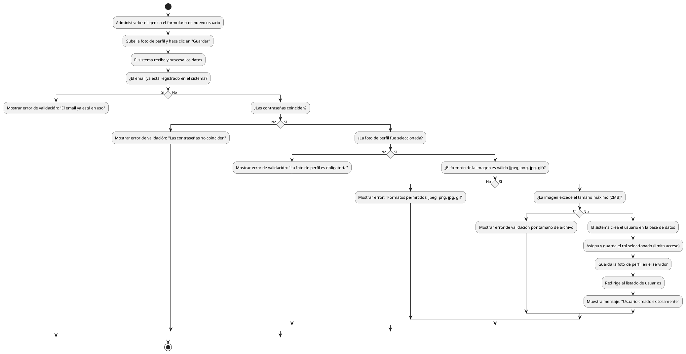

# Diagrama de Actividades: HU-ADM-009 (Crear Usuario y Asignar Rol)

**Historia de Usuario:** HU-ADM-009
**Rol:** Administrador
**Acción:** Crear nuevos usuarios en el sistema y asignarles un rol específico.
**Propósito:** Gestionar el acceso de nuevos miembros del personal al sistema.

**Casos de Uso:**
1. **Creación de usuario con datos válidos:** Creación exitosa, guardado de foto y redirección.
2. **Email ya registrado:** Error por email en uso.
3. **Contraseñas no coinciden:** Error de validación (contraseña y confirmación).
4. **Foto de perfil obligatoria:** Error si no se selecciona foto.
5. **Formato de imagen inválido:** Error si la foto no es (jpeg, png, jpg, gif).
6. **Imagen excede tamaño máximo:** Error si foto supera 2MB.
7. **Asignación de rol:** Limita acceso según permisos del rol asignado.

---

### Código PlantUML

