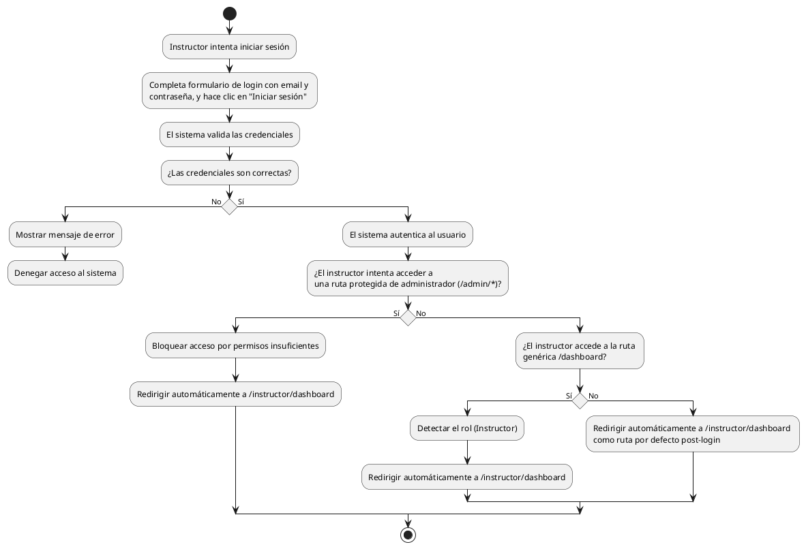

# Diagrama de Actividades: HU-INS-001 (Inicio de Sesión)

**Historia de Usuario:** HU-INS-001
**Rol:** Instructor
**Acción:** Iniciar sesión en el sistema con mis credenciales.
**Propósito:** Acceder a mi panel de reportes y gestionar las fallas que identifico en el centro.

**Casos de Uso:**
1. **Inicio de sesión exitoso:** Autentica y redirige a `/instructor/dashboard`.
2. **Credenciales incorrectas:** Muestra error y no permite el acceso.
3. **Redirección automática:** Redirige a `/instructor/dashboard` al entrar a `/dashboard`.
4. **Acceso denegado a admin:** Bloquea acceso a rutas de administrador redirigiendo al dashboard del instructor.

---

### Código PlantUML

