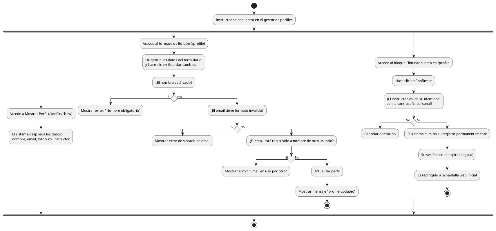

# Diagrama de Actividades: HU-INS-010 (Perfil Personal)

**Historia de Usuario:** HU-INS-010
**Rol:** Instructor
**Acción:** Ver y editar mi información de perfil personal dentro del sistema.
**Propósito:** Mantener mis datos actualizados y gestionar la seguridad de mi cuenta.

**Casos de Uso:**
1. **Visualización:** `/profile/show` muestra datos base y rol Asignado (Instructor).
2. **Edición:** Formulario precargado con nombre y correo.
3. **Edición exitosa:** Datos válidos muestran "profile-updated".
4. **Campo vacío:** Error de validación "Nombre es obligatorio".
5. **Formato inválido:** Error si el correo no tiene sintaxis válida.
6. **Email duplicado:** Error si ya está en otro registro.
7. **Cambio contraseña:** Confirmación de actuales y nuevas muestran "password-updated".
8. **Eliminación propia:** Al confirmar, elimina registro, cierra sesión y redirige al index.

---

### Código PlantUML

