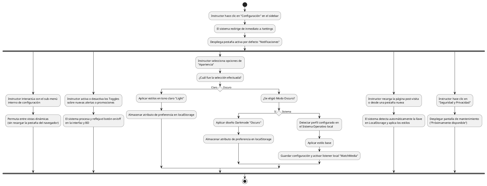

# Diagrama de Actividades: HU-INS-011 (Configuraciones y Preferencias)

**Historia de Usuario:** HU-INS-011
**Rol:** Instructor
**Acción:** Acceder y configurar las preferencias personales del sistema.
**Propósito:** Personalizar apariencia, gestionar preferencias de notificaciones y configurar seguridad.

**Casos de Uso:**
1. **Acceso:** Redirección a `/settings` mostrando pestaña "Notificaciones".
2. **Navegación:** Sin recarga de página (componentes).
3. **Toggles:** Manejo de alertas vía correo o de estados. Reflejos en UI inmediato.
4. **Temas (Claro/Oscuro/Sistema):** Guarda en LocalStorage, el de Sistema "escucha" SO.
5. **Privacidad/Seguridad:** Funcionalidad en "Construcción".
6. **Persistencia:** Carga del tema del sistema configurado incluso tras refrescar.

---

### Código PlantUML

