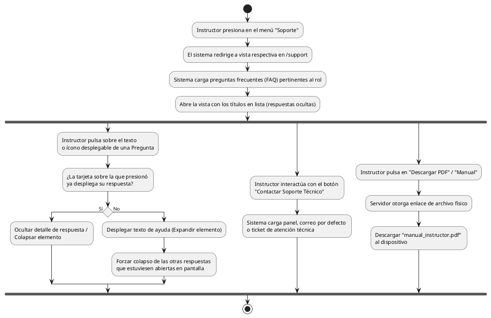

# Diagrama de Actividades: HU-INS-012 (Ayuda y Soporte)

**Historia de Usuario:** HU-INS-012
**Rol:** Instructor
**Acción:** Acceder a la sección de ayuda y soporte del sistema.
**Propósito:** Consultar preguntas frecuentes, contactar soporte técnico y descargar documentación.

**Casos de Uso:**
1. **Acceso:** Mostrar FAQ en `/support`.
2. **Visualizar FAQ:** Inicialmente todas las tarjetas van colapsadas.
3. **Expandir/Colapsar:** Acordeón de respuestas (una a la vez).
4. **Contacto:** Permite comunicarse con el área técnica.
5. **Descarga:** Otorga el manual de la herramienta.

---

### Código PlantUML

