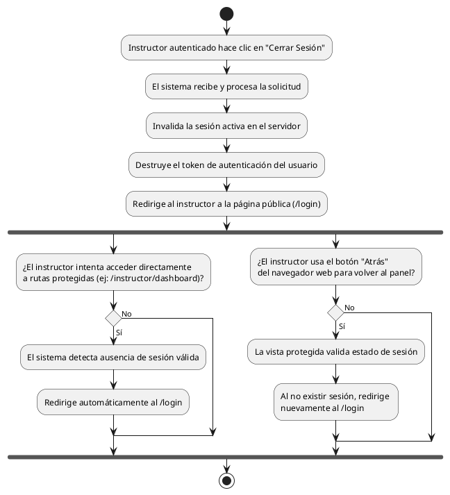

# Diagrama de Actividades: HU-INS-002 (Cierre de Sesión)

**Historia de Usuario:** HU-INS-002
**Rol:** Instructor
**Acción:** Cerrar la sesión activa en el sistema.
**Propósito:** Proteger mi cuenta y garantizar que nadie más pueda acceder a mi información.

**Casos de Uso:**
1. **Cierre de sesión exitoso:** Invalida sesión, destruye token y redirige a `/login`.
2. **Acceso bloqueado post-cierre:** Redirige al login si intenta acceder a rutas protegidas sin sesión.
3. **No retorno con botón atrás:** Redirige al login si usa el botón atrás del navegador.

---

### Código PlantUML

