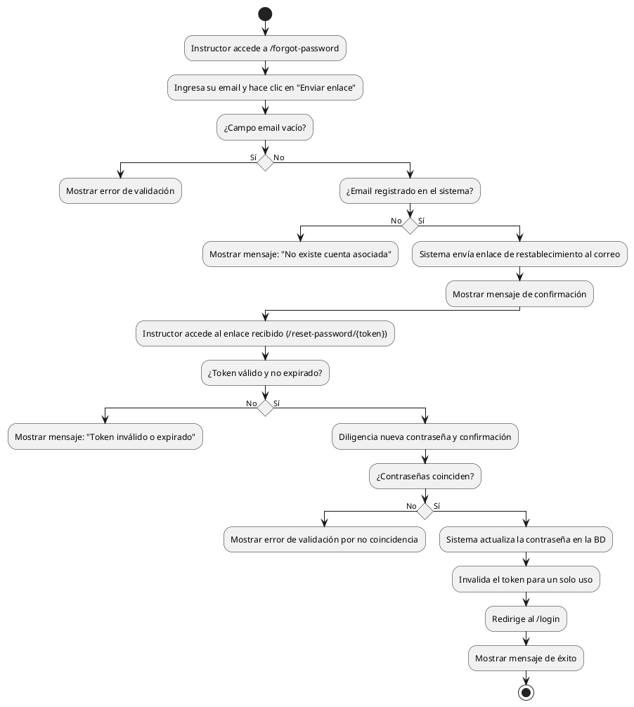

# Diagrama de Actividades: HU-INS-003 (Recuperar Contraseña)

**Historia de Usuario:** HU-INS-003
**Rol:** Instructor
**Acción:** Recuperar el acceso a mi cuenta cuando olvido mi contraseña.
**Propósito:** Restablecer mi contraseña de forma segura a través de mi correo.

**Casos de Uso:**
1. **Solicitud con email válido:** Envía enlace y muestra confirmación.
2. **Email no registrado:** Muestra mensaje de que no hay cuenta asociada.
3. **Campo vacío:** Error de validación.
4. **Restablecimiento exitoso:** Actualiza contraseña, invalida token y redirige a `/login`.
5. **No coinciden:** Error si confirmación no es igual.
6. **Token inválido/expirado:** Muestra error si el enlace caducó o es falso.

---

### Código PlantUML

