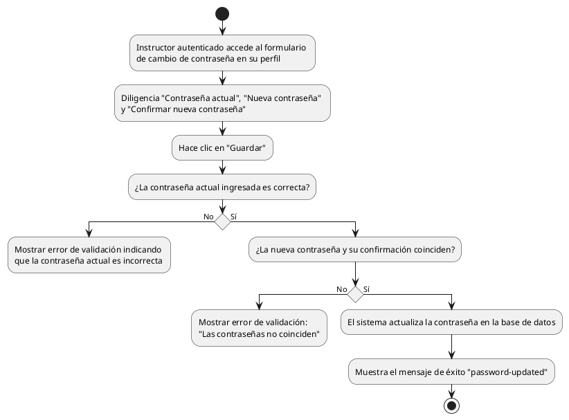

# Diagrama de Actividades: HU-INS-004 (Cambiar Contraseña Autenticado)

**Historia de Usuario:** HU-INS-004
**Rol:** Instructor
**Acción:** Cambiar mi contraseña actual estando autenticado en el sistema.
**Propósito:** Actualizar mis credenciales de acceso por razones de seguridad.

**Casos de Uso:**
1. **Cambio exitoso:** Ingresa actual, nueva y confirmación correctas. Muestra `password-updated`.
2. **Actual incorrecta:** Muestra error y no realiza cambio.
3. **Nuevas no coinciden:** Muestra error y no actualiza.

---

### Código PlantUML

