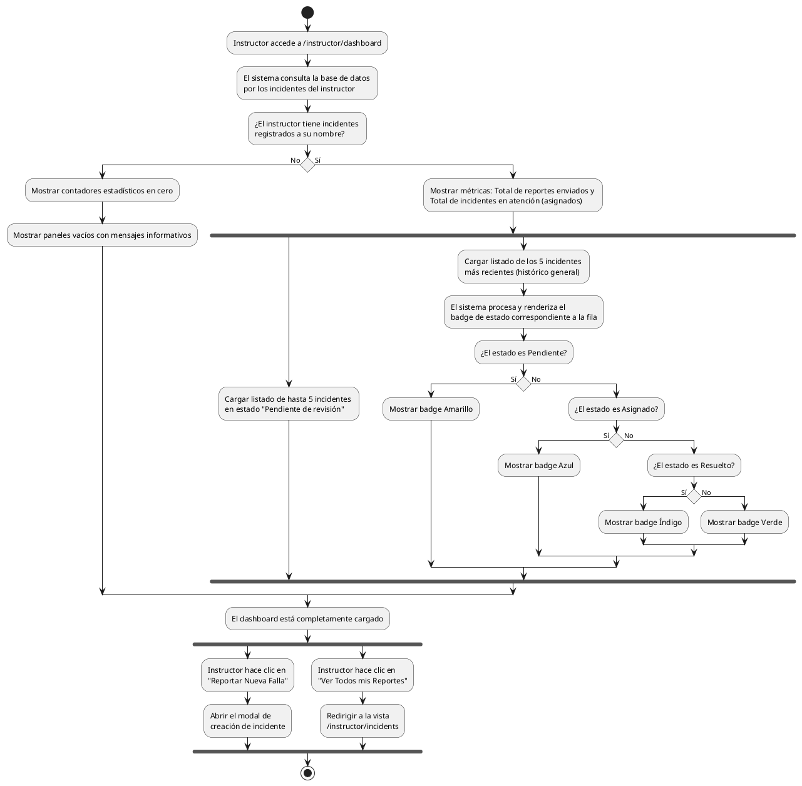

# Diagrama de Actividades: HU-INS-005 (Dashboard / Estado general)

**Historia de Usuario:** HU-INS-005
**Rol:** Instructor
**Acción:** Ver un resumen general del estado de todas mis incidencias.
**Propósito:** Tener visibilidad inmediata sobre el estado de mis reportes y cuáles requieren seguimiento.

**Casos de Uso:**
1. **Métricas propias:** Muestra total enviados e incidentes asignados (en atención).
2. **Pendientes de revisión:** Muestra hasta 5 incidentes.
3. **Reportes recientes:** Muestra hasta 5 más recientes con badge de color.
4. **Colores de estado:** amarillo (pend.), azul (asig.), índigo (resu.), verde (cerrado).
5. **Dashboard sin incidentes:** Muestra contadores en cero y mensajes si no hay reportes.
6. **Nueva falla:** Modal rápido desde el dashboard para crear incidente.
7. **Ver Todos mis Reportes:** Redirección rápida al listado `/instructor/incidents`.

---

### Código PlantUML

