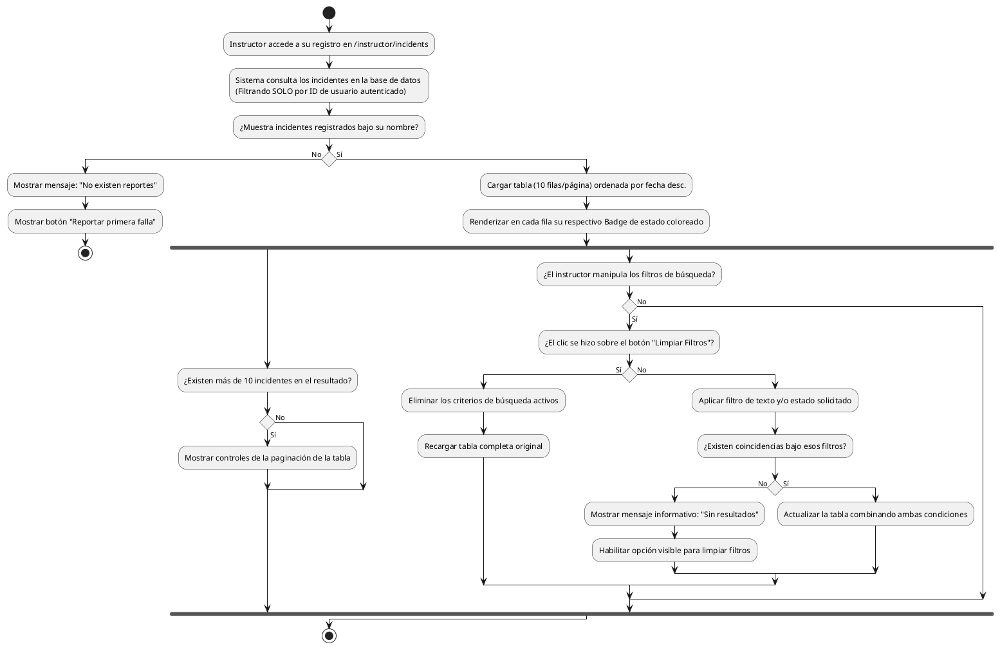

# Diagrama de Actividades: HU-INS-006 (Listado de Fallas Reportadas)

**Historia de Usuario:** HU-INS-006
**Rol:** Instructor
**Acción:** Ver el listado completo de todas las fallas reportadas al sistema.
**Propósito:** Monitorear el estado y seguimiento de cada incidencia reportada.

**Casos de Uso:**
1. **Lista con datos:** Muestra tabla paginada (10/pag) con título, desc, ubicación, estado, fecha.
2. **Lista vacía:** Muestra mensaje si no hay reportes y botón para enviar el primero.
3. **Búsqueda por texto:** Filtra título, descripción o ubicación.
4. **Filtrado por estado:** Filtra pendiente, asignado, resuelto o cerrado.
5. **Filtros combinados:** Muestra coincidencias con ambos criterios activos.
6. **Limpieza de filtros:** Si hace clic en "Limpiar", quita filtros y muestra tabla base.
7. **Búsqueda sin coincidencias:** Muestra mensaje y botón "Limpiar filtros".
8. **Paginación:** Si hay más de 10, muestra los controles.
9. **Restricción visual:** El sistema filtra en base de datos SOLO por id de instructor autenticado.
10. **Badge de estado:** Aplica gama cromática según estado.

---

### Código PlantUML

