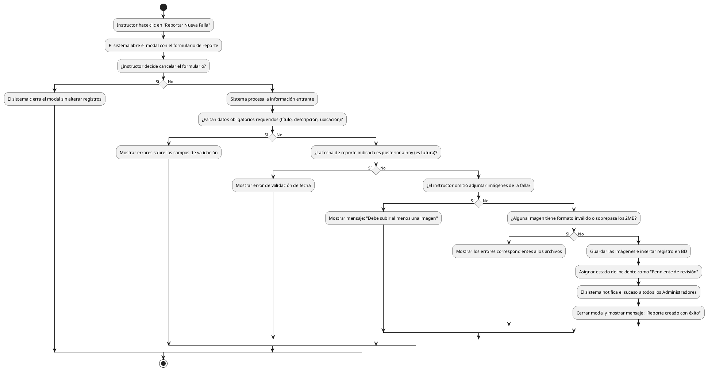

# Diagrama de Actividades: HU-INS-007 (Reportar Nueva Falla)

**Historia de Usuario:** HU-INS-007
**Rol:** Instructor
**Acción:** Reportar una nueva falla o incidencia identificada en las instalaciones.
**Propósito:** Notificar al equipo administrativo para que sea atendida oportunamente.

**Casos de Uso:**
1. **Apertura del modal:** Desde dashboard o listado, abre el formulario.
2. **Reporte exitoso:** Crea incidente (pendiente), notifica (a admins) y redirige.
3. **Notificación admin:** Procesa el reporte y alerta a los administradores.
4. **Campos obligatorios:** Error de validación y cancelación si faltan.
5. **Fecha inválida:** Error si ingresa una fecha futura (posterior a hoy).
6. **Imágenes obligatorias:** Error "Debe subir al menos una imagen".
7. **Formato inválido:** Error si imagen no es jpeg, jpg, png, gif.
8. **Excede tamaño:** Error si una imagen es de más de 2MB.
9. **Cierre sin guardar:** Cancelar o salir del modal descarta el registro.

---

### Código PlantUML

