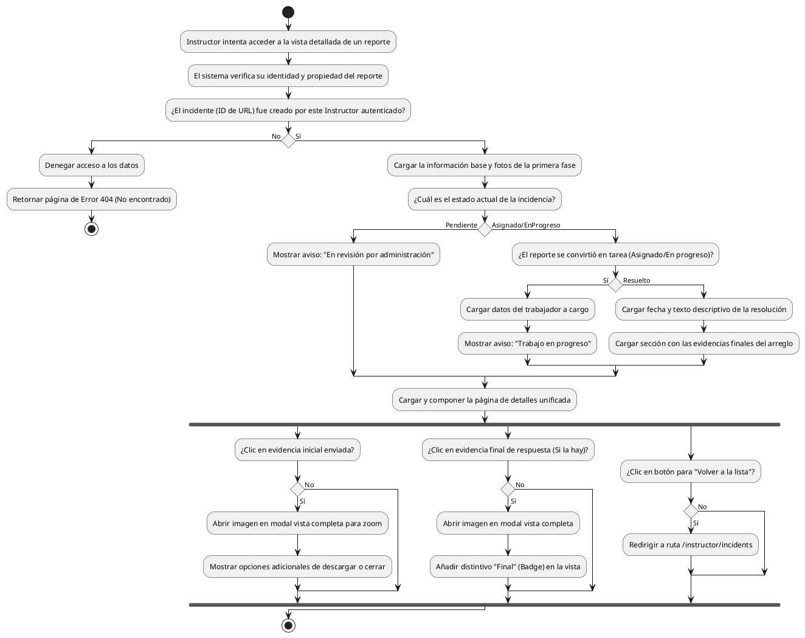

# Diagrama de Actividades: HU-INS-008 (Detalle de Falla Reportada)

**Historia de Usuario:** HU-INS-008
**Rol:** Instructor
**Acción:** Ver el detalle completo de un reporte de falla enviado.
**Propósito:** Conocer el estado actual de la incidencia y revisar evidencia.

**Casos de Uso:**
1. **Ver detalle completo:** Título, estado, desc., ubicación, fecha, id e imágenes.
2. **Zoom en fotos iniciales:** Hace clic en imagen y se abre en modal interactivo (descargar).
3. **Acceso denegado externo:** 404 si intenta acceder a incidentes de otros usando la URL.
4. **Aviso pendiente revisión:** Mensaje informativo cuando está en revisión por admins.
5. **Aviso asignado:** Si ya se volvió tarea, muestra al trabajador y que "está en progreso".
6. **Aviso resuelto:** Si la tarea terminó, expone descripción de solución, fecha y fotos finales.
7. **Zoom en fotos finales:** Modal con badge respectivo para las partes finales.
8. **Botón volver:** Redirige al listado nuevamente.

---

### Código PlantUML

