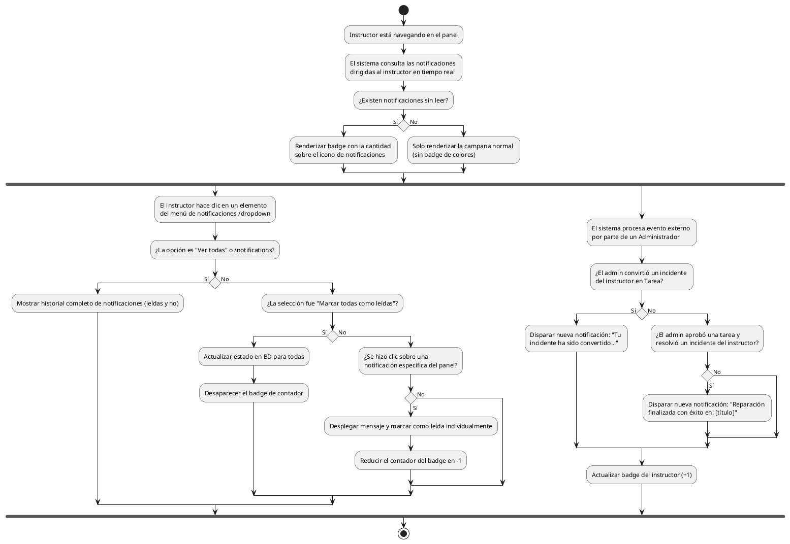

# Diagrama de Actividades: HU-INS-009 (Notificaciones sobre Reportes)

**Historia de Usuario:** HU-INS-009
**Rol:** Instructor
**Acción:** Recibir y visualizar notificaciones sobre el estado de mis reportes de fallas.
**Propósito:** Estar al tanto de cuando mis incidentes son convertidos en tarea o cuando el mantenimiento es finalizado.

**Casos de Uso:**
1. **Conversión a tarea:** Recibe notificación automática si cambian un incidente suyo.
2. **Resolución:** Recibe notificación automática si el incidente es finalizado con éxito.
3. **Contador de no leídas:** Badge rojo con cantidad en la campana si hay pendientes.
4. **Sin no leídas:** Muestra el ícono normal sin badge.
5. **Listado:** La ruta `/notifications` exhibe el historial completo.
6. **Marcar una leída:** Clic sobre la tarjeta la marca internamente como leída.
7. **Marcar todas como leídas:** El botón superior "Marcar todas" limpia el contador.

---

### Código PlantUML

