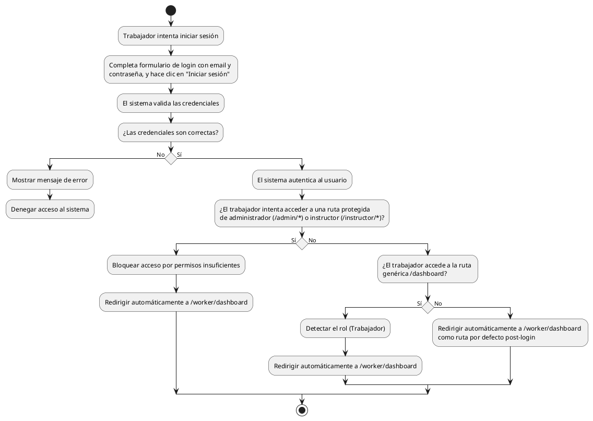

# Diagrama de Actividades: HU-TRB-001 (Inicio de Sesión)

**Historia de Usuario:** HU-TRB-001
**Rol:** Trabajador
**Acción:** Iniciar sesión en el sistema con mis credenciales.
**Propósito:** Acceder a mi panel de trabajo y gestionar las tareas de mantenimiento asignadas.

**Casos de Uso:**
1. **Inicio de sesión exitoso:** Autentica y redirige a `/worker/dashboard`.
2. **Credenciales incorrectas:** Muestra error y no permite el acceso.
3. **Redirección automática:** Redirige a `/worker/dashboard` al entrar a `/dashboard`.
4. **Acceso denegado a otros roles:** Bloquea acceso a rutas de administrador o instructor redirigiendo al dashboard del trabajador.

---

### Código PlantUML

