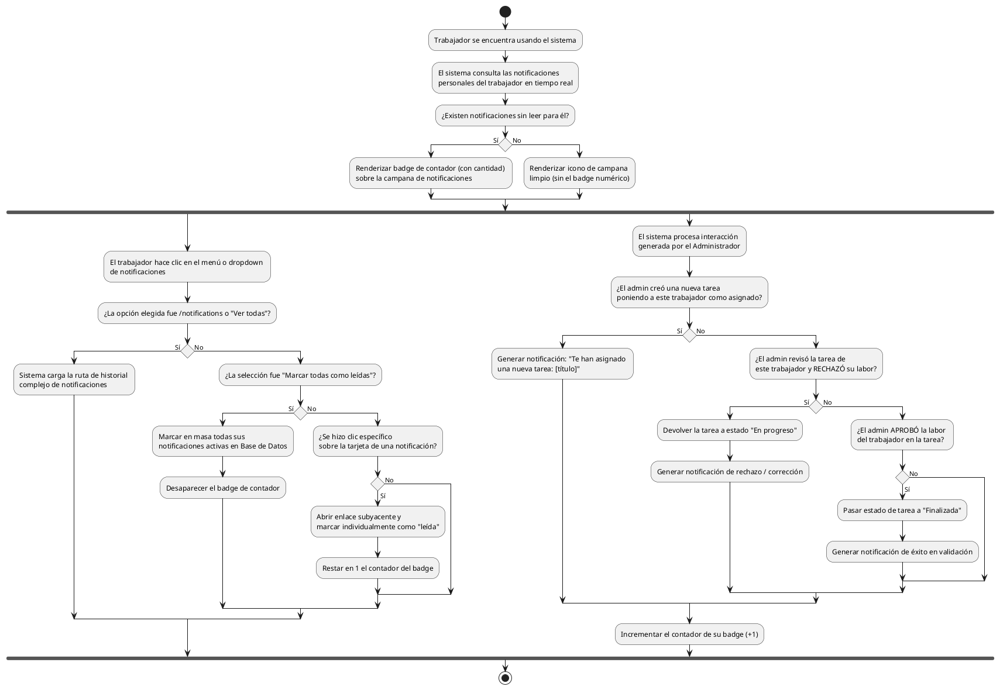

# Diagrama de Actividades: HU-TRB-010 (Notificaciones sobre Tareas)

**Historia de Usuario:** HU-TRB-010
**Rol:** Trabajador
**Acción:** Recibir y visualizar notificaciones sobre las tareas que me son asignadas.
**Propósito:** Estar al tanto de nuevas asignaciones y actualizaciones sobre mis tareas de mantenimiento.

**Casos de Uso:**
1. **Asignación de Tarea:** Notificación automática ("Te han asignado una nueva tarea...") al crearse la asignación.
2. **Rechazo de Trabajo:** Si el admin rechaza su trabajo final, vuelve a "En progreso" y notifica la corrección.
3. **Aprobación de Trabajo:** Si el admin lo aprueba, se culmina el proceso con mensaje de éxito.
4. **Contadores / Menús:** Badge encima de la campana si hay >0 sin leer; si no hay, no existe badge; Historial en `/notifications`.
5. **Acciones de lectura:** Clic sobre una noti específica la marca; clic sobre "Marcar todas" limpia el contador completo.

---

### Código PlantUML

