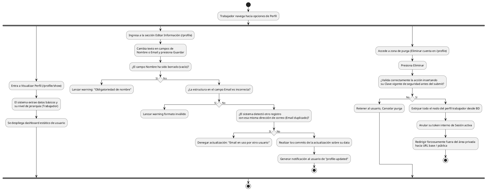

# Diagrama de Actividades: HU-TRB-011 (Perfil Personal)

**Historia de Usuario:** HU-TRB-011
**Rol:** Trabajador
**Acción:** Ver y editar mi información de perfil personal dentro del sistema.
**Propósito:** Mantener mis datos actualizados y gestionar la seguridad de mi cuenta.

**Casos de Uso:**
1. **Visualización:** `/profile/show` muestra datos: nombre, email, foto y rol Trabajador.
2. **Edición Datos:** Carga datos previos en el formulario. 
3. **Edición Exitosa:** Al guardar datos válidos, muestra "profile-updated".
4. **Validaciones de Error:** Error si envía el nombre en blanco; error de sintaxis al evaluar el email; error `duplicado` si el correo le pertenece a otro usuario de la plataforma.
5. **Cambio contraseña:** Confirmación de actuales y nuevas muestran validación `password-updated`.
6. **Eliminación propia:** Al confirmar decisión y clave, borra archivo propio de BD, rompe sesión y expulsa a index.

---

### Código PlantUML

