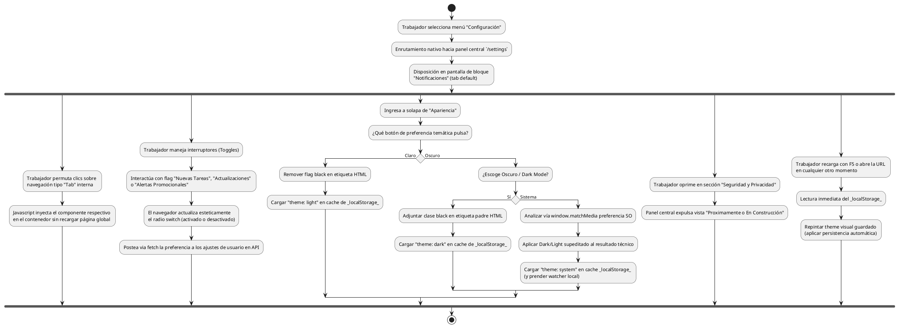

# Diagrama de Actividades: HU-TRB-012 (Configuraciones y Preferencias)

**Historia de Usuario:** HU-TRB-012
**Rol:** Trabajador
**Acción:** Acceder y configurar las preferencias personales del sistema.
**Propósito:** Personalizar la apariencia de la plataforma y gestionar preferencias.

**Casos de Uso:**
1. **Acceso UI:** Al pulsar Configuración dirige a `/settings`, entra predeterminado en `Notificaciones`.
2. **Navegación:** Renderizado de pestañas en un mismo layout vía Javascript (sin refrescar URI base completo).
3. **Toggles Funcionales:** Toggle de "nuevos encargos" (nuevas tareas) o "cambio estado" asimilan clics instantáneos y envían peticiones asíncronas para afectar sus flags de permisos de correos. Igual para promociones.
4. **Temas del DOM:** Light (fija claro en base localStorage); Dark (fija oscuro en base localStorage); System (invoca un MatchMedia de OS local, y aplica CSS correspondiente a la solicitud del SO).
5. **Persistencia Visual:** Visitas futuras evalúan `localStorage` en carga y re-pintan su preferencia.
6. **Privacidad:** Mockup visual, bloque de "Funcionalidad construyéndose".

---

### Código PlantUML

