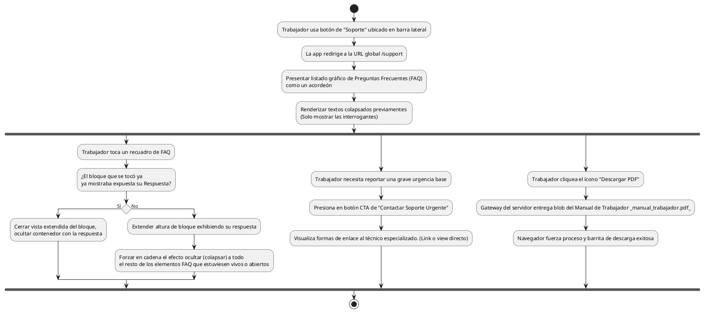

# Diagrama de Actividades: HU-TRB-013 (Ayuda y Soporte)

**Historia de Usuario:** HU-TRB-013
**Rol:** Trabajador
**Acción:** Acceder a la sección de ayuda y soporte del sistema.
**Propósito:** Consultar preguntas frecuentes y obtener asistencia técnica.

**Casos de Uso:**
1. **Acceso:** Ir a la ruta `/support` y evidenciar Acordeón de preguntas frecuentes.
2. **Visualizar FAQ:** Entran ocultas / cerradas por defecto en lista vertical.
3. **Manejo Expandir:** El clic las agranda de forma que devela el cuadro de texto inferido, si otra está abierta, se auto-colapsa.
4. **Manejo Colapsar:** Clic en FAQ ya abierta, se guarda limpiamente.
5. **Contactar urgencias:** El botón "Contactar Soporte" brinda puentes físicos (formulario, tel).
6. **Descargar Manual:** "Descargar PDF" ejecuta Request GET hacia un fichero estático devolviendo un payload tipo `application/pdf` al sistema.

---

### Código PlantUML

